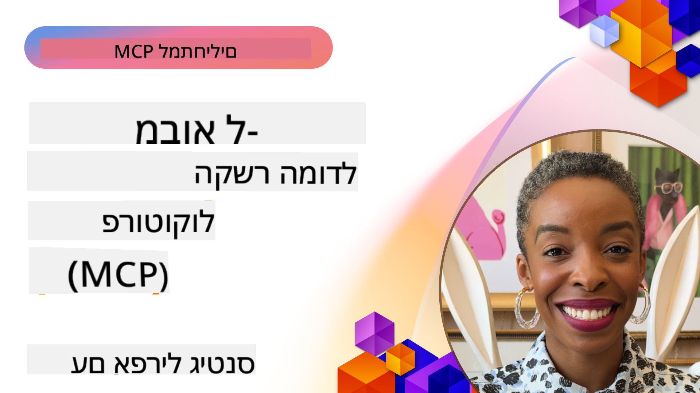
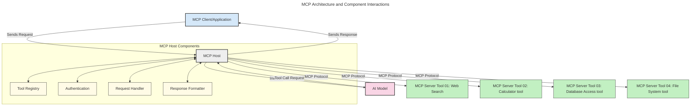
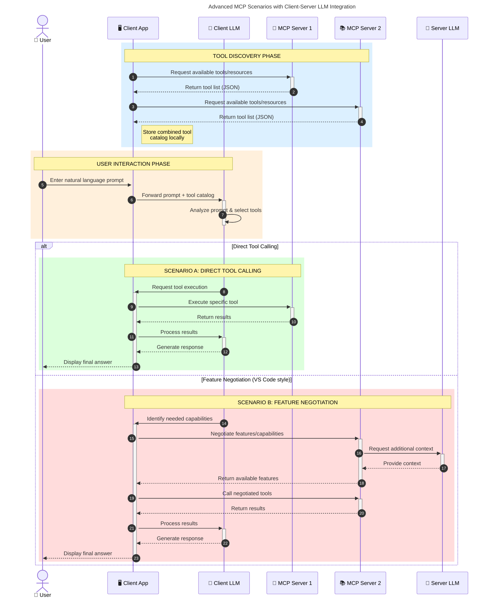

<!--
CO_OP_TRANSLATOR_METADATA:
{
  "original_hash": "0df1ee78a6dd8300f3a040ca5b411c2e",
  "translation_date": "2025-08-18T17:01:46+00:00",
  "source_file": "00-Introduction/README.md",
  "language_code": "he"
}
-->
# מבוא לפרוטוקול הקשר מודל (MCP): למה זה חשוב ליישומי AI בקנה מידה גדול

_(לחצו על התמונה למעלה לצפייה בסרטון של השיעור)_

יישומי AI גנרטיביים הם צעד גדול קדימה, שכן הם מאפשרים למשתמשים לתקשר עם האפליקציה באמצעות פקודות בשפה טבעית. עם זאת, ככל שמשקיעים יותר זמן ומשאבים באפליקציות כאלה, חשוב לוודא שניתן לשלב פונקציות ומשאבים בצורה קלה להרחבה, כך שהאפליקציה תוכל לתמוך ביותר ממודל אחד ולהתמודד עם מורכבויות שונות של מודלים. בקיצור, קל להתחיל לבנות אפליקציות AI גנרטיביות, אבל ככל שהן גדלות והופכות למורכבות יותר, יש צורך להגדיר ארכיטקטורה, וסביר להניח שתצטרכו להסתמך על תקן שיבטיח שהאפליקציות שלכם נבנות בצורה עקבית. כאן נכנס MCP לתמונה, מארגן את הדברים ומספק תקן.

---

## **🔍 מהו פרוטוקול הקשר מודל (MCP)?**

**פרוטוקול הקשר מודל (MCP)** הוא **ממשק פתוח וסטנדרטי** שמאפשר למודלים של שפה גדולה (LLMs) לתקשר בצורה חלקה עם כלים חיצוניים, APIs ומקורות נתונים. הוא מספק ארכיטקטורה עקבית לשיפור הפונקציונליות של מודלים מעבר לנתוני האימון שלהם, ומאפשר מערכות AI חכמות, ניתנות להרחבה ותגובתיות יותר.

---

## **🎯 למה סטנדרטיזציה ב-AI חשובה**

ככל שיישומי AI גנרטיביים הופכים למורכבים יותר, חשוב לאמץ תקנים שמבטיחים **יכולת הרחבה, גמישות, תחזוקה**, ו**הימנעות מנעילת ספקים**. MCP עונה על הצרכים הללו על ידי:

- איחוד אינטגרציות בין מודלים לכלים
- הפחתת פתרונות מותאמים אישית ושבירים
- מתן אפשרות למודלים מספקים שונים להתקיים באותו אקוסיסטם

**הערה:** למרות ש-MCP מציג את עצמו כתקן פתוח, אין תוכניות לתקנן אותו דרך גופים קיימים כמו IEEE, IETF, W3C, ISO או כל גוף תקינה אחר.

---

## **📚 מטרות למידה**

בסיום מאמר זה, תוכלו:

- להגדיר את **פרוטוקול הקשר מודל (MCP)** ושימושיו
- להבין כיצד MCP מסטנדרט תקשורת בין מודלים לכלים
- לזהות את הרכיבים המרכזיים בארכיטקטורת MCP
- לחקור יישומים מעשיים של MCP בהקשרים ארגוניים ופיתוחיים

---

## **💡 למה פרוטוקול הקשר מודל (MCP) הוא משנה משחק**

### **🔗 MCP פותר פיצול באינטראקציות AI**

לפני MCP, שילוב מודלים עם כלים דרש:

- קוד מותאם אישית לכל זוג כלי-מודל
- APIs לא סטנדרטיים לכל ספק
- תקלות תכופות עקב עדכונים
- יכולת הרחבה נמוכה עם ריבוי כלים

### **✅ יתרונות הסטנדרטיזציה של MCP**

| **יתרון**                 | **תיאור**                                                                      |
|--------------------------|--------------------------------------------------------------------------------|
| תאימות                  | LLMs עובדים בצורה חלקה עם כלים מספקים שונים                                   |
| עקביות                  | התנהגות אחידה בין פלטפורמות וכלים                                             |
| שימוש חוזר              | כלים שנבנו פעם אחת יכולים לשמש בפרויקטים ומערכות שונות                        |
| פיתוח מואץ             | קיצור זמן הפיתוח באמצעות ממשקים סטנדרטיים, מוכנים לשימוש                      |

---

## **🧱 סקירה כללית של ארכיטקטורת MCP ברמה גבוהה**

MCP פועל לפי מודל **לקוח-שרת**, שבו:

- **מארחי MCP** מריצים את מודלי ה-AI
- **לקוחות MCP** יוזמים בקשות
- **שרתי MCP** מספקים הקשר, כלים ויכולות

### **רכיבים מרכזיים:**

- **משאבים** – נתונים סטטיים או דינמיים למודלים  
- **פקודות** – תהליכי עבודה מוגדרים מראש להפקה מונחית  
- **כלים** – פונקציות ניתנות לביצוע כמו חיפוש, חישובים  
- **דגימה** – התנהגות סוכנית באמצעות אינטראקציות חוזרות

---

## איך שרתי MCP פועלים

שרתי MCP פועלים באופן הבא:

- **זרימת בקשה**:
    1. משתמש קצה או תוכנה הפועלת בשמו יוזמים בקשה.
    2. **לקוח MCP** שולח את הבקשה ל**מארח MCP**, שמנהל את זמן הריצה של מודל ה-AI.
    3. **מודל ה-AI** מקבל את הפקודה מהמשתמש ועשוי לבקש גישה לכלים חיצוניים או נתונים באמצעות קריאות לכלים.
    4. **מארח MCP**, ולא המודל עצמו, מתקשר עם **שרת(י) MCP** המתאימים באמצעות הפרוטוקול הסטנדרטי.
- **פונקציונליות מארח MCP**:
    - **רישום כלים**: שומר קטלוג של כלים זמינים ויכולותיהם.
    - **אימות**: מאמת הרשאות לגישה לכלים.
    - **מטפל בקשות**: מעבד בקשות לכלים שמגיעות מהמודל.
    - **מעצב תגובות**: מעצב פלטי כלים בפורמט שהמודל יכול להבין.
- **ביצוע שרת MCP**:
    - **מארח MCP** מנתב קריאות כלים לשרת(י) MCP, שכל אחד מהם חושף פונקציות מיוחדות (למשל, חיפוש, חישובים, שאילתות מסד נתונים).
    - **שרתי MCP** מבצעים את הפעולות שלהם ומחזירים תוצאות ל**מארח MCP** בפורמט עקבי.
    - **מארח MCP** מעצב ומעביר את התוצאות הללו ל**מודל ה-AI**.
- **השלמת תגובה**:
    - **מודל ה-AI** משלב את פלטי הכלים בתגובה הסופית.
    - **מארח MCP** שולח את התגובה חזרה ל**לקוח MCP**, שמעביר אותה למשתמש הקצה או לתוכנה הקוראת.

## 👨‍💻 איך לבנות שרת MCP (עם דוגמאות)

שרתי MCP מאפשרים להרחיב את יכולות ה-LLM על ידי אספקת נתונים ופונקציונליות.

מוכנים לנסות? הנה SDKs ודוגמאות ליצירת שרתי MCP פשוטים בשפות/סטאקים שונים:

- **Python SDK**: https://github.com/modelcontextprotocol/python-sdk

- **TypeScript SDK**: https://github.com/modelcontextprotocol/typescript-sdk

- **Java SDK**: https://github.com/modelcontextprotocol/java-sdk

- **C#/.NET SDK**: https://github.com/modelcontextprotocol/csharp-sdk

---

## 🌍 שימושים מעשיים של MCP

MCP מאפשר מגוון רחב של יישומים על ידי הרחבת יכולות AI:

| **יישום**                  | **תיאור**                                                                      |
|----------------------------|--------------------------------------------------------------------------------|
| אינטגרציה עם נתוני ארגון   | חיבור LLMs למסדי נתונים, מערכות CRM או כלים פנימיים                           |
| מערכות AI סוכניות         | אפשרות לסוכנים אוטונומיים עם גישה לכלים ותהליכי קבלת החלטות                   |
| יישומים מולטי-מודליים     | שילוב כלים לטקסט, תמונה וקול באפליקציית AI מאוחדת אחת                         |
| אינטגרציה עם נתונים בזמן אמת | שילוב נתונים חיים באינטראקציות AI לתוצאות מדויקות ועדכניות יותר               |

---

### 🧠 MCP = תקן אוניברסלי לאינטראקציות AI

פרוטוקול הקשר מודל (MCP) משמש כתקן אוניברסלי לאינטראקציות AI, בדומה לאופן שבו USB-C תקנן חיבורים פיזיים למכשירים. בעולם ה-AI, MCP מספק ממשק עקבי, שמאפשר למודלים (לקוחות) להשתלב בצורה חלקה עם כלים חיצוניים וספקי נתונים (שרתים). כך נמנע הצורך בפרוטוקולים מותאמים אישית לכל API או מקור נתונים.

---

### 💡 מקל על גישה לידע

מעבר להצעת כלים, MCP גם מקל על גישה לידע. הוא מאפשר לאפליקציות לספק הקשר למודלים של שפה גדולה (LLMs) על ידי חיבורם למקורות נתונים שונים. לדוגמה, שרת MCP עשוי לייצג מאגר מסמכים של חברה, ולאפשר לסוכנים לשלוף מידע רלוונטי לפי דרישה. שרת אחר עשוי לטפל בפעולות ספציפיות כמו שליחת מיילים או עדכון רשומות. מבחינת הסוכן, אלו פשוט כלים שהוא יכול להשתמש בהם—חלק מהכלים מחזירים נתונים (הקשר ידע), בעוד אחרים מבצעים פעולות. MCP מנהל את שניהם ביעילות.

---

### 🔄 תרחישים מתקדמים של MCP עם אינטגרציה בצד הלקוח

מעבר לארכיטקטורת MCP הבסיסית, ישנם תרחישים מתקדמים שבהם גם בצד הלקוח וגם בצד השרת יש LLMs, מה שמאפשר אינטראקציות מתוחכמות יותר.

---

## 🔐 יתרונות מעשיים של MCP

הנה היתרונות המעשיים של שימוש ב-MCP:

- **עדכניות**: מודלים יכולים לגשת למידע עדכני מעבר לנתוני האימון שלהם
- **הרחבת יכולות**: מודלים יכולים להשתמש בכלים מיוחדים למשימות שהם לא אומנו עבורן
- **הפחתת הזיות**: מקורות נתונים חיצוניים מספקים ביסוס עובדתי
- **פרטיות**: נתונים רגישים יכולים להישאר בסביבות מאובטחות במקום להיות משולבים בפקודות

---

## 📌 נקודות מפתח

הנקודות הבאות מסכמות את השימוש ב-MCP:

- **MCP** מסטנדרט כיצד מודלים של AI מתקשרים עם כלים ונתונים
- מקדם **הרחבה, עקביות ותאימות**
- MCP מסייע **לקצר זמן פיתוח, לשפר אמינות ולהרחיב יכולות מודלים**
- ארכיטקטורת הלקוח-שרת **מאפשרת יישומי AI גמישים וניתנים להרחבה**

---

## 🧠 תרגיל

חשבו על אפליקציית AI שאתם מעוניינים לבנות.

- אילו **כלים חיצוניים או נתונים** יכולים לשפר את יכולותיה?
- כיצד MCP עשוי להפוך את האינטגרציה **לפשוטה ואמינה יותר**?

---

## משאבים נוספים

- [מאגר GitHub של MCP](https://github.com/modelcontextprotocol)

---

## מה הלאה

הבא: [פרק 1: מושגי יסוד](../01-CoreConcepts/README.md)

**כתב ויתור**:  
מסמך זה תורגם באמצעות שירות תרגום מבוסס בינה מלאכותית [Co-op Translator](https://github.com/Azure/co-op-translator). למרות שאנו שואפים לדיוק, יש לקחת בחשבון שתרגומים אוטומטיים עשויים להכיל שגיאות או אי דיוקים. המסמך המקורי בשפתו המקורית צריך להיחשב כמקור סמכותי. עבור מידע קריטי, מומלץ להשתמש בתרגום מקצועי על ידי אדם. אנו לא נושאים באחריות לאי הבנות או לפרשנויות שגויות הנובעות משימוש בתרגום זה.