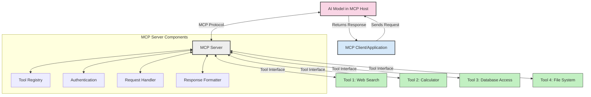
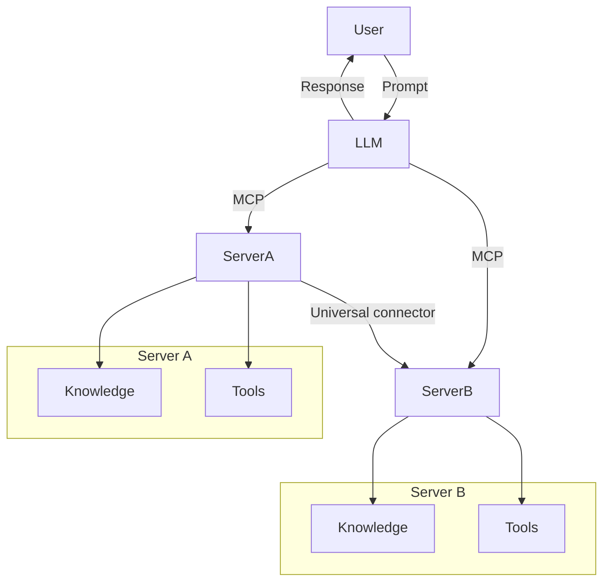
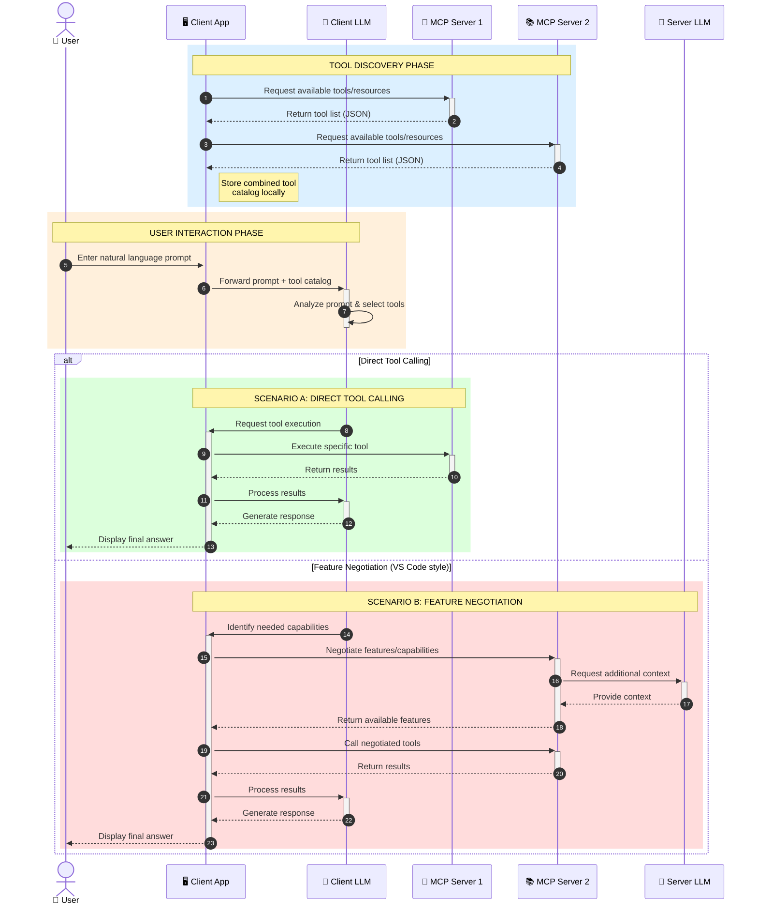

<!--
CO_OP_TRANSLATOR_METADATA:
{
  "original_hash": "25a94c681cf43612ff394d8cf78a74de",
  "translation_date": "2025-05-27T16:08:03+00:00",
  "source_file": "00-Introduction/README.md",
  "language_code": "he"
}
-->
# מבוא לפרוטוקול הקשר למודל (MCP): למה זה חשוב ליישומי AI מדרגיים

יישומי AI גנרטיביים הם צעד משמעותי קדימה, שכן הם מאפשרים למשתמש לתקשר עם האפליקציה באמצעות פקודות בשפה טבעית. עם זאת, ככל שמשקיעים יותר זמן ומשאבים באפליקציות כאלה, חשוב לוודא שניתן לשלב פונקציות ומשאבים בקלות כך שהאפליקציה תהיה ניתנת להרחבה, תתמוך בשימוש ביותר ממודל אחד, ותתמודד עם מורכבויות שונות של המודלים. בקיצור, בניית אפליקציות Gen AI קלה בתחילה, אבל ככל שהן גדלות ומורכבות יותר, צריך להתחיל להגדיר ארכיטקטורה וסביר שתצטרכו להסתמך על תקן כדי להבטיח שהאפליקציות בנויים בצורה עקבית. כאן MCP נכנס לתמונה כדי לארגן את הדברים ולספק תקן.

---

## **🔍 מהו פרוטוקול הקשר למודל (MCP)?**

**פרוטוקול הקשר למודל (MCP)** הוא **ממשק פתוח וסטנדרטי** שמאפשר למודלים שפתיים גדולים (LLMs) לתקשר בצורה חלקה עם כלים חיצוניים, APIs ומקורות נתונים. הוא מספק ארכיטקטורה אחידה לשיפור פונקציונליות של מודלים מעבר לנתוני האימון שלהם, ומאפשר מערכות AI חכמות, מדרגיות ותגובתיות יותר.

---

## **🎯 למה תקנון ב-AI חשוב**

ככל שיישומי AI גנרטיביים הופכים למורכבים יותר, חשוב לאמץ תקנים שמבטיחים **מדרגיות, הרחבה** ו**תחזוקה**. MCP עונה על הצרכים הללו על ידי:

- איחוד אינטגרציות בין מודלים לכלים
- צמצום פתרונות מותאמים שבירים וחד-פעמיים
- מתן אפשרות למספר מודלים להתקיים באקוסיסטם אחד

---

## **📚 מטרות הלמידה**

בסוף המאמר הזה, תוכלו:

- להגדיר את **פרוטוקול הקשר למודל (MCP)** ואת מקרים השימוש שלו
- להבין כיצד MCP מסטנדרט תקשורת בין מודל לכלי
- לזהות את הרכיבים המרכזיים בארכיטקטורת MCP
- לחקור יישומים מעשיים של MCP בהקשרים ארגוניים ופיתוחיים

---

## **💡 למה פרוטוקול הקשר למודל (MCP) משנה את כללי המשחק**

### **🔗 MCP פותר פיצול באינטראקציות AI**

לפני MCP, אינטגרציה בין מודלים לכלים דרשה:

- קוד מותאם אישית לכל זוג כלי-מודל
- APIs לא סטנדרטיים לכל ספק
- הפסקות תכופות בגלל עדכונים
- מדרגיות ירודה עם יותר כלים

### **✅ יתרונות תקנון MCP**

| **יתרון**                | **תיאור**                                                                  |
|--------------------------|----------------------------------------------------------------------------|
| אינטראופרביליות          | LLMs פועלים חלק עם כלים מספקים שונים                                    |
| עקביות                   | התנהגות אחידה בין פלטפורמות וכלים                                        |
| שימוש חוזר              | כלים שנבנו פעם אחת ניתנים לשימוש בפרויקטים ומערכות שונות               |
| פיתוח מואץ              | קיצור זמן פיתוח באמצעות ממשקים סטנדרטיים plug-and-play                   |

---

## **🧱 סקירת ארכיטקטורת MCP ברמה גבוהה**

MCP פועל במודל **לקוח-שרת**, כאשר:

- **MCP Hosts** מפעילים את המודלים
- **MCP Clients** יוזמים בקשות
- **MCP Servers** מספקים הקשר, כלים ויכולות

### **רכיבים מרכזיים:**

- **משאבים** – נתונים סטטיים או דינמיים עבור המודלים  
- **פרומפטים** – תהליכי עבודה מוגדרים מראש ליצירה מונחית  
- **כלים** – פונקציות ניתנות להרצה כמו חיפוש, חישובים  
- **דגימה** – התנהגות סוכנית באמצעות אינטראקציות רקורסיביות

---

## איך MCP Servers פועלים

שרתות MCP פועלים כך:

- **זרימת בקשות**:  
    1. הלקוח של MCP שולח בקשה למודל AI שרץ ב-MCP Host.  
    2. המודל מזהה מתי הוא צריך כלים חיצוניים או נתונים.  
    3. המודל מתקשר עם שרת MCP באמצעות הפרוטוקול הסטנדרטי.

- **פונקציונליות שרת MCP**:  
    - רישום כלים: מנהל קטלוג של כלים זמינים ויכולותיהם.  
    - אימות: מאמת הרשאות גישה לכלים.  
    - מטפל בבקשות: מעבד בקשות כלים שמגיעות מהמודל.  
    - מעצב תגובות: מארגן את הפלט של הכלים בפורמט שהמודל יכול להבין.

- **הרצת כלים**:  
    - השרת מפנה בקשות לכלים החיצוניים המתאימים  
    - הכלים מבצעים את הפונקציות המיוחדות שלהם (חיפוש, חישוב, שאילתות למסדי נתונים וכו')  
    - התוצאות מוחזרות למודל בפורמט אחיד.

- **סיום תגובה**:  
    - המודל משלב את פלט הכלים בתגובה שלו.  
    - התגובה הסופית נשלחת חזרה לאפליקציית הלקוח.

## 👨‍💻 איך לבנות שרת MCP (עם דוגמאות)

שרתות MCP מאפשרים להרחיב את יכולות ה-LLM על ידי מתן נתונים ופונקציונליות.

רוצים לנסות? הנה דוגמאות ליצירת שרת MCP פשוט בשפות שונות:

- **דוגמת Python**: https://github.com/modelcontextprotocol/python-sdk

- **דוגמת TypeScript**: https://github.com/modelcontextprotocol/typescript-sdk

- **דוגמת Java**: https://github.com/modelcontextprotocol/java-sdk

- **דוגמת C#/.NET**: https://github.com/modelcontextprotocol/csharp-sdk

## 🌍 מקרים שימושיים מהעולם האמיתי ל-MCP

MCP מאפשר מגוון רחב של יישומים על ידי הרחבת יכולות ה-AI:

| **יישום**                   | **תיאור**                                                                    |
|-----------------------------|-------------------------------------------------------------------------------|
| אינטגרציה של נתונים ארגוניים | חיבור LLMs למסדי נתונים, CRM או כלים פנימיים                                |
| מערכות AI סוכניות           | הפעלת סוכנים אוטונומיים עם גישה לכלים ותהליכי קבלת החלטות                  |
| יישומים מולטי-מודליים       | שילוב כלים לטקסט, תמונה וקול באפליקציית AI אחודה                           |
| אינטגרציה של נתונים בזמן אמת | הבאת נתונים חיים לאינטראקציות AI לתוצאות מדויקות ועדכניות יותר             |

### 🧠 MCP = תקן אוניברסלי לאינטראקציות AI

פרוטוקול הקשר למודל (MCP) משמש כתקן אוניברסלי לאינטראקציות AI, בדומה לאופן שבו USB-C תקנן חיבורים פיזיים למכשירים. בעולם ה-AI, MCP מספק ממשק אחיד, שמאפשר למודלים (לקוחות) להשתלב בצורה חלקה עם כלים וספקי נתונים חיצוניים (שרתים). זה מבטל את הצורך בפרוטוקולים מותאמים ומגוונים לכל API או מקור נתונים.

במסגרת MCP, כלי התואם ל-MCP (המכונה שרת MCP) פועל לפי תקן אחיד. שרתים אלה יכולים לפרסם את הכלים או הפעולות שהם מציעים ולבצע אותן כאשר סוכן AI מבקש זאת. פלטפורמות סוכני AI התומכות ב-MCP מסוגלות לגלות כלים זמינים מהשרתים ולהפעילם דרך הפרוטוקול הסטנדרטי.

### 💡 מאפשר גישה לידע

מעבר להציע כלים, MCP גם מקל על גישה לידע. הוא מאפשר לאפליקציות לספק הקשר למודלים שפתיים גדולים (LLMs) על ידי חיבור למקורות נתונים שונים. לדוגמה, שרת MCP יכול לייצג מאגר מסמכים של חברה, המאפשר לסוכנים לשלוף מידע רלוונטי לפי דרישה. שרת אחר יכול לטפל בפעולות ספציפיות כמו שליחת אימיילים או עדכון רשומות. מנקודת מבט הסוכן, אלה פשוט כלים שניתן להשתמש בהם – חלקם מחזירים נתונים (הקשר ידע), אחרים מבצעים פעולות. MCP מנהל את שניהם ביעילות.

סוכן שמתחבר לשרת MCP לומד אוטומטית את היכולות הזמינות ואת הנתונים הנגישים דרך פורמט סטנדרטי. תקנון זה מאפשר זמינות דינמית של כלים. לדוגמה, הוספת שרת MCP חדש למערכת של סוכן הופכת את הפונקציות שלו לזמינות מיידית ללא צורך בהתאמות נוספות בהנחיות הסוכן.

שילוב זה מתואם עם הזרימה שמוצגת בדיאגרמת ה-mermaid, שבה השרתים מספקים גם כלים וגם ידע, ומבטיח שיתוף פעולה חלק בין מערכות.

### 👉 דוגמה: פתרון סוכני מדרגי

### 🔄 תרחישי MCP מתקדמים עם אינטגרציית LLM בצד הלקוח

מעבר לארכיטקטורת MCP הבסיסית, קיימים תרחישים מתקדמים שבהם גם הלקוח וגם השרת מכילים LLMs, מה שמאפשר אינטראקציות מורכבות יותר:

## 🔐 יתרונות מעשיים של MCP

הנה היתרונות המעשיים בשימוש ב-MCP:

- **עדכניות**: מודלים יכולים לגשת למידע עדכני מעבר לנתוני האימון שלהם  
- **הרחבת יכולות**: מודלים יכולים לנצל כלים מיוחדים למשימות שלא אומנו עליהן  
- **צמצום הזיות**: מקורות נתונים חיצוניים מספקים עיגון עובדתי  
- **פרטיות**: נתונים רגישים נשארים בסביבות מאובטחות במקום להיות מוטמעים בפרומפטים

## 📌 נקודות מפתח

הנקודות החשובות בשימוש ב-MCP:

- **MCP** מסטנדרט כיצד מודלים מתקשרים עם כלים ונתונים  
- מקדם **הרחבה, עקביות ואינטראופרביליות**  
- MCP עוזר **לקצר זמן פיתוח, לשפר אמינות ולהרחיב יכולות מודל**  
- ארכיטקטורת לקוח-שרת מאפשרת יישומי AI גמישים ומורחבים

## 🧠 תרגיל

חשבו על אפליקציית AI שאתם מעוניינים לבנות.

- אילו **כלים חיצוניים או נתונים** יכולים לשפר את היכולות שלה?  
- איך MCP עשוי להפוך את האינטגרציה ל**פשוטה ואמינה יותר**?

## משאבים נוספים

- [מאגר MCP ב-GitHub](https://github.com/modelcontextprotocol)

## מה הלאה

הבא: [פרק 1: מושגים מרכזיים](/01-CoreConcepts/README.md)

**כתב ויתור**:  
מסמך זה תורגם באמצעות שירות תרגום מבוסס בינה מלאכותית [Co-op Translator](https://github.com/Azure/co-op-translator). בעוד שאנו שואפים לדיוק, יש לקחת בחשבון שתרגומים אוטומטיים עלולים להכיל שגיאות או אי-דיוקים. המסמך המקורי בשפת המקור שלו צריך להיחשב כמקור הסמכות. עבור מידע קריטי, מומלץ להשתמש בתרגום מקצועי אנושי. אנו לא נישא באחריות לכל אי-הבנה או פרשנות שגויה הנובעת משימוש בתרגום זה.