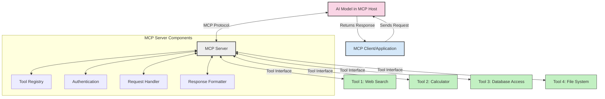
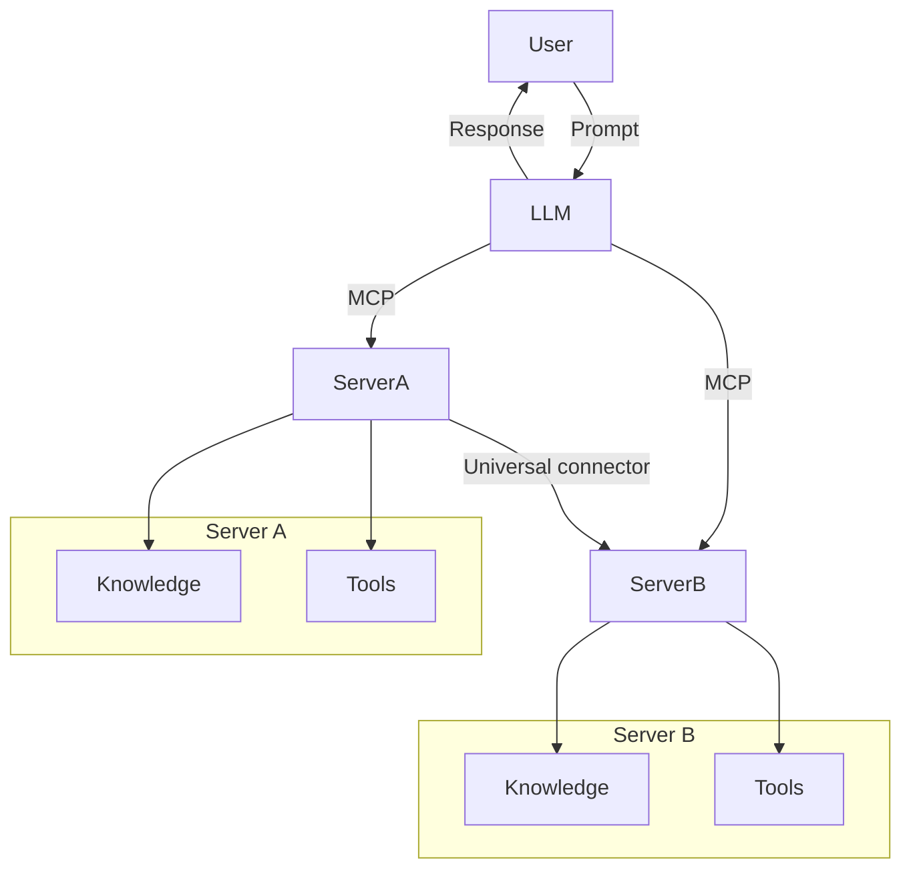

<!--
CO_OP_TRANSLATOR_METADATA:
{
  "original_hash": "cf84f987e1b771d2201408e110dfd2db",
  "translation_date": "2025-05-20T17:33:37+00:00",
  "source_file": "00-Introduction/README.md",
  "language_code": "he"
}
-->
# מבוא לפרוטוקול הקשר למודל (MCP): למה זה חשוב לאפליקציות AI מדרגיות

אפליקציות AI גנרטיביות הן צעד משמעותי קדימה, שכן הן מאפשרות למשתמש לתקשר עם האפליקציה באמצעות פקודות בשפה טבעית. עם זאת, ככל שמשקיעים יותר זמן ומשאבים באפליקציות כאלה, חשוב לוודא שניתן לשלב פונקציות ומשאבים בקלות בצורה שניתנת להרחבה, שהאפליקציה תוכל לתמוך ביותר ממודל אחד והשימוש המורכב בהם. בקיצור, בניית אפליקציות Gen AI קלה בהתחלה, אבל ככל שהן גדלות ומסובכות יותר, יש צורך להגדיר ארכיטקטורה ובסביר להניח להישען על תקן כדי להבטיח שהאפליקציות בנויים בצורה עקבית. כאן נכנס MCP כדי לארגן את הדברים ולספק תקן.

---

## **🔍 מהו פרוטוקול הקשר למודל (MCP)?**

**פרוטוקול הקשר למודל (MCP)** הוא **ממשק פתוח ומאוחד** שמאפשר למודלים גדולים של שפה (LLMs) לתקשר בצורה חלקה עם כלים חיצוניים, APIs ומקורות נתונים. הוא מספק ארכיטקטורה עקבית לשיפור פונקציונליות המודל מעבר לנתוני האימון שלו, ומאפשר מערכות AI חכמות, מדרגיות ותגובה יותר מהירה.

---

## **🎯 למה תקינה ב-AI חשובה**

ככל שאפליקציות AI גנרטיביות נעשות מורכבות יותר, חיוני לאמץ תקנים שמבטיחים **יכולת מדרגית, הרחבה** ו**תחזוקה**. MCP עונה על צרכים אלה על ידי:

- איחוד שילובי מודל-כלים  
- הפחתת פתרונות מותאמים יחידניים ופריכים  
- אפשרות לקיומם של מספר מודלים במערכת אחת  

---

## **📚 מטרות הלמידה**

בסוף המאמר הזה תוכל:

- להגדיר את **פרוטוקול הקשר למודל (MCP)** ואת מקרים לשימוש בו  
- להבין כיצד MCP מאחד את התקשורת בין מודל לכלי  
- לזהות את הרכיבים המרכזיים בארכיטקטורת MCP  
- לחקור יישומים מעשיים של MCP בהקשרים ארגוניים ופיתוח  

---

## **💡 למה פרוטוקול הקשר למודל (MCP) משנה את המשחק**

### **🔗 MCP פותר את הפירוק בתקשורת AI**

לפני MCP, שילוב מודלים עם כלים דרש:

- קוד מותאם אישית לכל זוג כלי-מודל  
- APIs לא סטנדרטיים לכל ספק  
- הפסקות תכופות עקב עדכונים  
- מדרגיות לקויה עם יותר כלים  

### **✅ יתרונות התקינה של MCP**

| **יתרון**                 | **תיאור**                                                                     |
|---------------------------|--------------------------------------------------------------------------------|
| אינטראופרביליות           | LLMs פועלים בצורה חלקה עם כלים מספקים שונים                                  |
| עקביות                    | התנהגות אחידה בפלטפורמות ובכלים                                              |
| שימוש חוזר                | כלים שנבנו פעם יכולים לשמש בפרויקטים ומערכות שונות                          |
| פיתוח מואץ                | הקטנת זמן הפיתוח באמצעות ממשקים סטנדרטיים plug-and-play                      |

---

## **🧱 סקירה כללית של ארכיטקטורת MCP ברמה גבוהה**

MCP פועל במודל **לקוח-שרת**, שבו:

- **MCP Hosts** מריצים את המודלים  
- **MCP Clients** יוזמים בקשות  
- **MCP Servers** מספקים הקשר, כלים ויכולות  

### **רכיבים מרכזיים:**

- **משאבים** – נתונים סטטיים או דינמיים עבור המודלים  
- **פרומפטים** – תהליכים מוגדרים מראש להנחיית יצירה  
- **כלים** – פונקציות ניתנות להרצה כמו חיפוש, חישובים  
- **דגימה** – התנהגות סוכנית דרך אינטראקציות רקורסיביות  

---

## כיצד שרתי MCP פועלים

שרתי MCP פועלים כך:

- **זרימת בקשה**:  
    1. לקוח MCP שולח בקשה למודל AI שרץ ב-MCP Host.  
    2. המודל מזהה מתי הוא צריך כלים חיצוניים או נתונים.  
    3. המודל מתקשר עם שרת MCP באמצעות הפרוטוקול הסטנדרטי.

- **פונקציונליות שרת MCP**:  
    - רישום כלים: מנהל קטלוג של כלים זמינים ויכולותיהם.  
    - אימות: מאמת הרשאות לגישה לכלים.  
    - מטפל בבקשות: מעבד בקשות כלים נכנסות מהמודל.  
    - מעצב תגובות: מארגן את פלט הכלים בפורמט שהמודל יכול להבין.

- **הפעלת כלים**:  
    - השרת מנתב בקשות לכלים החיצוניים המתאימים  
    - הכלים מבצעים את הפונקציות המיוחדות שלהם (חיפוש, חישוב, שאילתות מסד נתונים וכו')  
    - התוצאות מוחזרות למודל בפורמט עקבי.

- **השלמת תגובה**:  
    - המודל משלב את פלט הכלים בתגובה שלו.  
    - התגובה הסופית נשלחת חזרה לאפליקציית הלקוח.

## 👨‍💻 כיצד לבנות שרת MCP (עם דוגמאות)

שרתי MCP מאפשרים להרחיב את יכולות ה-LLM על ידי מתן נתונים ופונקציונליות.

מוכן לנסות? הנה דוגמאות ליצירת שרת MCP פשוט בשפות שונות:

- **דוגמת Python**: https://github.com/modelcontextprotocol/python-sdk

- **דוגמת TypeScript**: https://github.com/modelcontextprotocol/typescript-sdk

- **דוגמת Java**: https://github.com/modelcontextprotocol/java-sdk

- **דוגמת C#/.NET**: https://github.com/modelcontextprotocol/csharp-sdk

## 🌍 מקרים מעשיים לשימוש ב-MCP

MCP מאפשר מגוון רחב של יישומים על ידי הרחבת יכולות ה-AI:

| **יישום**                   | **תיאור**                                                                     |
|-----------------------------|--------------------------------------------------------------------------------|
| אינטגרציה של נתוני ארגון    | חיבור LLMs למסדי נתונים, CRM, או כלים פנימיים                                |
| מערכות AI סוכניות           | הפעלת סוכנים אוטונומיים עם גישה לכלים ותהליכי קבלת החלטות                   |
| אפליקציות מולטי-מודל       | שילוב כלים לטקסט, תמונה, וצליל באפליקציית AI מאוחדת                          |
| אינטגרציה בזמן אמת של נתונים | הבאת נתונים חיים לאינטראקציות AI לתוצאות מדויקות ועדכניות יותר               |

### 🧠 MCP = תקן אוניברסלי לאינטראקציות AI

פרוטוקול הקשר למודל (MCP) משמש כתקן אוניברסלי לאינטראקציות AI, בדומה לאופן שבו USB-C תקן חיבורים פיזיים למכשירים. בעולם ה-AI, MCP מספק ממשק עקבי, שמאפשר למודלים (לקוחות) להשתלב בקלות עם כלים חיצוניים וספקי נתונים (שרתים). זה מבטל את הצורך בפרוטוקולים מותאמים שונים לכל API או מקור נתונים.

במסגרת MCP, כלי תואם MCP (המכונה שרת MCP) פועל לפי תקן אחיד. שרתים אלה יכולים לרשום את הכלים או הפעולות שהם מציעים ולבצע אותן כאשר סוכן AI מבקש זאת. פלטפורמות סוכני AI התומכות ב-MCP יכולות לאתר כלים זמינים מהשרתים ולהפעיל אותם דרך הפרוטוקול הסטנדרטי.

### 💡 מקל על הגישה לידע

מעבר להציע כלים, MCP גם מקל על הגישה לידע. הוא מאפשר לאפליקציות לספק הקשר למודלים גדולים של שפה (LLMs) על ידי קישור למקורות נתונים שונים. לדוגמה, שרת MCP עשוי לייצג מאגר מסמכים של חברה, מה שמאפשר לסוכנים לשלוף מידע רלוונטי לפי דרישה. שרת אחר יכול לטפל בפעולות ספציפיות כמו שליחת מיילים או עדכון רשומות. מנקודת מבט הסוכן, אלה פשוט כלים שהוא יכול להשתמש בהם – חלק מהכלים מחזירים נתונים (הקשר ידע), ואחרים מבצעים פעולות. MCP מנהל את שניהם ביעילות.

סוכן שמתחבר לשרת MCP לומד אוטומטית את היכולות הזמינות והנתונים הנגישים דרך פורמט סטנדרטי. תקינה זו מאפשרת זמינות דינמית של כלים. למשל, הוספת שרת MCP חדש למערכת הסוכן הופכת את פונקציותיו לשמישות מיד, ללא צורך בהתאמה נוספת של ההוראות לסוכן.

שילוב חלק זה תואם לזרימה המוצגת בדיאגרמת mermaid, שבה השרתים מספקים גם כלים וגם ידע, ומבטיחים שיתוף פעולה חלק בין מערכות.

### 👉 דוגמה: פתרון סוכן מדרגי

## 🔐 יתרונות מעשיים של MCP

הנה היתרונות המעשיים של שימוש ב-MCP:

- **עדכניות**: מודלים יכולים לגשת למידע עדכני מעבר לנתוני האימון שלהם  
- **הרחבת יכולות**: מודלים יכולים לנצל כלים מיוחדים למשימות שלא אומנו עבורן  
- **הפחתת הזיות**: מקורות נתונים חיצוניים מספקים עיגון עובדתי  
- **פרטיות**: נתונים רגישים יכולים להישאר בסביבות מאובטחות במקום להיות מוטמעים בפרומפטים  

## 📌 נקודות מפתח

הנקודות המרכזיות לשימוש ב-MCP הן:

- **MCP** מאחד את האופן שבו מודלים של AI מתקשרים עם כלים ונתונים  
- מקדם **הרחבה, עקביות ואינטראופרביליות**  
- MCP מסייע **להפחית זמן פיתוח, לשפר אמינות ולהרחיב יכולות מודל**  
- ארכיטקטורת הלקוח-שרת מאפשרת אפליקציות AI גמישות ומורחבות  

## 🧠 תרגיל

חשוב על אפליקציית AI שאתה מעוניין לבנות.

- אילו **כלים חיצוניים או נתונים** יכולים לשפר את היכולות שלה?  
- איך MCP עשוי להפוך את השילוב ל**פשוט ואמין יותר?**  

## משאבים נוספים

- [מאגר GitHub של MCP](https://github.com/modelcontextprotocol)

## מה הלאה

הבא: [פרק 1: מושגים מרכזיים](/01-CoreConcepts/README.md)

**כתב ויתור**:  
מסמך זה תורגם באמצעות שירות תרגום מבוסס בינה מלאכותית [Co-op Translator](https://github.com/Azure/co-op-translator). למרות שאנו שואפים לדיוק, יש לקחת בחשבון כי תרגומים אוטומטיים עלולים להכיל שגיאות או אי-דיוקים. המסמך המקורי בשפת המקור שלו נחשב למקור הסמכותי. למידע קריטי מומלץ להשתמש בתרגום מקצועי על ידי אדם. אנו לא אחראים לכל אי-הבנות או פרשנויות שגויות הנובעות משימוש בתרגום זה.