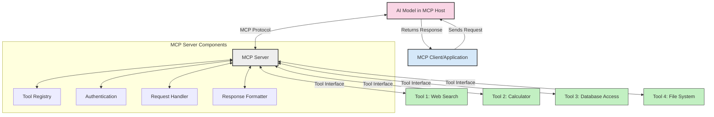
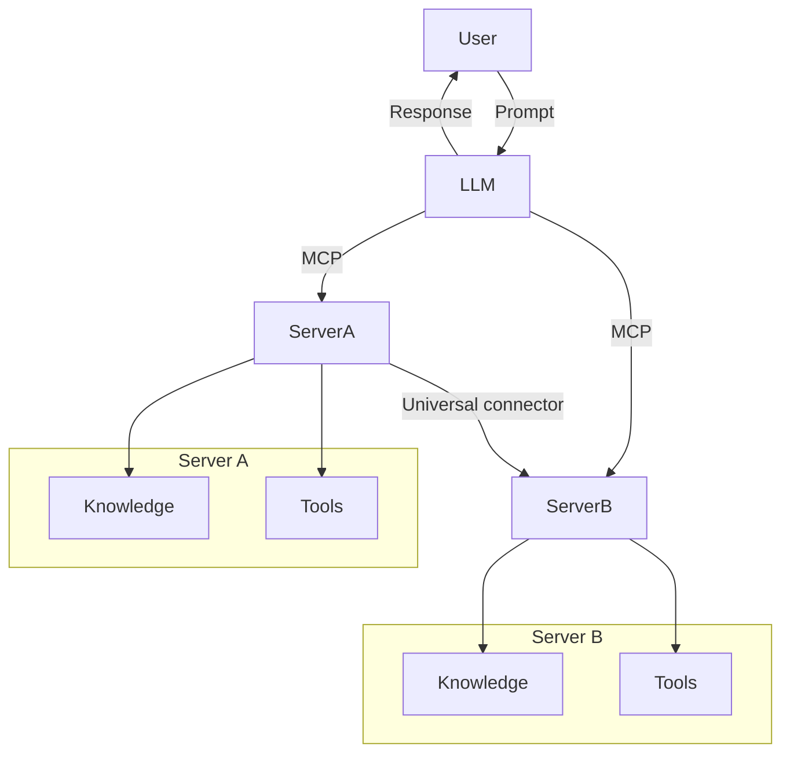

<!--
CO_OP_TRANSLATOR_METADATA:
{
  "original_hash": "02301140adbd807ecf0f17720fa307bc",
  "translation_date": "2025-05-17T06:05:04+00:00",
  "source_file": "00-Introduction/README.md",
  "language_code": "he"
}
-->
# מבוא לפרוטוקול הקשר מודל (MCP): למה זה חשוב ליישומי AI בקנה מידה

יישומי AI גנרטיביים הם צעד גדול קדימה מכיוון שהם מאפשרים לעיתים קרובות למשתמשים לקיים אינטראקציה עם האפליקציה באמצעות הנחיות בשפה טבעית. עם זאת, ככל שיותר זמן ומשאבים מושקעים באפליקציות כאלה, אתה רוצה לוודא שאתה יכול לשלב פונקציות ומשאבים בקלות כך שיהיה קל להרחיב, שהאפליקציה שלך תוכל להתאים ליותר מדגם אחד שמופעל, ולמול מורכבותה. בקצרה, בניית אפליקציות AI גנרטיביות היא קלה להתחיל אך ככל שהיא גדלה ומורכבת, אתה צריך להתחיל להגדיר ארכיטקטורה וסביר להניח שתצטרך להסתמך על סטנדרט כדי לוודא שהאפליקציות שלך נבנות בצורה עקבית. כאן נכנס MCP לארגן דברים, לספק סטנדרט.

---

## **🔍 מהו פרוטוקול הקשר מודל (MCP)?**

**פרוטוקול הקשר מודל (MCP)** הוא **ממשק פתוח ומאוחד** שמאפשר למודלים שפה גדולים (LLMs) לקיים אינטראקציה בצורה חלקה עם כלים חיצוניים, APIs ומקורות נתונים. הוא מספק ארכיטקטורה עקבית לשיפור פונקציונליות המודלים AI מעבר לנתוני האימון שלהם, ומאפשר מערכות AI חכמות, בקנה מידה ויותר מגיבות.

---

## **🎯 למה סטנדרטיזציה ב-AI חשובה**

ככל שיישומי AI גנרטיביים הופכים מורכבים יותר, חיוני לאמץ סטנדרטים שמבטיחים **קנה מידה, הרחבה** ו**תחזוקה**. MCP עונה על הצרכים האלה על ידי:

- איחוד אינטגרציות מודל-כלי
- הפחתת פתרונות מותאמים אישית שבריריים
- מאפשר למודלים רבים להתקיים באותו אקוסיסטם

---

## **📚 מטרות למידה**

בסוף מאמר זה, תוכל:

- להגדיר **פרוטוקול הקשר מודל (MCP)** ואת המקרים השימוש שלו
- להבין איך MCP מאחד תקשורת מודל-כלי
- לזהות את הרכיבים המרכזיים של ארכיטקטורת MCP
- לחקור יישומים בעולם האמיתי של MCP בהקשרי ארגון ופיתוח

---

## **💡 למה פרוטוקול הקשר מודל (MCP) הוא משנה משחק**

### **🔗 MCP פותר פירוק באינטראקציות AI**

לפני MCP, שילוב מודלים עם כלים דרש:

- קוד מותאם לכל זוג כלי-מודל
- APIs לא סטנדרטיים לכל ספק
- הפסקות תכופות עקב עדכונים
- קנה מידה גרוע עם יותר כלים

### **✅ יתרונות סטנדרטיזציה של MCP**

| **יתרון**              | **תיאור**                                                                |
|--------------------------|--------------------------------------------------------------------------------|
| תאימות                   | LLMs עובדים בצורה חלקה עם כלים מספקים שונים                       |
| עקביות                   | התנהגות אחידה בפלטפורמות וכלים                                    |
| שימוש חוזר               | כלים שנבנו פעם אחת יכולים לשמש בפרויקטים ומערכות שונות                       |
| פיתוח מואץ               | הפחתת זמן פיתוח על ידי שימוש בממשקים סטנדרטיים, פלאג-אנד-פליי                |

---

## **🧱 סקירה ברמה גבוהה של ארכיטקטורת MCP**

MCP פועל לפי **מודל לקוח-שרת**, שבו:

- **מארחי MCP** מריצים את המודלים AI
- **לקוחות MCP** מתחילים בקשות
- **שרתים MCP** מספקים הקשר, כלים ויכולות

### **רכיבים מרכזיים:**

- **משאבים** – נתונים סטטיים או דינמיים למודלים  
- **הנחיות** – תהליכי עבודה מוגדרים מראש להנחיה יצירתית  
- **כלים** – פונקציות ניתנות לביצוע כמו חיפוש, חישובים  
- **דגימה** – התנהגות אייג'נטית באמצעות אינטראקציות חוזרות

---

## איך שרתי MCP עובדים

שרתי MCP פועלים באופן הבא:

- **זרימת בקשה**: 
    1. לקוח MCP שולח בקשה למודל AI שרץ במארח MCP.
    2. מודל AI מזהה מתי הוא צריך כלים חיצוניים או נתונים.
    3. המודל מתקשר עם שרת MCP באמצעות הפרוטוקול המאוחד.

- **פונקציונליות שרת MCP**:
    - רישום כלים: שומר קטלוג של הכלים הזמינים והיכולות שלהם.
    - אימות: מאמת הרשאות לגישה לכלים.
    - מטפל בקשות: מעבד בקשות כלים נכנסות מהמודל.
    - פורמט תגובה: מבנה פלטי כלים בפורמט שהמודל יכול להבין.

- **ביצוע כלי**: 
    - השרת מנתב בקשות לכלים חיצוניים מתאימים
    - כלים מבצעים את הפונקציות המיוחדות שלהם (חיפוש, חישוב, שאילתות בסיס נתונים וכו')
    - תוצאות מוחזרות למודל בפורמט עקבי.

- **השלמת תגובה**: 
    - מודל AI משלב את פלטי הכלים בתגובתו.
    - התגובה הסופית נשלחת חזרה ליישום הלקוח.

## 👨‍💻 איך לבנות שרת MCP (עם דוגמאות)

שרתי MCP מאפשרים לך להרחיב את יכולות LLM על ידי מתן נתונים ופונקציונליות. 

מוכן לנסות? הנה דוגמאות ליצירת שרת MCP פשוט בשפות שונות:

- **דוגמת פייתון**: https://github.com/modelcontextprotocol/python-sdk

- **דוגמת TypeScript**: https://github.com/modelcontextprotocol/typescript-sdk

- **דוגמת Java**: https://github.com/modelcontextprotocol/java-sdk

- **דוגמת C#/.NET**: https://github.com/modelcontextprotocol/csharp-sdk

## 🌍 מקרים שימוש בעולם האמיתי ל-MCP

MCP מאפשר מגוון רחב של יישומים על ידי הרחבת יכולות AI:

| **יישום**                  | **תיאור**                                                                |
|------------------------------|--------------------------------------------------------------------------------|
| אינטגרציה נתונים ארגונית    | חיבור LLMs לבסיסי נתונים, CRMs או כלים פנימיים                             |
| מערכות AI אייג'נטיות        | מאפשר סוכנים אוטונומיים עם גישה לכלים ותהליכי קבלת החלטות        |
| יישומים רב-מודאליים         | שילוב כלים לטקסט, תמונה ואודיו בתוך אפליקציית AI מאוחדת אחת            |
| אינטגרציה נתונים בזמן אמת   | הבאת נתונים חיים לאינטראקציות AI לקבלת פלטים מדויקים ועדכניים יותר        |

### 🧠 MCP = סטנדרט אוניברסלי לאינטראקציות AI

פרוטוקול הקשר מודל (MCP) פועל כסטנדרט אוניברסלי לאינטראקציות AI, בדומה לאיך ש-USB-C סטנדרטיזציה חיבורים פיזיים למכשירים. בעולם ה-AI, MCP מספק ממשק עקבי, שמאפשר למודלים (לקוחות) להשתלב בצורה חלקה עם כלים ומקורות נתונים חיצוניים (שרתים). זה מבטל את הצורך בפרוטוקולים מגוונים ומותאמים אישית לכל API או מקור נתונים.

תחת MCP, כלי תואם MCP (המכונה שרת MCP) פועל לפי סטנדרט מאוחד. שרתים אלה יכולים לרשום את הכלים או הפעולות שהם מציעים ולבצע את הפעולות הללו כשמתבקש על ידי סוכן AI. פלטפורמות סוכן AI שתומכות ב-MCP מסוגלות לגלות כלים זמינים מהשרתים ולהפעיל אותם דרך פרוטוקול סטנדרטי זה.

### 💡 גישה לידע

מעבר להצעת כלים, MCP גם מקל על גישה לידע. הוא מאפשר לאפליקציות לספק הקשר למודלים שפה גדולים (LLMs) על ידי קישורם למקורות נתונים שונים. לדוגמה, שרת MCP עשוי לייצג מאגר מסמכים של חברה, ומאפשר לסוכנים לאחזר מידע רלוונטי לפי דרישה. שרת אחר יכול לטפל בפעולות ספציפיות כמו שליחת אימיילים או עדכון רשומות. מנקודת מבט הסוכן, אלה פשוט כלים שהוא יכול להשתמש בהם—חלק מהכלים מחזירים נתונים (הקשר ידע), בעוד אחרים מבצעים פעולות. MCP מנהל את שניהם ביעילות.

סוכן שמתחבר לשרת MCP לומד אוטומטית את היכולות הזמינות של השרת ואת הנתונים הנגישים בפורמט סטנדרטי. סטנדרטיזציה זו מאפשרת זמינות כלים דינמית. לדוגמה, הוספת שרת MCP חדש למערכת הסוכן עושה את הפונקציות שלו זמינות באופן מיידי ללא צורך בהתאמה נוספת של הוראות הסוכן.

אינטגרציה זו המוסדרת מתיישרת עם הזרימה המוצגת בתרשים מרמייד, שבו שרתים מספקים הן כלים והן ידע, ומבטיחים שיתוף פעולה חלק בין מערכות.

### 👉 דוגמה: פתרון סוכן בקנה מידה

## 🔐 יתרונות מעשיים של MCP

הנה כמה יתרונות מעשיים לשימוש ב-MCP:

- **עדכניות**: מודלים יכולים לגשת למידע עדכני מעבר לנתוני האימון שלהם
- **הרחבת יכולות**: מודלים יכולים לנצל כלים מיוחדים למשימות שלא אומנו עבורן
- **הפחתת הזיות**: מקורות נתונים חיצוניים מספקים בסיס עובדתי
- **פרטיות**: נתונים רגישים יכולים להישאר בסביבות מאובטחות במקום להיות מוטבעים בהנחיות

## 📌 נקודות מפתח

הנקודות הבאות הן נקודות מפתח לשימוש ב-MCP:

- **MCP** מאחד איך מודלים AI מקיימים אינטראקציה עם כלים ונתונים
- מקדם **הרחבה, עקביות ותאימות**
- MCP עוזר **להפחית זמן פיתוח, לשפר אמינות ולהרחיב יכולות מודל**
- ארכיטקטורת לקוח-שרת **מאפשרת יישומי AI גמישים ומורחבים**

## 🧠 תרגיל

חשוב על יישום AI שאתה מעוניין לבנות.

- אילו **כלים חיצוניים או נתונים** יכולים לשפר את יכולותיו?
- איך MCP יכול להפוך את האינטגרציה **לקלה ואמינה יותר?**

## משאבים נוספים

- [מאגר GitHub של MCP](https://github.com/modelcontextprotocol)

## מה הלאה

הבא: [פרק 1: מושגים מרכזיים](/01-CoreConcepts/README.md)

**כתב ויתור**:  
מסמך זה תורגם באמצעות שירות תרגום AI [Co-op Translator](https://github.com/Azure/co-op-translator). בעוד אנו שואפים לדיוק, אנא היו מודעים לכך שתרגומים אוטומטיים עשויים להכיל שגיאות או אי דיוקים. המסמך המקורי בשפתו המקורית צריך להיחשב כמקור סמכותי. עבור מידע קריטי, מומלץ להשתמש בתרגום מקצועי אנושי. אנו לא נושאים באחריות לכל אי הבנות או פרשנויות מוטעות הנובעות משימוש בתרגום זה.