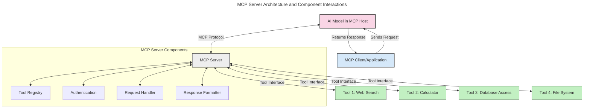
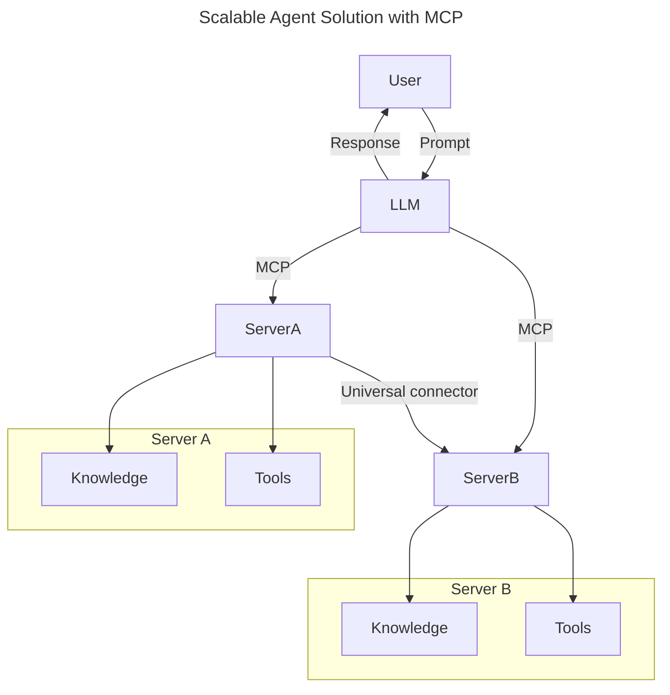
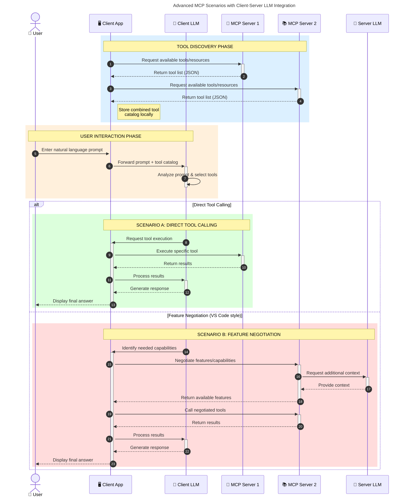

<!--
CO_OP_TRANSLATOR_METADATA:
{
  "original_hash": "1446979020432f512c883848d7eca144",
  "translation_date": "2025-05-29T21:50:57+00:00",
  "source_file": "00-Introduction/README.md",
  "language_code": "he"
}
-->
# مقدمة لبروتوكول سياق النموذج (MCP): למה זה חשוב ליישומי AI ניתנים להרחבה

יישומי AI גנרטיביים הם צעד גדול קדימה כי הם מאפשרים למשתמש לתקשר עם האפליקציה באמצעות פקודות בשפה טבעית. עם זאת, ככל שמשקיעים יותר זמן ומשאבים באפליקציות כאלה, חשוב לוודא שניתן לשלב פונקציות ומשאבים בקלות כך שיהיה פשוט להרחיב, שהאפליקציה תוכל לתמוך ביותר מדגם אחד ולהתמודד עם מורכבויות שונות של מודלים. בקיצור, בניית אפליקציות Gen AI קלה להתחלה, אך כשהן מתפתחות ומורכבות יותר, צריך להתחיל להגדיר ארכיטקטורה וסביר שתצטרך להסתמך על תקן כדי להבטיח שהאפליקציות שלך בנויים באופן עקבי. כאן MCP נכנס לארגון הדברים ולמתן תקן.

---

## **🔍 מהו Model Context Protocol (MCP)?**

**Model Context Protocol (MCP)** הוא **ממשק פתוח ומאוחד** שמאפשר למודלים לשפה גדולים (LLMs) לתקשר בצורה חלקה עם כלים חיצוניים, APIs ומקורות נתונים. הוא מספק ארכיטקטורה עקבית לשיפור פונקציונליות המודל מעבר לנתוני האימון, ומאפשר מערכות AI חכמות, ניתנות להרחבה ויותר תגובתיות.

---

## **🎯 למה תקינה ב-AI חשובה**

ככל שיישומי AI גנרטיביים נעשים מורכבים יותר, חשוב לאמץ תקנים שמבטיחים **ניתנות להרחבה, הרחבה** ו**תחזוקה**. MCP מטפל בצרכים אלו על ידי:

- איחוד אינטגרציות מודל-כלי
- הפחתת פתרונות מותאמים אישית שבירים
- אפשרות למודלים מרובים להתקיים באקוסיסטם אחד

---

## **📚 מטרות למידה**

בסוף המאמר תוכל:

- להגדיר את **Model Context Protocol (MCP)** ואת מקרים השימוש שלו
- להבין איך MCP מאחד את התקשורת בין מודל לכלי
- לזהות את הרכיבים המרכזיים בארכיטקטורת MCP
- לחקור יישומים מעשיים של MCP בהקשרים ארגוניים ופיתוחיים

---

## **💡 למה Model Context Protocol (MCP) משנה את המשחק**

### **🔗 MCP פותר את הפיצול באינטראקציות AI**

לפני MCP, אינטגרציה בין מודלים לכלים דרשה:

- קוד מותאם אישית לכל זוג כלי-מודל
- APIs לא תקניים לכל ספק
- הפסקות תכופות בעקבות עדכונים
- קושי בהרחבה עם כלים נוספים

### **✅ יתרונות התקינה של MCP**

| **יתרון**                | **תיאור**                                                                     |
|--------------------------|--------------------------------------------------------------------------------|
| אינטרופרביליות           | LLMs עובדים בצורה חלקה עם כלים מספקים שונים                                  |
| עקביות                   | התנהגות אחידה בפלטפורמות וכלים שונים                                         |
| שימוש חוזר               | כלים שנבנו פעם יכולים לשמש בפרויקטים ומערכות שונות                           |
| פיתוח מואץ              | קיצור זמן הפיתוח באמצעות ממשקים תקניים Plug-and-Play                         |

---

## **🧱 סקירת ארכיטקטורת MCP ברמה גבוהה**

MCP פועל במודל **לקוח-שרת**, שבו:

- **MCP Hosts** מפעילים את מודלי ה-AI
- **MCP Clients** שולחים בקשות
- **MCP Servers** מספקים הקשר, כלים ויכולות

### **רכיבים מרכזיים:**

- **משאבים** – נתונים סטטיים או דינמיים עבור המודלים  
- **פרומפטים** – תרחישים מוגדרים מראש ליצירה מודרכת  
- **כלים** – פונקציות הניתנות להרצה כמו חיפוש, חישובים  
- **דגימה** – התנהגות אגנטית דרך אינטראקציות חוזרות

---

## איך MCP Servers עובדים

שרתים של MCP פועלים כך:

- **זרימת בקשות**:  
    1. MCP Client שולח בקשה למודל AI שרץ ב-MCP Host.  
    2. המודל מזהה מתי הוא זקוק לכלים חיצוניים או לנתונים.  
    3. המודל מתקשר עם MCP Server דרך הפרוטוקול התקני.

- **פונקציונליות MCP Server**:  
    - רישום כלים: שומר קטלוג של כלים זמינים ויכולותיהם.  
    - אימות: מאמת הרשאות לגישה לכלים.  
    - מטפל בבקשות: מעבד בקשות לכלים שמגיעות מהמודל.  
    - מעצב תגובות: מארגן את פלט הכלים בפורמט שהמודל מבין.

- **הרצת כלים**:  
    - השרת מנתב בקשות לכלים החיצוניים המתאימים  
    - הכלים מבצעים את הפונקציות המיוחדות שלהם (חיפוש, חישוב, שאילתות למסדי נתונים וכו')  
    - התוצאות מוחזרות למודל בפורמט עקבי.

- **השלמת תגובה**:  
    - המודל משלב את פלט הכלים בתגובה שלו.  
    - התגובה הסופית נשלחת חזרה לאפליקציית הלקוח.

## 👨‍💻 איך לבנות שרת MCP (עם דוגמאות)

שרתים של MCP מאפשרים להרחיב את יכולות ה-LLM באמצעות מתן נתונים ופונקציונליות.

מוכן לנסות? הנה דוגמאות ליצירת שרת MCP פשוט בשפות שונות:

- **דוגמת Python**: https://github.com/modelcontextprotocol/python-sdk

- **דוגמת TypeScript**: https://github.com/modelcontextprotocol/typescript-sdk

- **דוגמת Java**: https://github.com/modelcontextprotocol/java-sdk

- **דוגמת C#/.NET**: https://github.com/modelcontextprotocol/csharp-sdk

## 🌍 מקרים אמיתיים לשימוש ב-MCP

MCP מאפשר מגוון רחב של יישומים על ידי הרחבת יכולות AI:

| **יישום**                  | **תיאור**                                                                     |
|----------------------------|--------------------------------------------------------------------------------|
| אינטגרציית נתונים ארגונית | חיבור LLMs למסדי נתונים, CRM או כלים פנימיים                                |
| מערכות AI אגנטיות          | אפשרות לסוכנים אוטונומיים עם גישה לכלים וזרימות עבודה לקבלת החלטות          |
| יישומים מולטימודאליים      | שילוב כלים לטקסט, תמונה וקול באפליקציית AI אחודה                           |
| אינטגרציית נתונים בזמן אמת| הבאת נתונים חיים לאינטראקציות AI לתוצאות מדויקות ועדכניות יותר             |

### 🧠 MCP = תקן אוניברסלי לאינטראקציות AI

Model Context Protocol (MCP) משמש כתקן אוניברסלי לאינטראקציות AI, בדומה לאופן שבו USB-C התקן חיבורים פיזיים למכשירים. בעולם ה-AI, MCP מספק ממשק עקבי שמאפשר למודלים (לקוחות) להשתלב בצורה חלקה עם כלים וספקי נתונים חיצוניים (שרתים). זה מבטל את הצורך בפרוטוקולים מותאמים אישית ומגוונים לכל API או מקור נתונים.

במסגרת MCP, כלי תואם MCP (המכונה שרת MCP) פועל לפי תקן מאוחד. שרתים אלה יכולים לרשום את הכלים או הפעולות שהם מציעים ולבצע אותן כאשר סוכן AI מבקש זאת. פלטפורמות סוכני AI שתומכות ב-MCP מסוגלות לאתר כלים זמינים מהשרתים ולהפעיל אותם דרך פרוטוקול זה.

### 💡 מקל על גישה לידע

מעבר להצעת כלים, MCP גם מקל על גישה לידע. הוא מאפשר לאפליקציות לספק הקשר למודלי שפה גדולים (LLMs) על ידי חיבורם למקורות נתונים שונים. למשל, שרת MCP יכול לייצג מאגר מסמכים של חברה, שמאפשר לסוכנים לאחזר מידע רלוונטי לפי דרישה. שרת אחר יכול לטפל בפעולות ספציפיות כמו שליחת אימיילים או עדכון רשומות. מנקודת מבטו של הסוכן, אלה פשוט כלים שהוא יכול להשתמש בהם — חלקם מחזירים נתונים (הקשר ידע), ואחרים מבצעים פעולות. MCP מנהל את שניהם ביעילות.

סוכן שמתחבר לשרת MCP לומד אוטומטית את היכולות והנתונים הזמינים בשרת דרך פורמט תקני. תקינה זו מאפשרת זמינות דינמית של כלים. לדוגמה, הוספת שרת MCP חדש למערכת הסוכן הופכת את פונקציותיו לזמינות מיידית ללא צורך בהתאמות נוספות להוראות הסוכן.

אינטגרציה זו זורמת בהתאם לדיאגרמת mermaid, שבה השרתים מספקים גם כלים וגם ידע, ומבטיחים שיתוף פעולה חלק בין מערכות.

### 👉 דוגמה: פתרון סוכן ניתנים להרחבה

### 🔄 תרחישי MCP מתקדמים עם אינטגרציית LLM בצד הלקוח

מעבר לארכיטקטורת MCP הבסיסית, קיימים תרחישים מתקדמים שבהם גם הלקוח וגם השרת מכילים LLMs, מה שמאפשר אינטראקציות מורכבות יותר:

## 🔐 יתרונות מעשיים של MCP

הנה היתרונות המעשיים של שימוש ב-MCP:

- **עדכניות**: מודלים יכולים לגשת למידע עדכני מעבר לנתוני האימון שלהם  
- **הרחבת יכולות**: מודלים יכולים לנצל כלים מיוחדים למשימות שלא הוכשרו עבורן  
- **הפחתת הזיות**: מקורות נתונים חיצוניים מספקים בסיס עובדתי  
- **פרטיות**: נתונים רגישים נשארים בסביבות מאובטחות במקום להיות מוטמעים בפרומפטים

## 📌 נקודות עיקריות

הנקודות החשובות לשימוש ב-MCP הן:

- **MCP** מאחד את האופן שבו מודלים של AI מתקשרים עם כלים ונתונים  
- מקדם **הרחבה, עקביות ואינטרופרביליות**  
- MCP עוזר **להפחית זמן פיתוח, לשפר אמינות ולהרחיב יכולות מודל**  
- ארכיטקטורת לקוח-שרת **מאפשרת יישומי AI גמישים וניתנים להרחבה**

## 🧠 תרגיל

חשוב על אפליקציית AI שאתה מעוניין לבנות.

- אילו **כלים או נתונים חיצוניים** יכולים לשפר את היכולות שלה?  
- איך MCP יכול להפוך את האינטגרציה ל**פשוטה ואמינה יותר**?

## משאבים נוספים

- [MCP GitHub Repository](https://github.com/modelcontextprotocol)

## מה הלאה

הבא: [פרק 1: מושגים מרכזיים](/01-CoreConcepts/README.md)

**כתב ויתור**:  
מסמך זה תורגם באמצעות שירות תרגום מבוסס בינה מלאכותית [Co-op Translator](https://github.com/Azure/co-op-translator). למרות שאנו שואפים לדיוק, יש לקחת בחשבון כי תרגומים אוטומטיים עלולים להכיל שגיאות או אי-דיוקים. המסמך המקורי בשפתו המקורית צריך להיחשב כמקור הסמכותי. למידע קריטי מומלץ להשתמש בתרגום מקצועי על ידי מתרגם אנושי. אנו לא נושאים באחריות לכל אי-הבנה או פרשנות שגויה הנובעת מהשימוש בתרגום זה.