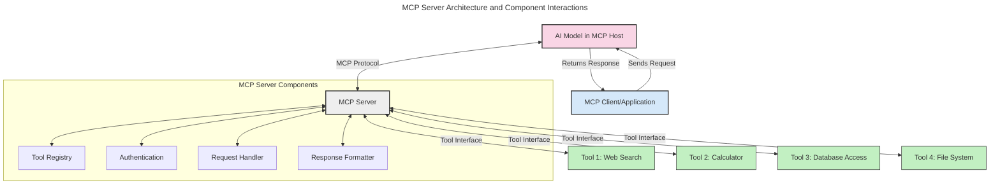
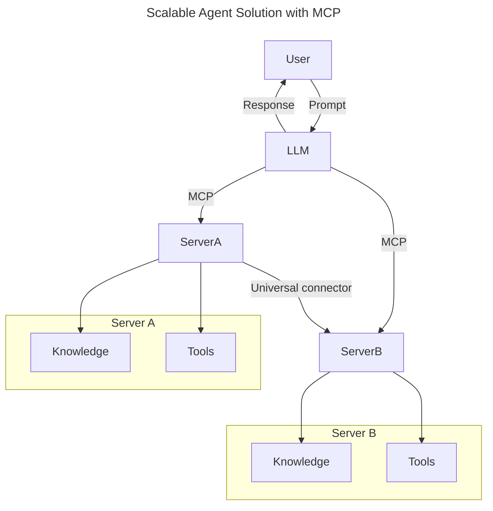
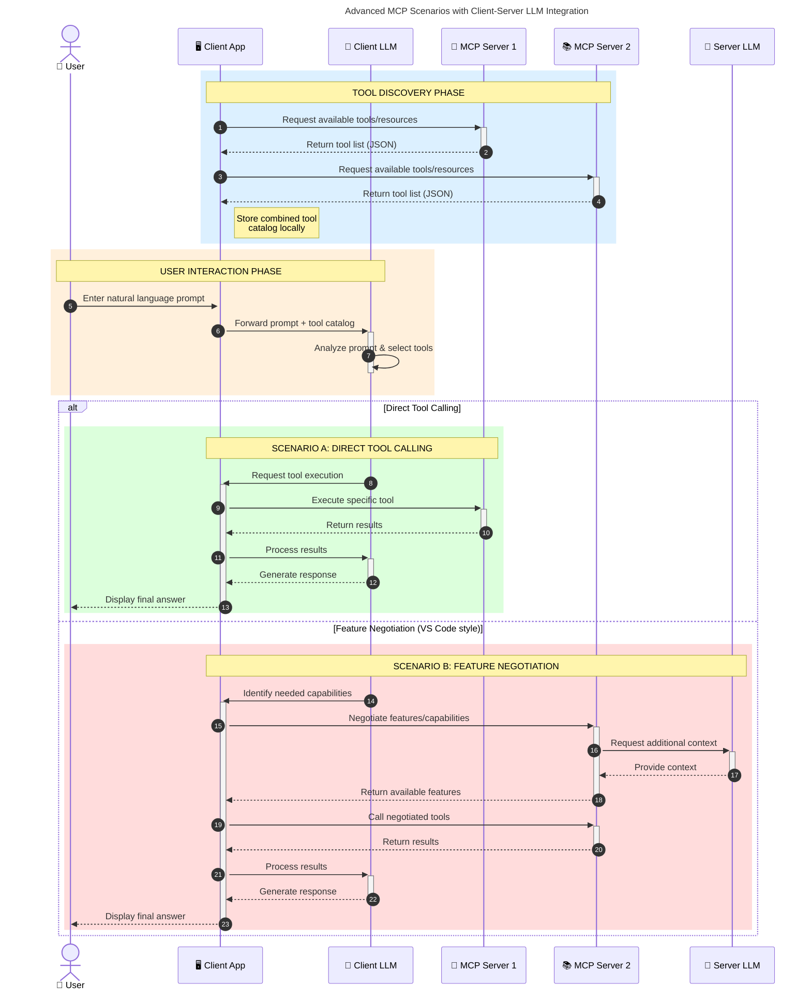

<!--
CO_OP_TRANSLATOR_METADATA:
{
  "original_hash": "105c2ddbb77bc38f7e9df009e1b06e45",
  "translation_date": "2025-07-13T15:35:44+00:00",
  "source_file": "00-Introduction/README.md",
  "language_code": "he"
}
-->
# מבוא לפרוטוקול הקשר מודל (MCP): למה זה חשוב לאפליקציות AI מתרחבות

אפליקציות AI גנרטיביות הן צעד משמעותי קדימה, שכן הן מאפשרות למשתמש לתקשר עם האפליקציה באמצעות פקודות בשפה טבעית. עם זאת, ככל שמשקיעים יותר זמן ומשאבים באפליקציות כאלה, חשוב לוודא שניתן לשלב פונקציות ומשאבים בקלות כך שיהיה פשוט להרחיב אותן, שהאפליקציה תוכל לתמוך ביותר ממודל אחד ולהתמודד עם מורכבויות שונות של המודלים. בקיצור, בניית אפליקציות Gen AI קלה בתחילה, אך ככל שהן גדלות ומורכבות יותר, יש צורך להגדיר ארכיטקטורה ולרוב להסתמך על תקן שיבטיח שהאפליקציות נבנות בצורה עקבית. כאן נכנס MCP לארגון העניינים ולמתן תקן.

---

## **🔍 מהו פרוטוקול הקשר מודל (MCP)?**

**פרוטוקול הקשר מודל (MCP)** הוא **ממשק פתוח ומאוחד** שמאפשר למודלים שפתיים גדולים (LLMs) לתקשר בצורה חלקה עם כלים חיצוניים, APIs ומקורות נתונים. הוא מספק ארכיטקטורה עקבית לשיפור פונקציונליות המודל מעבר לנתוני האימון שלו, ומאפשר מערכות AI חכמות, מתרחבות ותגובתיות יותר.

---

## **🎯 למה תקינה ב-AI חשובה**

ככל שאפליקציות AI גנרטיביות נעשות מורכבות יותר, חשוב לאמץ תקנים שמבטיחים **יכולת התרחבות, הרחבה** ו**תחזוקה**. MCP עונה על הצרכים האלה על ידי:

- איחוד אינטגרציות בין מודלים לכלים
- הפחתת פתרונות מותאמים אישית שבירים
- אפשרות להרצת מספר מודלים במערכת אחת

---

## **📚 מטרות הלמידה**

בסיום המאמר תוכל:

- להגדיר את **פרוטוקול הקשר מודל (MCP)** ואת מקרים השימוש שלו
- להבין כיצד MCP מאחד את התקשורת בין מודל לכלי
- לזהות את הרכיבים המרכזיים בארכיטקטורת MCP
- לחקור יישומים מעשיים של MCP בהקשרים ארגוניים ופיתוחיים

---

## **💡 למה פרוטוקול הקשר מודל (MCP) משנה את המשחק**

### **🔗 MCP פותר את הפירגמנטציה באינטראקציות AI**

לפני MCP, אינטגרציה בין מודלים לכלים דרשה:

- קוד מותאם אישית לכל זוג כלי-מודל
- APIs לא סטנדרטיים לכל ספק
- תקלות תכופות בעקבות עדכונים
- קושי בהתרחבות עם יותר כלים

### **✅ יתרונות התקינה של MCP**

| **יתרון**                | **תיאור**                                                                    |
|--------------------------|-------------------------------------------------------------------------------|
| אינטרופרביליות           | LLMs פועלים בצורה חלקה עם כלים מספקים שונים                                 |
| עקביות                   | התנהגות אחידה בין פלטפורמות וכלים                                           |
| שימוש חוזר               | כלים שנבנו פעם אחת ניתנים לשימוש בפרויקטים ומערכות שונות                   |
| פיתוח מואץ               | קיצור זמן הפיתוח באמצעות ממשקים סטנדרטיים plug-and-play                     |

---

## **🧱 סקירה כללית של ארכיטקטורת MCP ברמה גבוהה**

MCP פועל במודל **לקוח-שרת**, שבו:

- **MCP Hosts** מריצים את המודלים
- **MCP Clients** יוזמים בקשות
- **MCP Servers** מספקים הקשר, כלים ויכולות

### **רכיבים מרכזיים:**

- **משאבים** – נתונים סטטיים או דינמיים עבור המודלים  
- **פרומפטים** – תהליכים מוגדרים מראש להנחיית יצירה  
- **כלים** – פונקציות ניתנות להרצה כמו חיפוש, חישובים  
- **דגימה** – התנהגות סוכנית דרך אינטראקציות רקורסיביות

---

## איך MCP Servers פועלים

שרתים של MCP פועלים כך:

- **זרימת בקשות**:  
    1. הלקוח של MCP שולח בקשה למודל AI שרץ ב-MCP Host.  
    2. המודל מזהה מתי הוא זקוק לכלים או לנתונים חיצוניים.  
    3. המודל מתקשר עם שרת MCP באמצעות הפרוטוקול הסטנדרטי.

- **פונקציונליות שרת MCP**:  
    - רישום כלים: מנהל קטלוג של כלים זמינים ויכולותיהם.  
    - אימות: מאמת הרשאות לגישה לכלים.  
    - מטפל בבקשות: מעבד בקשות כלים שמגיעות מהמודל.  
    - מעצב תגובות: מארגן את פלט הכלים בפורמט שהמודל מבין.

- **הרצת כלים**:  
    - השרת מנתב בקשות לכלים חיצוניים מתאימים  
    - הכלים מבצעים את הפונקציות המיוחדות שלהם (חיפוש, חישוב, שאילתות מסד נתונים וכו')  
    - התוצאות מוחזרות למודל בפורמט עקבי.

- **השלמת תגובה**:  
    - המודל משלב את פלט הכלים בתגובתו.  
    - התגובה הסופית נשלחת חזרה לאפליקציית הלקוח.

## 👨‍💻 איך לבנות שרת MCP (עם דוגמאות)

שרתים של MCP מאפשרים להרחיב את יכולות ה-LLM על ידי מתן נתונים ופונקציונליות.

מוכן לנסות? הנה דוגמאות ליצירת שרת MCP פשוט בשפות שונות:

- **דוגמת Python**: https://github.com/modelcontextprotocol/python-sdk

- **דוגמת TypeScript**: https://github.com/modelcontextprotocol/typescript-sdk

- **דוגמת Java**: https://github.com/modelcontextprotocol/java-sdk

- **דוגמת C#/.NET**: https://github.com/modelcontextprotocol/csharp-sdk

## 🌍 מקרים מעשיים לשימוש ב-MCP

MCP מאפשר מגוון רחב של יישומים על ידי הרחבת יכולות ה-AI:

| **יישום**                  | **תיאור**                                                                    |
|----------------------------|-------------------------------------------------------------------------------|
| אינטגרציית נתונים ארגונית | חיבור LLMs למסדי נתונים, CRM או כלים פנימיים                                |
| מערכות AI סוכניות          | הפעלת סוכנים אוטונומיים עם גישה לכלים ותהליכי קבלת החלטות                   |
| אפליקציות מולטימודליות    | שילוב טקסט, תמונה וקול באפליקציית AI אחידה                                 |
| אינטגרציית נתונים בזמן אמת| הבאת נתונים חיים לאינטראקציות AI לתוצאות מדויקות ועדכניות יותר              |

### 🧠 MCP = תקן אוניברסלי לאינטראקציות AI

פרוטוקול הקשר מודל (MCP) משמש כתקן אוניברסלי לאינטראקציות AI, בדומה לאופן שבו USB-C תקן חיבורים פיזיים למכשירים. בעולם ה-AI, MCP מספק ממשק עקבי, שמאפשר למודלים (לקוחות) להשתלב בצורה חלקה עם כלים וספקי נתונים חיצוניים (שרתים). זה מבטל את הצורך בפרוטוקולים מותאמים ומגוונים לכל API או מקור נתונים.

במסגרת MCP, כלי תואם MCP (המכונה שרת MCP) פועל לפי תקן אחיד. שרתים אלה יכולים לרשום את הכלים או הפעולות שהם מציעים ולבצע אותן כאשר סוכן AI מבקש זאת. פלטפורמות סוכני AI התומכות ב-MCP מסוגלות לגלות כלים זמינים מהשרתים ולהפעיל אותם דרך הפרוטוקול הסטנדרטי.

### 💡 מקל על גישה לידע

מעבר להצעת כלים, MCP גם מקל על גישה לידע. הוא מאפשר לאפליקציות לספק הקשר למודלים שפתיים גדולים (LLMs) על ידי קישור למקורות נתונים שונים. לדוגמה, שרת MCP יכול לייצג מאגר מסמכים של חברה, המאפשר לסוכנים לשלוף מידע רלוונטי לפי דרישה. שרת אחר יכול לטפל בפעולות ספציפיות כמו שליחת מיילים או עדכון רשומות. מנקודת מבטו של הסוכן, אלה פשוט כלים שהוא יכול להשתמש בהם – חלק מהכלים מחזירים נתונים (הקשר ידע), ואחרים מבצעים פעולות. MCP מנהל את שניהם ביעילות.

סוכן שמתחבר לשרת MCP לומד אוטומטית את היכולות והנתונים הזמינים בשרת דרך פורמט סטנדרטי. תקינה זו מאפשרת זמינות דינמית של כלים. לדוגמה, הוספת שרת MCP חדש למערכת הסוכן הופכת את הפונקציות שלו לזמינות מיידית ללא צורך בהתאמות נוספות בהוראות הסוכן.

אינטגרציה חלקה זו מתיישרת עם הזרימה המתוארת בדיאגרמת mermaid, שבה השרתים מספקים גם כלים וגם ידע, ומבטיחים שיתוף פעולה חלק בין מערכות.

### 👉 דוגמה: פתרון סוכני מתרחב

### 🔄 תרחישי MCP מתקדמים עם אינטגרציית LLM בצד הלקוח

מעבר לארכיטקטורת MCP הבסיסית, קיימים תרחישים מתקדמים שבהם גם הלקוח וגם השרת מכילים LLMs, ומאפשרים אינטראקציות מתוחכמות יותר:

## 🔐 יתרונות מעשיים של MCP

הנה היתרונות המעשיים של שימוש ב-MCP:

- **עדכניות**: מודלים יכולים לגשת למידע מעודכן מעבר לנתוני האימון שלהם  
- **הרחבת יכולות**: מודלים יכולים לנצל כלים מיוחדים למשימות שלא אומנו עליהן  
- **הפחתת הזיות**: מקורות נתונים חיצוניים מספקים עיגון עובדתי  
- **פרטיות**: נתונים רגישים נשארים בסביבות מאובטחות במקום להיות מוטמעים בפרומפטים

## 📌 נקודות מפתח

הנקודות המרכזיות לשימוש ב-MCP:

- **MCP** מאחד את האופן שבו מודלים מתקשרים עם כלים ונתונים  
- מקדם **הרחבה, עקביות ואינטרופרביליות**  
- MCP עוזר **לקצר זמן פיתוח, לשפר אמינות ולהרחיב יכולות מודל**  
- ארכיטקטורת לקוח-שרת מאפשרת אפליקציות AI גמישות ומורחבות

## 🧠 תרגיל

חשוב על אפליקציית AI שאתה מעוניין לבנות.

- אילו **כלים או נתונים חיצוניים** יכולים לשפר את היכולות שלה?  
- איך MCP יכול להפוך את האינטגרציה ל**פשוטה ואמינה יותר**?

## משאבים נוספים

- [מאגר GitHub של MCP](https://github.com/modelcontextprotocol)

## מה הלאה

הבא: [פרק 1: מושגים מרכזיים](../01-CoreConcepts/README.md)

**כתב ויתור**:  
מסמך זה תורגם באמצעות שירות תרגום מבוסס בינה מלאכותית [Co-op Translator](https://github.com/Azure/co-op-translator). למרות שאנו שואפים לדיוק, יש לקחת בחשבון כי תרגומים אוטומטיים עלולים להכיל שגיאות או אי-דיוקים. המסמך המקורי בשפת המקור שלו נחשב למקור הסמכותי. למידע קריטי מומלץ להשתמש בתרגום מקצועי על ידי מתרגם אנושי. אנו לא נושאים באחריות לכל אי-הבנה או פרשנות שגויה הנובעת משימוש בתרגום זה.