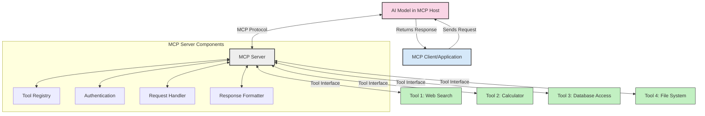
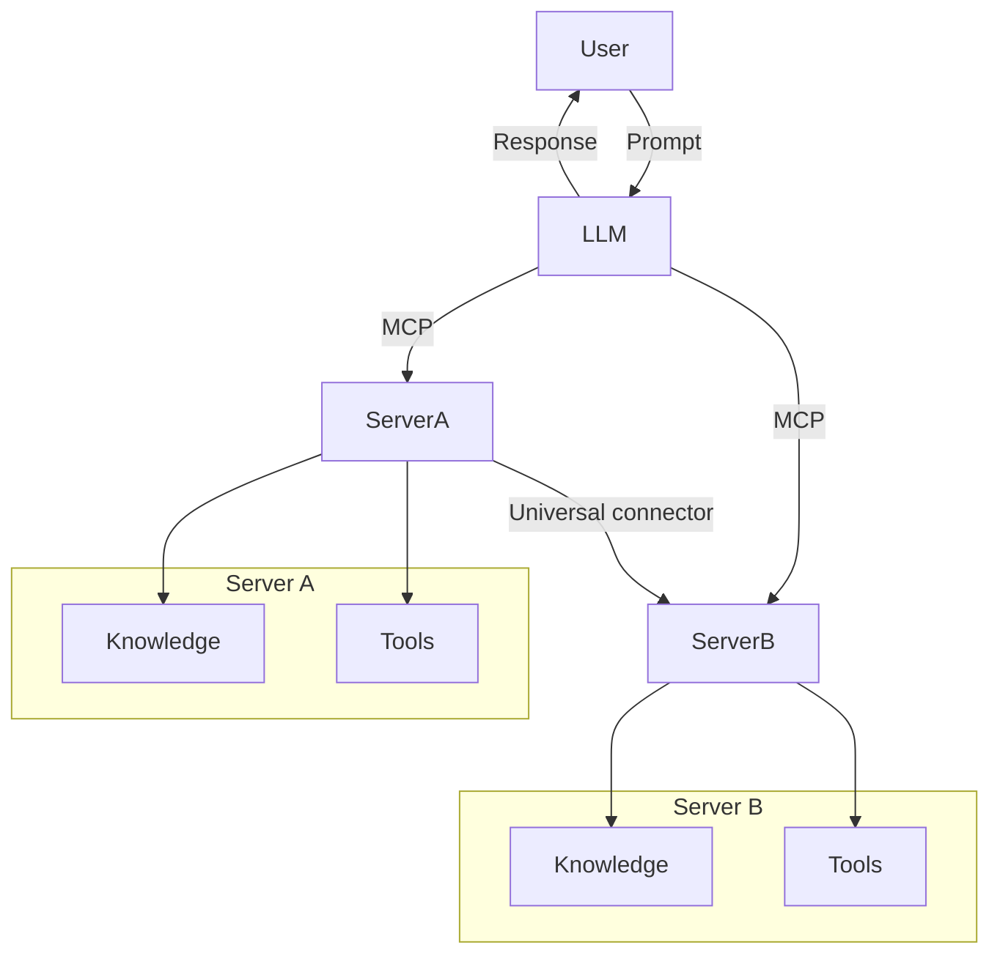

<!--
CO_OP_TRANSLATOR_METADATA:
{
  "original_hash": "1d88dee994dcbb3fa52c271d0c0817b5",
  "translation_date": "2025-05-20T21:57:00+00:00",
  "source_file": "00-Introduction/README.md",
  "language_code": "he"
}
-->
# מבוא לפרוטוקול הקשר למודל (MCP): למה זה חשוב לאפליקציות AI מדרגיות

אפליקציות AI גנרטיביות הן צעד משמעותי קדימה שכן הן מאפשרות למשתמשים לתקשר עם האפליקציה באמצעות פקודות בשפה טבעית. עם זאת, ככל שמשקיעים יותר זמן ומשאבים באפליקציות כאלה, חשוב לוודא שניתן לשלב פונקציות ומשאבים בקלות בצורה שניתן להרחיב, שהאפליקציה תתמוך בשימוש ביותר ממודל אחד, ותתמודד עם מורכבויות שונות של מודלים. בקיצור, בניית אפליקציות Gen AI קלה בהתחלה, אך כשהן מתפתחות ומורכבות יותר, יש צורך להתחיל להגדיר ארכיטקטורה וככל הנראה להסתמך על סטנדרט כדי להבטיח שהאפליקציות נבנות בצורה עקבית. כאן נכנס MCP לארגון הדברים ולמתן סטנדרט.

---

## **🔍 מהו Model Context Protocol (MCP)?**

**Model Context Protocol (MCP)** הוא **ממשק פתוח ומאוחד** שמאפשר למודלים לשפה גדולים (LLMs) לתקשר בצורה חלקה עם כלים חיצוניים, APIs ומקורות מידע. הוא מספק ארכיטקטורה עקבית לשיפור פונקציונליות של מודלים מעבר לנתוני האימון שלהם, ומאפשר מערכות AI חכמות, מדרגיות ותגובתיות יותר.

---

## **🎯 למה סטנדרטיזציה ב-AI חשובה**

כשהאפליקציות הגנרטיביות נעשות מורכבות יותר, חשוב לאמץ סטנדרטים שמבטיחים **יכולת מדרגית, הרחבה** ו**תחזוקה**. MCP מתמודד עם הצרכים האלה על ידי:

- איחוד אינטגרציות בין מודלים לכלים
- הפחתת פתרונות מותאמים אישית שבירים וחד-פעמיים
- מתן אפשרות למספר מודלים להתקיים באקוסיסטם אחד

---

## **📚 מטרות הלמידה**

בסוף המאמר תוכל/י:

- להגדיר את **Model Context Protocol (MCP)** ואת מקרי השימוש שלו
- להבין כיצד MCP מאחד את התקשורת בין מודל לכלי
- לזהות את הרכיבים המרכזיים בארכיטקטורת MCP
- לחקור יישומים ממשיים של MCP בהקשרים ארגוניים ופיתוחיים

---

## **💡 למה Model Context Protocol (MCP) משנה את המשחק**

### **🔗 MCP פותר פיצול באינטראקציות AI**

לפני MCP, אינטגרציה של מודלים עם כלים דרשה:

- קוד מותאם לכל זוג כלי-מודל
- APIs לא סטנדרטיים לכל ספק
- הפסקות תכופות עקב עדכונים
- מדרגיות גרועה עם יותר כלים

### **✅ יתרונות הסטנדרטיזציה של MCP**

| **יתרון**               | **תיאור**                                                                     |
|-------------------------|-------------------------------------------------------------------------------|
| אינטראופראביליות       | LLMs פועלים בצורה חלקה עם כלים של ספקים שונים                               |
| עקביות                  | התנהגות אחידה בין פלטפורמות וכלים                                            |
| שימוש חוזר              | כלים שנבנו פעם אחת ניתנים לשימוש בפרויקטים ומערכות שונות                   |
| פיתוח מואץ              | מקצר זמן פיתוח באמצעות ממשקים סטנדרטיים Plug-and-Play                      |

---

## **🧱 סקירה כללית של ארכיטקטורת MCP ברמה גבוהה**

MCP פועל במודל **לקוח-שרת**, שבו:

- **MCP Hosts** מפעילים את מודלי ה-AI
- **MCP Clients** יוזמים בקשות
- **MCP Servers** מספקים הקשר, כלים ויכולות

### **רכיבים מרכזיים:**

- **Resources** – נתונים סטטיים או דינמיים עבור המודלים  
- **Prompts** – זרימות עבודה מוגדרות מראש להנחיית יצירה  
- **Tools** – פונקציות הניתנות להרצה כמו חיפוש, חישובים  
- **Sampling** – התנהגות סוכנית דרך אינטראקציות חוזרות

---

## איך MCP Servers פועלים

שרתים של MCP פועלים כך:

- **זרימת בקשות**:  
    1. MCP Client שולח בקשה למודל ה-AI שרץ ב-MCP Host.  
    2. מודל ה-AI מזהה מתי הוא זקוק לכלים או לנתונים חיצוניים.  
    3. המודל מתקשר עם MCP Server באמצעות הפרוטוקול הסטנדרטי.

- **פונקציונליות MCP Server**:  
    - רישום כלים: שומר קטלוג של כלים זמינים ויכולותיהם.  
    - אימות: מאמת הרשאות לגישה לכלים.  
    - מטפל בבקשות: מעבד בקשות כלים שמגיעות מהמודל.  
    - מעצב תגובות: מארגן את פלט הכלים בפורמט שהמודל מבין.

- **הרצת כלים**:  
    - השרת מנתב בקשות לכלים חיצוניים מתאימים  
    - הכלים מבצעים את הפונקציות המיוחדות שלהם (חיפוש, חישוב, שאילתות מסד נתונים וכו')  
    - התוצאות מוחזרות למודל בפורמט עקבי.

- **השלמת תגובה**:  
    - מודל ה-AI משלב את פלט הכלים בתגובה שלו.  
    - התגובה הסופית נשלחת חזרה לאפליקציית הלקוח.

## 👨‍💻 איך לבנות MCP Server (עם דוגמאות)

שרתים של MCP מאפשרים להרחיב את יכולות ה-LLM על ידי מתן נתונים ופונקציונליות.

רוצים לנסות? הנה דוגמאות ליצירת שרת MCP פשוט בשפות שונות:

- **דוגמת Python**: https://github.com/modelcontextprotocol/python-sdk

- **דוגמת TypeScript**: https://github.com/modelcontextprotocol/typescript-sdk

- **דוגמת Java**: https://github.com/modelcontextprotocol/java-sdk

- **דוגמת C#/.NET**: https://github.com/modelcontextprotocol/csharp-sdk

## 🌍 מקרי שימוש אמיתיים ל-MCP

MCP מאפשר מגוון רחב של יישומים על ידי הרחבת יכולות ה-AI:

| **יישום**                   | **תיאור**                                                                     |
|----------------------------|-------------------------------------------------------------------------------|
| אינטגרציה ארגונית של נתונים | חיבור LLMs למסדי נתונים, CRM, או כלים פנימיים                              |
| מערכות AI סוכניות          | מאפשר סוכנים אוטונומיים עם גישה לכלים וזרימות עבודה לקבלת החלטות           |
| אפליקציות מולטימודליות    | שילוב טקסט, תמונה, וכלי שמע באפליקציית AI אחידה                           |
| אינטגרציה של נתונים בזמן אמת | הבאת נתונים חיים לאינטראקציות AI לתוצאות מדויקות ועדכניות                 |

### 🧠 MCP = סטנדרט אוניברסלי לאינטראקציות AI

Model Context Protocol (MCP) פועל כסטנדרט אוניברסלי לאינטראקציות AI, בדומה לאופן שבו USB-C סטנדרט את החיבורים הפיזיים למכשירים. בעולם ה-AI, MCP מספק ממשק עקבי שמאפשר למודלים (לקוחות) להשתלב בצורה חלקה עם כלים חיצוניים וספקי מידע (שרתים). זה מבטל את הצורך בפרוטוקולים מגוונים ומותאמים אישית לכל API או מקור מידע.

במסגרת MCP, כלי תואם MCP (המכונה MCP server) פועל לפי סטנדרט אחיד. שרתים אלה יכולים לרשום את הכלים או הפעולות שהם מציעים ולבצע אותן כאשר סוכן AI מבקש זאת. פלטפורמות סוכני AI שתומכות ב-MCP מסוגלות לאתר כלים זמינים מהשרתים ולהפעילם דרך הפרוטוקול הסטנדרטי.

### 💡 מקל על גישה לידע

מעבר למתן כלים, MCP גם מקל על גישה לידע. הוא מאפשר לאפליקציות לספק הקשר למודלים גדולים על ידי קישור למקורות מידע שונים. לדוגמה, שרת MCP יכול לייצג מאגר מסמכים של חברה, שמאפשר לסוכנים לאחזר מידע רלוונטי לפי דרישה. שרת אחר יכול לטפל בפעולות ספציפיות כמו שליחת מיילים או עדכון רשומות. מנקודת מבטו של הסוכן, אלו פשוט כלים שניתן להשתמש בהם—חלקם מחזירים נתונים (הקשר ידע), אחרים מבצעים פעולות. MCP מנהל את שניהם ביעילות.

סוכן שמתחבר לשרת MCP לומד אוטומטית את היכולות והנתונים הזמינים בשרת דרך פורמט סטנדרטי. הסטנדרטיזציה הזו מאפשרת זמינות דינמית של כלים. לדוגמה, הוספת שרת MCP חדש למערכת הסוכן הופכת את הפונקציות שלו לזמינות מיידית ללא צורך בהתאמות נוספות בהנחיות הסוכן.

האינטגרציה המפושטת הזו מתאימה לזרימה המוצגת בדיאגרמת Mermaid, שבה השרתים מספקים גם כלים וגם ידע, ומבטיחים שיתוף פעולה חלק בין מערכות.

### 👉 דוגמה: פתרון סוכני מדרגי

## 🔐 יתרונות מעשיים של MCP

הנה היתרונות המעשיים של שימוש ב-MCP:

- **עדכניות**: מודלים יכולים לגשת למידע עדכני מעבר לנתוני האימון שלהם  
- **הרחבת יכולות**: מודלים יכולים לנצל כלים מיוחדים למשימות שלא הוכשרו להן  
- **הפחתת הזיות**: מקורות מידע חיצוניים מספקים בסיס עובדתי  
- **פרטיות**: נתונים רגישים יכולים להישאר בסביבות מאובטחות במקום להיות מוטמעים בפקודות

## 📌 נקודות מפתח

הנה נקודות מפתח לשימוש ב-MCP:

- **MCP** מאחד את האופן שבו מודלי AI מתקשרים עם כלים ונתונים  
- מקדם **הרחבה, עקביות ואינטראופראביליות**  
- MCP עוזר **לקצר זמן פיתוח, לשפר אמינות ולהרחיב יכולות מודל**  
- ארכיטקטורת לקוח-שרת **מאפשרת אפליקציות AI גמישות ומורחבות**

## 🧠 תרגיל

חשבו על אפליקציית AI שאתם מעוניינים לבנות.

- אילו **כלים או נתונים חיצוניים** יכולים לשפר את היכולות שלה?  
- כיצד MCP יכול להפוך את האינטגרציה ל**פשוטה ואמינה יותר**?

## משאבים נוספים

- [מאגר GitHub של MCP](https://github.com/modelcontextprotocol)

## מה הלאה

הבא: [פרק 1: מושגים מרכזיים](/01-CoreConcepts/README.md)

**כתב ויתור**:  
מסמך זה תורגם באמצעות שירות תרגום מבוסס בינה מלאכותית [Co-op Translator](https://github.com/Azure/co-op-translator). למרות שאנו שואפים לדיוק, יש לקחת בחשבון כי תרגומים אוטומטיים עלולים להכיל שגיאות או אי-דיוקים. המסמך המקורי בשפת המקור שלו הוא המקור הסמכותי. למידע קריטי מומלץ להשתמש בתרגום מקצועי אנושי. אנו לא נושאים באחריות לכל אי-הבנה או פרשנות שגויה הנובעת משימוש בתרגום זה.