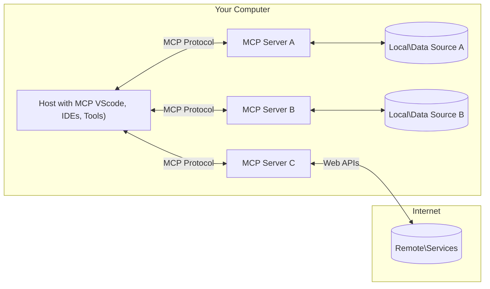

<!--
CO_OP_TRANSLATOR_METADATA:
{
  "original_hash": "b3b4a6ad10c3c0edbf7fa7cfa0ec496b",
  "translation_date": "2025-07-02T07:23:07+00:00",
  "source_file": "01-CoreConcepts/README.md",
  "language_code": "he"
}
-->
# 📖 מושגי יסוד ב-MCP: שליטה בפרוטוקול הקשר למודל לאינטגרציה עם בינה מלאכותית

[Model Context Protocol (MCP)](https://github.com/modelcontextprotocol) הוא מסגרת סטנדרטית ועוצמתית שמייעלת את התקשורת בין מודלים לשוניים גדולים (LLMs) לכלים חיצוניים, אפליקציות ומקורות מידע. מדריך זה, המותאם לקידום במנועי חיפוש, ילווה אותך במושגי היסוד של MCP, ויבטיח הבנה של ארכיטקטורת לקוח-שרת, רכיבים מרכזיים, מנגנוני תקשורת, ושיטות מימוש מיטביות.

## סקירה כללית

שיעור זה בוחן את הארכיטקטורה הבסיסית והרכיבים שמרכיבים את מערכת Model Context Protocol (MCP). תלמד על ארכיטקטורת לקוח-שרת, רכיבים מרכזיים, ומנגנוני תקשורת שמפעילים את האינטראקציות ב-MCP.

## 👩‍🎓 יעדים מרכזיים ללמידה

בסיום השיעור תוכל:

- להבין את ארכיטקטורת הלקוח-שרת של MCP.
- לזהות תפקידים ואחריות של Hosts, Clients ו-Servers.
- לנתח את התכונות המרכזיות שהופכות את MCP לשכבת אינטגרציה גמישה.
- ללמוד כיצד זורמת המידע במערכת MCP.
- לקבל תובנות מעשיות דרך דוגמאות קוד ב-.NET, Java, Python ו-JavaScript.

## 🔎 ארכיטקטורת MCP: מבט מעמיק

מערכת MCP בנויה על מודל לקוח-שרת. מבנה מודולרי זה מאפשר לאפליקציות בינה מלאכותית לתקשר עם כלים, מסדי נתונים, APIs ומשאבים הקשריים ביעילות. נפרק את הארכיטקטורה לרכיביה המרכזיים.

ביסודה, MCP פועלת בארכיטקטורת לקוח-שרת שבה אפליקציית Host יכולה להתחבר למספר שרתים:



- **MCP Hosts**: תוכניות כמו VSCode, Claude Desktop, IDEים או כלים מבוססי AI שרוצים לגשת לנתונים דרך MCP
- **MCP Clients**: לקוחות פרוטוקול שמנהלים חיבור 1:1 עם השרתים
- **MCP Servers**: תוכניות קלות שמשדרות יכולות ספציפיות דרך פרוטוקול ה-Model Context הסטנדרטי
- **מקורות נתונים מקומיים**: קבצים, מסדי נתונים ושירותים במחשב שלך ששרתי MCP יכולים לגשת אליהם בצורה מאובטחת
- **שירותים מרוחקים**: מערכות חיצוניות הזמינות דרך האינטרנט ששרתי MCP מתחברים אליהן דרך APIs.

פרוטוקול MCP הוא תקן מתפתח, ואת העדכונים האחרונים ניתן לראות ב-[מפרט הפרוטוקול](https://modelcontextprotocol.io/specification/2025-06-18/)

### 1. Hosts

בפרוטוקול Model Context (MCP), ה-Hosts ממלאים תפקיד מרכזי כממשק הראשי דרכו המשתמשים מתקשרים עם הפרוטוקול. ה-Hosts הם אפליקציות או סביבות שמתחילות חיבורים עם שרתי MCP כדי לגשת לנתונים, כלים והנחיות. דוגמאות ל-Hosts הן סביבת פיתוח משולבת (IDE) כמו Visual Studio Code, כלים מבוססי AI כמו Claude Desktop, או סוכנים מותאמים למשימות ספציפיות.

**Hosts** הם אפליקציות LLM שמתחילות חיבורים. הם:

- מריצים או מתקשרים עם מודלים ליצירת תגובות.
- יוזמים חיבורים עם שרתי MCP.
- מנהלים את זרימת השיחה וממשק המשתמש.
- שולטות בהרשאות ובמגבלות אבטחה.
- מטפלים בהסכמת המשתמש לשיתוף נתונים והפעלת כלים.

### 2. Clients

ה-Clients הם רכיבים חיוניים שמאפשרים את האינטראקציה בין ה-Hosts לשרתי MCP. הם פועלים כמתווכים, ומאפשרים ל-Hosts לגשת ולהשתמש בפונקציות שמספקים שרתי MCP. תפקידם קריטי להבטחת תקשורת חלקה והחלפת מידע יעילה במסגרת ארכיטקטורת MCP.

**Clients** הם מחברים בתוך אפליקציית ה-Host. הם:

- שולחים בקשות לשרתים עם הנחיות/פרומפטים.
- מנהלים משא ומתן על יכולות עם השרתים.
- מנהלים בקשות להפעלת כלים מהמודלים.
- מעבדים ומציגים תגובות למשתמשים.

### 3. Servers

ה-Servers אחראים על טיפול בבקשות מלקוחות MCP ומתן תגובות מתאימות. הם מנהלים פעולות שונות כמו אחזור נתונים, הפעלת כלים, ויצירת הנחיות. השרתים מבטיחים שהתקשורת בין הלקוחות ל-Hosts תהיה יעילה ואמינה, ושומרים על שלמות תהליך האינטראקציה.

**Servers** הם שירותים שמספקים הקשר ויכולות. הם:

- רושמים תכונות זמינות (משאבים, הנחיות, כלים)
- מקבלים ומבצעים קריאות כלים מהלקוח
- מספקים מידע הקשרי לשיפור תגובות המודל
- מחזירים פלטים ללקוח
- שומרים על מצב בין אינטראקציות לפי הצורך

שרתים יכולים להיות מפותחים על ידי כל אחד להרחבת יכולות המודל עם פונקציונליות מיוחדת.

### 4. תכונות שרת

שרתי MCP מספקים אבני בניין בסיסיות שמאפשרות אינטראקציות עשירות בין לקוחות, Hosts ומודלים לשוניים. תכונות אלה נועדו להעצים את היכולות של MCP על ידי הצעת הקשר מובנה, כלים והנחיות.

שרתי MCP יכולים להציע כל אחת מהתכונות הבאות:

#### 📑 משאבים

משאבים בפרוטוקול Model Context (MCP) כוללים סוגים שונים של הקשר ונתונים שניתן להשתמש בהם על ידי משתמשים או מודלים. אלה כוללים:

- **נתונים הקשריים**: מידע והקשר שהמשתמשים או המודלים יכולים לנצל לקבלת החלטות וביצוע משימות.
- **מאגרי ידע ומאגרי מסמכים**: אוספי מידע מובנים ולא מובנים, כמו מאמרים, מדריכים ומחקרים, שמספקים תובנות וידע חשוב.
- **קבצים ומסדי נתונים מקומיים**: נתונים המאוחסנים במכשירים או במסדי נתונים, נגישים לעיבוד וניתוח.
- **APIs ושירותי אינטרנט**: ממשקים חיצוניים ושירותים שמציעים נתונים ופונקציות נוספות, ומאפשרים אינטגרציה עם משאבים וכלים מקוונים.

דוגמה למשאב יכולה להיות סכמת מסד נתונים או קובץ שניתן לגשת אליו כך:

```text
file://log.txt
database://schema
```

### 🤖 הנחיות (Prompts)

ההנחיות בפרוטוקול MCP כוללות תבניות מוגדרות מראש ודפוסי אינטראקציה שמטרתם לייעל את זרימות העבודה של המשתמשים ולשפר את התקשורת. אלה כוללים:

- **הודעות ותהליכים מתבניתים**: הודעות ותהליכים מובנים שמדריכים את המשתמשים במשימות ואינטראקציות ספציפיות.
- **דפוסי אינטראקציה מוגדרים מראש**: רצפים סטנדרטיים של פעולות ותגובות שמאפשרים תקשורת עקבית ויעילה.
- **תבניות שיחה מיוחדות**: תבניות מותאמות לסוגי שיחות מסוימים, להבטיח אינטראקציות רלוונטיות והקשריות.

תבנית הנחיה יכולה להיראות כך:

```markdown
Generate a product slogan based on the following {{product}} with the following {{keywords}}
```

#### ⛏️ כלים

כלים בפרוטוקול MCP הם פונקציות שהמודל יכול להפעיל לביצוע משימות מסוימות. כלים אלו נועדו להרחיב את יכולות המודל על ידי מתן פעולות מובנות ואמינות. נקודות מרכזיות כוללות:

- **פונקציות שהמודל יכול להפעיל**: כלים הם פונקציות שניתן לקרוא להן כדי לבצע משימות שונות.
- **שם ותיאור ייחודיים**: לכל כלי שם מובחן ותיאור מפורט המסביר את מטרתו ופונקציונליותו.
- **פרמטרים ופלטים**: הכלים מקבלים פרמטרים מסוימים ומחזירים פלטים מובנים, להבטיח תוצאות עקביות וניתנות לחיזוי.
- **פונקציות דיסקרטיות**: כלים מבצעים פעולות מוגדרות כמו חיפוש באינטרנט, חישובים, ושאילתות למסדי נתונים.

דוגמה לכלי יכולה להיראות כך:

```typescript
server.tool(
  "GetProducts",
  {
    pageSize: z.string().optional(),
    pageCount: z.string().optional()
  }, () => {
    // return results from API
  }
)
```

## תכונות לקוח

בפרוטוקול MCP, הלקוחות מציעים מספר תכונות מרכזיות לשרתים, המשפרות את הפונקציונליות והאינטראקציה בפרוטוקול. אחת התכונות הבולטות היא Sampling.

### 👉 Sampling

- **התנהגויות יזומות על ידי השרת**: הלקוחות מאפשרים לשרתים ליזום פעולות או התנהגויות באופן עצמאי, מה שמרחיב את היכולות הדינמיות של המערכת.
- **אינטראקציות רקורסיביות עם LLMs**: תכונה זו מאפשרת אינטראקציות חוזרות עם מודלים לשוניים גדולים, לתהליכים מורכבים וחוזרים.
- **בקשת השלמות נוספות מהמודל**: השרתים יכולים לבקש השלמות נוספות מהמודל, להבטיח שהתגובות יהיו מקיפות ורלוונטיות להקשר.

## זרימת מידע ב-MCP

פרוטוקול Model Context (MCP) מגדיר זרימה מובנית של מידע בין Hosts, Clients, Servers ומודלים. הבנת זרימה זו מסייעת להבהיר כיצד מעובדות בקשות המשתמש וכיצד משולבים כלים ונתונים חיצוניים בתגובות המודל.

- **ה-Host יוזם חיבור**  
  אפליקציית ה-Host (כמו IDE או ממשק שיחה) מקימה חיבור לשרת MCP, בדרך כלל דרך STDIO, WebSocket או אמצעי העברה נתמך אחר.

- **משא ומתן על יכולות**  
  הלקוח (שמשולב ב-Host) והשרת מחליפים מידע על תכונות, כלים, משאבים וגרסאות פרוטוקול נתמכות. כך מבטיחים ששני הצדדים מבינים את היכולות הזמינות למפגש.

- **בקשת משתמש**  
  המשתמש מתקשר עם ה-Host (למשל, מזין פרומפט או פקודה). ה-Host אוסף את הקלט ומעבירו ללקוח לעיבוד.

- **שימוש במשאב או כלי**  
  - הלקוח יכול לבקש הקשר או משאבים נוספים מהשרת (כגון קבצים, רשומות במסד נתונים, או מאמרים ממאגר ידע) כדי להעשיר את הבנת המודל.
  - אם המודל קובע שיש צורך בכלי (למשל, להביא נתונים, לבצע חישוב, או לקרוא ל-API), הלקוח שולח בקשה להפעלת הכלי לשרת, כולל שם הכלי והפרמטרים.

- **ביצוע על ידי השרת**  
  השרת מקבל את הבקשה למשאב או כלי, מבצע את הפעולות הנדרשות (כגון הרצת פונקציה, שאילתא למסד נתונים, או אחזור קובץ), ומחזיר תוצאות ללקוח בפורמט מובנה.

- **יצירת תגובה**  
  הלקוח משלב את תגובות השרת (נתוני משאב, פלטי כלים וכו') באינטראקציה עם המודל. המודל משתמש במידע זה ליצירת תגובה מקיפה ורלוונטית להקשר.

- **הצגת התוצאה**  
  ה-Host מקבל את הפלט הסופי מהלקוח ומציגו למשתמש, בדרך כלל כולל גם את הטקסט שנוצר על ידי המודל וגם את תוצאות הפעלת הכלים או אחזור המשאבים.

זרימה זו מאפשרת ל-MCP לתמוך באפליקציות AI מתקדמות, אינטראקטיביות ומודעות הקשר, על ידי חיבור חלק בין מודלים לכלים ומקורות מידע חיצוניים.

## פרטי הפרוטוקול

MCP בנוי על בסיס [JSON-RPC 2.0](https://www.jsonrpc.org/), ומספק פורמט הודעות סטנדרטי, בלתי תלוי שפה, לתקשורת בין Hosts, Clients ו-Servers. יסוד זה מאפשר אינטראקציות אמינות, מובנות וניתנות להרחבה בין פלטפורמות ושפות תכנות שונות.

### תכונות מרכזיות של הפרוטוקול

MCP מרחיב את JSON-RPC 2.0 עם קונבנציות נוספות להפעלת כלים, גישה למשאבים וניהול הנחיות. הוא תומך בשכבות העברה מרובות (STDIO, WebSocket, SSE) ומאפשר תקשורת מאובטחת, גמישה ובלתי תלויה בשפה בין הרכיבים.

#### 🧢 פרוטוקול בסיסי

- **פורמט הודעות JSON-RPC**: כל הבקשות והתגובות משתמשות במפרט JSON-RPC 2.0, להבטחת מבנה עקבי לקריאות שיטה, פרמטרים, תוצאות וטיפול בשגיאות.
- **חיבורים עם מצב**: מפגשי MCP שומרים על מצב בין בקשות מרובות, תומכים בשיחות מתמשכות, הצטברות הקשר וניהול משאבים.
- **משא ומתן על יכולות**: במהלך הקמת החיבור, לקוחות ושרתים מחליפים מידע על תכונות נתמכות, גרסאות פרוטוקול, כלים ומשאבים. זה מבטיח ששני הצדדים מבינים את היכולות של השני ויכולים להתאים את עצמם בהתאם.

#### ➕ כלים נוספים

להלן מספר כלים והרחבות פרוטוקול ש-MCP מספק לשיפור חוויית המפתח ולאפשר תרחישים מתקדמים:

- **אפשרויות קונפיגורציה**: MCP מאפשר הגדרה דינמית של פרמטרי מפגש, כמו הרשאות כלים, גישת משאבים והגדרות מודל, המותאמים לכל אינטראקציה.
- **מעקב התקדמות**: פעולות ארוכות טווח יכולות לדווח על התקדמות, מה שמאפשר ממשקי משתמש רגישים וחוויית משתמש משופרת במהלך משימות מורכבות.
- **ביטול בקשות**: לקוחות יכולים לבטל בקשות בתהליך, לאפשר למשתמשים להפסיק פעולות שכבר אינן נחוצות או שלוקחות זמן רב מדי.
- **דיווח שגיאות**: הודעות שגיאה וקודים סטנדרטיים מסייעים באבחון בעיות, טיפול בכשלים בצורה חלקה, ומתן משוב מעשי למשתמשים ומפתחים.
- **רישום לוגים**: גם לקוחות וגם שרתים יכולים להפיק לוגים מובנים לצורך ביקורת, איתור תקלות ומעקב אחר אינטראקציות הפרוטוקול.

באמצעות תכונות אלה, MCP מבטיח תקשורת איתנה, מאובטחת וגמישה בין מודלים לשוניים לכלים ומקורות מידע חיצוניים.

### 🔐 שיקולי אבטחה

יש ליישם את MCP בהתאם למספר עקרונות אבטחה מרכזיים כדי להבטיח אינטראקציות בטוחות ואמינות:

- **הסכמת המשתמש ושליטה**: יש לקבל הסכמה מפורשת מהמשתמש לפני גישה לנתונים או ביצוע פעולות. המשתמשים צריכים לקבל שליטה ברורה על אילו נתונים משתפים ואילו פעולות מאושרות, תוך שימוש בממשקי משתמש אינטואיטיביים לסקירה ואישור הפעילויות.

- **פרטיות נתונים**: נתוני המשתמש צריכים להיחשף רק בהסכמה מפורשת ולהיות מוגנים באמצעות בקרות גישה מתאימות. יש להגן על המידע מפני שידור לא מורשה ולהבטיח שמירה על פרטיות בכל האינטראקציות.

- **בטיחות כלים**: לפני הפעלת כל כלי, נדרשת הסכמה מפורשת של המשתמש. יש לוודא שהמשתמש מבין את תפקוד הכלי, ולכפות גבולות אבטחה חזקים למניעת הפעלה לא בטוחה או בלתי מכוונת.

על ידי שמירה על עקרונות אלה, MCP מבטיח אמון, פרטיות ובטיחות בכל האינטראקציות בפרוטוקול.

## דוגמאות קוד: רכיבים מרכזיים

להלן דוגמאות קוד בשפות תכנות פופולריות שממחישות כיצד לממש רכיבי שרת MCP וכלים.

### דוגמת .NET: יצירת שרת MCP פשוט עם כלים

דוגמה מעשית ב-.NET שמדגימה כיצד לממש שרת MCP פשוט עם כלים מותאמים. הדוגמה מציגה כיצד להגדיר ולרשום כלים, לטפל בבקשות, ולחבר את השרת באמצעות פרוטוקול Model Context.

```csharp
using System;
using System.Threading.Tasks;
using ModelContextProtocol.Server;
using ModelContextProtocol.Server.Transport;
using ModelContextProtocol.Server.Tools;

public class WeatherServer
{
    public static async Task Main(string[] args)
    {
        // Create an MCP server
        var server = new McpServer(
            name: "Weather MCP Server",
            version: "1.0.0"
        );
        
        // Register our custom weather tool
        server.AddTool<string, WeatherData>("weatherTool", 
            description: "Gets current weather for a location",
            execute: async (location) => {
                // Call weather API (simplified)
                var weatherData = await GetWeatherDataAsync(location);
                return weatherData;
            });
        
        // Connect the server using stdio transport
        var transport = new StdioServerTransport();
        await server.ConnectAsync(transport);
        
        Console.WriteLine("Weather MCP Server started");
        
        // Keep the server running until process is terminated
        await Task.Delay(-1);
    }
    
    private static async Task<WeatherData> GetWeatherDataAsync(string location)
    {
        // This would normally call a weather API
        // Simplified for demonstration
        await Task.Delay(100); // Simulate API call
        return new WeatherData { 
            Temperature = 72.5,
            Conditions = "Sunny",
            Location = location
        };
    }
}

public class WeatherData
{
    public double Temperature { get; set; }
    public string Conditions { get; set; }
    public string Location { get; set; }
}
```

### דוגמת Java: רכיבי שרת MCP

דוגמה זו מדגימה את אותו שרת MCP ורישום כלים כמו בדוגמת .NET למעלה, אך מיושמת ב-Java.

```java
import io.modelcontextprotocol.server.McpServer;
import io.modelcontextprotocol.server.McpToolDefinition;
import io.modelcontextprotocol.server.transport.StdioServerTransport;
import io.modelcontextprotocol.server.tool.ToolExecutionContext;
import io.modelcontextprotocol.server.tool.ToolResponse;

public class WeatherMcpServer {
    public static void main(String[] args) throws Exception {
        // Create an MCP server
        McpServer server = McpServer.builder()
            .name("Weather MCP Server")
            .version("1.0.0")
            .build();
            
        // Register a weather tool
        server.registerTool(McpToolDefinition.builder("weatherTool")
            .description("Gets current weather for a location")
            .parameter("location", String.class)
            .execute((ToolExecutionContext ctx) -> {
                String location = ctx.getParameter("location", String.class);
                
                // Get weather data (simplified)
                WeatherData data = getWeatherData(location);
                
                // Return formatted response
                return ToolResponse.content(
                    String.format("Temperature: %.1f°F, Conditions: %s, Location: %s", 
                    data.getTemperature(), 
                    data.getConditions(), 
                    data.getLocation())
                );
            })
            .build());
        
        // Connect the server using stdio transport
        try (StdioServerTransport transport = new StdioServerTransport()) {
            server.connect(transport);
            System.out.println("Weather MCP Server started");
            // Keep server running until process is terminated
            Thread.currentThread().join();
        }
    }
    
    private static WeatherData getWeatherData(String location) {
        // Implementation would call a weather API
        // Simplified for example purposes
        return new WeatherData(72.5, "Sunny", location);
    }
}

class WeatherData {
    private double temperature;
    private String conditions;
    private String location;
    
    public WeatherData(double temperature, String conditions, String location) {
        this.temperature = temperature;
        this.conditions = conditions;
        this.location = location;
    }
    
    public double getTemperature() {
        return temperature;
    }
    
    public String getConditions() {
        return conditions;
    }
    
    public String getLocation() {
        return location;
    }
}
```

### דוגמת Python: בנ

**כתב ויתור**:  
מסמך זה תורגם באמצעות שירות תרגום מבוסס בינה מלאכותית [Co-op Translator](https://github.com/Azure/co-op-translator). למרות שאנו שואפים לדיוק, יש לקחת בחשבון כי תרגומים אוטומטיים עלולים להכיל שגיאות או אי-דיוקים. המסמך המקורי בשפת המקור שלו נחשב למקור הסמכותי. למידע קריטי מומלץ להשתמש בתרגום מקצועי שנעשה על ידי אדם. איננו אחראים לכל אי-הבנה או פרשנות שגויה הנובעות משימוש בתרגום זה.