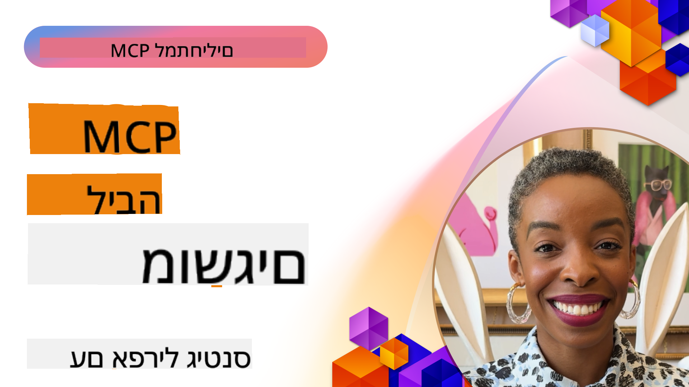
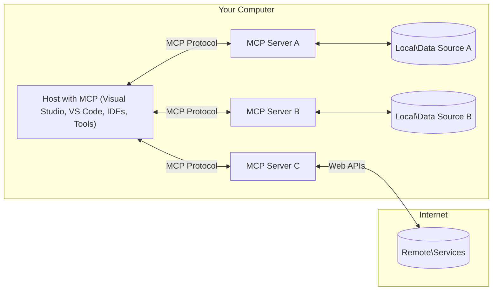

<!--
CO_OP_TRANSLATOR_METADATA:
{
  "original_hash": "904b59de1de9264801242d90a42cdd9d",
  "translation_date": "2025-09-05T11:15:37+00:00",
  "source_file": "01-CoreConcepts/README.md",
  "language_code": "he"
}
-->
# מושגי יסוד של MCP: שליטה בפרוטוקול הקשר המודל לשילוב AI

[](https://youtu.be/earDzWGtE84)

_(לחצו על התמונה למעלה לצפייה בסרטון של השיעור הזה)_

[Model Context Protocol (MCP)](https://github.com/modelcontextprotocol) הוא מסגרת סטנדרטית חזקה שמייעלת את התקשורת בין מודלים שפתיים גדולים (LLMs) לבין כלים, יישומים ומקורות נתונים חיצוניים. מדריך זה ילווה אתכם דרך מושגי היסוד של MCP. תלמדו על הארכיטקטורה של לקוח-שרת, רכיבים חיוניים, מנגנוני תקשורת והנחיות ליישום מיטבי.

- **הסכמה מפורשת של המשתמש**: כל גישה לנתונים וביצוע פעולות דורשים אישור מפורש מהמשתמש לפני הביצוע. המשתמשים חייבים להבין בבירור אילו נתונים ייגשו ואילו פעולות יבוצעו, עם שליטה מפורטת בהרשאות ואישורים.

- **הגנה על פרטיות הנתונים**: נתוני המשתמש נחשפים רק עם הסכמה מפורשת וחייבים להיות מוגנים באמצעות בקרות גישה חזקות לאורך כל מחזור האינטראקציה. יש למנוע העברת נתונים לא מורשית ולשמור על גבולות פרטיות מחמירים.

- **בטיחות בביצוע כלים**: כל הפעלה של כלי דורשת הסכמה מפורשת של המשתמש עם הבנה ברורה של הפונקציונליות, הפרמטרים וההשפעה הפוטנציאלית של הכלי. גבולות אבטחה חזקים חייבים למנוע הפעלה לא מכוונת, לא בטוחה או זדונית של כלים.

- **אבטחת שכבת התעבורה**: כל ערוצי התקשורת צריכים להשתמש במנגנוני הצפנה ואימות מתאימים. חיבורים מרוחקים צריכים ליישם פרוטוקולי תעבורה מאובטחים וניהול אישורים נכון.

#### הנחיות ליישום:

- **ניהול הרשאות**: יישמו מערכות הרשאה מפורטות שמאפשרות למשתמשים לשלוט באילו שרתים, כלים ומשאבים ניתן לגשת  
- **אימות ואישור**: השתמשו בשיטות אימות מאובטחות (OAuth, מפתחות API) עם ניהול נכון של אסימונים ותוקף  
- **אימות קלט**: אימתו את כל הפרמטרים וקלטי הנתונים לפי סכמות מוגדרות כדי למנוע התקפות הזרקה  
- **רישום ביקורת**: שמרו על יומנים מקיפים של כל הפעולות לצורך ניטור אבטחה ועמידה בדרישות

## סקירה כללית

שיעור זה בוחן את הארכיטקטורה והרכיבים הבסיסיים שמרכיבים את מערכת Model Context Protocol (MCP). תלמדו על ארכיטקטורת לקוח-שרת, רכיבים מרכזיים ומנגנוני תקשורת שמניעים אינטראקציות MCP.

## מטרות למידה מרכזיות

בסיום השיעור, תדעו:

- להבין את ארכיטקטורת לקוח-שרת של MCP.
- לזהות תפקידים ואחריות של Hosts, Clients ו-Servers.
- לנתח את התכונות המרכזיות שהופכות את MCP לשכבת שילוב גמישה.
- ללמוד כיצד מידע זורם בתוך מערכת MCP.
- לקבל תובנות מעשיות דרך דוגמאות קוד ב-.NET, Java, Python ו-JavaScript.

## ארכיטקטורת MCP: מבט מעמיק

מערכת MCP בנויה על מודל לקוח-שרת. מבנה מודולרי זה מאפשר ליישומי AI לתקשר עם כלים, מסדי נתונים, APIs ומשאבים הקשריים בצורה יעילה. בואו נפרק את הארכיטקטורה הזו לרכיבים המרכזיים שלה.

בלב המערכת, MCP פועל לפי ארכיטקטורת לקוח-שרת שבה יישום מארח יכול להתחבר למספר שרתים:



- **MCP Hosts**: תוכניות כמו VSCode, Claude Desktop, IDEs או כלים AI שרוצים לגשת לנתונים דרך MCP  
- **MCP Clients**: לקוחות פרוטוקול שמקיימים חיבורים 1:1 עם שרתים  
- **MCP Servers**: תוכניות קלות משקל שכל אחת חושפת יכולות ספציפיות דרך פרוטוקול Model Context Protocol  
- **מקורות נתונים מקומיים**: קבצים, מסדי נתונים ושירותים במחשב שלכם ששרתים של MCP יכולים לגשת אליהם בצורה מאובטחת  
- **שירותים מרוחקים**: מערכות חיצוניות הזמינות דרך האינטרנט ששרתים של MCP יכולים להתחבר אליהן דרך APIs.

פרוטוקול MCP הוא תקן מתפתח המשתמש בגרסאות מבוססות תאריך (פורמט YYYY-MM-DD). גרסת הפרוטוקול הנוכחית היא **2025-06-18**. תוכלו לראות את העדכונים האחרונים [למפרט הפרוטוקול](https://modelcontextprotocol.io/specification/2025-06-18/)

### 1. Hosts

בפרוטוקול Model Context Protocol (MCP), **Hosts** הם יישומי AI שמשמשים כממשק הראשי דרכו משתמשים מתקשרים עם הפרוטוקול. Hosts מתאמים ומנהלים חיבורים למספר שרתי MCP על ידי יצירת לקוחות MCP ייעודיים לכל חיבור שרת. דוגמאות ל-Hosts כוללות:

- **יישומי AI**: Claude Desktop, Visual Studio Code, Claude Code  
- **סביבות פיתוח**: IDEs ועורכי קוד עם שילוב MCP  
- **יישומים מותאמים אישית**: סוכני AI וכלים שנבנו למטרה מסוימת  

**Hosts** הם יישומים שמנהלים אינטראקציות עם מודלים AI. הם:

- **מתאמים מודלים AI**: מבצעים או מתקשרים עם LLMs ליצירת תגובות ותיאום זרימות עבודה של AI  
- **מנהלים חיבורי לקוח**: יוצרים ומתחזקים לקוח MCP אחד לכל חיבור שרת MCP  
- **שולטים בממשק המשתמש**: מנהלים את זרימת השיחה, אינטראקציות המשתמש והצגת התגובות  
- **אוכפים אבטחה**: שולטים בהרשאות, מגבלות אבטחה ואימות  
- **מטפלים בהסכמת המשתמש**: מנהלים אישור משתמש לשיתוף נתונים וביצוע כלים  

### 2. Clients

**Clients** הם רכיבים חיוניים שמקיימים חיבורים ייעודיים אחד-על-אחד בין Hosts לשרתי MCP. כל לקוח MCP מופעל על ידי Host כדי להתחבר לשרת MCP ספציפי, מה שמבטיח ערוצי תקשורת מאורגנים ומאובטחים. לקוחות מרובים מאפשרים ל-Hosts להתחבר למספר שרתים בו-זמנית.

**Clients** הם רכיבי חיבור בתוך יישום המארח. הם:

- **תקשורת פרוטוקול**: שולחים בקשות JSON-RPC 2.0 לשרתים עם הנחיות והוראות  
- **משא ומתן על יכולות**: מנהלים משא ומתן על תכונות נתמכות וגרסאות פרוטוקול עם שרתים במהלך האתחול  
- **ביצוע כלים**: מנהלים בקשות לביצוע כלים ממודלים ומעבדים תגובות  
- **עדכונים בזמן אמת**: מטפלים בהתראות ועדכונים בזמן אמת משרתים  
- **עיבוד תגובות**: מעבדים ומעצבים תגובות שרת להצגה למשתמשים  

### 3. Servers

**Servers** הם תוכניות שמספקות הקשר, כלים ויכולות ללקוחות MCP. הם יכולים לפעול באופן מקומי (באותו מחשב כמו Host) או מרחוק (בפלטפורמות חיצוניות), ואחראים לטיפול בבקשות לקוח ולספק תגובות מובנות. שרתים חושפים פונקציונליות ספציפית דרך פרוטוקול Model Context Protocol.

**Servers** הם שירותים שמספקים הקשר ויכולות. הם:

- **רישום תכונות**: רושמים וחושפים פרימיטיבים זמינים (משאבים, הנחיות, כלים) ללקוחות  
- **עיבוד בקשות**: מקבלים ומבצעים קריאות כלים, בקשות משאבים ובקשות הנחיות מלקוחות  
- **אספקת הקשר**: מספקים מידע הקשרי ונתונים לשיפור תגובות המודל  
- **ניהול מצב**: שומרים על מצב סשן ומטפלים באינטראקציות מבוססות מצב בעת הצורך  
- **התראות בזמן אמת**: שולחים התראות על שינויים ועדכונים ביכולות ללקוחות מחוברים  

שרתים יכולים להיות מפותחים על ידי כל אחד כדי להרחיב את יכולות המודל עם פונקציונליות מתמחה, ותומכים בתרחישי פריסה מקומיים ומרוחקים.

### 4. פרימיטיבים של שרת

שרתים בפרוטוקול Model Context Protocol (MCP) מספקים שלושה **פרימיטיבים** מרכזיים שמגדירים את אבני הבניין הבסיסיות לאינטראקציות עשירות בין לקוחות, Hosts ומודלים שפתיים. פרימיטיבים אלו מציינים את סוגי המידע ההקשרי והפעולות הזמינות דרך הפרוטוקול.

שרתים של MCP יכולים לחשוף כל שילוב של שלושת הפרימיטיבים המרכזיים הבאים:

#### משאבים

**משאבים** הם מקורות נתונים שמספקים מידע הקשרי ליישומי AI. הם מייצגים תוכן סטטי או דינמי שיכול לשפר את הבנת המודל וקבלת ההחלטות:

- **נתונים הקשריים**: מידע מובנה והקשר לצריכת מודל AI  
- **מאגרי ידע**: מאגרי מסמכים, מאמרים, מדריכים ומחקרים  
- **מקורות נתונים מקומיים**: קבצים, מסדי נתונים ומידע מערכת מקומי  
- **נתונים חיצוניים**: תגובות API, שירותי אינטרנט ונתוני מערכות מרוחקות  
- **תוכן דינמי**: נתונים בזמן אמת שמתעדכנים לפי תנאים חיצוניים  

משאבים מזוהים על ידי URIs ותומכים בגילוי דרך `resources/list` ובשליפה דרך `resources/read`:

```text
file://documents/project-spec.md
database://production/users/schema
api://weather/current
```

#### הנחיות

**הנחיות** הן תבניות לשימוש חוזר שמסייעות במבנה אינטראקציות עם מודלים שפתיים. הן מספקות דפוסי אינטראקציה סטנדרטיים וזרימות עבודה מובנות:

- **אינטראקציות מבוססות תבניות**: הודעות מובנות מראש ומתחילי שיחה  
- **תבניות זרימת עבודה**: רצפים סטנדרטיים למשימות ואינטראקציות נפוצות  
- **דוגמאות Few-shot**: תבניות מבוססות דוגמאות להנחיית מודלים  
- **הנחיות מערכת**: הנחיות בסיסיות שמגדירות את התנהגות המודל וההקשר  
- **תבניות דינמיות**: הנחיות פרמטריות שמסתגלות להקשרים ספציפיים  

הנחיות תומכות בהחלפת משתנים וניתן לגלות אותן דרך `prompts/list` ולשלוף עם `prompts/get`:

```markdown
Generate a {{task_type}} for {{product}} targeting {{audience}} with the following requirements: {{requirements}}
```

#### כלים

**כלים** הם פונקציות ניתנות לביצוע שמודלי AI יכולים להפעיל כדי לבצע פעולות ספציפיות. הם מייצגים את "הפעלים" של מערכת MCP, ומאפשרים למודלים לתקשר עם מערכות חיצוניות:

- **פונקציות ניתנות לביצוע**: פעולות דיסקרטיות שמודלים יכולים להפעיל עם פרמטרים ספציפיים  
- **אינטגרציה עם מערכות חיצוניות**: קריאות API, שאילתות מסדי נתונים, פעולות קבצים, חישובים  
- **זהות ייחודית**: לכל כלי יש שם, תיאור וסכמת פרמטרים ייחודיים  
- **I/O מובנה**: כלים מקבלים פרמטרים מאומתים ומחזירים תגובות מובנות ומסוגות  
- **יכולות פעולה**: מאפשרים למודלים לבצע פעולות בעולם האמיתי ולשלוף נתונים חיים  

כלים מוגדרים עם JSON Schema לאימות פרמטרים ונחשפים דרך `tools/list` ומבוצעים דרך `tools/call`:

```typescript
server.tool(
  "search_products", 
  {
    query: z.string().describe("Search query for products"),
    category: z.string().optional().describe("Product category filter"),
    max_results: z.number().default(10).describe("Maximum results to return")
  }, 
  async (params) => {
    // Execute search and return structured results
    return await productService.search(params);
  }
);
```

## פרימיטיבים של לקוח

בפרוטוקול Model Context Protocol (MCP), **לקוחות** יכולים לחשוף פרימיטיבים שמאפשרים לשרתים לבקש יכולות נוספות מיישום המארח. פרימיטיבים בצד הלקוח מאפשרים יישומי שרת עשירים ואינטראקטיביים יותר שיכולים לגשת ליכולות מודל AI ואינטראקציות משתמש.

### דגימה

**דגימה** מאפשרת לשרתים לבקש השלמות מודל שפה מיישום ה-AI של הלקוח. פרימיטיב זה מאפשר לשרתים לגשת ליכולות LLM מבלי להטמיע תלות במודל משלהם:

- **גישה בלתי תלויה במודל**: שרתים יכולים לבקש השלמות מבלי לכלול SDKs של LLM או לנהל גישה למודל  
- **AI יזום על ידי שרת**: מאפשר לשרתים ליצור תוכן באופן עצמאי באמצעות מודל ה-AI של הלקוח  
- **אינטראקציות LLM רקורסיביות**: תומך בתרחישים מורכבים שבהם שרתים זקוקים לעזרת AI לעיבוד  
- **יצירת תוכן דינמי**: מאפשר לשרתים ליצור תגובות הקשריות באמצעות המודל של המארח  

דגימה מופעלת דרך השיטה `sampling/complete`, שבה שרתים שולחים בקשות השלמה ללקוחות.

### איסוף מידע  

**איסוף מידע** מאפשר לשרתים לבקש מידע נוסף או אישור ממשתמשים דרך ממשק הלקוח:

- **בקשות קלט משתמש**: שרתים יכולים לבקש מידע נוסף כאשר נדרש לביצוע כלי  
- **דיאלוגי אישור**: בקשת אישור משתמש לפעולות רגישות או בעלות השפעה  
- **זרימות עבודה אינטראקטיביות**: מאפשר לשרתים ליצור אינטראקציות משתמש שלב-אחר-שלב  
- **איסוף פרמטרים דינמי**: איסוף פרמטרים חסרים או אופציונליים במהלך ביצוע כלי  

בקשות איסוף מידע נעשות באמצעות השיטה `elicitation/request` כדי לאסוף קלט משתמש דרך ממשק הלקוח.

### רישום

**רישום** מאפשר לשרתים לשלוח הודעות יומן מובנות ללקוחות לצורך ניפוי שגיאות, ניטור וראות תפעולית:

- **תמיכה בניפוי שגיאות**: מאפשר לשרתים לספק יומני ביצוע מפורטים לצורך פתרון בעיות  
- **ניטור תפעולי**: שליחת עדכוני מצב ומדדי ביצועים ללקוחות  
- **דיווח על שגיאות**: מתן הקשר שגיאה מפורט ומידע אבחוני  
- **עקבות ביקורת**: יצירת יומנים מקיפים של פעולות שרת והחלטות  

הודעות רישום נשלחות ללקוחות כדי לספק שקיפות לפעולות שרת ולהקל על ניפוי שגיאות.

## זרימת מידע ב-MCP

פרוטוקול Model Context Protocol (MCP) מגדיר זרימה מובנית של מידע בין Hosts, Clients, Servers ומודלים. הבנת זרימה זו מסייעת להבהיר כיצד בקשות משתמש מעובדות וכיצד כלים ונתונים חיצוניים משולבים בתגובות המודל.

- **המארח יוזם חיבור**  
  יישום המארח (כגון IDE או ממשק צ'אט) יוצר חיבור לשרת MCP, בדרך כלל דרך STDIO, WebSocket או תעבורה נתמכת אחרת.

- **משא ומתן על יכולות**  
  הלקוח (המוטמע במארח) והשרת מחליפים מידע על התכונות הנתמכות, הכלים, המשאבים וגרסאות הפרוטוקול שלהם. זה מבטיח ששני הצדדים מבינים אילו יכולות זמינות לסשן.

- **בקשת משתמש**  
  המשתמש מתקשר עם המארח (למשל, מזין הנחיה או פקודה). המארח אוסף את הקלט הזה ומעביר אותו ללקוח לעיבוד.

- **שימוש במשאב או כלי**  
  - הלקוח עשוי לבקש הקשר נוסף או משאבים מהשרת (כגון קבצים, רשומות מסד נתונים או מאמרים ממאגר ידע) כדי להעשיר את הבנת המודל.  
  - אם המודל קובע שכלי נדרש (למשל, כדי לשלוף נתונים, לבצע חישוב או לקרוא API), הלקוח שולח בקשת הפעלת כלי לשרת, ומציין את שם הכלי והפרמטרים.

- **ביצוע שרת**  
  השרת מקבל את בקשת המשאב או הכלי, מבצע את הפעולות הנדרשות (כגון הרצת פונקציה, שאילת מסד נתונים או שליפת קובץ), ומחזיר את התוצאות ללקוח בפורמט מובנה.

- **יצ
- **פרוטוקול JSON-RPC 2.0**: כל התקשורת משתמשת בפורמט הודעות JSON-RPC 2.0 סטנדרטי לקריאות שיטה, תגובות והתראות  
- **ניהול מחזור חיים**: מטפל באתחול חיבור, משא ומתן על יכולות וסיום סשן בין לקוחות לשרתים  
- **פרימיטיבים של שרת**: מאפשר לשרתים לספק פונקציונליות ליבה באמצעות כלים, משאבים והנחיות  
- **פרימיטיבים של לקוח**: מאפשר לשרתים לבקש דגימה מ-LLMs, לקבל קלט ממשתמשים ולשלוח הודעות לוג  
- **התראות בזמן אמת**: תומך בהתראות אסינכרוניות לעדכונים דינמיים ללא צורך בשאילתות חוזרות  

#### תכונות עיקריות:

- **משא ומתן על גרסת פרוטוקול**: משתמש בגרסאות מבוססות תאריך (YYYY-MM-DD) להבטחת תאימות  
- **גילוי יכולות**: לקוחות ושרתים מחליפים מידע על תכונות נתמכות במהלך האתחול  
- **סשנים עם מצב**: שומר על מצב החיבור לאורך אינטראקציות מרובות להמשכיות הקשר  

### שכבת התעבורה

**שכבת התעבורה** מנהלת ערוצי תקשורת, מסגור הודעות ואימות בין משתתפי MCP:

#### מנגנוני תעבורה נתמכים:

1. **תעבורת STDIO**:
   - משתמשת בזרמי קלט/פלט סטנדרטיים לתקשורת ישירה בין תהליכים  
   - אופטימלית לתהליכים מקומיים באותה מכונה ללא תקורה רשתית  
   - נפוצה ביישומי שרת MCP מקומיים  

2. **תעבורת HTTP ניתנת לזרימה**:
   - משתמשת ב-HTTP POST להודעות מלקוח לשרת  
   - אירועים שנשלחים מהשרת (SSE) אופציונליים לזרימה משרת ללקוח  
   - מאפשרת תקשורת עם שרתים מרוחקים דרך רשתות  
   - תומכת באימות HTTP סטנדרטי (אסימוני נושא, מפתחות API, כותרות מותאמות אישית)  
   - MCP ממליץ על OAuth לאימות מאובטח מבוסס אסימונים  

#### הפשטת תעבורה:

שכבת התעבורה מפשטת את פרטי התקשורת משכבת הנתונים, ומאפשרת שימוש באותו פורמט הודעות JSON-RPC 2.0 בכל מנגנוני התעבורה. הפשטה זו מאפשרת לאפליקציות לעבור בין שרתים מקומיים ומרוחקים בצורה חלקה.

### שיקולי אבטחה

יישומי MCP חייבים לעמוד בכמה עקרונות אבטחה קריטיים כדי להבטיח אינטראקציות בטוחות, אמינות ומאובטחות בכל פעולות הפרוטוקול:

- **הסכמה ושליטה של משתמש**: משתמשים חייבים לספק הסכמה מפורשת לפני גישה לנתונים או ביצוע פעולות. עליהם לקבל שליטה ברורה על אילו נתונים משותפים ואילו פעולות מאושרות, בתמיכה של ממשקי משתמש אינטואיטיביים לסקירה ואישור פעילויות.  

- **פרטיות נתונים**: נתוני משתמש צריכים להיחשף רק בהסכמה מפורשת וחייבים להיות מוגנים באמצעות בקרות גישה מתאימות. יישומי MCP חייבים להגן מפני העברת נתונים לא מורשית ולהבטיח שפרטיות נשמרת לאורך כל האינטראקציות.  

- **בטיחות כלים**: לפני הפעלת כל כלי, נדרשת הסכמה מפורשת של המשתמש. על המשתמשים להבין בבירור את הפונקציונליות של כל כלי, ויש לאכוף גבולות אבטחה חזקים כדי למנוע הפעלה לא מכוונת או לא בטוחה של כלים.  

על ידי עמידה בעקרונות אבטחה אלו, MCP מבטיח שמירה על אמון המשתמשים, פרטיות ובטיחות בכל אינטראקציות הפרוטוקול תוך אפשרות לשילובים עוצמתיים עם AI.

## דוגמאות קוד: רכיבים מרכזיים

להלן דוגמאות קוד בכמה שפות תכנות פופולריות המדגימות כיצד ליישם רכיבי שרת MCP וכלים מרכזיים.

### דוגמה ב-.NET: יצירת שרת MCP פשוט עם כלים

להלן דוגמת קוד מעשית ב-.NET המדגימה כיצד ליישם שרת MCP פשוט עם כלים מותאמים אישית. דוגמה זו מציגה כיצד להגדיר ולרשום כלים, לטפל בבקשות ולחבר את השרת באמצעות פרוטוקול Model Context.

```csharp
using System;
using System.Threading.Tasks;
using ModelContextProtocol.Server;
using ModelContextProtocol.Server.Transport;
using ModelContextProtocol.Server.Tools;

public class WeatherServer
{
    public static async Task Main(string[] args)
    {
        // Create an MCP server
        var server = new McpServer(
            name: "Weather MCP Server",
            version: "1.0.0"
        );
        
        // Register our custom weather tool
        server.AddTool<string, WeatherData>("weatherTool", 
            description: "Gets current weather for a location",
            execute: async (location) => {
                // Call weather API (simplified)
                var weatherData = await GetWeatherDataAsync(location);
                return weatherData;
            });
        
        // Connect the server using stdio transport
        var transport = new StdioServerTransport();
        await server.ConnectAsync(transport);
        
        Console.WriteLine("Weather MCP Server started");
        
        // Keep the server running until process is terminated
        await Task.Delay(-1);
    }
    
    private static async Task<WeatherData> GetWeatherDataAsync(string location)
    {
        // This would normally call a weather API
        // Simplified for demonstration
        await Task.Delay(100); // Simulate API call
        return new WeatherData { 
            Temperature = 72.5,
            Conditions = "Sunny",
            Location = location
        };
    }
}

public class WeatherData
{
    public double Temperature { get; set; }
    public string Conditions { get; set; }
    public string Location { get; set; }
}
```

### דוגמה ב-Java: רכיבי שרת MCP

דוגמה זו מדגימה את אותו שרת MCP ורישום כלים כמו בדוגמה ב-.NET, אך מיושמת ב-Java.

```java
import io.modelcontextprotocol.server.McpServer;
import io.modelcontextprotocol.server.McpToolDefinition;
import io.modelcontextprotocol.server.transport.StdioServerTransport;
import io.modelcontextprotocol.server.tool.ToolExecutionContext;
import io.modelcontextprotocol.server.tool.ToolResponse;

public class WeatherMcpServer {
    public static void main(String[] args) throws Exception {
        // Create an MCP server
        McpServer server = McpServer.builder()
            .name("Weather MCP Server")
            .version("1.0.0")
            .build();
            
        // Register a weather tool
        server.registerTool(McpToolDefinition.builder("weatherTool")
            .description("Gets current weather for a location")
            .parameter("location", String.class)
            .execute((ToolExecutionContext ctx) -> {
                String location = ctx.getParameter("location", String.class);
                
                // Get weather data (simplified)
                WeatherData data = getWeatherData(location);
                
                // Return formatted response
                return ToolResponse.content(
                    String.format("Temperature: %.1f°F, Conditions: %s, Location: %s", 
                    data.getTemperature(), 
                    data.getConditions(), 
                    data.getLocation())
                );
            })
            .build());
        
        // Connect the server using stdio transport
        try (StdioServerTransport transport = new StdioServerTransport()) {
            server.connect(transport);
            System.out.println("Weather MCP Server started");
            // Keep server running until process is terminated
            Thread.currentThread().join();
        }
    }
    
    private static WeatherData getWeatherData(String location) {
        // Implementation would call a weather API
        // Simplified for example purposes
        return new WeatherData(72.5, "Sunny", location);
    }
}

class WeatherData {
    private double temperature;
    private String conditions;
    private String location;
    
    public WeatherData(double temperature, String conditions, String location) {
        this.temperature = temperature;
        this.conditions = conditions;
        this.location = location;
    }
    
    public double getTemperature() {
        return temperature;
    }
    
    public String getConditions() {
        return conditions;
    }
    
    public String getLocation() {
        return location;
    }
}
```

### דוגמה ב-Python: בניית שרת MCP

דוגמה זו משתמשת ב-fastmcp, לכן יש לוודא התקנה מראש:

```python
pip install fastmcp
```  
דוגמת קוד:

```python
#!/usr/bin/env python3
import asyncio
from fastmcp import FastMCP
from fastmcp.transports.stdio import serve_stdio

# Create a FastMCP server
mcp = FastMCP(
    name="Weather MCP Server",
    version="1.0.0"
)

@mcp.tool()
def get_weather(location: str) -> dict:
    """Gets current weather for a location."""
    return {
        "temperature": 72.5,
        "conditions": "Sunny",
        "location": location
    }

# Alternative approach using a class
class WeatherTools:
    @mcp.tool()
    def forecast(self, location: str, days: int = 1) -> dict:
        """Gets weather forecast for a location for the specified number of days."""
        return {
            "location": location,
            "forecast": [
                {"day": i+1, "temperature": 70 + i, "conditions": "Partly Cloudy"}
                for i in range(days)
            ]
        }

# Register class tools
weather_tools = WeatherTools()

# Start the server
if __name__ == "__main__":
    asyncio.run(serve_stdio(mcp))
```

### דוגמה ב-JavaScript: יצירת שרת MCP

דוגמה זו מציגה יצירת שרת MCP ב-JavaScript וכיצד לרשום שני כלים הקשורים למזג אוויר.

```javascript
// Using the official Model Context Protocol SDK
import { McpServer } from "@modelcontextprotocol/sdk/server/mcp.js";
import { StdioServerTransport } from "@modelcontextprotocol/sdk/server/stdio.js";
import { z } from "zod"; // For parameter validation

// Create an MCP server
const server = new McpServer({
  name: "Weather MCP Server",
  version: "1.0.0"
});

// Define a weather tool
server.tool(
  "weatherTool",
  {
    location: z.string().describe("The location to get weather for")
  },
  async ({ location }) => {
    // This would normally call a weather API
    // Simplified for demonstration
    const weatherData = await getWeatherData(location);
    
    return {
      content: [
        { 
          type: "text", 
          text: `Temperature: ${weatherData.temperature}°F, Conditions: ${weatherData.conditions}, Location: ${weatherData.location}` 
        }
      ]
    };
  }
);

// Define a forecast tool
server.tool(
  "forecastTool",
  {
    location: z.string(),
    days: z.number().default(3).describe("Number of days for forecast")
  },
  async ({ location, days }) => {
    // This would normally call a weather API
    // Simplified for demonstration
    const forecast = await getForecastData(location, days);
    
    return {
      content: [
        { 
          type: "text", 
          text: `${days}-day forecast for ${location}: ${JSON.stringify(forecast)}` 
        }
      ]
    };
  }
);

// Helper functions
async function getWeatherData(location) {
  // Simulate API call
  return {
    temperature: 72.5,
    conditions: "Sunny",
    location: location
  };
}

async function getForecastData(location, days) {
  // Simulate API call
  return Array.from({ length: days }, (_, i) => ({
    day: i + 1,
    temperature: 70 + Math.floor(Math.random() * 10),
    conditions: i % 2 === 0 ? "Sunny" : "Partly Cloudy"
  }));
}

// Connect the server using stdio transport
const transport = new StdioServerTransport();
server.connect(transport).catch(console.error);

console.log("Weather MCP Server started");
```

דוגמה זו ב-JavaScript מדגימה כיצד ליצור לקוח MCP שמתחבר לשרת, שולח הנחיה ומעבד את התגובה כולל כל קריאות כלים שבוצעו.

## אבטחה ואימות

MCP כולל מספר מושגים ומנגנונים מובנים לניהול אבטחה ואימות לאורך כל הפרוטוקול:

1. **בקרת הרשאות כלים**:  
   לקוחות יכולים לציין אילו כלים מודל מורשה להשתמש בהם במהלך סשן. הדבר מבטיח שרק כלים שאושרו במפורש יהיו נגישים, ומפחית את הסיכון לפעולות לא מכוונות או לא בטוחות. ניתן להגדיר הרשאות באופן דינמי בהתבסס על העדפות משתמש, מדיניות ארגונית או הקשר האינטראקציה.  

2. **אימות**:  
   שרתים יכולים לדרוש אימות לפני מתן גישה לכלים, משאבים או פעולות רגישות. הדבר עשוי לכלול מפתחות API, אסימוני OAuth או סכמות אימות אחרות. אימות נכון מבטיח שרק לקוחות ומשתמשים מהימנים יכולים להפעיל יכולות בצד השרת.  

3. **ולידציה**:  
   ולידציה של פרמטרים נאכפת עבור כל הפעלת כלי. כל כלי מגדיר את סוגי הפרמטרים, הפורמטים והמגבלות הצפויים, והשרת מאמת בקשות נכנסות בהתאם. הדבר מונע קלט פגום או זדוני מלהגיע ליישומי הכלים ועוזר לשמור על שלמות הפעולות.  

4. **הגבלת קצב**:  
   כדי למנוע ניצול יתר ולהבטיח שימוש הוגן במשאבי השרת, שרתי MCP יכולים ליישם הגבלת קצב עבור קריאות כלים וגישה למשאבים. ניתן להחיל הגבלות קצב לפי משתמש, לפי סשן או באופן גלובלי, והן עוזרות להגן מפני התקפות מניעת שירות או צריכת משאבים מוגזמת.  

על ידי שילוב מנגנונים אלו, MCP מספק בסיס מאובטח לשילוב מודלים שפתיים עם כלים ומשאבים חיצוניים, תוך מתן שליטה מדויקת למשתמשים ולמפתחים על גישה ושימוש.

## הודעות פרוטוקול וזרימת תקשורת

תקשורת MCP משתמשת בהודעות **JSON-RPC 2.0** מובנות כדי להקל על אינטראקציות ברורות ואמינות בין מארחים, לקוחות ושרתים. הפרוטוקול מגדיר דפוסי הודעות ספציפיים לסוגי פעולות שונים:

### סוגי הודעות מרכזיים:

#### **הודעות אתחול**
- **בקשת `initialize`**: מקימה חיבור ומנהלת משא ומתן על גרסת פרוטוקול ויכולות  
- **תגובה `initialize`**: מאשרת תכונות נתמכות ומידע על השרת  
- **`notifications/initialized`**: מסמנת שהאתחול הושלם והסשן מוכן  

#### **הודעות גילוי**
- **בקשת `tools/list`**: מגלה כלים זמינים מהשרת  
- **בקשת `resources/list`**: מציגה משאבים זמינים (מקורות נתונים)  
- **בקשת `prompts/list`**: שולפת תבניות הנחיה זמינות  

#### **הודעות ביצוע**  
- **בקשת `tools/call`**: מפעילה כלי ספציפי עם פרמטרים שסופקו  
- **בקשת `resources/read`**: שולפת תוכן ממשאב ספציפי  
- **בקשת `prompts/get`**: שולפת תבנית הנחיה עם פרמטרים אופציונליים  

#### **הודעות בצד הלקוח**
- **בקשת `sampling/complete`**: השרת מבקש השלמה מ-LLM מהלקוח  
- **`elicitation/request`**: השרת מבקש קלט משתמש דרך ממשק הלקוח  
- **הודעות לוג**: השרת שולח הודעות לוג מובנות ללקוח  

#### **הודעות התראה**
- **`notifications/tools/list_changed`**: השרת מודיע ללקוח על שינויים בכלים  
- **`notifications/resources/list_changed`**: השרת מודיע ללקוח על שינויים במשאבים  
- **`notifications/prompts/list_changed`**: השרת מודיע ללקוח על שינויים בתבניות הנחיה  

### מבנה הודעות:

כל הודעות MCP עוקבות אחר פורמט JSON-RPC 2.0 עם:
- **הודעות בקשה**: כוללות `id`, `method` ופרמטרים אופציונליים  
- **הודעות תגובה**: כוללות `id` ו-`result` או `error`  
- **הודעות התראה**: כוללות `method` ופרמטרים אופציונליים (ללא `id` או תגובה צפויה)  

תקשורת מובנית זו מבטיחה אינטראקציות אמינות, ניתנות למעקב ומתרחבות, התומכות בתרחישים מתקדמים כמו עדכונים בזמן אמת, שרשור כלים וטיפול חזק בשגיאות.

## נקודות מפתח

- **ארכיטקטורה**: MCP משתמש בארכיטקטורת לקוח-שרת שבה מארחים מנהלים חיבורים מרובים של לקוחות לשרתים  
- **משתתפים**: האקוסיסטם כולל מארחים (אפליקציות AI), לקוחות (מחברי פרוטוקול) ושרתים (ספקי יכולות)  
- **מנגנוני תעבורה**: התקשורת תומכת ב-STDIO (מקומי) וב-HTTP ניתנת לזרימה עם SSE אופציונלי (מרוחק)  
- **פרימיטיבים מרכזיים**: שרתים חושפים כלים (פונקציות ניתנות להפעלה), משאבים (מקורות נתונים) ותבניות הנחיה  
- **פרימיטיבים של לקוח**: שרתים יכולים לבקש דגימה (השלמות LLM), קלט (ממשתמשים) ולוגים מלקוחות  
- **בסיס הפרוטוקול**: מבוסס על JSON-RPC 2.0 עם גרסאות מבוססות תאריך (נוכחית: 2025-06-18)  
- **יכולות בזמן אמת**: תומך בהתראות לעדכונים דינמיים וסנכרון בזמן אמת  
- **אבטחה תחילה**: הסכמה מפורשת של משתמש, הגנה על פרטיות נתונים ותעבורה מאובטחת הם דרישות ליבה  

## תרגיל

עצבו כלי MCP פשוט שיהיה שימושי בתחום שלכם. הגדירו:
1. מה יהיה שם הכלי  
2. אילו פרמטרים הוא יקבל  
3. איזה פלט הוא יחזיר  
4. כיצד מודל עשוי להשתמש בכלי זה כדי לפתור בעיות של משתמשים  

---

## מה הלאה

הבא: [פרק 2: אבטחה](../02-Security/README.md)  

---

**כתב ויתור**:  
מסמך זה תורגם באמצעות שירות תרגום מבוסס בינה מלאכותית [Co-op Translator](https://github.com/Azure/co-op-translator). למרות שאנו שואפים לדיוק, יש לקחת בחשבון שתרגומים אוטומטיים עשויים להכיל שגיאות או אי דיוקים. המסמך המקורי בשפתו המקורית צריך להיחשב כמקור סמכותי. עבור מידע קריטי, מומלץ להשתמש בתרגום מקצועי על ידי אדם. איננו נושאים באחריות לאי הבנות או לפרשנויות שגויות הנובעות משימוש בתרגום זה.