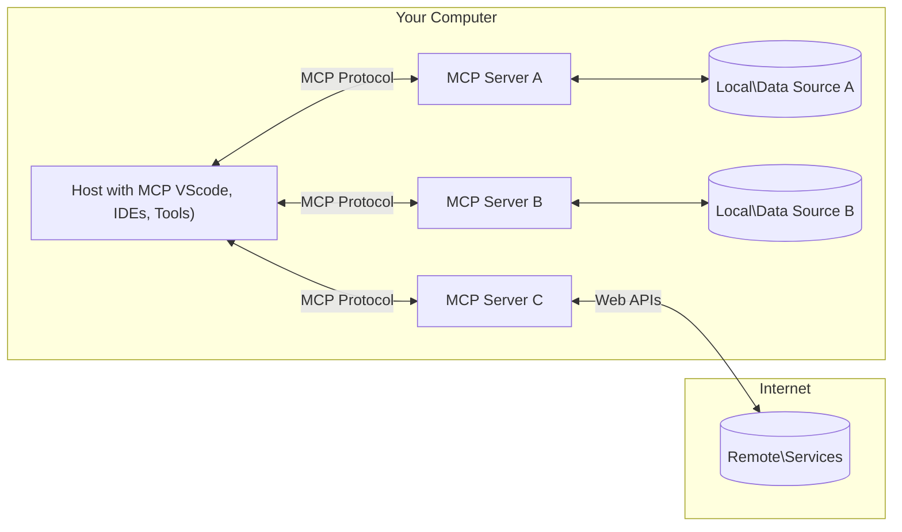

<!--
CO_OP_TRANSLATOR_METADATA:
{
  "original_hash": "355b12a5970c5c9e6db0bee970c751ba",
  "translation_date": "2025-07-04T17:58:44+00:00",
  "source_file": "01-CoreConcepts/README.md",
  "language_code": "he"
}
-->
# 📖 מושגי יסוד ב-MCP: שליטה בפרוטוקול הקשר למודל לשילוב בינה מלאכותית

[Model Context Protocol (MCP)](https://github.com/modelcontextprotocol) הוא מסגרת סטנדרטית ועוצמתית שמייעלת את התקשורת בין מודלים שפתיים גדולים (LLMs) לכלים חיצוניים, אפליקציות ומקורות נתונים. מדריך זה, המותאם לקידום במנועי חיפוש, ילווה אותך במושגי היסוד של MCP, ויבטיח שתבין את ארכיטקטורת הלקוח-שרת, הרכיבים המרכזיים, מנגנוני התקשורת והפרקטיקות הטובות ליישום.

## סקירה כללית

השיעור הזה בוחן את הארכיטקטורה הבסיסית והרכיבים שמרכיבים את מערכת ה-MCP. תלמד על ארכיטקטורת הלקוח-שרת, הרכיבים המרכזיים ומנגנוני התקשורת שמאפשרים את האינטראקציות ב-MCP.

## 👩‍🎓 מטרות למידה מרכזיות

בסיום השיעור תוכל:

- להבין את ארכיטקטורת הלקוח-שרת של MCP.
- לזהות את התפקידים והאחריות של Hosts, Clients ו-Servers.
- לנתח את התכונות המרכזיות שהופכות את MCP לשכבת אינטגרציה גמישה.
- ללמוד כיצד זורמת המידע במערכת ה-MCP.
- לקבל תובנות מעשיות דרך דוגמאות קוד ב-.NET, Java, Python ו-JavaScript.

## 🔎 ארכיטקטורת MCP: מבט מעמיק

מערכת ה-MCP בנויה על מודל לקוח-שרת. מבנה מודולרי זה מאפשר לאפליקציות בינה מלאכותית לתקשר ביעילות עם כלים, מאגרי נתונים, APIs ומשאבים הקשריים. נפרק את הארכיטקטורה הזו לרכיביה המרכזיים.

בבסיסו, MCP פועל על ארכיטקטורת לקוח-שרת שבה אפליקציית Host יכולה להתחבר למספר שרתים:



- **MCP Hosts**: תוכניות כמו VSCode, Claude Desktop, IDEs או כלים מבוססי AI שרוצים לגשת לנתונים דרך MCP  
- **MCP Clients**: לקוחות פרוטוקול שמנהלים חיבורים 1:1 עם השרתים  
- **MCP Servers**: תוכניות קלות שמשדרות יכולות ספציפיות דרך פרוטוקול הקשר למודל הסטנדרטי  
- **מקורות נתונים מקומיים**: קבצים, מאגרי נתונים ושירותים במחשב שלך שאליהם שרתי MCP יכולים לגשת בצורה מאובטחת  
- **שירותים מרוחקים**: מערכות חיצוניות הזמינות דרך האינטרנט שאליהן שרתי MCP יכולים להתחבר דרך APIs.

פרוטוקול MCP הוא תקן מתפתח, ניתן לעקוב אחרי העדכונים האחרונים ב-[מפרט הפרוטוקול](https://modelcontextprotocol.io/specification/2025-06-18/)

### 1. Hosts

בפרוטוקול הקשר למודל (MCP), ה-Hosts ממלאים תפקיד מרכזי כממשק הראשי דרכו המשתמשים מתקשרים עם הפרוטוקול. ה-Hosts הם אפליקציות או סביבות שמתחילות חיבורים עם שרתי MCP כדי לגשת לנתונים, כלים והנחיות. דוגמאות ל-Hosts הן סביבות פיתוח משולבות (IDEs) כמו Visual Studio Code, כלים מבוססי AI כמו Claude Desktop, או סוכנים מותאמים למשימות ספציפיות.

**Hosts** הם אפליקציות LLM שמתחילות חיבורים. הם:

- מבצעים או מתקשרים עם מודלים ליצירת תגובות.  
- מתחילים חיבורים עם שרתי MCP.  
- מנהלים את זרימת השיחה וממשק המשתמש.  
- שומרים על הרשאות ומגבלות אבטחה.  
- מטפלים באישור המשתמש לשיתוף נתונים והפעלת כלים.

### 2. Clients

ה-Clients הם רכיבים חיוניים שמאפשרים את האינטראקציה בין ה-Hosts לשרתי MCP. הם פועלים כמגשרים, ומאפשרים ל-Hosts לגשת ולנצל את הפונקציות שמספקים שרתי MCP. הם ממלאים תפקיד חשוב בהבטחת תקשורת חלקה והחלפת נתונים יעילה במערכת ה-MCP.

**Clients** הם מחברים בתוך אפליקציית ה-Host. הם:

- שולחים בקשות לשרתים עם הנחיות/פרומפטים.  
- מנהלים משא ומתן על יכולות עם השרתים.  
- מנהלים בקשות להפעלת כלים מהמודלים.  
- מעבדים ומציגים תגובות למשתמשים.

### 3. Servers

ה-Servers אחראים על טיפול בבקשות מלקוחות MCP ומתן תגובות מתאימות. הם מנהלים פעולות שונות כמו שליפת נתונים, הפעלת כלים ויצירת פרומפטים. השרתים מבטיחים שהתקשורת בין הלקוחות ל-Hosts תהיה יעילה ואמינה, ושומרים על שלמות תהליך האינטראקציה.

**Servers** הם שירותים שמספקים הקשר ויכולות. הם:

- רושמים תכונות זמינות (משאבים, פרומפטים, כלים)  
- מקבלים ומבצעים קריאות כלים מהלקוח  
- מספקים מידע הקשרי לשיפור תגובות המודל  
- מחזירים פלטים ללקוח  
- שומרים על מצב לאורך האינטראקציות במידת הצורך

ניתן לפתח שרתים על ידי כל אחד כדי להרחיב את יכולות המודל עם פונקציונליות מיוחדת.

### 4. תכונות השרת

שרתים בפרוטוקול הקשר למודל (MCP) מספקים אבני בניין בסיסיות שמאפשרות אינטראקציות עשירות בין לקוחות, Hosts ומודלים שפתיים. תכונות אלו נועדו לשפר את יכולות ה-MCP על ידי הצעת הקשר מובנה, כלים ופרומפטים.

שרתים ב-MCP יכולים להציע כל אחת מהתכונות הבאות:

#### 📑 משאבים

משאבים בפרוטוקול הקשר למודל (MCP) כוללים סוגים שונים של הקשר ונתונים שניתן להשתמש בהם על ידי משתמשים או מודלים. אלה כוללים:

- **נתונים הקשריים**: מידע והקשר שמשתמשים או מודלים יכולים לנצל לקבלת החלטות וביצוע משימות.  
- **מאגרי ידע ומאגרי מסמכים**: אוספים של נתונים מובנים ובלתי מובנים, כמו מאמרים, מדריכים ומחקרים, שמספקים תובנות ומידע חשוב.  
- **קבצים ומאגרי נתונים מקומיים**: נתונים המאוחסנים במכשירים או במאגרי נתונים, נגישים לעיבוד וניתוח.  
- **APIs ושירותי רשת**: ממשקים ושירותים חיצוניים שמציעים נתונים ופונקציות נוספות, ומאפשרים אינטגרציה עם משאבים וכלים מקוונים שונים.

דוגמה למשאב יכולה להיות סכמת מסד נתונים או קובץ שניתן לגשת אליו כך:

```text
file://log.txt
database://schema
```

### 🤖 פרומפטים

פרומפטים בפרוטוקול הקשר למודל (MCP) כוללים תבניות מוגדרות מראש ודפוסי אינטראקציה שמטרתם לייעל את זרימות העבודה של המשתמשים ולשפר את התקשורת. אלה כוללים:

- **הודעות ותהליכי עבודה מתבניתים**: הודעות ותהליכים מובנים מראש שמנחים את המשתמשים במשימות ואינטראקציות ספציפיות.  
- **דפוסי אינטראקציה מוגדרים מראש**: רצפים סטנדרטיים של פעולות ותגובות שמאפשרים תקשורת עקבית ויעילה.  
- **תבניות שיחה מיוחדות**: תבניות מותאמות אישית לסוגי שיחות מסוימים, שמבטיחות אינטראקציות רלוונטיות והקשריות.

תבנית פרומפט יכולה להיראות כך:

```markdown
Generate a product slogan based on the following {{product}} with the following {{keywords}}
```

#### ⛏️ כלים

כלים בפרוטוקול הקשר למודל (MCP) הם פונקציות שהמודל יכול להפעיל כדי לבצע משימות ספציפיות. כלים אלו נועדו להרחיב את יכולות המודל על ידי מתן פעולות מובנות ואמינות. מאפיינים מרכזיים כוללים:

- **פונקציות שהמודל יכול להפעיל**: כלים הם פונקציות הניתנות להפעלה שהמודל יכול לקרוא להן לביצוע משימות שונות.  
- **שם ותיאור ייחודיים**: לכל כלי יש שם מובחן ותיאור מפורט שמסביר את מטרתו ופונקציונליותו.  
- **פרמטרים ופלטים**: כלים מקבלים פרמטרים ספציפיים ומחזירים פלטים מובנים, להבטחת תוצאות עקביות וניתנות לחיזוי.  
- **פונקציות נפרדות**: כלים מבצעים פונקציות נפרדות כמו חיפוש באינטרנט, חישובים ושאילתות למסדי נתונים.

דוגמה לכלי יכולה להיראות כך:

```typescript
server.tool(
  "GetProducts",
  {
    pageSize: z.string().optional(),
    pageCount: z.string().optional()
  }, () => {
    // return results from API
  }
)
```

## תכונות הלקוח

בפרוטוקול הקשר למודל (MCP), הלקוחות מציעים מספר תכונות מרכזיות לשרתים, המשפרות את הפונקציונליות והאינטראקציה בפרוטוקול. אחת התכונות הבולטות היא Sampling.

### 👉 Sampling

- **התנהגויות סוכניות ביוזמת השרת**: הלקוחות מאפשרים לשרתים ליזום פעולות או התנהגויות ספציפיות באופן עצמאי, ומשפרים את היכולות הדינמיות של המערכת.  
- **אינטראקציות רקורסיביות עם LLMs**: תכונה זו מאפשרת אינטראקציות חוזרות עם מודלים שפתיים גדולים, ומאפשרת עיבוד מורכב ואיטרטיבי של משימות.  
- **בקשת השלמות נוספות מהמודל**: השרתים יכולים לבקש השלמות נוספות מהמודל, כדי להבטיח שהתגובות יהיו מקיפות ורלוונטיות להקשר.

## זרימת מידע ב-MCP

פרוטוקול הקשר למודל (MCP) מגדיר זרימה מובנית של מידע בין Hosts, Clients, Servers ומודלים. הבנת הזרימה הזו מסייעת להבהיר כיצד מעובדות בקשות המשתמש ואיך כלים ונתונים חיצוניים משתלבים בתגובות המודל.

- **ה-Host מתחיל חיבור**  
  אפליקציית ה-Host (כמו IDE או ממשק שיחה) מקימה חיבור לשרת MCP, בדרך כלל דרך STDIO, WebSocket או אמצעי תקשורת נתמך אחר.

- **משא ומתן על יכולות**  
  הלקוח (המוטמע ב-Host) והשרת מחליפים מידע על התכונות, הכלים, המשאבים וגרסאות הפרוטוקול הנתמכות. זה מבטיח ששני הצדדים מבינים אילו יכולות זמינות למפגש.

- **בקשת משתמש**  
  המשתמש מתקשר עם ה-Host (לדוגמה, מזין פרומפט או פקודה). ה-Host אוסף את הקלט ומעביר אותו ללקוח לעיבוד.

- **שימוש במשאב או כלי**  
  - הלקוח עשוי לבקש הקשר או משאבים נוספים מהשרת (כגון קבצים, רשומות מסד נתונים או מאמרים ממאגר ידע) כדי להעשיר את הבנת המודל.  
  - אם המודל קובע שיש צורך בכלי (למשל לשליפת נתונים, ביצוע חישוב או קריאת API), הלקוח שולח בקשה להפעלת הכלי לשרת, עם שם הכלי והפרמטרים.

- **ביצוע בשרת**  
  השרת מקבל את בקשת המשאב או הכלי, מבצע את הפעולות הנדרשות (כגון הרצת פונקציה, שאילתת מסד נתונים או שליפת קובץ) ומחזיר את התוצאות ללקוח בפורמט מובנה.

- **יצירת תגובה**  
  הלקוח משלב את תגובות השרת (נתוני משאב, פלטי כלים וכו') באינטראקציה השוטפת עם המודל. המודל משתמש במידע זה כדי ליצור תגובה מקיפה ורלוונטית להקשר.

- **הצגת התוצאה**  
  ה-Host מקבל את הפלט הסופי מהלקוח ומציג אותו למשתמש, לרוב כולל את הטקסט שנוצר על ידי המודל וכל תוצאות מהפעלת כלים או שליפת משאבים.

זרימה זו מאפשרת ל-MCP לתמוך באפליקציות AI מתקדמות, אינטראקטיביות ומודעות להקשר, על ידי חיבור חלק בין מודלים לכלים חיצוניים ומקורות נתונים.

## פרטי הפרוטוקול

MCP (Model Context Protocol) בנוי על גבי [JSON-RPC 2.0](https://www.jsonrpc.org/), ומספק פורמט הודעות סטנדרטי, בלתי תלוי שפה, לתקשורת בין Hosts, Clients ו-Servers. בסיס זה מאפשר אינטראקציות אמינות, מובנות וניתנות להרחבה בין פלטפורמות ושפות תכנות שונות.

### תכונות מרכזיות של הפרוטוקול

MCP מרחיב את JSON-RPC 2.0 עם קונבנציות נוספות להפעלת כלים, גישה למשאבים וניהול פרומפטים. הוא תומך בשכבות תקשורת מרובות (STDIO, WebSocket, SSE) ומאפשר תקשורת מאובטחת, ניתנת להרחבה ובלתי תלויה בשפה בין הרכיבים.

#### 🧢 פרוטוקול בסיסי

- **פורמט הודעות JSON-RPC**: כל הבקשות והתגובות משתמשות במפרט JSON-RPC 2.0, להבטחת מבנה עקבי לקריאות שיטה, פרמטרים, תוצאות וטיפול בשגיאות.  
- **חיבורים עם מצב**: מפגשי MCP שומרים על מצב לאורך בקשות מרובות, תומכים בשיחות מתמשכות, הצטברות הקשר וניהול משאבים.  
- **משא ומתן על יכולות**: במהלך הקמת החיבור, הלקוחות והשרתים מחליפים מידע על תכונות נתמכות, גרסאות פרוטוקול, כלים ומשאבים זמינים. זה מבטיח ששני הצדדים מבינים את היכולות של השני ויכולים להתאים את עצמם בהתאם.

#### ➕ תוספות ושירותים נוספים

להלן כמה תוספות ושירותים שה-MCP מספק לשיפור חוויית המפתח ולאפשר תרחישים מתקדמים:

- **אפשרויות קונפיגורציה**: MCP מאפשר קונפיגורציה דינמית של פרמטרי מפגש, כמו הרשאות כלים, גישה למשאבים והגדרות מודל, המותאמות לכל אינטראקציה.  
- **מעקב התקדמות**: פעולות ארוכות טווח יכולות לדווח על עדכוני התקדמות, מה שמאפשר ממשקי משתמש רספונסיביים וחוויית משתמש טובה יותר במשימות מורכבות.  
- **ביטול בקשות**: לקוחות יכולים לבטל בקשות בתהליך, מה שמאפשר למשתמשים להפסיק פעולות שכבר אינן נחוצות או שלוקחות זמן רב מדי.  
- **דיווח שגיאות**: הודעות שגיאה וקודים סטנדרטיים מסייעים באבחון בעיות, טיפול בכשלים בצורה חלקה ומתן משוב מעשי למשתמשים ולמפתחים.  
- **רישום לוגים**: גם הלקוחות וגם השרתים יכולים להפיק לוגים מובנים לצורך ביקורת, איתור תקלות ומעקב אחר אינטראקציות בפרוטוקול.

באמצעות תכונות אלו, MCP מבטיח תקשורת חזקה, מאובטחת וגמישה בין מודלים שפתיים לכלים חיצוניים או מקורות נתונים.

### 🔐 שיקולי אבטחה

יישומי MCP צריכים לעמוד בכמה עקרונות אבטחה מרכזיים כדי להבטיח אינטראקציות בטוחות ואמינות:

- **הסכמה ושליטה של המשתמש**: יש לקבל הסכמה מפורשת מהמשתמש לפני גישה לנתונים או ביצוע פעולות. המשתמשים צריכים לשלוט בבירור אילו נתונים משותפים ואילו פעולות מורשות, עם ממשקי משתמש אינטואיטיביים לסקירה ואישור פעילויות.  
- **פרטיות נתונים**: נתוני המשתמש צריכים להיות חשופים רק בהסכמה מפורשת ולהיות מוגנים באמצעות בקרות גישה מתאימות. יישומי MCP חייבים להגן מפני העברת נתונים לא מורשית ולהבטיח שהפרטיות נשמרת בכל האינטראקציות.  
- **בטיחות הכלים**: לפני הפעלת כל כלי, נדרשת הסכמה מפורשת מהמשתמש. המשתמשים צריכים להבין היטב את פונקציונליות הכלי, ויש לאכוף גבולות אבטחה חזקים כדי למנוע הפעלה לא מכוונת או לא בטוחה של כלים.

באמצעות עמידה בעקרונות אלו, MCP מבטיח אמון, פרטיות ובטיחות המשתמשים בכל האינטראקציות בפרוטוקול.

## דוגמאות קוד: רכיבים מרכזיים

להלן דוגמאות קוד בכמה שפות תכנות פופולריות שמדגימות כיצד לממש רכיבי שרת
MCP כוללת מספר מושגים ומנגנונים מובנים לניהול אבטחה והרשאות לאורך כל הפרוטוקול:

1. **בקרת הרשאות לכלי**:  
  לקוחות יכולים לציין אילו כלים מותר למודל להשתמש בהם במהלך הסשן. זה מבטיח שרק כלים שהורשו במפורש יהיו נגישים, ומפחית את הסיכון לפעולות לא מכוונות או לא בטוחות. ההרשאות ניתנות להגדרה דינמית בהתאם להעדפות המשתמש, מדיניות הארגון או הקשר האינטראקציה.

2. **אימות**:  
  השרתים יכולים לדרוש אימות לפני מתן גישה לכלים, משאבים או פעולות רגישות. זה יכול לכלול מפתחות API, אסימוני OAuth או שיטות אימות אחרות. אימות נכון מבטיח שרק לקוחות ומשתמשים מהימנים יוכלו להפעיל יכולות בצד השרת.

3. **אימות תקינות**:  
  אימות פרמטרים נאכף עבור כל קריאה לכלי. כל כלי מגדיר את סוגי הפרמטרים, הפורמטים והמגבלות הצפויים, והשרת מאמת את הבקשות הנכנסות בהתאם. זה מונע קלט שגוי או זדוני מלהגיע למימושי הכלים ועוזר לשמור על שלמות הפעולות.

4. **הגבלת קצב**:  
  כדי למנוע שימוש לרעה ולהבטיח שימוש הוגן במשאבי השרת, שרתי MCP יכולים ליישם הגבלת קצב לקריאות לכלים ולגישה למשאבים. הגבלות הקצב יכולות להיות לפי משתמש, לפי סשן או באופן גלובלי, ועוזרות להגן מפני התקפות מניעת שירות או צריכת משאבים מופרזת.

בשילוב מנגנונים אלו, MCP מספקת בסיס מאובטח לשילוב מודלים שפתיים עם כלים חיצוניים ומקורות נתונים, תוך מתן שליטה מדויקת למשתמשים ולמפתחים על הגישה והשימוש.

## הודעות פרוטוקול

התקשורת ב-MCP משתמשת בהודעות JSON מובנות כדי לאפשר אינטראקציות ברורות ואמינות בין לקוחות, שרתים ומודלים. סוגי ההודעות העיקריים כוללים:

- **בקשת לקוח**  
  נשלחת מהלקוח לשרת, הודעה זו כוללת בדרך כלל:
  - הפקודה או ההנחיה של המשתמש
  - היסטוריית שיחה להקשר
  - תצורת הכלים וההרשאות
  - כל מטא-דאטה נוספת או מידע על הסשן

- **תגובה של מודל**  
  מוחזרת על ידי המודל (דרך הלקוח), הודעה זו מכילה:
  - טקסט שנוצר או השלמה בהתבסס על ההנחיה וההקשר
  - הוראות קריאה לכלי במידת הצורך אם המודל קובע שיש להפעיל כלי
  - הפניות למשאבים או הקשר נוסף לפי הצורך

- **בקשת כלי**  
  נשלחת מהלקוח לשרת כאשר יש צורך להפעיל כלי. הודעה זו כוללת:
  - שם הכלי שיש להפעיל
  - פרמטרים הנדרשים על ידי הכלי (מאומתים מול הסכימה של הכלי)
  - מידע הקשרי או מזהים למעקב אחר הבקשה

- **תגובה של כלי**  
  מוחזרת על ידי השרת לאחר ביצוע הכלי. הודעה זו מספקת:
  - תוצאות ביצוע הכלי (נתונים מובנים או תוכן)
  - שגיאות או מידע סטטוס אם קריאת הכלי נכשלה
  - במידת הצורך, מטא-דאטה נוספת או יומנים הקשורים לביצוע

הודעות מובנות אלו מבטיחות שכל שלב בזרימת העבודה של MCP יהיה מפורש, ניתן למעקב ומורחב, ותומכות בתרחישים מתקדמים כמו שיחות מרובות סבבים, שרשור כלים וטיפול שגיאות חזק.

## נקודות מפתח

- MCP משתמשת בארכיטקטורת לקוח-שרת לחיבור מודלים עם יכולות חיצוניות  
- האקוסיסטם כולל לקוחות, מארחים, שרתים, כלים ומקורות נתונים  
- התקשורת יכולה להתבצע דרך STDIO, SSE או WebSockets  
- כלים הם יחידות היסוד של פונקציונליות המוצגות למודלים  
- פרוטוקולי תקשורת מובנים מבטיחים אינטראקציות עקביות

## תרגיל

עצב כלי MCP פשוט שיהיה שימושי בתחום שלך. הגדר:  
1. איך הכלי יקרא  
2. אילו פרמטרים יקבל  
3. איזה פלט יחזיר  
4. איך מודל עשוי להשתמש בכלי זה כדי לפתור בעיות של משתמשים

---

## מה הלאה

הבא: [Chapter 2: Security](../02-Security/README.md)

**כתב ויתור**:  
מסמך זה תורגם באמצעות שירות תרגום מבוסס בינה מלאכותית [Co-op Translator](https://github.com/Azure/co-op-translator). למרות שאנו שואפים לדיוק, יש לקחת בחשבון כי תרגומים אוטומטיים עלולים להכיל שגיאות או אי-דיוקים. המסמך המקורי בשפת המקור שלו נחשב למקור הסמכותי. למידע קריטי מומלץ להשתמש בתרגום מקצועי על ידי מתרגם אנושי. אנו לא נושאים באחריות לכל אי-הבנה או פרשנות שגויה הנובעת משימוש בתרגום זה.