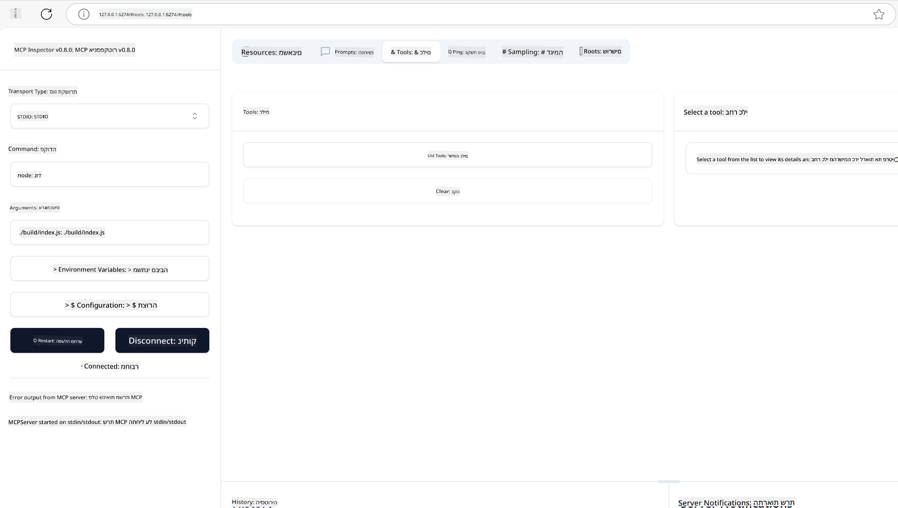
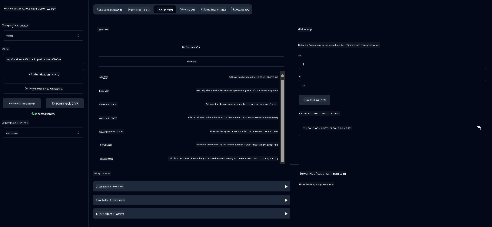
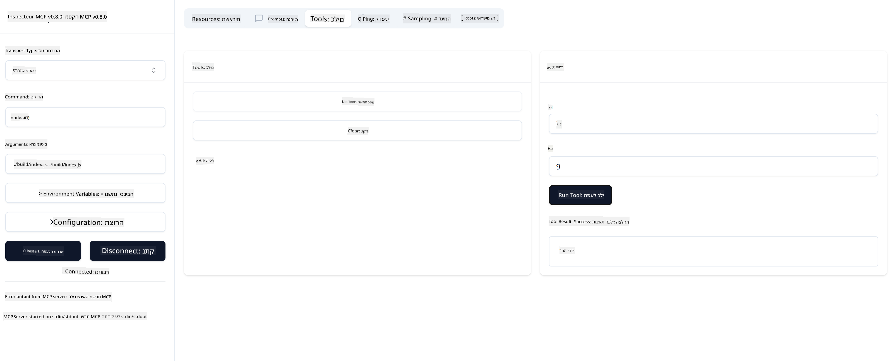

<!--
CO_OP_TRANSLATOR_METADATA:
{
  "original_hash": "ec11ee93f31fdadd94facd3e3d22f9e6",
  "translation_date": "2025-09-09T22:01:21+00:00",
  "source_file": "03-GettingStarted/01-first-server/README.md",
  "language_code": "he"
}
-->
# התחלת עבודה עם MCP

ברוכים הבאים לצעדים הראשונים שלכם עם פרוטוקול הקשר למודל (MCP)! בין אם אתם חדשים ב-MCP או מחפשים להעמיק את ההבנה שלכם, מדריך זה ילווה אתכם בתהליך ההגדרה והפיתוח הבסיסי. תגלו כיצד MCP מאפשר אינטגרציה חלקה בין מודלים של AI לאפליקציות, ותלמדו כיצד להכין במהירות את הסביבה שלכם לבניית ובדיקת פתרונות מבוססי MCP.

> בקצרה: אם אתם מפתחים אפליקציות AI, אתם יודעים שניתן להוסיף כלים ומשאבים נוספים ל-LLM (מודל שפה גדול) כדי להפוך אותו ליותר חכם. אך אם תציבו את הכלים והמשאבים הללו על שרת, האפליקציה ויכולות השרת יוכלו לשמש כל לקוח עם או בלי LLM.

## סקירה כללית

שיעור זה מספק הדרכה מעשית על הגדרת סביבות MCP ובניית אפליקציות MCP ראשונות. תלמדו כיצד להגדיר את הכלים והמסגרות הנדרשים, לבנות שרתי MCP בסיסיים, ליצור אפליקציות מארחות ולבדוק את היישומים שלכם.

פרוטוקול הקשר למודל (MCP) הוא פרוטוקול פתוח שמגדיר סטנדרט כיצד אפליקציות מספקות הקשר ל-LLMs. חשבו על MCP כמו חיבור USB-C לאפליקציות AI - הוא מספק דרך סטנדרטית לחבר מודלים של AI למקורות נתונים וכלים שונים.

## מטרות למידה

בסיום השיעור הזה, תוכלו:

- להגדיר סביבות פיתוח עבור MCP בשפות C#, Java, Python, TypeScript ו-Rust
- לבנות ולפרוס שרתי MCP בסיסיים עם תכונות מותאמות אישית (משאבים, הנחיות וכלים)
- ליצור אפליקציות מארחות שמתחברות לשרתי MCP
- לבדוק ולנפות שגיאות ביישומי MCP

## הגדרת סביבת MCP שלכם

לפני שתתחילו לעבוד עם MCP, חשוב להכין את סביבת הפיתוח שלכם ולהבין את תהליך העבודה הבסיסי. חלק זה ידריך אתכם בשלבי ההגדרה הראשוניים כדי להבטיח התחלה חלקה עם MCP.

### דרישות מוקדמות

לפני שתצללו לפיתוח MCP, ודאו שיש לכם:

- **סביבת פיתוח**: עבור השפה שבחרתם (C#, Java, Python, TypeScript או Rust)
- **IDE/עורך**: Visual Studio, Visual Studio Code, IntelliJ, Eclipse, PyCharm או כל עורך קוד מודרני
- **מנהל חבילות**: NuGet, Maven/Gradle, pip, npm/yarn או Cargo
- **מפתחות API**: עבור שירותי AI שתכננתם להשתמש בהם באפליקציות המארחות שלכם

## מבנה בסיסי של שרת MCP

שרת MCP כולל בדרך כלל:

- **הגדרות שרת**: הגדרת פורט, אימות והגדרות נוספות
- **משאבים**: נתונים והקשר שמועברים ל-LLMs
- **כלים**: פונקציות שהמודלים יכולים להפעיל
- **הנחיות**: תבניות ליצירת או מבנה טקסט

הנה דוגמה פשוטה ב-TypeScript:

```typescript
import { McpServer, ResourceTemplate } from "@modelcontextprotocol/sdk/server/mcp.js";
import { StdioServerTransport } from "@modelcontextprotocol/sdk/server/stdio.js";
import { z } from "zod";

// Create an MCP server
const server = new McpServer({
  name: "Demo",
  version: "1.0.0"
});

// Add an addition tool
server.tool("add",
  { a: z.number(), b: z.number() },
  async ({ a, b }) => ({
    content: [{ type: "text", text: String(a + b) }]
  })
);

// Add a dynamic greeting resource
server.resource(
  "file",
  // The 'list' parameter controls how the resource lists available files. Setting it to undefined disables listing for this resource.
  new ResourceTemplate("file://{path}", { list: undefined }),
  async (uri, { path }) => ({
    contents: [{
      uri: uri.href,
      text: `File, ${path}!`
    }]
  })
);

// Add a file resource that reads the file contents
server.resource(
  "file",
  new ResourceTemplate("file://{path}", { list: undefined }),
  async (uri, { path }) => {
    let text;
    try {
      text = await fs.readFile(path, "utf8");
    } catch (err) {
      text = `Error reading file: ${err.message}`;
    }
    return {
      contents: [{
        uri: uri.href,
        text
      }]
    };
  }
);

server.prompt(
  "review-code",
  { code: z.string() },
  ({ code }) => ({
    messages: [{
      role: "user",
      content: {
        type: "text",
        text: `Please review this code:\n\n${code}`
      }
    }]
  })
);

// Start receiving messages on stdin and sending messages on stdout
const transport = new StdioServerTransport();
await server.connect(transport);
```

בקוד הקודם:

- ייבאנו את המחלקות הנדרשות מ-SDK של MCP ב-TypeScript.
- יצרנו והגדרנו מופע חדש של שרת MCP.
- רשמנו כלי מותאם אישית (`calculator`) עם פונקציית מטפל.
- הפעלנו את השרת להאזנה לבקשות MCP נכנסות.

## בדיקה וניפוי שגיאות

לפני שתתחילו לבדוק את שרת MCP שלכם, חשוב להבין את הכלים והפרקטיקות הטובות ביותר לניפוי שגיאות. בדיקה יעילה מבטיחה שהשרת שלכם מתנהג כמצופה ועוזרת לזהות ולפתור בעיות במהירות. החלק הבא מתאר גישות מומלצות לאימות יישום MCP שלכם.

MCP מספק כלים שיעזרו לכם לבדוק ולנפות שגיאות בשרתים שלכם:

- **כלי Inspector**: ממשק גרפי שמאפשר לכם להתחבר לשרת ולבדוק את הכלים, ההנחיות והמשאבים שלכם.
- **curl**: ניתן גם להתחבר לשרת באמצעות כלי שורת פקודה כמו curl או לקוחות אחרים שיכולים ליצור ולהריץ פקודות HTTP.

### שימוש ב-MCP Inspector

ה-[MCP Inspector](https://github.com/modelcontextprotocol/inspector) הוא כלי בדיקה חזותי שמסייע לכם:

1. **לגלות יכולות שרת**: לזהות באופן אוטומטי משאבים, כלים והנחיות זמינים
2. **לבחון ביצוע כלים**: לנסות פרמטרים שונים ולראות תגובות בזמן אמת
3. **לצפות במטא-נתונים של השרת**: לבדוק מידע על השרת, סכמות והגדרות

```bash
# ex TypeScript, installing and running MCP Inspector
npx @modelcontextprotocol/inspector node build/index.js
```

כאשר אתם מריצים את הפקודות לעיל, MCP Inspector יפעיל ממשק אינטרנט מקומי בדפדפן שלכם. תוכלו לצפות בלוח מחוונים המציג את שרתי MCP הרשומים שלכם, הכלים, המשאבים וההנחיות הזמינים שלהם. הממשק מאפשר לכם לבדוק באופן אינטראקטיבי ביצוע כלים, לבדוק מטא-נתונים של השרת ולראות תגובות בזמן אמת, מה שמקל על אימות וניפוי שגיאות ביישומי שרת MCP שלכם.

הנה צילום מסך של איך זה יכול להיראות:



## בעיות הגדרה נפוצות ופתרונות

| בעיה | פתרון אפשרי |
|------|------------|
| חיבור נדחה | בדקו אם השרת פועל והפורט נכון |
| שגיאות בביצוע כלים | בדקו את אימות הפרמטרים וטיפול בשגיאות |
| כשלי אימות | ודאו שמפתחות ה-API והרשאות תקינים |
| שגיאות אימות סכמות | ודאו שהפרמטרים תואמים לסכמה שהוגדרה |
| השרת לא מתחיל | בדקו אם יש קונפליקטים בפורט או תלות חסרה |
| שגיאות CORS | הגדירו כותרות CORS מתאימות לבקשות בין-מקור |
| בעיות אימות | בדקו את תוקף הטוקן והרשאות |

## פיתוח מקומי

לצורך פיתוח ובדיקה מקומיים, ניתן להפעיל שרתי MCP ישירות על המחשב שלכם:

1. **הפעילו את תהליך השרת**: הריצו את אפליקציית שרת MCP שלכם
2. **הגדירו רשת**: ודאו שהשרת נגיש בפורט הצפוי
3. **חברו לקוחות**: השתמשו בכתובות חיבור מקומיות כמו `http://localhost:3000`

```bash
# Example: Running a TypeScript MCP server locally
npm run start
# Server running at http://localhost:3000
```

## בניית שרת MCP ראשון שלכם

כבר סקרנו [מושגים בסיסיים](/01-CoreConcepts/README.md) בשיעור קודם, עכשיו הגיע הזמן ליישם את הידע הזה.

### מה שרת יכול לעשות

לפני שנתחיל לכתוב קוד, בואו נזכיר לעצמנו מה שרת יכול לעשות:

שרת MCP יכול למשל:

- לגשת לקבצים ומאגרי נתונים מקומיים
- להתחבר ל-APIs מרוחקים
- לבצע חישובים
- להשתלב עם כלים ושירותים אחרים
- לספק ממשק משתמש לאינטראקציה

מעולה, עכשיו כשאנחנו יודעים מה אפשר לעשות, בואו נתחיל לכתוב קוד.

## תרגיל: יצירת שרת

כדי ליצור שרת, עליכם לבצע את השלבים הבאים:

- התקינו את SDK של MCP.
- צרו פרויקט והגדירו את מבנה הפרויקט.
- כתבו את קוד השרת.
- בדקו את השרת.

### -1- יצירת פרויקט

#### TypeScript

```sh
# Create project directory and initialize npm project
mkdir calculator-server
cd calculator-server
npm init -y
```

#### Python

```sh
# Create project dir
mkdir calculator-server
cd calculator-server
# Open the folder in Visual Studio Code - Skip this if you are using a different IDE
code .
```

#### .NET

```sh
dotnet new console -n McpCalculatorServer
cd McpCalculatorServer
```

#### Java

ל-Java, צרו פרויקט Spring Boot:

```bash
curl https://start.spring.io/starter.zip \
  -d dependencies=web \
  -d javaVersion=21 \
  -d type=maven-project \
  -d groupId=com.example \
  -d artifactId=calculator-server \
  -d name=McpServer \
  -d packageName=com.microsoft.mcp.sample.server \
  -o calculator-server.zip
```

חלצו את קובץ ה-ZIP:

```bash
unzip calculator-server.zip -d calculator-server
cd calculator-server
# optional remove the unused test
rm -rf src/test/java
```

הוסיפו את ההגדרה המלאה הבאה לקובץ *pom.xml* שלכם:

```xml
<?xml version="1.0" encoding="UTF-8"?>
<project xmlns="http://maven.apache.org/POM/4.0.0"
    xmlns:xsi="http://www.w3.org/2001/XMLSchema-instance"
    xsi:schemaLocation="http://maven.apache.org/POM/4.0.0 http://maven.apache.org/xsd/maven-4.0.0.xsd">
    <modelVersion>4.0.0</modelVersion>
    
    <!-- Spring Boot parent for dependency management -->
    <parent>
        <groupId>org.springframework.boot</groupId>
        <artifactId>spring-boot-starter-parent</artifactId>
        <version>3.5.0</version>
        <relativePath />
    </parent>

    <!-- Project coordinates -->
    <groupId>com.example</groupId>
    <artifactId>calculator-server</artifactId>
    <version>0.0.1-SNAPSHOT</version>
    <name>Calculator Server</name>
    <description>Basic calculator MCP service for beginners</description>

    <!-- Properties -->
    <properties>
        <java.version>21</java.version>
        <maven.compiler.source>21</maven.compiler.source>
        <maven.compiler.target>21</maven.compiler.target>
    </properties>

    <!-- Spring AI BOM for version management -->
    <dependencyManagement>
        <dependencies>
            <dependency>
                <groupId>org.springframework.ai</groupId>
                <artifactId>spring-ai-bom</artifactId>
                <version>1.0.0-SNAPSHOT</version>
                <type>pom</type>
                <scope>import</scope>
            </dependency>
        </dependencies>
    </dependencyManagement>

    <!-- Dependencies -->
    <dependencies>
        <dependency>
            <groupId>org.springframework.ai</groupId>
            <artifactId>spring-ai-starter-mcp-server-webflux</artifactId>
        </dependency>
        <dependency>
            <groupId>org.springframework.boot</groupId>
            <artifactId>spring-boot-starter-actuator</artifactId>
        </dependency>
        <dependency>
         <groupId>org.springframework.boot</groupId>
         <artifactId>spring-boot-starter-test</artifactId>
         <scope>test</scope>
      </dependency>
    </dependencies>

    <!-- Build configuration -->
    <build>
        <plugins>
            <plugin>
                <groupId>org.springframework.boot</groupId>
                <artifactId>spring-boot-maven-plugin</artifactId>
            </plugin>
            <plugin>
                <groupId>org.apache.maven.plugins</groupId>
                <artifactId>maven-compiler-plugin</artifactId>
                <configuration>
                    <release>21</release>
                </configuration>
            </plugin>
        </plugins>
    </build>

    <!-- Repositories for Spring AI snapshots -->
    <repositories>
        <repository>
            <id>spring-milestones</id>
            <name>Spring Milestones</name>
            <url>https://repo.spring.io/milestone</url>
            <snapshots>
                <enabled>false</enabled>
            </snapshots>
        </repository>
        <repository>
            <id>spring-snapshots</id>
            <name>Spring Snapshots</name>
            <url>https://repo.spring.io/snapshot</url>
            <releases>
                <enabled>false</enabled>
            </releases>
        </repository>
    </repositories>
</project>
```

#### Rust

```sh
mkdir calculator-server
cd calculator-server
cargo init
```

### -2- הוספת תלות

עכשיו כשיצרתם את הפרויקט שלכם, בואו נוסיף תלות:

#### TypeScript

```sh
# If not already installed, install TypeScript globally
npm install typescript -g

# Install the MCP SDK and Zod for schema validation
npm install @modelcontextprotocol/sdk zod
npm install -D @types/node typescript
```

#### Python

```sh
# Create a virtual env and install dependencies
python -m venv venv
venv\Scripts\activate
pip install "mcp[cli]"
```

#### Java

```bash
cd calculator-server
./mvnw clean install -DskipTests
```

#### Rust

```sh
cargo add rmcp --features server,transport-io
cargo add serde
cargo add tokio --features rt-multi-thread
```

### -3- יצירת קבצי פרויקט

#### TypeScript

פתחו את קובץ *package.json* והחליפו את התוכן עם הבא כדי להבטיח שתוכלו לבנות ולהריץ את השרת:

```json
{
  "name": "calculator-server",
  "version": "1.0.0",
  "main": "index.js",
  "type": "module",
  "scripts": {
    "start": "tsc && node ./build/index.js",
    "build": "tsc && node ./build/index.js"
  },
  "keywords": [],
  "author": "",
  "license": "ISC",
  "description": "A simple calculator server using Model Context Protocol",
  "dependencies": {
    "@modelcontextprotocol/sdk": "^1.16.0",
    "zod": "^3.25.76"
  },
  "devDependencies": {
    "@types/node": "^24.0.14",
    "typescript": "^5.8.3"
  }
}
```

צרו קובץ *tsconfig.json* עם התוכן הבא:

```json
{
  "compilerOptions": {
    "target": "ES2022",
    "module": "Node16",
    "moduleResolution": "Node16",
    "outDir": "./build",
    "rootDir": "./src",
    "strict": true,
    "esModuleInterop": true,
    "skipLibCheck": true,
    "forceConsistentCasingInFileNames": true
  },
  "include": ["src/**/*"],
  "exclude": ["node_modules"]
}
```

צרו תיקייה לקוד המקור שלכם:

```sh
mkdir src
touch src/index.ts
```

#### Python

צרו קובץ *server.py*

```sh
touch server.py
```

#### .NET

התקינו את חבילות NuGet הנדרשות:

```sh
dotnet add package ModelContextProtocol --prerelease
dotnet add package Microsoft.Extensions.Hosting
```

#### Java

לפרויקטים של Spring Boot ב-Java, מבנה הפרויקט נוצר באופן אוטומטי.

#### Rust

ל-Rust, קובץ *src/main.rs* נוצר כברירת מחדל כאשר אתם מריצים `cargo init`. פתחו את הקובץ ומחקו את הקוד המוגדר כברירת מחדל.

### -4- כתיבת קוד שרת

#### TypeScript

צרו קובץ *index.ts* והוסיפו את הקוד הבא:

```typescript
import { McpServer, ResourceTemplate } from "@modelcontextprotocol/sdk/server/mcp.js";
import { StdioServerTransport } from "@modelcontextprotocol/sdk/server/stdio.js";
import { z } from "zod";
 
// Create an MCP server
const server = new McpServer({
  name: "Calculator MCP Server",
  version: "1.0.0"
});
```

עכשיו יש לכם שרת, אבל הוא לא עושה הרבה, בואו נתקן את זה.

#### Python

```python
# server.py
from mcp.server.fastmcp import FastMCP

# Create an MCP server
mcp = FastMCP("Demo")
```

#### .NET

```csharp
using Microsoft.Extensions.DependencyInjection;
using Microsoft.Extensions.Hosting;
using Microsoft.Extensions.Logging;
using ModelContextProtocol.Server;
using System.ComponentModel;

var builder = Host.CreateApplicationBuilder(args);
builder.Logging.AddConsole(consoleLogOptions =>
{
    // Configure all logs to go to stderr
    consoleLogOptions.LogToStandardErrorThreshold = LogLevel.Trace;
});

builder.Services
    .AddMcpServer()
    .WithStdioServerTransport()
    .WithToolsFromAssembly();
await builder.Build().RunAsync();

// add features
```

#### Java

ל-Java, צרו את רכיבי השרת המרכזיים. ראשית, ערכו את מחלקת האפליקציה הראשית:

*src/main/java/com/microsoft/mcp/sample/server/McpServerApplication.java*:

```java
package com.microsoft.mcp.sample.server;

import org.springframework.ai.tool.ToolCallbackProvider;
import org.springframework.ai.tool.method.MethodToolCallbackProvider;
import org.springframework.boot.SpringApplication;
import org.springframework.boot.autoconfigure.SpringBootApplication;
import org.springframework.context.annotation.Bean;
import com.microsoft.mcp.sample.server.service.CalculatorService;

@SpringBootApplication
public class McpServerApplication {

    public static void main(String[] args) {
        SpringApplication.run(McpServerApplication.class, args);
    }
    
    @Bean
    public ToolCallbackProvider calculatorTools(CalculatorService calculator) {
        return MethodToolCallbackProvider.builder().toolObjects(calculator).build();
    }
}
```

צרו את שירות המחשבון *src/main/java/com/microsoft/mcp/sample/server/service/CalculatorService.java*:

```java
package com.microsoft.mcp.sample.server.service;

import org.springframework.ai.tool.annotation.Tool;
import org.springframework.stereotype.Service;

/**
 * Service for basic calculator operations.
 * This service provides simple calculator functionality through MCP.
 */
@Service
public class CalculatorService {

    /**
     * Add two numbers
     * @param a The first number
     * @param b The second number
     * @return The sum of the two numbers
     */
    @Tool(description = "Add two numbers together")
    public String add(double a, double b) {
        double result = a + b;
        return formatResult(a, "+", b, result);
    }

    /**
     * Subtract one number from another
     * @param a The number to subtract from
     * @param b The number to subtract
     * @return The result of the subtraction
     */
    @Tool(description = "Subtract the second number from the first number")
    public String subtract(double a, double b) {
        double result = a - b;
        return formatResult(a, "-", b, result);
    }

    /**
     * Multiply two numbers
     * @param a The first number
     * @param b The second number
     * @return The product of the two numbers
     */
    @Tool(description = "Multiply two numbers together")
    public String multiply(double a, double b) {
        double result = a * b;
        return formatResult(a, "*", b, result);
    }

    /**
     * Divide one number by another
     * @param a The numerator
     * @param b The denominator
     * @return The result of the division
     */
    @Tool(description = "Divide the first number by the second number")
    public String divide(double a, double b) {
        if (b == 0) {
            return "Error: Cannot divide by zero";
        }
        double result = a / b;
        return formatResult(a, "/", b, result);
    }

    /**
     * Calculate the power of a number
     * @param base The base number
     * @param exponent The exponent
     * @return The result of raising the base to the exponent
     */
    @Tool(description = "Calculate the power of a number (base raised to an exponent)")
    public String power(double base, double exponent) {
        double result = Math.pow(base, exponent);
        return formatResult(base, "^", exponent, result);
    }

    /**
     * Calculate the square root of a number
     * @param number The number to find the square root of
     * @return The square root of the number
     */
    @Tool(description = "Calculate the square root of a number")
    public String squareRoot(double number) {
        if (number < 0) {
            return "Error: Cannot calculate square root of a negative number";
        }
        double result = Math.sqrt(number);
        return String.format("√%.2f = %.2f", number, result);
    }

    /**
     * Calculate the modulus (remainder) of division
     * @param a The dividend
     * @param b The divisor
     * @return The remainder of the division
     */
    @Tool(description = "Calculate the remainder when one number is divided by another")
    public String modulus(double a, double b) {
        if (b == 0) {
            return "Error: Cannot divide by zero";
        }
        double result = a % b;
        return formatResult(a, "%", b, result);
    }

    /**
     * Calculate the absolute value of a number
     * @param number The number to find the absolute value of
     * @return The absolute value of the number
     */
    @Tool(description = "Calculate the absolute value of a number")
    public String absolute(double number) {
        double result = Math.abs(number);
        return String.format("|%.2f| = %.2f", number, result);
    }

    /**
     * Get help about available calculator operations
     * @return Information about available operations
     */
    @Tool(description = "Get help about available calculator operations")
    public String help() {
        return "Basic Calculator MCP Service\n\n" +
               "Available operations:\n" +
               "1. add(a, b) - Adds two numbers\n" +
               "2. subtract(a, b) - Subtracts the second number from the first\n" +
               "3. multiply(a, b) - Multiplies two numbers\n" +
               "4. divide(a, b) - Divides the first number by the second\n" +
               "5. power(base, exponent) - Raises a number to a power\n" +
               "6. squareRoot(number) - Calculates the square root\n" + 
               "7. modulus(a, b) - Calculates the remainder of division\n" +
               "8. absolute(number) - Calculates the absolute value\n\n" +
               "Example usage: add(5, 3) will return 5 + 3 = 8";
    }

    /**
     * Format the result of a calculation
     */
    private String formatResult(double a, String operator, double b, double result) {
        return String.format("%.2f %s %.2f = %.2f", a, operator, b, result);
    }
}
```

**רכיבים אופציונליים לשירות מוכן לייצור:**

צרו הגדרת הפעלה *src/main/java/com/microsoft/mcp/sample/server/config/StartupConfig.java*:

```java
package com.microsoft.mcp.sample.server.config;

import org.springframework.boot.CommandLineRunner;
import org.springframework.context.annotation.Bean;
import org.springframework.context.annotation.Configuration;

@Configuration
public class StartupConfig {
    
    @Bean
    public CommandLineRunner startupInfo() {
        return args -> {
            System.out.println("\n" + "=".repeat(60));
            System.out.println("Calculator MCP Server is starting...");
            System.out.println("SSE endpoint: http://localhost:8080/sse");
            System.out.println("Health check: http://localhost:8080/actuator/health");
            System.out.println("=".repeat(60) + "\n");
        };
    }
}
```

צרו בקר בריאות *src/main/java/com/microsoft/mcp/sample/server/controller/HealthController.java*:

```java
package com.microsoft.mcp.sample.server.controller;

import org.springframework.http.ResponseEntity;
import org.springframework.web.bind.annotation.GetMapping;
import org.springframework.web.bind.annotation.RestController;
import java.time.LocalDateTime;
import java.util.HashMap;
import java.util.Map;

@RestController
public class HealthController {
    
    @GetMapping("/health")
    public ResponseEntity<Map<String, Object>> healthCheck() {
        Map<String, Object> response = new HashMap<>();
        response.put("status", "UP");
        response.put("timestamp", LocalDateTime.now().toString());
        response.put("service", "Calculator MCP Server");
        return ResponseEntity.ok(response);
    }
}
```

צרו מטפל בשגיאות *src/main/java/com/microsoft/mcp/sample/server/exception/GlobalExceptionHandler.java*:

```java
package com.microsoft.mcp.sample.server.exception;

import org.springframework.http.HttpStatus;
import org.springframework.http.ResponseEntity;
import org.springframework.web.bind.annotation.ExceptionHandler;
import org.springframework.web.bind.annotation.RestControllerAdvice;

@RestControllerAdvice
public class GlobalExceptionHandler {

    @ExceptionHandler(IllegalArgumentException.class)
    public ResponseEntity<ErrorResponse> handleIllegalArgumentException(IllegalArgumentException ex) {
        ErrorResponse error = new ErrorResponse(
            "Invalid_Input", 
            "Invalid input parameter: " + ex.getMessage());
        return new ResponseEntity<>(error, HttpStatus.BAD_REQUEST);
    }

    public static class ErrorResponse {
        private String code;
        private String message;

        public ErrorResponse(String code, String message) {
            this.code = code;
            this.message = message;
        }

        // Getters
        public String getCode() { return code; }
        public String getMessage() { return message; }
    }
}
```

צרו באנר מותאם אישית *src/main/resources/banner.txt*:

```text
_____      _            _       _             
 / ____|    | |          | |     | |            
| |     __ _| | ___ _   _| | __ _| |_ ___  _ __ 
| |    / _` | |/ __| | | | |/ _` | __/ _ \| '__|
| |___| (_| | | (__| |_| | | (_| | || (_) | |   
 \_____\__,_|_|\___|\__,_|_|\__,_|\__\___/|_|   
                                                
Calculator MCP Server v1.0
Spring Boot MCP Application
```

#### Rust

הוסיפו את הקוד הבא לראש קובץ *src/main.rs*. זה מייבא את הספריות והמודולים הנדרשים לשרת MCP שלכם.

```rust
use rmcp::{
    handler::server::{router::tool::ToolRouter, tool::Parameters},
    model::{ServerCapabilities, ServerInfo},
    schemars, tool, tool_handler, tool_router,
    transport::stdio,
    ServerHandler, ServiceExt,
};
use std::error::Error;
```

שרת המחשבון יהיה פשוט ויוכל להוסיף שני מספרים יחד. בואו ניצור מבנה לייצוג בקשת מחשבון.

```rust
#[derive(Debug, serde::Deserialize, schemars::JsonSchema)]
pub struct CalculatorRequest {
    pub a: f64,
    pub b: f64,
}
```

לאחר מכן, צרו מבנה לייצוג שרת המחשבון. מבנה זה יחזיק את נתב הכלים, שמשמש לרישום כלים.

```rust
#[derive(Debug, Clone)]
pub struct Calculator {
    tool_router: ToolRouter<Self>,
}
```

עכשיו, נוכל ליישם את מבנה `Calculator` כדי ליצור מופע חדש של השרת וליישם את מטפל השרת כדי לספק מידע על השרת.

```rust
#[tool_router]
impl Calculator {
    pub fn new() -> Self {
        Self {
            tool_router: Self::tool_router(),
        }
    }
}

#[tool_handler]
impl ServerHandler for Calculator {
    fn get_info(&self) -> ServerInfo {
        ServerInfo {
            instructions: Some("A simple calculator tool".into()),
            capabilities: ServerCapabilities::builder().enable_tools().build(),
            ..Default::default()
        }
    }
}
```

לבסוף, עלינו ליישם את פונקציית ה-main כדי להפעיל את השרת. פונקציה זו תיצור מופע של מבנה `Calculator` ותשרת אותו דרך קלט/פלט סטנדרטי.

```rust
#[tokio::main]
async fn main() -> Result<(), Box<dyn Error>> {
    let service = Calculator::new().serve(stdio()).await?;
    service.waiting().await?;
    Ok(())
}
```

השרת מוגדר כעת לספק מידע בסיסי על עצמו. כעת נוסיף כלי לביצוע חיבור.

### -5- הוספת כלי ומשאב

הוסיפו כלי ומשאב על ידי הוספת הקוד הבא:

#### TypeScript

```typescript
server.tool(
  "add",
  { a: z.number(), b: z.number() },
  async ({ a, b }) => ({
    content: [{ type: "text", text: String(a + b) }]
  })
);

server.resource(
  "greeting",
  new ResourceTemplate("greeting://{name}", { list: undefined }),
  async (uri, { name }) => ({
    contents: [{
      uri: uri.href,
      text: `Hello, ${name}!`
    }]
  })
);
```

הכלי שלכם מקבל פרמטרים `a` ו-`b` ומפעיל פונקציה שמייצרת תגובה בצורה:

```typescript
{
  contents: [{
    type: "text", content: "some content"
  }]
}
```

המשאב שלכם נגיש דרך מחרוזת "greeting" ומקבל פרמטר `name` ומייצר תגובה דומה לכלי:

```typescript
{
  uri: "<href>",
  text: "a text"
}
```

#### Python

```python
# Add an addition tool
@mcp.tool()
def add(a: int, b: int) -> int:
    """Add two numbers"""
    return a + b


# Add a dynamic greeting resource
@mcp.resource("greeting://{name}")
def get_greeting(name: str) -> str:
    """Get a personalized greeting"""
    return f"Hello, {name}!"
```

בקוד הקודם:

- הגדרנו כלי `add` שמקבל פרמטרים `a` ו-`p`, שניהם מספרים שלמים.
- יצרנו משאב בשם `greeting` שמקבל פרמטר `name`.

#### .NET

הוסיפו את זה לקובץ Program.cs שלכם:

```csharp
[McpServerToolType]
public static class CalculatorTool
{
    [McpServerTool, Description("Adds two numbers")]
    public static string Add(int a, int b) => $"Sum {a + b}";
}
```

#### Java

הכלים כבר נוצרו בשלב הקודם.

#### Rust

הוסיפו כלי חדש בתוך בלוק `impl Calculator`:

```rust
#[tool(description = "Adds a and b")]
async fn add(
    &self,
    Parameters(CalculatorRequest { a, b }): Parameters<CalculatorRequest>,
) -> String {
    (a + b).to_string()
}
```

### -6- קוד סופי

בואו נוסיף את הקוד האחרון שאנחנו צריכים כדי שהשרת יוכל להתחיל:

#### TypeScript

```typescript
// Start receiving messages on stdin and sending messages on stdout
const transport = new StdioServerTransport();
await server.connect(transport);
```

הנה הקוד המלא:

```typescript
// index.ts
import { McpServer, ResourceTemplate } from "@modelcontextprotocol/sdk/server/mcp.js";
import { StdioServerTransport } from "@modelcontextprotocol/sdk/server/stdio.js";
import { z } from "zod";

// Create an MCP server
const server = new McpServer({
  name: "Calculator MCP Server",
  version: "1.0.0"
});

// Add an addition tool
server.tool(
  "add",
  { a: z.number(), b: z.number() },
  async ({ a, b }) => ({
    content: [{ type: "text", text: String(a + b) }]
  })
);

// Add a dynamic greeting resource
server.resource(
  "greeting",
  new ResourceTemplate("greeting://{name}", { list: undefined }),
  async (uri, { name }) => ({
    contents: [{
      uri: uri.href,
      text: `Hello, ${name}!`
    }]
  })
);

// Start receiving messages on stdin and sending messages on stdout
const transport = new StdioServerTransport();
server.connect(transport);
```

#### Python

```python
# server.py
from mcp.server.fastmcp import FastMCP

# Create an MCP server
mcp = FastMCP("Demo")


# Add an addition tool
@mcp.tool()
def add(a: int, b: int) -> int:
    """Add two numbers"""
    return a + b


# Add a dynamic greeting resource
@mcp.resource("greeting://{name}")
def get_greeting(name: str) -> str:
    """Get a personalized greeting"""
    return f"Hello, {name}!"

# Main execution block - this is required to run the server
if __name__ == "__main__":
    mcp.run()
```

#### .NET

צרו קובץ Program.cs עם התוכן הבא:

```csharp
using Microsoft.Extensions.DependencyInjection;
using Microsoft.Extensions.Hosting;
using Microsoft.Extensions.Logging;
using ModelContextProtocol.Server;
using System.ComponentModel;

var builder = Host.CreateApplicationBuilder(args);
builder.Logging.AddConsole(consoleLogOptions =>
{
    // Configure all logs to go to stderr
    consoleLogOptions.LogToStandardErrorThreshold = LogLevel.Trace;
});

builder.Services
    .AddMcpServer()
    .WithStdioServerTransport()
    .WithToolsFromAssembly();
await builder.Build().RunAsync();

[McpServerToolType]
public static class CalculatorTool
{
    [McpServerTool, Description("Adds two numbers")]
    public static string Add(int a, int b) => $"Sum {a + b}";
}
```

#### Java

מחלקת האפליקציה הראשית המלאה שלכם צריכה להיראות כך:

```java
// McpServerApplication.java
package com.microsoft.mcp.sample.server;

import org.springframework.ai.tool.ToolCallbackProvider;
import org.springframework.ai.tool.method.MethodToolCallbackProvider;
import org.springframework.boot.SpringApplication;
import org.springframework.boot.autoconfigure.SpringBootApplication;
import org.springframework.context.annotation.Bean;
import com.microsoft.mcp.sample.server.service.CalculatorService;

@SpringBootApplication
public class McpServerApplication {

    public static void main(String[] args) {
        SpringApplication.run(McpServerApplication.class, args);
    }
    
    @Bean
    public ToolCallbackProvider calculatorTools(CalculatorService calculator) {
        return MethodToolCallbackProvider.builder().toolObjects(calculator).build();
    }
}
```

#### Rust

הקוד הסופי לשרת Rust צריך להיראות כך:

```rust
use rmcp::{
    ServerHandler, ServiceExt,
    handler::server::{router::tool::ToolRouter, tool::Parameters},
    model::{ServerCapabilities, ServerInfo},
    schemars, tool, tool_handler, tool_router,
    transport::stdio,
};
use std::error::Error;

#[derive(Debug, serde::Deserialize, schemars::JsonSchema)]
pub struct CalculatorRequest {
    pub a: f64,
    pub b: f64,
}

#[derive(Debug, Clone)]
pub struct Calculator {
    tool_router: ToolRouter<Self>,
}

#[tool_router]
impl Calculator {
    pub fn new() -> Self {
        Self {
            tool_router: Self::tool_router(),
        }
    }
    
    #[tool(description = "Adds a and b")]
    async fn add(
        &self,
        Parameters(CalculatorRequest { a, b }): Parameters<CalculatorRequest>,
    ) -> String {
        (a + b).to_string()
    }
}

#[tool_handler]
impl ServerHandler for Calculator {
    fn get_info(&self) -> ServerInfo {
        ServerInfo {
            instructions: Some("A simple calculator tool".into()),
            capabilities: ServerCapabilities::builder().enable_tools().build(),
            ..Default::default()
        }
    }
}

#[tokio::main]
async fn main() -> Result<(), Box<dyn Error>> {
    let service = Calculator::new().serve(stdio()).await?;
    service.waiting().await?;
    Ok(())
}
```

### -7- בדיקת השרת

הפעילו את השרת עם הפקודה הבאה:

#### TypeScript

```sh
npm run build
```

#### Python

```sh
mcp run server.py
```

> כדי להשתמש ב-MCP Inspector, השתמשו ב-`mcp dev server.py` שמפעיל אוטומטית את ה-Inspector ומספק את טוקן הפרוקסי הנדרש. אם אתם משתמשים ב-`mcp run server.py`, תצטרכו להפעיל ידנית את ה-Inspector ולהגדיר את החיבור.

#### .NET

ודאו שאתם בתיקיית הפרויקט שלכם:

```sh
cd McpCalculatorServer
dotnet run
```

#### Java

```bash
./mvnw clean install -DskipTests
java -jar target/calculator-server-0.0.1-SNAPSHOT.jar
```

#### Rust

הריצו את הפקודות הבאות כדי לעצב ולהפעיל את השרת:

```sh
cargo fmt
cargo run
```

### -8- הפעלה באמצעות ה-Inspector

ה-Inspector הוא כלי נהדר שיכול להפעיל את השרת שלכם ומאפשר לכם לתקשר איתו כדי לבדוק שהוא עובד. בואו נפעיל אותו:

> [!NOTE]
> ייתכן שזה ייראה שונה בשדה "command" מכיוון שהוא מכיל את הפקודה להפעלת שרת עם סביבת הריצה הספציפית שלכם.

#### TypeScript

```sh
npx @modelcontextprotocol/inspector node build/index.js
```

או הוסיפו אותו ל-*package.json* שלכם כך: `"inspector": "npx @modelcontextprotocol/inspector node build/index.js"` ואז הריצו `npm run inspector`.

Python עוטף כלי Node.js בשם inspector. ניתן לקרוא לכלי זה כך:

```sh
mcp dev server.py
```

עם זאת, הוא לא מיישם את כל השיטות הזמינות בכלי ולכן מומלץ להריץ את כלי Node.js ישירות כמו למטה:

```sh
npx @modelcontextprotocol/inspector mcp run server.py
```

אם אתם משתמשים בכלי או IDE שמאפשרים לכם להגדיר פקודות וארגומנטים להרצת סקריפטים, 
ודאו שהגדרתם `python` בשדה `Command` ו-`server.py` כ-`Arguments`. זה מבטיח שהסקריפט ירוץ כראוי.

#### .NET

ודאו שאתם בתיקיית הפרויקט שלכם:

```sh
cd McpCalculatorServer
npx @modelcontextprotocol/inspector dotnet run
```

#### Java

ודאו ששרת המחשבון שלכם פועל. לאחר מכן הפעילו את ה-Inspector:

```cmd
npx @modelcontextprotocol/inspector
```

בממשק האינטרנט של ה-Inspector:

1. בחרו "SSE" כסוג התעבורה
2. הגדירו את ה-URL ל: `http://localhost:8080/sse`
3. לחצו על "Connect"


**כעת אתם מחוברים לשרת**  
**סיימתם את שלב בדיקות השרת ב-Java**

השלב הבא עוסק באינטראקציה עם השרת.

עליכם לראות את ממשק המשתמש הבא:


1. התחברו לשרת על ידי לחיצה על כפתור Connect  
   לאחר ההתחברות לשרת, עליכם לראות את התצוגה הבאה:

   

2. בחרו "Tools" ואז "listTools". אתם אמורים לראות את האפשרות "Add". בחרו ב-"Add" ומלאו את ערכי הפרמטרים.

   עליכם לראות את התגובה הבאה, כלומר תוצאה מהכלי "add":

   

ברכות, הצלחתם ליצור ולהפעיל את השרת הראשון שלכם!

#### Rust

כדי להפעיל את שרת ה-Rust באמצעות MCP Inspector CLI, השתמשו בפקודה הבאה:

```sh
npx @modelcontextprotocol/inspector cargo run --cli --method tools/call --tool-name add --tool-arg a=1 b=2
```

### SDKs רשמיים

MCP מספק SDKs רשמיים למספר שפות:

- [C# SDK](https://github.com/modelcontextprotocol/csharp-sdk) - מתוחזק בשיתוף פעולה עם Microsoft  
- [Java SDK](https://github.com/modelcontextprotocol/java-sdk) - מתוחזק בשיתוף פעולה עם Spring AI  
- [TypeScript SDK](https://github.com/modelcontextprotocol/typescript-sdk) - המימוש הרשמי של TypeScript  
- [Python SDK](https://github.com/modelcontextprotocol/python-sdk) - המימוש הרשמי של Python  
- [Kotlin SDK](https://github.com/modelcontextprotocol/kotlin-sdk) - המימוש הרשמי של Kotlin  
- [Swift SDK](https://github.com/modelcontextprotocol/swift-sdk) - מתוחזק בשיתוף פעולה עם Loopwork AI  
- [Rust SDK](https://github.com/modelcontextprotocol/rust-sdk) - המימוש הרשמי של Rust  

## נקודות מפתח

- הקמת סביבת פיתוח MCP היא פשוטה באמצעות SDKs ייעודיים לשפה  
- בניית שרתי MCP כוללת יצירה ורישום כלים עם סכמות ברורות  
- בדיקות וניפוי שגיאות חיוניים ליישומי MCP אמינים  

## דוגמאות

- [Java Calculator](../samples/java/calculator/README.md)  
- [.Net Calculator](../../../../03-GettingStarted/samples/csharp)  
- [JavaScript Calculator](../samples/javascript/README.md)  
- [TypeScript Calculator](../samples/typescript/README.md)  
- [Python Calculator](../../../../03-GettingStarted/samples/python)  
- [Rust Calculator](../../../../03-GettingStarted/samples/rust)  

## משימה

צרו שרת MCP פשוט עם כלי לבחירתכם:

1. יישמו את הכלי בשפה המועדפת עליכם (.NET, Java, Python, TypeScript, או Rust).  
2. הגדירו פרמטרי קלט וערכי פלט.  
3. הפעילו את כלי הבדיקה כדי לוודא שהשרת פועל כראוי.  
4. בדקו את היישום עם קלטים שונים.  

## פתרון

[Solution](./solution/README.md)

## משאבים נוספים

- [בניית סוכנים באמצעות Model Context Protocol על Azure](https://learn.microsoft.com/azure/developer/ai/intro-agents-mcp)  
- [MCP מרוחק עם Azure Container Apps (Node.js/TypeScript/JavaScript)](https://learn.microsoft.com/samples/azure-samples/mcp-container-ts/mcp-container-ts/)  
- [.NET OpenAI MCP Agent](https://learn.microsoft.com/samples/azure-samples/openai-mcp-agent-dotnet/openai-mcp-agent-dotnet/)  

## מה הלאה

הבא: [התחלת עבודה עם לקוחות MCP](../02-client/README.md)  

---

**כתב ויתור**:  
מסמך זה תורגם באמצעות שירות תרגום מבוסס בינה מלאכותית [Co-op Translator](https://github.com/Azure/co-op-translator). למרות שאנו שואפים לדיוק, יש לקחת בחשבון שתרגומים אוטומטיים עשויים להכיל שגיאות או אי דיוקים. המסמך המקורי בשפתו המקורית צריך להיחשב כמקור סמכותי. עבור מידע קריטי, מומלץ להשתמש בתרגום מקצועי על ידי אדם. איננו נושאים באחריות לאי הבנות או לפרשנויות שגויות הנובעות משימוש בתרגום זה.