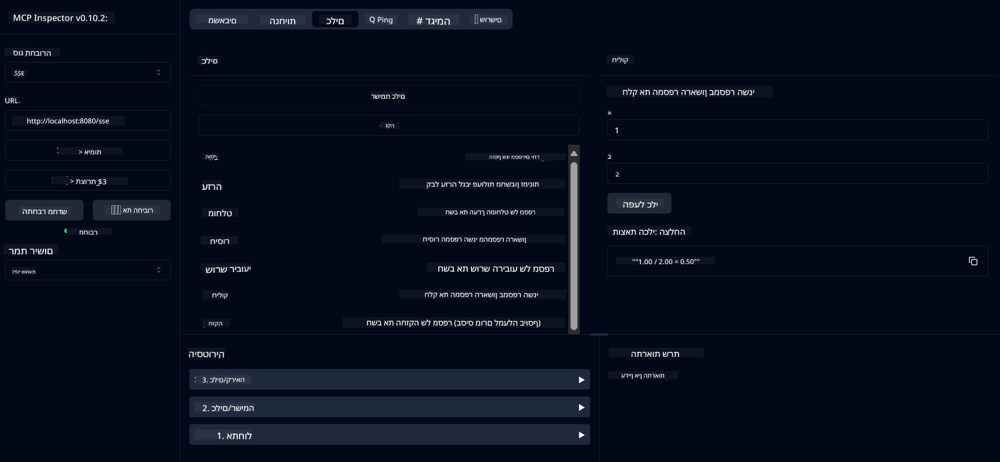

<!--
CO_OP_TRANSLATOR_METADATA:
{
  "original_hash": "ed9cab32cc67c12d8969b407aa47100a",
  "translation_date": "2025-07-13T17:55:22+00:00",
  "source_file": "03-GettingStarted/01-first-server/solution/java/README.md",
  "language_code": "he"
}
-->
# שירות מחשבון בסיסי MCP

שירות זה מספק פעולות מחשבון בסיסיות דרך פרוטוקול Model Context (MCP) באמצעות Spring Boot עם WebFlux כערוץ תקשורת. הוא מיועד כדוגמה פשוטה למתחילים הלומדים על יישומי MCP.

למידע נוסף, ראה את תיעוד ה-[MCP Server Boot Starter](https://docs.spring.io/spring-ai/reference/api/mcp/mcp-server-boot-starter-docs.html).


## שימוש בשירות

השירות מציג את נקודות הקצה הבאות דרך פרוטוקול MCP:

- `add(a, b)`: חיבור שני מספרים
- `subtract(a, b)`: חיסור המספר השני מהראשון
- `multiply(a, b)`: כפל שני מספרים
- `divide(a, b)`: חילוק המספר הראשון בשני (עם בדיקת אפס)
- `power(base, exponent)`: חישוב חזקת מספר
- `squareRoot(number)`: חישוב שורש ריבועי (עם בדיקת מספר שלילי)
- `modulus(a, b)`: חישוב השארית בחילוק
- `absolute(number)`: חישוב הערך המוחלט

## תלותים

הפרויקט דורש את התלותים המרכזיים הבאים:

```xml
<dependency>
    <groupId>org.springframework.ai</groupId>
    <artifactId>spring-ai-starter-mcp-server-webflux</artifactId>
</dependency>
```

## בניית הפרויקט

בנה את הפרויקט באמצעות Maven:
```bash
./mvnw clean install -DskipTests
```

## הפעלת השרת

### שימוש ב-Java

```bash
java -jar target/calculator-server-0.0.1-SNAPSHOT.jar
```

### שימוש ב-MCP Inspector

MCP Inspector הוא כלי עזר לאינטראקציה עם שירותי MCP. לשימוש בו עם שירות המחשבון הזה:

1. **התקן והפעל את MCP Inspector** בחלון טרמינל חדש:
   ```bash
   npx @modelcontextprotocol/inspector
   ```

2. **גש לממשק האינטרנטי** על ידי לחיצה על כתובת ה-URL שמוצגת באפליקציה (בדרך כלל http://localhost:6274)

3. **הגדר את החיבור**:
   - הגדר את סוג התקשורת ל-"SSE"
   - הגדר את כתובת ה-URL לנקודת הקצה SSE של השרת שלך: `http://localhost:8080/sse`
   - לחץ על "Connect"

4. **השתמש בכלים**:
   - לחץ על "List Tools" כדי לראות את פעולות המחשבון הזמינות
   - בחר כלי ולחץ על "Run Tool" כדי לבצע פעולה



**כתב ויתור**:  
מסמך זה תורגם באמצעות שירות תרגום מבוסס בינה מלאכותית [Co-op Translator](https://github.com/Azure/co-op-translator). למרות שאנו שואפים לדיוק, יש לקחת בחשבון כי תרגומים אוטומטיים עלולים להכיל שגיאות או אי-דיוקים. המסמך המקורי בשפת המקור שלו נחשב למקור הסמכותי. למידע קריטי מומלץ להשתמש בתרגום מקצועי על ידי מתרגם אנושי. אנו לא נושאים באחריות לכל אי-הבנה או פרשנות שגויה הנובעת משימוש בתרגום זה.