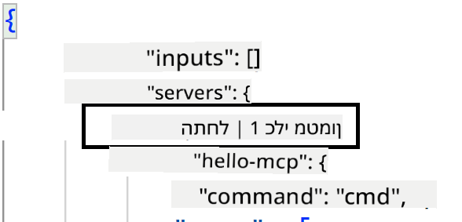
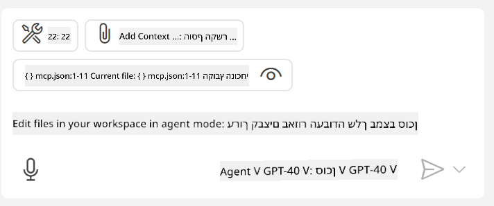

<!--
CO_OP_TRANSLATOR_METADATA:
{
  "original_hash": "54e9ffc5dba01afcb8880a9949fd1881",
  "translation_date": "2025-07-13T19:32:16+00:00",
  "source_file": "03-GettingStarted/04-vscode/README.md",
  "language_code": "he"
}
-->
בוא נדבר יותר על איך להשתמש בממשק הוויזואלי בחלקים הבאים.

## גישה

ככה אנחנו צריכים לגשת לזה ברמה גבוהה:

- להגדיר קובץ שימצא את שרת ה-MCP שלנו.
- להפעיל/להתחבר לשרת כדי לקבל את רשימת היכולות שלו.
- להשתמש ביכולות האלו דרך ממשק השיחה של GitHub Copilot.

מעולה, עכשיו כשאנחנו מבינים את הזרימה, בואו ננסה להשתמש בשרת MCP דרך Visual Studio Code באמצעות תרגיל.

## תרגיל: צריכת שרת

בתרגיל הזה, נגדיר את Visual Studio Code כדי שימצא את שרת ה-MCP שלך כך שניתן יהיה להשתמש בו דרך ממשק השיחה של GitHub Copilot.

### -0- שלב מקדים, הפעלת גילוי שרתי MCP

ייתכן שתצטרך להפעיל את גילוי שרתי MCP.

1. עבור ל- `File -> Preferences -> Settings` ב-Visual Studio Code.

1. חפש "MCP" והפעל את `chat.mcp.discovery.enabled` בקובץ settings.json.

### -1- יצירת קובץ הגדרות

התחל ביצירת קובץ הגדרות בשורש הפרויקט שלך, תצטרך קובץ בשם MCP.json ולמקם אותו בתיקייה בשם .vscode. הוא צריך להיראות כך:

```text
.vscode
|-- mcp.json
```

עכשיו, בוא נראה איך להוסיף רשומת שרת.

### -2- הגדרת שרת

הוסף את התוכן הבא ל-*mcp.json*:

```json
{
    "inputs": [],
    "servers": {
       "hello-mcp": {
           "command": "node",
           "args": [
               "build/index.js"
           ]
       }
    }
}
```

הנה דוגמה פשוטה למעלה איך להפעיל שרת שכתוב ב-Node.js, עבור סביבות ריצה אחרות ציין את הפקודה הנכונה להפעלת השרת באמצעות `command` ו-`args`.

### -3- הפעלת השרת

עכשיו כשהוספת רשומה, בוא נתחיל את השרת:

1. אתר את הרשומה שלך ב-*mcp.json* וודא שאתה רואה את סמל ה"play":

    

1. לחץ על סמל ה"play", אתה אמור לראות שסמל הכלים בממשק השיחה של GitHub Copilot מראה עלייה במספר הכלים הזמינים. אם תלחץ על סמל הכלים, תראה רשימה של כלים רשומים. תוכל לסמן/לבטל סימון לכל כלי בהתאם אם ברצונך ש-GitHub Copilot ישתמש בהם כהקשר:

  

1. כדי להפעיל כלי, הקלד פקודה שאתה יודע שתתאים לתיאור של אחד הכלים שלך, למשל פקודה כמו "add 22 to 1":

  

  אתה אמור לראות תגובה שאומרת 23.

## משימה

נסה להוסיף רשומת שרת לקובץ *mcp.json* שלך וודא שאתה יכול להפעיל/להפסיק את השרת. ודא גם שאתה יכול לתקשר עם הכלים בשרת שלך דרך ממשק השיחה של GitHub Copilot.

## פתרון

[פתרון](./solution/README.md)

## נקודות מפתח

הנקודות החשובות מפרק זה הן:

- Visual Studio Code הוא לקוח מצוין שמאפשר לך לצרוך מספר שרתי MCP והכלים שלהם.
- ממשק השיחה של GitHub Copilot הוא איך אתה מתקשר עם השרתים.
- ניתן לבקש מהמשתמש להזין קלטים כמו מפתחות API שניתן להעביר לשרת MCP בעת הגדרת רשומת השרת בקובץ *mcp.json*.

## דוגמאות

- [מחשבון Java](../samples/java/calculator/README.md)
- [מחשבון .Net](../../../../03-GettingStarted/samples/csharp)
- [מחשבון JavaScript](../samples/javascript/README.md)
- [מחשבון TypeScript](../samples/typescript/README.md)
- [מחשבון Python](../../../../03-GettingStarted/samples/python)

## משאבים נוספים

- [מסמכי Visual Studio](https://code.visualstudio.com/docs/copilot/chat/mcp-servers)

## מה הלאה

- הבא: [יצירת שרת SSE](../05-sse-server/README.md)

**כתב ויתור**:  
מסמך זה תורגם באמצעות שירות תרגום מבוסס בינה מלאכותית [Co-op Translator](https://github.com/Azure/co-op-translator). למרות שאנו שואפים לדיוק, יש לקחת בחשבון כי תרגומים אוטומטיים עלולים להכיל שגיאות או אי-דיוקים. המסמך המקורי בשפת המקור שלו נחשב למקור הסמכותי. למידע קריטי מומלץ להשתמש בתרגום מקצועי על ידי מתרגם אנושי. אנו לא נושאים באחריות לכל אי-הבנה או פרשנות שגויה הנובעים משימוש בתרגום זה.