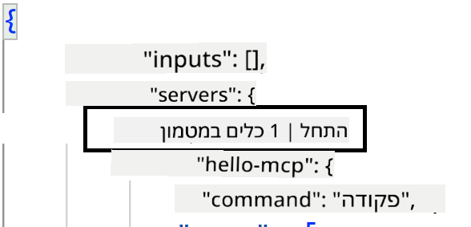
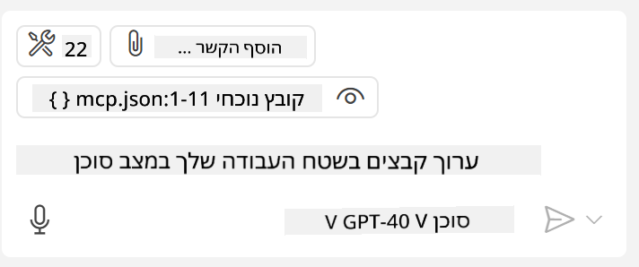

<!--
CO_OP_TRANSLATOR_METADATA:
{
  "original_hash": "c37fabfbc0dcbc9a4afb6d17e7d3be9f",
  "translation_date": "2025-05-17T11:11:33+00:00",
  "source_file": "03-GettingStarted/04-vscode/README.md",
  "language_code": "he"
}
-->
בואו נדבר יותר על איך להשתמש בממשק הוויזואלי בחלקים הבאים.

## גישה

הנה איך שאנחנו צריכים לגשת לזה ברמה גבוהה:

- להגדיר קובץ כדי למצוא את ה-MCP Server שלנו.
- להפעיל/להתחבר לשרת המדובר כדי לראות את היכולות שלו.
- להשתמש ביכולות המדוברות דרך ממשק הצ'אט של GitHub Copilot.

מעולה, עכשיו כשאנחנו מבינים את הזרימה, בואו ננסה להשתמש ב-MCP Server דרך Visual Studio Code בתרגיל.

## תרגיל: שימוש בשרת

בתרגיל זה, נגדיר את Visual Studio Code כדי למצוא את ה-MCP server שלך כך שהוא יוכל לשמש מממשק הצ'אט של GitHub Copilot.

### -0- שלב מקדים, לאפשר גילוי MCP Server

ייתכן שתצטרך לאפשר גילוי של MCP Servers.

1. עבור ל- `File -> Preferences -> Settings` in Visual Studio Code.

1. Search for "MCP" and enable `chat.mcp.discovery.enabled` בקובץ settings.json.

### -1- צור קובץ תצורה

התחל ביצירת קובץ תצורה בשורש הפרויקט שלך, תצטרך קובץ בשם MCP.json ולהניח אותו בתיקייה בשם .vscode. זה אמור להיראות כך:

```text
.vscode
|-- mcp.json
```

הבא, נראה איך אפשר להוסיף רשומת שרת.

### -2- הגדרת שרת

הוסף את התוכן הבא ל-*mcp.json*:

```json
{
    "inputs": [],
    "servers": {
       "hello-mcp": {
           "command": "cmd",
           "args": [
               "/c", "node", "<absolute path>\\build\\index.js"
           ]
       }
    }
}
```

הנה דוגמה פשוטה למעלה כיצד להתחיל שרת שנכתב ב-Node.js, עבור ריצות אחרות ציין את הפקודה המתאימה להתחלת השרת באמצעות `command` and `args`.

### -3- הפעלת השרת

עכשיו כשהוספת רשומה, בוא נתחיל את השרת:

1. אתר את הרשומה שלך ב-*mcp.json* וודא שאתה מוצא את האייקון "play":

    

1. לחץ על האייקון "play", אתה אמור לראות את אייקון הכלים בצ'אט של GitHub Copilot מגדיל את מספר הכלים הזמינים. אם תלחץ על אייקון הכלים המדובר, תראה רשימה של כלים רשומים. תוכל לסמן/לבטל כל כלי בהתאם אם אתה רוצה ש-GitHub Copilot ישתמש בהם כהקשר:

  

1. כדי להפעיל כלי, הקלד הנחיה שאתה יודע שתתאים לתיאור של אחד מהכלים שלך, לדוגמה הנחיה כזו "add 22 to 1":

  

  אתה אמור לראות תגובה שאומרת 23.

## משימה

נסה להוסיף רשומת שרת לקובץ *mcp.json* שלך וודא שאתה יכול להפעיל/לעצור את השרת. וודא שאתה גם יכול לתקשר עם הכלים בשרת שלך דרך ממשק הצ'אט של GitHub Copilot.

## פתרון

[פתרון](./solution/README.md)

## נקודות מפתח

הנקודות המפתח מהפרק הזה הן:

- Visual Studio Code הוא לקוח נהדר שמאפשר לך להשתמש בכמה MCP Servers וכליהם.
- ממשק הצ'אט של GitHub Copilot הוא איך שאתה מתקשר עם השרתים.
- אתה יכול להנחות את המשתמש להזין נתונים כמו מפתחות API שניתן להעביר ל-MCP Server כאשר מגדירים את רשומת השרת בקובץ *mcp.json*.

## דוגמאות

- [Java Calculator](../samples/java/calculator/README.md)
- [.Net Calculator](../../../../03-GettingStarted/samples/csharp)
- [JavaScript Calculator](../samples/javascript/README.md)
- [TypeScript Calculator](../samples/typescript/README.md)
- [Python Calculator](../../../../03-GettingStarted/samples/python) 

## משאבים נוספים

- [Visual Studio docs](https://code.visualstudio.com/docs/copilot/chat/mcp-servers)

## מה הלאה

- הבא: [יצירת SSE Server](/03-GettingStarted/05-sse-server/README.md)

**כתב ויתור**:  
מסמך זה תורגם באמצעות שירות תרגום AI [Co-op Translator](https://github.com/Azure/co-op-translator). למרות שאנו שואפים לדיוק, יש להיות מודעים לכך שתרגומים אוטומטיים עשויים להכיל טעויות או אי דיוקים. המסמך המקורי בשפתו המקורית צריך להיחשב כמקור סמכותי. עבור מידע קריטי, מומלץ להשתמש בתרגום מקצועי על ידי אדם. אנו לא אחראים לכל אי הבנות או פירושים שגויים הנובעים מהשימוש בתרגום זה.