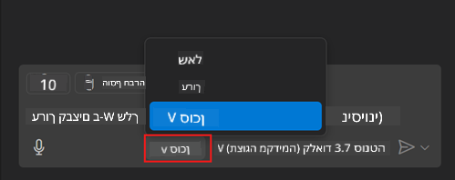
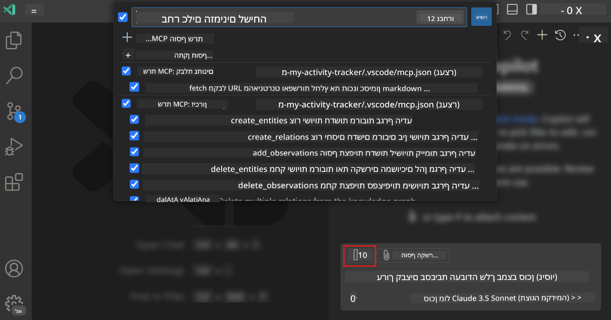
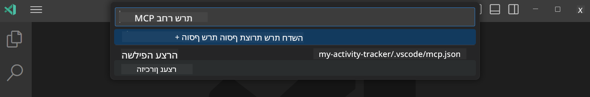

<!--
CO_OP_TRANSLATOR_METADATA:
{
  "original_hash": "8ea28e5e566edd5969337fd0b191ba3f",
  "translation_date": "2025-07-17T07:29:15+00:00",
  "source_file": "03-GettingStarted/04-vscode/README.md",
  "language_code": "he"
}
-->
# צריכת שרת ממצב סוכן של GitHub Copilot

Visual Studio Code ו-GitHub Copilot יכולים לפעול כלקוח ולצרוך שרת MCP. למה נרצה לעשות את זה, אתם שואלים? ובכן, זה אומר שכל הפיצ'רים שיש לשרת MCP יכולים כעת לשמש מתוך סביבת הפיתוח שלכם. דמיינו שאתם מוסיפים למשל את שרת MCP של GitHub, זה יאפשר שליטה ב-GitHub דרך פקודות בשפה טבעית במקום להקליד פקודות ספציפיות בטרמינל. או דמיינו כל דבר שיכול לשפר את חוויית המפתח שלכם, הכל נשלט בשפה טבעית. עכשיו אתם מתחילים להבין את היתרון, נכון?

## סקירה כללית

השיעור הזה מסביר איך להשתמש ב-Visual Studio Code ובמצב סוכן של GitHub Copilot כלקוח עבור שרת MCP שלכם.

## מטרות הלמידה

בסיום השיעור תוכלו:

- לצרוך שרת MCP דרך Visual Studio Code.
- להפעיל יכולות כמו כלים דרך GitHub Copilot.
- להגדיר את Visual Studio Code כדי למצוא ולנהל את שרת MCP שלכם.

## שימוש

ניתן לשלוט בשרת MCP שלכם בשתי דרכים שונות:

- ממשק משתמש, תראו איך עושים זאת בהמשך הפרק.
- טרמינל, אפשר לשלוט דרך הטרמינל באמצעות הפקודה `code`:

  כדי להוסיף שרת MCP לפרופיל המשתמש שלכם, השתמשו באפשרות השורת פקודה --add-mcp, וספקו את קונפיגורציית השרת בפורמט JSON בצורה {\"name\":\"server-name\",\"command\":...}.

  ```
  code --add-mcp "{\"name\":\"my-server\",\"command\": \"uvx\",\"args\": [\"mcp-server-fetch\"]}"
  ```

### צילומי מסך

  
  


בואו נדבר יותר על השימוש בממשק הוויזואלי בחלקים הבאים.

## גישה

כך יש לגשת לנושא ברמה גבוהה:

- להגדיר קובץ שימצא את שרת MCP שלנו.
- להפעיל/להתחבר לשרת כדי לקבל את רשימת היכולות שלו.
- להשתמש ביכולות האלו דרך ממשק השיחה של GitHub Copilot.

מעולה, עכשיו כשאנחנו מבינים את התהליך, בואו ננסה להשתמש בשרת MCP דרך Visual Studio Code באמצעות תרגיל.

## תרגיל: צריכת שרת

בתרגיל זה, נגדיר את Visual Studio Code כדי שימצא את שרת MCP שלכם כך שניתן יהיה להשתמש בו דרך ממשק השיחה של GitHub Copilot.

### -0- שלב מקדים, הפעלת גילוי שרתי MCP

ייתכן שתצטרכו להפעיל את גילוי שרתי MCP.

1. עברו ל-`File -> Preferences -> Settings` ב-Visual Studio Code.

1. חפשו "MCP" והפעילו את `chat.mcp.discovery.enabled` בקובץ settings.json.

### -1- יצירת קובץ קונפיגורציה

התחילו ביצירת קובץ קונפיגורציה בשורש הפרויקט שלכם, תצטרכו קובץ בשם MCP.json ולמקם אותו בתיקייה בשם .vscode. הוא אמור להיראות כך:

```text
.vscode
|-- mcp.json
```

עכשיו נראה איך להוסיף רשומת שרת.

### -2- הגדרת שרת

הוסיפו את התוכן הבא ל-*mcp.json*:

```json
{
    "inputs": [],
    "servers": {
       "hello-mcp": {
           "command": "node",
           "args": [
               "build/index.js"
           ]
       }
    }
}
```

הנה דוגמה פשוטה איך להפעיל שרת שנכתב ב-Node.js, עבור סביבות ריצה אחרות ציינו את הפקודה המתאימה להפעלת השרת באמצעות `command` ו-`args`.

### -3- הפעלת השרת

עכשיו כשהוספתם רשומה, בואו נתחיל את השרת:

1. מצאו את הרשומה שלכם ב-*mcp.json* וודאו שאתם רואים את סמל ה"play":

    

1. לחצו על סמל ה"play", אתם אמורים לראות שסמל הכלים בממשק השיחה של GitHub Copilot מראה על עלייה במספר הכלים הזמינים. אם תלחצו על סמל הכלים, תראו רשימה של כלים רשומים. תוכלו לסמן או להסיר סימון לכל כלי לפי אם תרצו ש-GitHub Copilot ישתמש בהם כהקשר:

  

1. כדי להפעיל כלי, הקלידו פקודה שאתם יודעים שתתאים לתיאור של אחד הכלים שלכם, למשל פקודה כמו "add 22 to 1":

  

  אתם אמורים לקבל תגובה שאומרת 23.

## משימה

נסו להוסיף רשומת שרת לקובץ *mcp.json* שלכם וודאו שאתם יכולים להפעיל ולעצור את השרת. ודאו גם שאתם יכולים לתקשר עם הכלים בשרת דרך ממשק השיחה של GitHub Copilot.

## פתרון

[Solution](./solution/README.md)

## נקודות מפתח

הנקודות החשובות מהפרק הן:

- Visual Studio Code הוא לקוח מצוין שמאפשר לכם לצרוך מספר שרתי MCP והכלים שלהם.
- ממשק השיחה של GitHub Copilot הוא הדרך שבה אתם מתקשרים עם השרתים.
- ניתן לבקש מהמשתמש להזין קלטים כמו מפתחות API שניתן להעביר לשרת MCP בעת הגדרת רשומת השרת בקובץ *mcp.json*.

## דוגמאות

- [מחשבון Java](../samples/java/calculator/README.md)  
- [מחשבון .Net](../../../../03-GettingStarted/samples/csharp)  
- [מחשבון JavaScript](../samples/javascript/README.md)  
- [מחשבון TypeScript](../../../../03-GettingStarted/samples/typescript)  
- [מחשבון Python](../../../../03-GettingStarted/samples/python)

## משאבים נוספים

- [מסמכי Visual Studio](https://code.visualstudio.com/docs/copilot/chat/mcp-servers)

## מה הלאה

- הבא: [יצירת שרת SSE](../05-sse-server/README.md)

**כתב ויתור**:  
מסמך זה תורגם באמצעות שירות תרגום מבוסס בינה מלאכותית [Co-op Translator](https://github.com/Azure/co-op-translator). למרות שאנו שואפים לדיוק, יש לקחת בחשבון כי תרגומים אוטומטיים עלולים להכיל שגיאות או אי-דיוקים. המסמך המקורי בשפת המקור שלו צריך להיחשב כמקור הסמכות. למידע קריטי מומלץ להשתמש בתרגום מקצועי על ידי מתרגם אנושי. אנו לא נושאים באחריות לכל אי-הבנה או פרשנות שגויה הנובעת משימוש בתרגום זה.