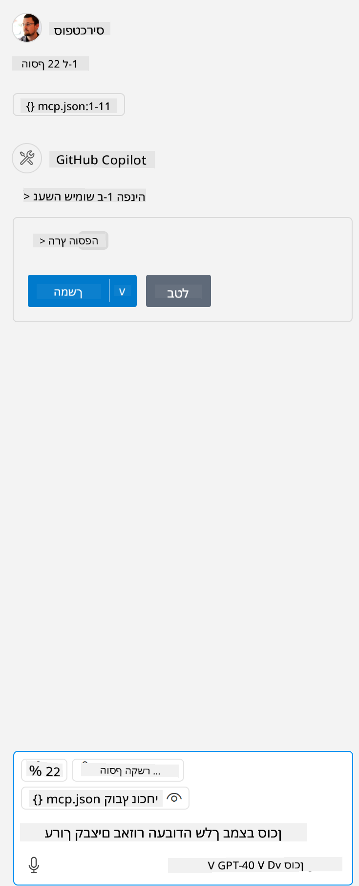

<!--
CO_OP_TRANSLATOR_METADATA:
{
  "original_hash": "5ef8f5821c1a04f7b1fc4f15098ecab8",
  "translation_date": "2025-07-13T19:44:08+00:00",
  "source_file": "03-GettingStarted/04-vscode/solution/README.md",
  "language_code": "he"
}
-->
זה מתאים להרצת פקודה כמו: `node build/index.js`.

- שנה את הערך של השרת כך שיתאים למיקום הקובץ של השרת שלך או למה שנדרש כדי להפעיל את השרת בהתאם לסביבת הריצה והמיקום שבחרת.

## צריכת הפיצ'רים בשרת

- לחץ על סמל ה-`play`, לאחר שהוספת את *mcp.json* לתיקיית *./vscode*,

    שים לב שסמל הכלים משתנה ומגדיל את מספר הכלים הזמינים. סמל הכלים ממוקם ממש מעל שדה הצ'אט ב-GitHub Copilot.

## הפעלת כלי

- הקלד פקודה בחלון הצ'אט שלך שמתאימה לתיאור של הכלי שלך. לדוגמה, כדי להפעיל את הכלי `add` הקלד משהו כמו "add 3 to 20".

    תראה כלי שמוצג מעל תיבת הטקסט של הצ'אט שמבקש ממך לבחור להפעיל את הכלי, כפי שמוצג בתמונה:

    

    בחירת הכלי אמורה להניב תוצאה מספרית שאומרת "23" אם הפקודה שהקלדת הייתה כפי שהזכרנו קודם.

**כתב ויתור**:  
מסמך זה תורגם באמצעות שירות תרגום מבוסס בינה מלאכותית [Co-op Translator](https://github.com/Azure/co-op-translator). למרות שאנו שואפים לדיוק, יש לקחת בחשבון כי תרגומים אוטומטיים עלולים להכיל שגיאות או אי-דיוקים. המסמך המקורי בשפת המקור שלו נחשב למקור הסמכותי. למידע קריטי מומלץ להשתמש בתרגום מקצועי על ידי מתרגם אנושי. אנו לא נושאים באחריות לכל אי-הבנה או פרשנות שגויה הנובעת משימוש בתרגום זה.