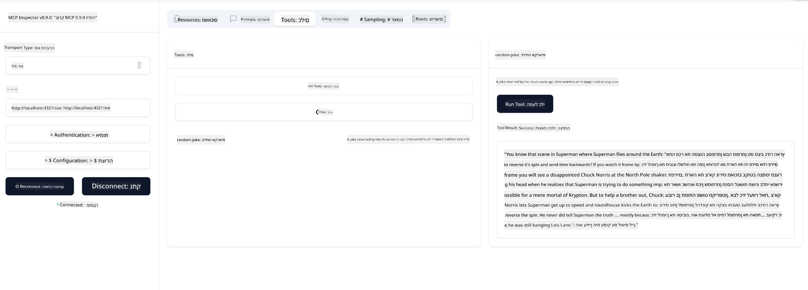

<!--
CO_OP_TRANSLATOR_METADATA:
{
  "original_hash": "a8831b194cb5ece750355e99434b7154",
  "translation_date": "2025-07-17T18:59:40+00:00",
  "source_file": "03-GettingStarted/05-sse-server/README.md",
  "language_code": "he"
}
-->
# שרת SSE

SSE (Server Sent Events) הוא תקן לשידור נתונים מהשרת ללקוח בזמן אמת, המאפשר לשרתים לדחוף עדכונים בזמן אמת ללקוחות דרך HTTP. זה שימושי במיוחד לאפליקציות שדורשות עדכונים חיים, כמו אפליקציות צ'אט, התראות או זרמי נתונים בזמן אמת. בנוסף, השרת שלך יכול לשמש מספר לקוחות בו זמנית מכיוון שהוא פועל על שרת שניתן להריץ אותו במקום כלשהו בענן, לדוגמה.

## סקירה כללית

השיעור הזה מסביר כיצד לבנות ולצרוך שרתי SSE.

## מטרות הלמידה

בסיום השיעור תוכל:

- לבנות שרת SSE.
- לבצע דיבוג לשרת SSE באמצעות Inspector.
- לצרוך שרת SSE באמצעות Visual Studio Code.

## SSE, איך זה עובד

SSE הוא אחד משני סוגי ההעברה הנתמכים. כבר ראית את הראשון stdio בשיעורים קודמים. ההבדל הוא:

- ב-SSE עליך לטפל בשני דברים; חיבור והודעות.
- מכיוון שזה שרת שיכול לפעול בכל מקום, עליך לשקף זאת באופן העבודה עם כלים כמו Inspector ו-Visual Studio Code. כלומר, במקום להצביע איך להפעיל את השרת, אתה מצביע על נקודת הקצה שבה ניתן להקים חיבור. ראה דוגמת קוד למטה:

### TypeScript

```typescript
app.get("/sse", async (_: Request, res: Response) => {
    const transport = new SSEServerTransport('/messages', res);
    transports[transport.sessionId] = transport;
    res.on("close", () => {
        delete transports[transport.sessionId];
    });
    await server.connect(transport);
});

app.post("/messages", async (req: Request, res: Response) => {
    const sessionId = req.query.sessionId as string;
    const transport = transports[sessionId];
    if (transport) {
        await transport.handlePostMessage(req, res);
    } else {
        res.status(400).send('No transport found for sessionId');
    }
});
```

בקוד שלמעלה:

- `/sse` מוגדר כנתיב. כאשר מתקבלת בקשה לנתיב זה, נוצרת מופע חדש של ההעברה והשרת *מתחבר* באמצעות ההעברה הזו.
- `/messages` הוא הנתיב המטפל בהודעות נכנסות.

### Python

```python
mcp = FastMCP("My App")

@mcp.tool()
def add(a: int, b: int) -> int:
    """Add two numbers"""
    return a + b

# Mount the SSE server to the existing ASGI server
app = Starlette(
    routes=[
        Mount('/', app=mcp.sse_app()),
    ]
)

```

בקוד שלמעלה:

- יוצרים מופע של שרת ASGI (במיוחד באמצעות Starlette) ומרכיבים את הנתיב ברירת המחדל `/`

  מה שקורה מאחורי הקלעים הוא שהנתיבים `/sse` ו-`/messages` מוגדרים לטיפול בחיבורים ובהודעות בהתאמה. שאר האפליקציה, כמו הוספת תכונות וכלים, מתבצעת כמו בשרתי stdio.

### .NET    

```csharp
    var builder = WebApplication.CreateBuilder(args);
    builder.Services
        .AddMcpServer()
        .WithTools<Tools>();


    builder.Services.AddHttpClient();

    var app = builder.Build();

    app.MapMcp();
    ```

    יש שתי שיטות שעוזרות לנו לעבור משרת ווב לשרת ווב התומך ב-SSE והן:

    - `AddMcpServer`, שיטה זו מוסיפה יכולות.
    - `MapMcp`, שמוסיפה נתיבים כמו `/SSE` ו-`/messages`.
```

Now that we know a little bit more about SSE, let's build an SSE server next.

## Exercise: Creating an SSE Server

To create our server, we need to keep two things in mind:

- We need to use a web server to expose endpoints for connection and messages.
- Build our server like we normally do with tools, resources and prompts when we were using stdio.

### -1- Create a server instance

To create our server, we use the same types as with stdio. However, for the transport, we need to choose SSE.

### TypeScript

```typescript
import { Request, Response } from "express";
import express from "express";
import { McpServer } from "@modelcontextprotocol/sdk/server/mcp.js";
import { SSEServerTransport } from "@modelcontextprotocol/sdk/server/sse.js";

const server = new McpServer({
  name: "example-server",
  version: "1.0.0"
});

const app = express();

const transports: {[sessionId: string]: SSEServerTransport} = {};
```

In the preceding code we've:

- Created a server instance.
- Defined an app using the web framework express.
- Created a transports variable that we will use to store incoming connections.

### Python

```python
from starlette.applications import Starlette
from starlette.routing import Mount, Host
from mcp.server.fastmcp import FastMCP


mcp = FastMCP("My App")
```

In the preceding code we've:

- Imported the libraries we're going to need with Starlette (an ASGI framework) being pulled in.
- Created an MCP server instance `mcp`.

### .NET

```csharp
var builder = WebApplication.CreateBuilder(args);
builder.Services
    .AddMcpServer();


builder.Services.AddHttpClient();

var app = builder.Build();

// TODO: add routes 
```

At this point, we've:

- Created a web app
- Added support for MCP features through `AddMcpServer`.

Let's add the needed routes next.

### -2- Add routes

Let's add routes next that handle the connection and incoming messages:

### TypeScript

```typescript
app.get("/sse", async (_: Request, res: Response) => {
  const transport = new SSEServerTransport('/messages', res);
  transports[transport.sessionId] = transport;
  res.on("close", () => {
    delete transports[transport.sessionId];
  });
  await server.connect(transport);
});

app.post("/messages", async (req: Request, res: Response) => {
  const sessionId = req.query.sessionId as string;
  const transport = transports[sessionId];
  if (transport) {
    await transport.handlePostMessage(req, res);
  } else {
    res.status(400).send('No transport found for sessionId');
  }
});

app.listen(3001);
```

In the preceding code we've defined:

- An `/sse` route that instantiates a transport of type SSE and ends up calling `connect` on the MCP server.
- A `/messages` route that takes care of incoming messages.

### Python

```python
app = Starlette(
    routes=[
        Mount('/', app=mcp.sse_app()),
    ]
)
```

In the preceding code we've:

- Created an ASGI app instance using the Starlette framework. As part of that we passes `mcp.sse_app()` to it's list of routes. That ends up mounting an `/sse` and `/messages` route on the app instance.

### .NET

```csharp
var builder = WebApplication.CreateBuilder(args);
builder.Services
    .AddMcpServer();

builder.Services.AddHttpClient();

var app = builder.Build();

app.MapMcp();
```

We've added one line of code at the end `add.MapMcp()` this means we now have routes `/SSE` and `/messages`. 

Let's add capabilties to the server next.

### -3- Adding server capabilities

Now that we've got everything SSE specific defined, let's add server capabilities like tools, prompts and resources.

### TypeScript

```typescript
server.tool("random-joke", "A joke returned by the chuck norris api", {},
  async () => {
    const response = await fetch("https://api.chucknorris.io/jokes/random");
    const data = await response.json();

    return {
      content: [
        {
          type: "text",
          text: data.value
        }
      ]
    };
  }
);
```

Here's how you can add a tool for example. This specific tool creates a tool call "random-joke" that calls a Chuck Norris API and returns a JSON response.

### Python

```python
@mcp.tool()
def add(a: int, b: int) -> int:
    """Add two numbers"""
    return a + b
```

Now your server has one tool.

### TypeScript

```typescript
// server-sse.ts
import { Request, Response } from "express";
import express from "express";
import { McpServer } from "@modelcontextprotocol/sdk/server/mcp.js";
import { SSEServerTransport } from "@modelcontextprotocol/sdk/server/sse.js";

// Create an MCP server
const server = new McpServer({
  name: "example-server",
  version: "1.0.0",
});

const app = express();

const transports: { [sessionId: string]: SSEServerTransport } = {};

app.get("/sse", async (_: Request, res: Response) => {
  const transport = new SSEServerTransport("/messages", res);
  transports[transport.sessionId] = transport;
  res.on("close", () => {
    delete transports[transport.sessionId];
  });
  await server.connect(transport);
});

app.post("/messages", async (req: Request, res: Response) => {
  const sessionId = req.query.sessionId as string;
  const transport = transports[sessionId];
  if (transport) {
    await transport.handlePostMessage(req, res);
  } else {
    res.status(400).send("No transport found for sessionId");
  }
});

server.tool("random-joke", "A joke returned by the chuck norris api", {}, async () => {
  const response = await fetch("https://api.chucknorris.io/jokes/random");
  const data = await response.json();

  return {
    content: [
      {
        type: "text",
        text: data.value,
      },
    ],
  };
});

app.listen(3001);
```

### Python

```python
from starlette.applications import Starlette
from starlette.routing import Mount, Host
from mcp.server.fastmcp import FastMCP


mcp = FastMCP("My App")

@mcp.tool()
def add(a: int, b: int) -> int:
    """Add two numbers"""
    return a + b

# Mount the SSE server to the existing ASGI server
app = Starlette(
    routes=[
        Mount('/', app=mcp.sse_app()),
    ]
)
```

### .NET

1. Let's create some tools first, for this we will create a file *Tools.cs* with the following content:

  ```csharp
  using System.ComponentModel;
  using System.Text.Json;
  using ModelContextProtocol.Server;

  namespace server;

  [McpServerToolType]
  public sealed class Tools
  {

      public Tools()
      {
      
      }

      [McpServerTool, Description("Add two numbers together.")]
      public async Task<string> AddNumbers(
          [Description("The first number")] int a,
          [Description("The second number")] int b)
      {
          return (a + b).ToString();
      }

  }
  ```

  Here we've added the following:

  - Created a class `Tools` with the decorator `McpServerToolType`.
  - Defined a tool `AddNumbers` by decorating the method with `McpServerTool`. We've also provided parameters and an implementation.

1. Let's leverage the `Tools` class we just created:

  ```csharp
  var builder = WebApplication.CreateBuilder(args);
  builder.Services
      .AddMcpServer()
      .WithTools<Tools>();


  builder.Services.AddHttpClient();

  var app = builder.Build();

  app.MapMcp();
  ```

  We've added a call to `WithTools` that specifies `Tools` as the class containing the tools. That's it, we're ready.

Great, we have a server using SSE, let's take it for a spin next.

## Exercise: Debugging an SSE Server with Inspector

Inspector is a great tool that we saw in a previous lesson [Creating your first server](/03-GettingStarted/01-first-server/README.md). Let's see if we can use the Inspector even here:

### -1- Running the inspector

To run the inspector, you first must have an SSE server running, so let's do that next:

1. Run the server 

    ### TypeScript

    ```sh
    tsx && node ./build/server-sse.ts
    ```

    ### Python

    ```sh
    uvicorn server:app
    ```

    Note how we use the executable `uvicorn` that's installed when we typed `pip install "mcp[cli]"`. Typing `server:app` means we're trying to run a file `server.py` and for it to have a Starlette instance called `app`. 

    ### .NET

    ```sh
    dotnet run
    ```

    This should start the server. To interface with it you need a new terminal.

1. Run the inspector

    > ![NOTE]
    > Run this in a separate terminal window than the server is running in. Also note, you need to adjust the below command to fit the URL where your server runs.

    ```sh
    npx @modelcontextprotocol/inspector --cli http://localhost:8000/sse --method tools/list
    ```

    הפעלת ה-inspector נראית זהה בכל סביבות הריצה. שים לב שבמקום להעביר נתיב לשרת שלנו ופקודה להפעלת השרת, אנו מעבירים את ה-URL שבו השרת פועל ומציינים גם את הנתיב `/sse`.

### -2- ניסוי בכלי

התחבר לשרת על ידי בחירת SSE ברשימת הבחירה ומלא את שדה ה-URL שבו השרת שלך פועל, לדוגמה http:localhost:4321/sse. עכשיו לחץ על כפתור "Connect". כמו קודם, בחר ברשימת הכלים, בחר כלי וספק ערכי קלט. תראה תוצאה כמו בתמונה למטה:



מעולה, אתה יכול לעבוד עם ה-inspector, בוא נראה איך לעבוד עם Visual Studio Code בהמשך.

## משימה

נסה לבנות את השרת שלך עם יכולות נוספות. ראה [את העמוד הזה](https://api.chucknorris.io/) כדי, למשל, להוסיף כלי שקורא ל-API. אתה מחליט איך השרת ייראה. בהצלחה :)

## פתרון

[פתרון](./solution/README.md) הנה פתרון אפשרי עם קוד עובד.

## נקודות מפתח

הנקודות המרכזיות בפרק זה הן:

- SSE הוא סוג ההעברה השני הנתמך אחרי stdio.
- כדי לתמוך ב-SSE, עליך לנהל חיבורים והודעות נכנסות באמצעות מסגרת ווב.
- ניתן להשתמש גם ב-Inspector וגם ב-Visual Studio Code לצריכת שרת SSE, בדיוק כמו שרתי stdio. שים לב שיש הבדלים קלים בין stdio ל-SSE. ב-SSE, יש להפעיל את השרת בנפרד ואז להריץ את כלי ה-inspector. בנוסף, בכלי ה-inspector יש צורך לציין את ה-URL.

## דוגמאות

- [מחשבון Java](../samples/java/calculator/README.md)
- [מחשבון .Net](../../../../03-GettingStarted/samples/csharp)
- [מחשבון JavaScript](../samples/javascript/README.md)
- [מחשבון TypeScript](../samples/typescript/README.md)
- [מחשבון Python](../../../../03-GettingStarted/samples/python)

## משאבים נוספים

- [SSE](https://developer.mozilla.org/en-US/docs/Web/API/Server-sent_events)

## מה הלאה

- הבא: [HTTP Streaming עם MCP (Streamable HTTP)](../06-http-streaming/README.md)

**כתב ויתור**:  
מסמך זה תורגם באמצעות שירות תרגום מבוסס בינה מלאכותית [Co-op Translator](https://github.com/Azure/co-op-translator). למרות שאנו שואפים לדיוק, יש לקחת בחשבון כי תרגומים אוטומטיים עלולים להכיל שגיאות או אי-דיוקים. המסמך המקורי בשפת המקור שלו צריך להיחשב כמקור הסמכות. למידע קריטי מומלץ להשתמש בתרגום מקצועי על ידי אדם. אנו לא נושאים באחריות לכל אי-הבנה או פרשנות שגויה הנובעת משימוש בתרגום זה.