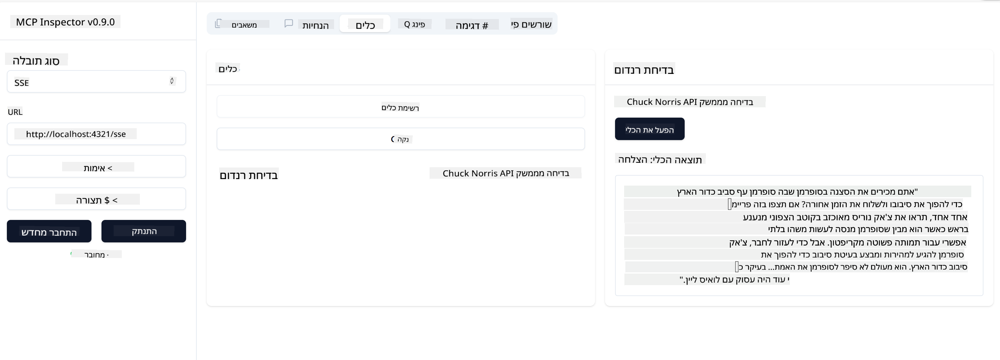

<!--
CO_OP_TRANSLATOR_METADATA:
{
  "original_hash": "0a8086dc4bf89448f83e7936db972c42",
  "translation_date": "2025-05-17T11:39:00+00:00",
  "source_file": "03-GettingStarted/05-sse-server/README.md",
  "language_code": "he"
}
-->
# שרת SSE

SSE (Server Sent Events) הוא תקן להעברת נתונים מהשרת ללקוח, המאפשר לשרתים לשלוח עדכונים בזמן אמת ללקוחות דרך HTTP. זה שימושי במיוחד עבור יישומים שדורשים עדכונים חיים, כמו יישומי צ'אט, התראות, או הזנות נתונים בזמן אמת. בנוסף, השרת שלך יכול לשמש מספר לקוחות בו זמנית כיוון שהוא פועל על שרת שיכול להיות מופעל למשל בענן.

## סקירה כללית

שיעור זה מכסה כיצד לבנות ולצרוך שרתי SSE.

## מטרות למידה

בסוף השיעור הזה, תוכל:

- לבנות שרת SSE.
- לנפות באגים בשרת SSE באמצעות ה-Inspector.
- לצרוך שרת SSE באמצעות Visual Studio Code.

## SSE, איך זה עובד

SSE הוא אחד משני סוגי התעבורה הנתמכים. כבר ראית את הראשון, stdio, בשיעורים קודמים. ההבדל הוא כדלקמן:

- SSE דורש ממך לטפל בשני דברים: חיבור והודעות.
- כיוון שזהו שרת שיכול לפעול בכל מקום, אתה צריך לשקף זאת באופן שבו אתה עובד עם כלים כמו ה-Inspector ו-Visual Studio. מה שזה אומר הוא שבמקום להצביע איך להפעיל את השרת, אתה מצביע על נקודת הקצה שבה הוא יכול ליצור חיבור. ראה דוגמת קוד למטה:

עכשיו כשאנחנו יודעים קצת יותר על SSE, בואו נבנה שרת SSE הבא.

## תרגיל: יצירת שרת SSE

כדי ליצור את השרת שלנו, עלינו לזכור שני דברים:

- עלינו להשתמש בשרת אינטרנט כדי לחשוף נקודות קצה לחיבור והודעות.
- לבנות את השרת שלנו כמו שאנחנו עושים בדרך כלל עם כלים, משאבים והנחיות כאשר השתמשנו ב-stdio.

### -1- צור מופע שרת

כדי ליצור את השרת שלנו, אנחנו משתמשים באותם סוגים כמו עם stdio. עם זאת, עבור התעבורה, עלינו לבחור SSE.

בואו נוסיף את הנתיבים הנדרשים הבאים.

### -2- הוסף נתיבים

בואו נוסיף נתיבים הבאים שמטפלים בחיבור ובהודעות נכנסות:

בואו נוסיף יכולות לשרת הבא.

### -3- הוספת יכולות לשרת

עכשיו כשהגדרנו את כל מה שקשור ל-SSE, בואו נוסיף יכולות לשרת כמו כלים, הנחיות ומשאבים.

הקוד המלא שלך צריך להיראות כך:

מצוין, יש לנו שרת שמשתמש ב-SSE, בואו ננסה אותו הבא.

## תרגיל: ניפוי באגים בשרת SSE עם ה-Inspector

ה-Inspector הוא כלי נהדר שראינו בשיעור קודם [יצירת השרת הראשון שלך](/03-GettingStarted/01-first-server/README.md). בואו נראה אם אנחנו יכולים להשתמש ב-Inspector גם כאן:

### -1- הפעלת ה-Inspector

כדי להפעיל את ה-Inspector, קודם כל צריך שיהיה לך שרת SSE פועל, אז בואו נעשה את זה הבא:

1. הפעל את השרת

1. הפעל את ה-Inspector

    > ![NOTE]
    > הפעל את זה בחלון טרמינל נפרד מהשרת שרץ בו. שים לב גם, שאתה צריך להתאים את הפקודה למטה כדי להתאים את כתובת ה-URL שבה השרת שלך רץ.

    ```sh
    npx @modelcontextprotocol/inspector --cli http://localhost:8000/sse --method tools/list
    ```

    הפעלת ה-Inspector נראית אותו הדבר בכל סביבת ריצה. שים לב כיצד במקום להעביר נתיב לשרת שלנו ופקודה להפעלת השרת, אנחנו מעבירים את כתובת ה-URL שבה השרת רץ ואנחנו גם מציינים את הנתיב `/sse`.

### -2- ניסיון הכלי

חבר את השרת על ידי בחירת SSE ברשימת הבחירה ומלא את שדה ה-URL שבו השרת שלך רץ, למשל http:localhost:4321/sse. עכשיו לחץ על כפתור "Connect". כמו קודם, בחר לרשום כלים, בחר כלי וספק ערכי קלט. אתה צריך לראות תוצאה כמו למטה:



מצוין, אתה יכול לעבוד עם ה-Inspector, בואו נראה איך אנחנו יכולים לעבוד עם Visual Studio Code הבא.

## משימה

נסה לבנות את השרת שלך עם יותר יכולות. ראה [דף זה](https://api.chucknorris.io/) כדי למשל להוסיף כלי שקורא ל-API, אתה מחליט איך השרת צריך להיראות. תהנה :)

## פתרון

[פתרון](./solution/README.md) הנה פתרון אפשרי עם קוד עובד.

## נקודות מפתח

הנקודות המרכזיות מהפרק הזה הן הבאות:

- SSE הוא התעבורה השנייה הנתמכת לצד stdio.
- כדי לתמוך ב-SSE, אתה צריך לנהל חיבורים נכנסים והודעות באמצעות מסגרת אינטרנט.
- אתה יכול להשתמש גם ב-Inspector וגם ב-Visual Studio Code כדי לצרוך שרת SSE, בדיוק כמו שרתי stdio. שים לב כיצד זה שונה קצת בין stdio ל-SSE. עבור SSE, אתה צריך להפעיל את השרת בנפרד ואז להפעיל את כלי ה-Inspector שלך. עבור כלי ה-Inspector, יש גם כמה הבדלים בכך שאתה צריך לציין את כתובת ה-URL.

## דוגמאות

- [מחשבון Java](../samples/java/calculator/README.md)
- [.Net מחשבון](../../../../03-GettingStarted/samples/csharp)
- [מחשבון JavaScript](../samples/javascript/README.md)
- [מחשבון TypeScript](../samples/typescript/README.md)
- [מחשבון Python](../../../../03-GettingStarted/samples/python)

## משאבים נוספים

- [SSE](https://developer.mozilla.org/en-US/docs/Web/API/Server-sent_events)

## מה הלאה

- הבא: [התחלת עבודה עם AI Toolkit ל-VSCode](/03-GettingStarted/06-aitk/README.md)

**כתב ויתור**:  
מסמך זה תורגם באמצעות שירות תרגום AI [Co-op Translator](https://github.com/Azure/co-op-translator). בעוד שאנו שואפים לדיוק, יש להיות מודעים לכך שתרגומים אוטומטיים עשויים להכיל טעויות או אי דיוקים. המסמך המקורי בשפתו המקורית צריך להיחשב כמקור סמכותי. עבור מידע קריטי, מומלץ להשתמש בתרגום מקצועי על ידי אדם. איננו אחראים לכל אי הבנות או פירושים שגויים הנובעים משימוש בתרגום זה.