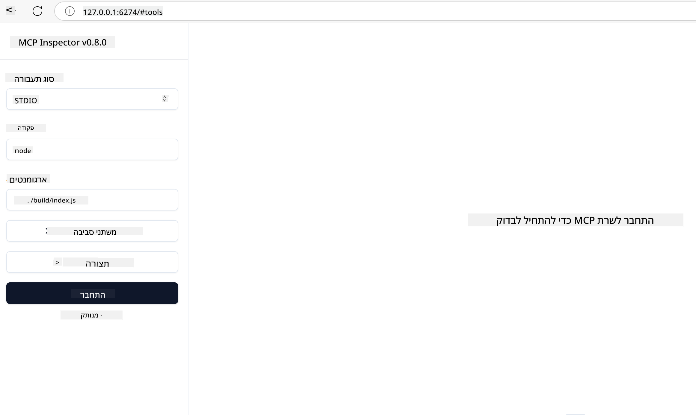

<!--
CO_OP_TRANSLATOR_METADATA:
{
  "original_hash": "717f34718a773f6cf52d8445e40a96bf",
  "translation_date": "2025-05-17T12:45:23+00:00",
  "source_file": "03-GettingStarted/07-testing/README.md",
  "language_code": "he"
}
-->
## בדיקה וניפוי שגיאות

לפני שתתחיל לבדוק את שרת ה-MCP שלך, חשוב להבין את הכלים הזמינים ואת השיטות הטובות ביותר לניפוי שגיאות. בדיקה יעילה מבטיחה שהשרת שלך מתנהג כמצופה ועוזרת לך לזהות ולפתור בעיות במהירות. הסעיף הבא מתאר גישות מומלצות לאימות היישום של MCP שלך.

## סקירה כללית

השיעור הזה מכסה כיצד לבחור את הגישה הנכונה לבדיקה ואת הכלי היעיל ביותר לבדיקה.

## מטרות לימוד

בסוף השיעור הזה, תוכל:

- לתאר גישות שונות לבדיקה.
- להשתמש בכלים שונים כדי לבדוק את הקוד שלך בצורה יעילה.

## בדיקת שרתי MCP

MCP מספק כלים שיעזרו לך לבדוק ולנפות את השרתים שלך:

- **MCP Inspector**: כלי שורת פקודה שניתן להפעיל גם ככלי CLI וגם ככלי חזותי.
- **בדיקה ידנית**: אתה יכול להשתמש בכלי כמו curl כדי להריץ בקשות רשת, אבל כל כלי שמסוגל להריץ HTTP יעשה את העבודה.
- **בדיקות יחידה**: אפשר להשתמש במסגרת הבדיקה המועדפת עליך כדי לבדוק את התכונות של השרת והלקוח.

### שימוש ב-MCP Inspector

תיארנו את השימוש בכלי הזה בשיעורים קודמים, אבל בואו נדבר עליו קצת ברמה גבוהה. זהו כלי שנבנה ב-Node.js ואתה יכול להשתמש בו על ידי קריאה ל-`npx` שמוריד ומתקין את הכלי באופן זמני ומנקה את עצמו לאחר סיום הרצת הבקשה שלך.

ה-[MCP Inspector](https://github.com/modelcontextprotocol/inspector) עוזר לך:

- **לגלות יכולות שרת**: לזהות אוטומטית משאבים זמינים, כלים ופקודות
- **בדיקת ביצוע כלי**: לנסות פרמטרים שונים ולראות תגובות בזמן אמת
- **צפייה במטא-נתונים של שרת**: לבחון מידע שרת, סכמות וקונפיגורציות

הרצה טיפוסית של הכלי נראית כך:

```bash
npx @modelcontextprotocol/inspector node build/index.js
```

הפקודה לעיל מתחילה MCP ואת הממשק החזותי שלו ומשיקה ממשק רשת מקומי בדפדפן שלך. אתה יכול לצפות לראות לוח מחוונים המציג את שרתי ה-MCP הרשומים שלך, הכלים הזמינים שלהם, המשאבים והפקודות. הממשק מאפשר לך לבדוק באופן אינטראקטיבי את ביצוע הכלים, לבדוק מטא-נתונים של שרת ולראות תגובות בזמן אמת, מה שמקל על אימות וניפוי יישום שרת ה-MCP שלך.

כך זה יכול להיראות: 

אתה יכול גם להפעיל את הכלי הזה במצב CLI שבו אתה מוסיף את התכונה `--cli`. הנה דוגמה להרצת הכלי במצב "CLI" שמפרט את כל הכלים על השרת:

```sh
npx @modelcontextprotocol/inspector --cli node build/index.js --method tools/list
```

### בדיקה ידנית

מלבד הרצת כלי הבדיקה לבדיקת יכולות שרת, גישה דומה היא להריץ לקוח שמסוגל להשתמש ב-HTTP כמו למשל curl.

עם curl, אתה יכול לבדוק שרתי MCP ישירות באמצעות בקשות HTTP:

```bash
# Example: Test server metadata
curl http://localhost:3000/v1/metadata

# Example: Execute a tool
curl -X POST http://localhost:3000/v1/tools/execute \
  -H "Content-Type: application/json" \
  -d '{"name": "calculator", "parameters": {"expression": "2+2"}}'
```

כפי שאתה יכול לראות מהשימוש לעיל ב-curl, אתה משתמש בבקשת POST כדי להפעיל כלי באמצעות מטען שמורכב משם הכלי והפרמטרים שלו. השתמש בגישה שמתאימה לך ביותר. כלי CLI בדרך כלל נוטים להיות מהירים יותר לשימוש ומתאימים להיכתב בסקריפט, מה שיכול להיות שימושי בסביבת CI/CD.

### בדיקות יחידה

צור בדיקות יחידה לכלים ולמשאבים שלך כדי להבטיח שהם עובדים כמצופה. הנה קוד בדיקה לדוגמה.

```python
import pytest

from mcp.server.fastmcp import FastMCP
from mcp.shared.memory import (
    create_connected_server_and_client_session as create_session,
)

# Mark the whole module for async tests
pytestmark = pytest.mark.anyio


async def test_list_tools_cursor_parameter():
    """Test that the cursor parameter is accepted for list_tools.

    Note: FastMCP doesn't currently implement pagination, so this test
    only verifies that the cursor parameter is accepted by the client.
    """

 server = FastMCP("test")

    # Create a couple of test tools
    @server.tool(name="test_tool_1")
    async def test_tool_1() -> str:
        """First test tool"""
        return "Result 1"

    @server.tool(name="test_tool_2")
    async def test_tool_2() -> str:
        """Second test tool"""
        return "Result 2"

    async with create_session(server._mcp_server) as client_session:
        # Test without cursor parameter (omitted)
        result1 = await client_session.list_tools()
        assert len(result1.tools) == 2

        # Test with cursor=None
        result2 = await client_session.list_tools(cursor=None)
        assert len(result2.tools) == 2

        # Test with cursor as string
        result3 = await client_session.list_tools(cursor="some_cursor_value")
        assert len(result3.tools) == 2

        # Test with empty string cursor
        result4 = await client_session.list_tools(cursor="")
        assert len(result4.tools) == 2
    
```

הקוד הקודם עושה את הדברים הבאים:

- מנצל את מסגרת pytest שמאפשרת לך ליצור בדיקות כפונקציות ולהשתמש בהצהרות assert.
- יוצר שרת MCP עם שני כלים שונים.
- משתמש בהצהרת `assert` כדי לבדוק שהתנאים מסוימים מתקיימים.

תסתכל על [הקובץ המלא כאן](https://github.com/modelcontextprotocol/python-sdk/blob/main/tests/client/test_list_methods_cursor.py)

בהתבסס על הקובץ לעיל, אתה יכול לבדוק את השרת שלך כדי להבטיח שהיכולות נוצרות כפי שהן צריכות.

לכל ה-SDK הגדולים יש חלקי בדיקה דומים כך שאתה יכול להתאים לריצה שבחרת.

## דוגמאות

- [Java Calculator](../samples/java/calculator/README.md)
- [.Net Calculator](../../../../03-GettingStarted/samples/csharp)
- [JavaScript Calculator](../samples/javascript/README.md)
- [TypeScript Calculator](../samples/typescript/README.md)
- [Python Calculator](../../../../03-GettingStarted/samples/python)

## משאבים נוספים

- [Python SDK](https://github.com/modelcontextprotocol/python-sdk)

## מה הלאה

- הבא: [Deployment](/03-GettingStarted/08-deployment/README.md)

**כתב ויתור**:  
מסמך זה תורגם באמצעות שירות תרגום AI [Co-op Translator](https://github.com/Azure/co-op-translator). למרות שאנו שואפים לדיוק, יש להיות מודעים לכך שתרגומים אוטומטיים עשויים להכיל שגיאות או אי דיוקים. המסמך המקורי בשפתו המקורית צריך להיחשב כמקור סמכותי. עבור מידע קריטי, מומלץ להשתמש בתרגום מקצועי אנושי. איננו אחראים לאי הבנות או פרשנויות שגויות הנובעות משימוש בתרגום זה.