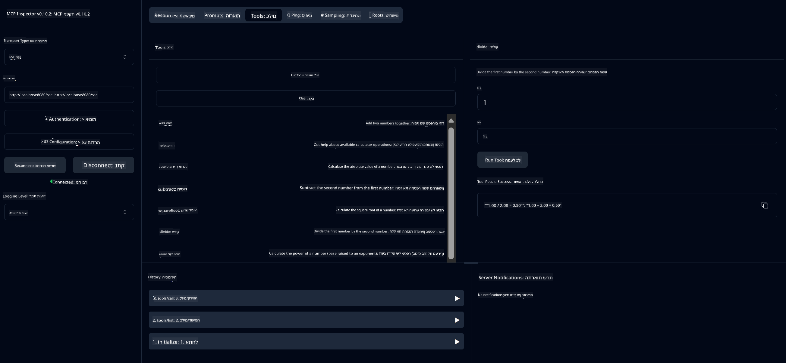

<!--
CO_OP_TRANSLATOR_METADATA:
{
  "original_hash": "13231e9951b68efd9df8c56bd5cdb27e",
  "translation_date": "2025-07-13T22:28:44+00:00",
  "source_file": "03-GettingStarted/samples/java/calculator/README.md",
  "language_code": "he"
}
-->
# שירות מחשבון בסיסי MCP

שירות זה מספק פעולות מחשבון בסיסיות דרך פרוטוקול Model Context (MCP) באמצעות Spring Boot עם WebFlux כתחבורה. הוא מיועד כדוגמה פשוטה למתחילים הלומדים על יישומי MCP.

למידע נוסף, ראה את תיעוד ההתייחסות של [MCP Server Boot Starter](https://docs.spring.io/spring-ai/reference/api/mcp/mcp-server-boot-starter-docs.html).

## סקירה כללית

השירות מציג:
- תמיכה ב-SSE (Server-Sent Events)
- רישום אוטומטי של כלים באמצעות ההערה `@Tool` של Spring AI
- פונקציות מחשבון בסיסיות:
  - חיבור, חיסור, כפל, חילוק
  - חישוב חזקות ושורש ריבועי
  - מודולוס (שארית) וערך מוחלט
  - פונקציית עזרה לתיאור פעולות

## תכונות

שירות המחשבון מציע את היכולות הבאות:

1. **פעולות אריתמטיות בסיסיות**:
   - חיבור של שני מספרים
   - חיסור של מספר אחד מהשני
   - כפל של שני מספרים
   - חילוק של מספר אחד באחר (עם בדיקת חילוק באפס)

2. **פעולות מתקדמות**:
   - חישוב חזקות (העלאת בסיס למעריך)
   - חישוב שורש ריבועי (עם בדיקת מספר שלילי)
   - חישוב מודולוס (שארית)
   - חישוב ערך מוחלט

3. **מערכת עזרה**:
   - פונקציית עזרה מובנית המסבירה את כל הפעולות הזמינות

## שימוש בשירות

השירות חושף את נקודות הקצה הבאות דרך פרוטוקול MCP:

- `add(a, b)`: מחבר שני מספרים יחד
- `subtract(a, b)`: מחסר את המספר השני מהראשון
- `multiply(a, b)`: מכפיל שני מספרים
- `divide(a, b)`: מחלק את המספר הראשון בשני (עם בדיקת אפס)
- `power(base, exponent)`: מחשב חזקת מספר
- `squareRoot(number)`: מחשב שורש ריבועי (עם בדיקת מספר שלילי)
- `modulus(a, b)`: מחשב את השארית מחילוק
- `absolute(number)`: מחשב את הערך המוחלט
- `help()`: מקבל מידע על הפעולות הזמינות

## לקוח בדיקה

לקוח בדיקה פשוט כלול בחבילת `com.microsoft.mcp.sample.client`. מחלקת `SampleCalculatorClient` מדגימה את הפעולות הזמינות של שירות המחשבון.

## שימוש בלקוח LangChain4j

הפרויקט כולל דוגמת לקוח LangChain4j ב-`com.microsoft.mcp.sample.client.LangChain4jClient` המדגימה כיצד לשלב את שירות המחשבון עם LangChain4j ודגמי GitHub:

### דרישות מוקדמות

1. **הגדרת טוקן GitHub**:
   
   לשימוש בדגמי ה-AI של GitHub (כמו phi-4), יש צורך בטוקן גישה אישי של GitHub:

   א. עבור להגדרות החשבון שלך ב-GitHub: https://github.com/settings/tokens
   
   ב. לחץ על "Generate new token" → "Generate new token (classic)"
   
   ג. תן לטוקן שם תיאורי
   
   ד. בחר את ההרשאות הבאות:
      - `repo` (שליטה מלאה על מאגרים פרטיים)
      - `read:org` (קריאת חברות בארגון ובצוות, קריאת פרויקטים בארגון)
      - `gist` (יצירת gists)
      - `user:email` (גישה לכתובות דוא"ל של המשתמש (קריאה בלבד))
   
   ה. לחץ על "Generate token" והעתק את הטוקן החדש
   
   ו. הגדר אותו כמשתנה סביבה:
      
      ב-Windows:
      ```
      set GITHUB_TOKEN=your-github-token
      ```
      
      ב-macOS/Linux:
      ```bash
      export GITHUB_TOKEN=your-github-token
      ```

   ז. להגדרה קבועה, הוסף אותו למשתני הסביבה דרך הגדרות המערכת

2. הוסף את התלות של LangChain4j GitHub לפרויקט שלך (כבר כלול ב-pom.xml):
   ```xml
   <dependency>
       <groupId>dev.langchain4j</groupId>
       <artifactId>langchain4j-github</artifactId>
       <version>${langchain4j.version}</version>
   </dependency>
   ```

3. ודא ששירות המחשבון רץ בכתובת `localhost:8080`

### הפעלת לקוח LangChain4j

דוגמה זו מדגימה:
- חיבור לשרת MCP של המחשבון דרך תחבורת SSE
- שימוש ב-LangChain4j ליצירת צ'אט בוט המשתמש בפעולות המחשבון
- אינטגרציה עם דגמי AI של GitHub (כעת באמצעות דגם phi-4)

הלקוח שולח את שאילתות הדוגמה הבאות להדגמת הפונקציונליות:
1. חישוב סכום של שני מספרים
2. מציאת שורש ריבועי של מספר
3. קבלת מידע עזרה על פעולות המחשבון הזמינות

הפעל את הדוגמה ובדוק את פלט הקונסולה כדי לראות כיצד דגם ה-AI משתמש בכלי המחשבון כדי לענות על השאילתות.

### קונפיגורציית דגם GitHub

לקוח LangChain4j מוגדר להשתמש בדגם phi-4 של GitHub עם ההגדרות הבאות:

```java
ChatLanguageModel model = GitHubChatModel.builder()
    .apiKey(System.getenv("GITHUB_TOKEN"))
    .timeout(Duration.ofSeconds(60))
    .modelName("phi-4")
    .logRequests(true)
    .logResponses(true)
    .build();
```

כדי להשתמש בדגמי GitHub שונים, פשוט שנה את הפרמטר `modelName` לדגם נתמך אחר (למשל, "claude-3-haiku-20240307", "llama-3-70b-8192" וכו').

## תלותים

הפרויקט דורש את התלותות המרכזיות הבאות:

```xml
<!-- For MCP Server -->
<dependency>
    <groupId>org.springframework.ai</groupId>
    <artifactId>spring-ai-starter-mcp-server-webflux</artifactId>
</dependency>

<!-- For LangChain4j integration -->
<dependency>
    <groupId>dev.langchain4j</groupId>
    <artifactId>langchain4j-mcp</artifactId>
    <version>${langchain4j.version}</version>
</dependency>

<!-- For GitHub models support -->
<dependency>
    <groupId>dev.langchain4j</groupId>
    <artifactId>langchain4j-github</artifactId>
    <version>${langchain4j.version}</version>
</dependency>
```

## בניית הפרויקט

בנה את הפרויקט באמצעות Maven:
```bash
./mvnw clean install -DskipTests
```

## הפעלת השרת

### שימוש ב-Java

```bash
java -jar target/calculator-server-0.0.1-SNAPSHOT.jar
```

### שימוש ב-MCP Inspector

MCP Inspector הוא כלי שימושי לאינטראקציה עם שירותי MCP. לשימוש בו עם שירות המחשבון הזה:

1. **התקן והפעל את MCP Inspector** בחלון טרמינל חדש:
   ```bash
   npx @modelcontextprotocol/inspector
   ```

2. **גש לממשק האינטרנטי** על ידי לחיצה על כתובת ה-URL שמוצגת באפליקציה (בדרך כלל http://localhost:6274)

3. **הגדר את החיבור**:
   - הגדר את סוג התחבורה ל-"SSE"
   - הגדר את ה-URL לנקודת הקצה SSE של השרת שלך: `http://localhost:8080/sse`
   - לחץ על "Connect"

4. **השתמש בכלים**:
   - לחץ על "List Tools" כדי לראות את פעולות המחשבון הזמינות
   - בחר כלי ולחץ על "Run Tool" כדי לבצע פעולה



### שימוש ב-Docker

הפרויקט כולל Dockerfile לפריסה במכולה:

1. **בנה את תמונת ה-Docker**:
   ```bash
   docker build -t calculator-mcp-service .
   ```

2. **הפעל את מכולת ה-Docker**:
   ```bash
   docker run -p 8080:8080 calculator-mcp-service
   ```

זה יבצע:
- בניית תמונת Docker רב-שלבית עם Maven 3.9.9 ו-Eclipse Temurin 24 JDK
- יצירת תמונת מכולה מותאמת
- חשיפת השירות על פורט 8080
- הפעלת שירות המחשבון MCP בתוך המכולה

תוכל לגשת לשירות בכתובת `http://localhost:8080` ברגע שהמכולה רצה.

## פתרון בעיות

### בעיות נפוצות עם טוקן GitHub

1. **בעיות הרשאות בטוקן**: אם אתה מקבל שגיאת 403 Forbidden, בדוק שהטוקן שלך כולל את ההרשאות הנכונות כפי שמפורט בדרישות המוקדמות.

2. **טוקן לא נמצא**: אם אתה מקבל שגיאה "No API key found", ודא שמשתנה הסביבה GITHUB_TOKEN מוגדר כראוי.

3. **הגבלת קצב**: ל-API של GitHub יש הגבלות קצב. אם אתה נתקל בשגיאת הגבלת קצב (קוד סטטוס 429), המתן כמה דקות לפני ניסיון חוזר.

4. **פג תוקף הטוקן**: טוקנים של GitHub יכולים לפוג. אם אתה מקבל שגיאות אימות לאחר זמן מה, צור טוקן חדש ועדכן את משתנה הסביבה.

אם אתה זקוק לעזרה נוספת, עיין ב-[תיעוד LangChain4j](https://github.com/langchain4j/langchain4j) או ב-[תיעוד API של GitHub](https://docs.github.com/en/rest).

**כתב ויתור**:  
מסמך זה תורגם באמצעות שירות תרגום מבוסס בינה מלאכותית [Co-op Translator](https://github.com/Azure/co-op-translator). למרות שאנו שואפים לדיוק, יש לקחת בחשבון כי תרגומים אוטומטיים עלולים להכיל שגיאות או אי-דיוקים. המסמך המקורי בשפת המקור שלו נחשב למקור הסמכותי. למידע קריטי מומלץ להשתמש בתרגום מקצועי על ידי מתרגם אנושי. אנו לא נושאים באחריות לכל אי-הבנה או פרשנות שגויה הנובעת משימוש בתרגום זה.