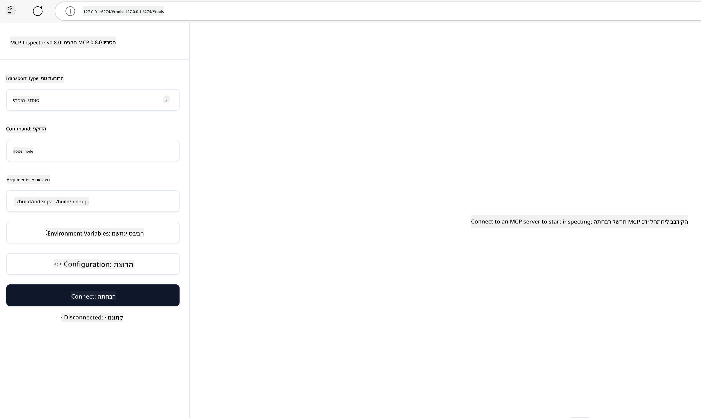

<!--
CO_OP_TRANSLATOR_METADATA:
{
  "original_hash": "83efa75a69bc831277263a6f1ae53669",
  "translation_date": "2025-08-18T16:46:31+00:00",
  "source_file": "04-PracticalImplementation/README.md",
  "language_code": "he"
}
-->
# יישום מעשי

[](https://youtu.be/vCN9-mKBDfQ)

_(לחצו על התמונה למעלה לצפייה בסרטון של השיעור הזה)_

היישום המעשי הוא המקום שבו הכוח של Model Context Protocol (MCP) הופך למוחשי. בעוד שהבנת התיאוריה והארכיטקטורה שמאחורי MCP היא חשובה, הערך האמיתי מתגלה כאשר מיישמים את הקונספטים הללו כדי לבנות, לבדוק ולפרוס פתרונות שמטפלים בבעיות אמיתיות. פרק זה מגשר על הפער בין ידע תיאורטי לפיתוח מעשי, ומנחה אתכם בתהליך של הפיכת אפליקציות מבוססות MCP למציאות.

בין אם אתם מפתחים עוזרים חכמים, משלבים AI בתהליכי עבודה עסקיים, או בונים כלים מותאמים אישית לעיבוד נתונים, MCP מספק בסיס גמיש. העיצוב שלו שאינו תלוי בשפה ו-SDKs הרשמיים לשפות תכנות פופולריות הופכים אותו לנגיש למגוון רחב של מפתחים. באמצעות ה-SDKs הללו, תוכלו ליצור אבטיפוס במהירות, לשפר ולשדרג את הפתרונות שלכם על פני פלטפורמות וסביבות שונות.

בקטעים הבאים תמצאו דוגמאות מעשיות, קוד לדוגמה ואסטרטגיות פריסה שמדגימות כיצד ליישם MCP ב-C#, Java עם Spring, TypeScript, JavaScript ו-Python. תלמדו גם כיצד לנפות באגים ולבדוק את שרתי MCP, לנהל APIs ולפרוס פתרונות לענן באמצעות Azure. המשאבים המעשיים הללו נועדו להאיץ את הלמידה שלכם ולעזור לכם לבנות אפליקציות MCP חזקות ומוכנות לייצור בביטחון.

## סקירה כללית

שיעור זה מתמקד בהיבטים המעשיים של יישום MCP בשפות תכנות שונות. נחקור כיצד להשתמש ב-SDKs של MCP ב-C#, Java עם Spring, TypeScript, JavaScript ו-Python כדי לבנות אפליקציות חזקות, לנפות באגים ולבדוק שרתי MCP, וליצור משאבים, פקודות וכלים לשימוש חוזר.

## מטרות למידה

בסיום השיעור הזה, תוכלו:

- ליישם פתרונות MCP באמצעות SDKs רשמיים בשפות תכנות שונות
- לנפות באגים ולבדוק שרתי MCP באופן שיטתי
- ליצור ולהשתמש בתכונות שרת (משאבים, פקודות וכלים)
- לעצב תהליכי עבודה יעילים של MCP למשימות מורכבות
- לייעל יישומי MCP לביצועים ואמינות

## משאבי SDK רשמיים

פרוטוקול Model Context מציע SDKs רשמיים למספר שפות:

- [C# SDK](https://github.com/modelcontextprotocol/csharp-sdk)
- [Java עם Spring SDK](https://github.com/modelcontextprotocol/java-sdk) **הערה:** דורש תלות ב-[Project Reactor](https://projectreactor.io). (ראו [דיון issue 246](https://github.com/orgs/modelcontextprotocol/discussions/246).)
- [TypeScript SDK](https://github.com/modelcontextprotocol/typescript-sdk)
- [Python SDK](https://github.com/modelcontextprotocol/python-sdk)
- [Kotlin SDK](https://github.com/modelcontextprotocol/kotlin-sdk)

## עבודה עם SDKs של MCP

חלק זה מספק דוגמאות מעשיות ליישום MCP בשפות תכנות שונות. תוכלו למצוא קוד לדוגמה בתיקיית `samples` המאורגנת לפי שפה.

### דוגמאות זמינות

הריפוזיטורי כולל [יישומים לדוגמה](../../../04-PracticalImplementation/samples) בשפות הבאות:

- [C#](./samples/csharp/README.md)
- [Java עם Spring](./samples/java/containerapp/README.md)
- [TypeScript](./samples/typescript/README.md)
- [JavaScript](./samples/javascript/README.md)
- [Python](./samples/python/README.md)

כל דוגמה מדגימה מושגי MCP מרכזיים ודפוסי יישום עבור אותה שפה ואקוסיסטמה.

## תכונות שרת מרכזיות

שרתי MCP יכולים ליישם כל שילוב של התכונות הבאות:

### משאבים

משאבים מספקים הקשר ונתונים לשימוש המשתמש או מודל ה-AI:

- מאגרי מסמכים
- בסיסי ידע
- מקורות נתונים מובנים
- מערכות קבצים

### פקודות

פקודות הן הודעות ותהליכים מובנים למשתמשים:

- תבניות שיחה מוגדרות מראש
- דפוסי אינטראקציה מודרכים
- מבני דיאלוג מיוחדים

### כלים

כלים הם פונקציות שהמודל יכול לבצע:

- כלי עיבוד נתונים
- אינטגרציות API חיצוניות
- יכולות חישוביות
- פונקציות חיפוש

## יישומים לדוגמה: יישום ב-C#

הריפוזיטורי הרשמי של C# SDK מכיל מספר יישומים לדוגמה המדגימים היבטים שונים של MCP:

- **לקוח MCP בסיסי**: דוגמה פשוטה שמראה כיצד ליצור לקוח MCP ולהפעיל כלים
- **שרת MCP בסיסי**: יישום שרת מינימלי עם רישום כלים בסיסי
- **שרת MCP מתקדם**: שרת מלא עם רישום כלים, אימות וטיפול בשגיאות
- **אינטגרציה עם ASP.NET**: דוגמאות המדגימות אינטגרציה עם ASP.NET Core
- **דפוסי יישום כלים**: דפוסים שונים ליישום כלים ברמות מורכבות שונות

SDK ה-C# של MCP נמצא בגרסת תצוגה מקדימה וייתכן שה-APIs ישתנו. נעדכן את הבלוג הזה באופן שוטף ככל שה-SDK יתפתח.

### תכונות מרכזיות

- [C# MCP Nuget ModelContextProtocol](https://www.nuget.org/packages/ModelContextProtocol)
- בניית [שרת MCP ראשון](https://devblogs.microsoft.com/dotnet/build-a-model-context-protocol-mcp-server-in-csharp/).

ליישומים מלאים ב-C#, בקרו ב-[ריפוזיטורי הדוגמאות הרשמי של C# SDK](https://github.com/modelcontextprotocol/csharp-sdk)

## יישום לדוגמה: יישום ב-Java עם Spring

SDK של Java עם Spring מציע אפשרויות יישום MCP חזקות עם תכונות ברמה ארגונית.

### תכונות מרכזיות

- אינטגרציה עם Spring Framework
- בטיחות סוגים חזקה
- תמיכה בתכנות ריאקטיבי
- טיפול מקיף בשגיאות

ליישום מלא ב-Java עם Spring, ראו [דוגמת Java עם Spring](samples/java/containerapp/README.md) בתיקיית הדוגמאות.

## יישום לדוגמה: יישום ב-JavaScript

SDK של JavaScript מספק גישה קלה וגמישה ליישום MCP.

### תכונות מרכזיות

- תמיכה ב-Node.js ודפדפנים
- API מבוסס הבטחות
- אינטגרציה קלה עם Express ומסגרות אחרות
- תמיכה ב-WebSocket להזרמה

ליישום מלא ב-JavaScript, ראו [דוגמת JavaScript](samples/javascript/README.md) בתיקיית הדוגמאות.

## יישום לדוגמה: יישום ב-Python

SDK של Python מציע גישה פייתונית ליישום MCP עם אינטגרציות מצוינות למסגרות ML.

### תכונות מרכזיות

- תמיכה ב-Async/await עם asyncio
- אינטגרציה עם FastAPI
- רישום כלים פשוט
- אינטגרציה טבעית עם ספריות ML פופולריות

ליישום מלא ב-Python, ראו [דוגמת Python](samples/python/README.md) בתיקיית הדוגמאות.

## ניהול API

Azure API Management הוא פתרון מצוין לאבטחת שרתי MCP. הרעיון הוא לשים מופע של Azure API Management לפני שרת ה-MCP שלכם ולתת לו לטפל בתכונות שאתם עשויים לרצות כמו:

- הגבלת קצב
- ניהול אסימונים
- ניטור
- איזון עומסים
- אבטחה

### דוגמת Azure

הנה דוגמת Azure שעושה בדיוק את זה, כלומר [יצירת שרת MCP ואבטחתו עם Azure API Management](https://github.com/Azure-Samples/remote-mcp-apim-functions-python).

ראו כיצד מתבצע תהליך האימות בתמונה הבאה:


בתמונה הקודמת, מתרחש התהליך הבא:

- אימות/אישור מתבצע באמצעות Microsoft Entra.
- Azure API Management פועל כשער ומשתמש במדיניות לניהול תעבורה.
- Azure Monitor מתעד את כל הבקשות לניתוח נוסף.

#### תהליך האישור

בואו נבחן את תהליך האישור בפירוט:


#### מפרט האישור של MCP

למדו עוד על [מפרט האישור של MCP](https://modelcontextprotocol.io/specification/2025-03-26/basic/authorization#2-10-third-party-authorization-flow)

## פריסת שרת MCP מרוחק ל-Azure

בואו נראה אם נוכל לפרוס את הדוגמה שהזכרנו קודם:

1. שיבטו את הריפוזיטורי

    ```bash
    git clone https://github.com/Azure-Samples/remote-mcp-apim-functions-python.git
    cd remote-mcp-apim-functions-python
    ```

1. רשמו את ספק המשאבים `Microsoft.App`.

   - אם אתם משתמשים ב-Azure CLI, הריצו `az provider register --namespace Microsoft.App --wait`.
   - אם אתם משתמשים ב-Azure PowerShell, הריצו `Register-AzResourceProvider -ProviderNamespace Microsoft.App`. לאחר מכן הריצו `(Get-AzResourceProvider -ProviderNamespace Microsoft.App).RegistrationState` לאחר זמן מה כדי לבדוק אם הרישום הושלם.

1. הריצו את הפקודה הזו של [azd](https://aka.ms/azd) כדי להקצות את שירות ניהול ה-API, אפליקציית הפונקציות (עם קוד) וכל משאבי Azure הנדרשים

    ```shell
    azd up
    ```

    פקודה זו אמורה לפרוס את כל משאבי הענן ב-Azure

### בדיקת השרת שלכם עם MCP Inspector

1. ב**חלון טרמינל חדש**, התקינו והריצו את MCP Inspector

    ```shell
    npx @modelcontextprotocol/inspector
    ```

    אתם אמורים לראות ממשק דומה ל:

    

1. לחצו על CTRL כדי לטעון את אפליקציית ה-MCP Inspector מה-URL שמוצג על ידי האפליקציה (לדוגמה [http://127.0.0.1:6274/#resources](http://127.0.0.1:6274/#resources))
1. הגדירו את סוג התעבורה ל-`SSE`
1. הגדירו את ה-URL לנקודת הקצה של SSE של ניהול ה-API שלכם שמוצגת לאחר `azd up` ו**התחברו**:

    ```shell
    https://<apim-servicename-from-azd-output>.azure-api.net/mcp/sse
    ```

1. **רשימת כלים**. לחצו על כלי ו**הריצו כלי**.

אם כל השלבים עבדו, אתם אמורים להיות מחוברים לשרת MCP והצלחתם לקרוא לכלי.

## שרתי MCP ל-Azure

[Remote-mcp-functions](https://github.com/Azure-Samples/remote-mcp-functions-dotnet): סט זה של ריפוזיטוריז הוא תבנית התחלה מהירה לבניית ופריסת שרתי MCP מותאמים אישית באמצעות Azure Functions עם Python, C# .NET או Node/TypeScript.

הדוגמאות מספקות פתרון מלא שמאפשר למפתחים:

- לבנות ולהריץ מקומית: לפתח ולנפות באגים בשרת MCP במחשב מקומי
- לפרוס ל-Azure: לפרוס בקלות לענן עם פקודת azd up פשוטה
- להתחבר מלקוחות: להתחבר לשרת MCP מלקוחות שונים כולל מצב סוכן של VS Code וכלי MCP Inspector

### תכונות מרכזיות

- אבטחה בעיצוב: שרת MCP מאובטח באמצעות מפתחות ו-HTTPS
- אפשרויות אימות: תומך ב-OAuth באמצעות אימות מובנה ו/או ניהול API
- בידוד רשת: מאפשר בידוד רשת באמצעות Azure Virtual Networks (VNET)
- ארכיטקטורה ללא שרת: מנצל את Azure Functions לביצוע ניתן להרחבה ומבוסס אירועים
- פיתוח מקומי: תמיכה מקיפה בפיתוח וניפוי באגים מקומיים
- פריסה פשוטה: תהליך פריסה פשוט ל-Azure

הריפוזיטורי כולל את כל קבצי הקונפיגורציה, קוד המקור והגדרות התשתית הדרושים כדי להתחיל במהירות עם יישום שרת MCP מוכן לייצור.

- [Azure Remote MCP Functions Python](https://github.com/Azure-Samples/remote-mcp-functions-python) - יישום לדוגמה של MCP באמצעות Azure Functions עם Python

- [Azure Remote MCP Functions .NET](https://github.com/Azure-Samples/remote-mcp-functions-dotnet) - יישום לדוגמה של MCP באמצעות Azure Functions עם C# .NET

- [Azure Remote MCP Functions Node/Typescript](https://github.com/Azure-Samples/remote-mcp-functions-typescript) - יישום לדוגמה של MCP באמצעות Azure Functions עם Node/TypeScript.

## נקודות מפתח

- SDKs של MCP מספקים כלים ייעודיים לשפות ליישום פתרונות MCP חזקים
- תהליך ניפוי הבאגים והבדיקות הוא קריטי ליישומי MCP אמינים
- תבניות פקודות לשימוש חוזר מאפשרות אינטראקציות עקביות עם AI
- תהליכי עבודה מעוצבים היטב יכולים לתזמר משימות מורכבות באמצעות כלים מרובים
- יישום פתרונות MCP דורש התחשבות באבטחה, ביצועים וטיפול בשגיאות

## תרגיל

עצבו תהליך עבודה מעשי של MCP שמטפל בבעיה אמיתית בתחום שלכם:

1. זהו 3-4 כלים שיכולים להיות שימושיים לפתרון הבעיה
2. צרו דיאגרמת תהליך עבודה שמראה כיצד הכלים הללו מתקשרים
3. יישמו גרסה בסיסית של אחד הכלים בשפה המועדפת עליכם
4. צרו תבנית פקודה שתעזור למודל להשתמש בכלי שלכם בצורה יעילה

## משאבים נוספים

---

הבא: [נושאים מתקדמים](../05-AdvancedTopics/README.md)

**כתב ויתור**:  
מסמך זה תורגם באמצעות שירות תרגום מבוסס בינה מלאכותית [Co-op Translator](https://github.com/Azure/co-op-translator). למרות שאנו שואפים לדיוק, יש להיות מודעים לכך שתרגומים אוטומטיים עשויים להכיל שגיאות או אי דיוקים. המסמך המקורי בשפתו המקורית צריך להיחשב כמקור הסמכותי. עבור מידע קריטי, מומלץ להשתמש בתרגום מקצועי על ידי אדם. איננו נושאים באחריות לאי הבנות או לפרשנויות שגויות הנובעות משימוש בתרגום זה.