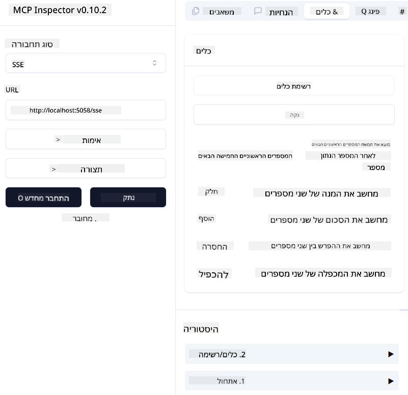
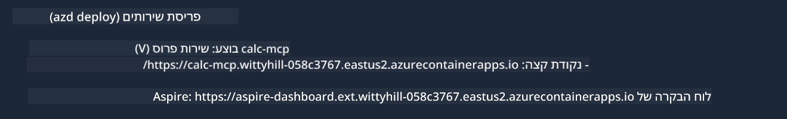

<!--
CO_OP_TRANSLATOR_METADATA:
{
  "original_hash": "5020a3e1a1c7f30c00f9e37f1fa208e3",
  "translation_date": "2025-05-17T14:10:16+00:00",
  "source_file": "04-PracticalImplementation/samples/csharp/README.md",
  "language_code": "he"
}
-->
# דוגמה

הדוגמה הקודמת מראה כיצד להשתמש בפרויקט .NET מקומי עם סוג `sdio`. וכיצד להפעיל את השרת באופן מקומי בתוך מכולה. זו פתרון טוב במצבים רבים. עם זאת, זה יכול להיות מועיל להפעיל את השרת מרחוק, כמו בסביבת ענן. כאן נכנס לתמונה סוג `http`.

כשמסתכלים על הפתרון בתיקיית `04-PracticalImplementation`, זה עשוי להיראות הרבה יותר מורכב מהקודם. אבל למעשה, זה לא. אם תסתכל מקרוב על הפרויקט `src/mcpserver/mcpserver.csproj`, תראה שזה בעיקר אותו קוד כמו בדוגמה הקודמת. ההבדל היחיד הוא שאנחנו משתמשים בספרייה שונה `ModelContextProtocol.AspNetCore` כדי לטפל בבקשות HTTP. ושינינו את השיטה `IsPrime` כדי להפוך אותה לפרטית, רק כדי להראות שאפשר שיהיו שיטות פרטיות בקוד שלך. שאר הקוד זהה לקודם.

הפרויקטים האחרים הם מ[.NET Aspire](https://learn.microsoft.com/dotnet/aspire/get-started/aspire-overview). שילוב .NET Aspire בפתרון ישפר את חוויית המפתח בזמן הפיתוח והבדיקה ויעזור עם נראות. זה לא נדרש כדי להפעיל את השרת, אבל זה נוהג טוב שיהיה אותו בפתרון שלך.

## הפעלת השרת באופן מקומי

1. מ-VS Code (עם תוסף C# DevKit), פתח את הפתרון `04-PracticalImplementation\samples\csharp\src\Calculator-chap4.sln`.
2. לחץ על `F5` כדי להתחיל את השרת. זה צריך להתחיל דפדפן אינטרנט עם לוח הבקרה של .NET Aspire.

או

1. מתוך מסוף, נווט לתיקייה `04-PracticalImplementation\samples\csharp\src`
2. בצע את הפקודה הבאה כדי להתחיל את השרת:
   ```bash
    dotnet run --project .\AppHost
   ```

3. מתוך לוח הבקרה, שים לב ל-URL של `http`. זה צריך להיות משהו כמו `http://localhost:5058/`.

## Test `SSE` עם ModelContext Protocol Inspector

אם יש לך Node.js 22.7.5 ומעלה, אתה יכול להשתמש ב-ModelContext Protocol Inspector כדי לבדוק את השרת שלך.

הפעל את השרת ובצע את הפקודה הבאה במסוף:

```bash
npx @modelcontextprotocol/inspector@latest
```



- בחר `SSE` as the Transport type. SSE stand for Server-Sent Events. 
- In the Url field, enter the URL of the server noted earlier,and append `/sse`. זה צריך להיות `http` (לא `https`) something like `http://localhost:5058/sse`.
- select the Connect button.

A nice thing about the Inspector is that it provide a nice visibility on what is happening.

- Try listing the availables tools
- Try some of them, it should works just like before.


## Test `SSE` with Github Copilot Chat in VS Code

To use the `SSE` transport with Github Copilot Chat, change the configuration of the `mcp-calc` השרת שנוצר קודם לכן נראה כך:

```json
"mcp-calc": {
    "type": "sse",
    "url": "http://localhost:5058/sse"
}
```

בצע כמה בדיקות:
- בקש את 3 המספרים הראשוניים אחרי 6780. שים לב כיצד Copilot ישתמש בכלים החדשים `NextFivePrimeNumbers` ויחזיר רק את 3 המספרים הראשוניים הראשונים.
- בקש את 7 המספרים הראשוניים אחרי 111, כדי לראות מה קורה.


# פריסת השרת ל-Azure

בואו נפרוס את השרת ל-Azure כדי שיותר אנשים יוכלו להשתמש בו.

מתוך מסוף, נווט לתיקייה `04-PracticalImplementation\samples\csharp\src` ובצע את הפקודה הבאה:

```bash
azd init
```

זה ייצור כמה קבצים באופן מקומי כדי לשמור את הגדרות משאבי Azure, ואת התשתית שלך כקוד (IaC).

לאחר מכן, בצע את הפקודה הבאה כדי לפרוס את השרת ל-Azure:

```bash
azd up
```

לאחר סיום הפריסה, אתה צריך לראות הודעה כמו זו:



נווט ללוח הבקרה של Aspire ושם לב ל-URL של `HTTP` כדי להשתמש בו ב-MCP Inspector וב-Github Copilot Chat.


## מה הלאה?

אנחנו מנסים סוגי תעבורה שונים, וכלי בדיקה וגם מפרסים את שרת ה-MCP שלנו ל-Azure. אבל מה אם השרת שלנו צריך גישה למשאבים פרטיים? לדוגמה, בסיס נתונים או API פרטי? בפרק הבא נראה כיצד אנו יכולים לשפר את האבטחה של השרת שלנו.

**כתב ויתור**:  
מסמך זה תורגם באמצעות שירות תרגום AI [Co-op Translator](https://github.com/Azure/co-op-translator). בעוד אנו שואפים לדיוק, אנא היו מודעים לכך שתרגומים אוטומטיים עשויים להכיל שגיאות או אי דיוקים. המסמך המקורי בשפתו המקורית צריך להיחשב כמקור הסמכותי. למידע קריטי, מומלץ להשתמש בתרגום מקצועי על ידי בני אדם. איננו אחראים לכל אי הבנות או פרשנויות שגויות הנובעות משימוש בתרגום זה.