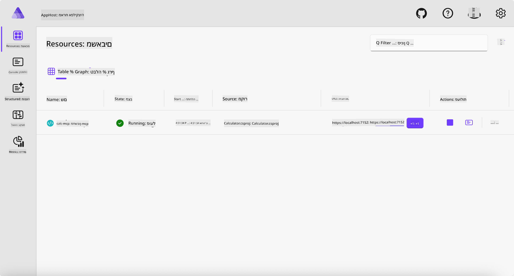
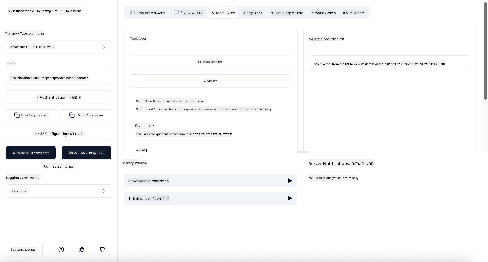
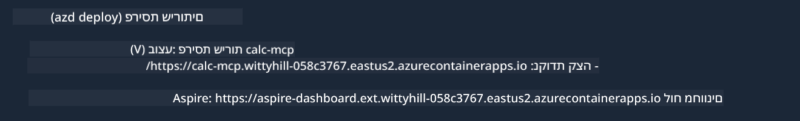

<!--
CO_OP_TRANSLATOR_METADATA:
{
  "original_hash": "0bc7bd48f55f1565f1d95ccb2c16f728",
  "translation_date": "2025-07-13T23:08:10+00:00",
  "source_file": "04-PracticalImplementation/samples/csharp/README.md",
  "language_code": "he"
}
-->
# דוגמה

הדוגמה הקודמת מראה כיצד להשתמש בפרויקט .NET מקומי עם סוג `stdio`. וכיצד להריץ את השרת מקומית בתוך מכולה. זו פתרון טוב במצבים רבים. עם זאת, יכול להיות שימושי שהשרת ירוץ מרחוק, כמו בסביבת ענן. כאן נכנס סוג ה-`http`.

בהסתכלות על הפתרון בתיקיית `04-PracticalImplementation`, זה עשוי להיראות הרבה יותר מורכב מהדוגמה הקודמת. אבל במציאות, זה לא כך. אם תסתכל מקרוב על הפרויקט `src/Calculator`, תראה שזה ברובו אותו קוד כמו בדוגמה הקודמת. ההבדל היחיד הוא שאנחנו משתמשים בספרייה שונה `ModelContextProtocol.AspNetCore` כדי לטפל בבקשות HTTP. ושינינו את המתודה `IsPrime` כדי להפוך אותה לפרטית, רק כדי להראות שאפשר שיהיו מתודות פרטיות בקוד שלך. שאר הקוד זהה כמו קודם.

הפרויקטים האחרים הם מ-[.NET Aspire](https://learn.microsoft.com/dotnet/aspire/get-started/aspire-overview). הכנסת .NET Aspire לפתרון תשפר את חוויית המפתח במהלך הפיתוח והבדיקות ותעזור בנראות. זה לא חובה כדי להריץ את השרת, אבל זו פרקטיקה טובה שיהיה לך את זה בפתרון שלך.

## הפעלת השרת מקומית

1. מתוך VS Code (עם תוסף C# DevKit), נווט לתיקייה `04-PracticalImplementation/samples/csharp`.
1. הרץ את הפקודה הבאה כדי להפעיל את השרת:

   ```bash
    dotnet watch run --project ./src/AppHost
   ```

1. כאשר דפדפן האינטרנט יפתח את לוח הבקרה של .NET Aspire, שים לב לכתובת ה-`http`. היא אמורה להיות משהו כמו `http://localhost:5058/`.

   

## בדיקת Streamable HTTP עם MCP Inspector

אם יש לך Node.js בגרסה 22.7.5 ומעלה, תוכל להשתמש ב-MCP Inspector כדי לבדוק את השרת שלך.

הפעל את השרת והריץ את הפקודה הבאה בטרמינל:

```bash
npx @modelcontextprotocol/inspector http://localhost:5058
```



- בחר את סוג ההעברה `Streamable HTTP`.
- בשדה ה-Url, הזן את כתובת השרת שנרשמה קודם, והוסף `/mcp`. זה אמור להיות `http` (לא `https`) משהו כמו `http://localhost:5058/mcp`.
- לחץ על כפתור Connect.

דבר טוב ב-Inspector הוא שהוא מספק נראות טובה על מה שקורה.

- נסה לרשום את הכלים הזמינים
- נסה כמה מהם, זה אמור לעבוד כמו קודם.

## בדיקת שרת MCP עם GitHub Copilot Chat ב-VS Code

כדי להשתמש בהעברת Streamable HTTP עם GitHub Copilot Chat, שנה את התצורה של השרת `calc-mcp` שנוצר קודם כך:

```jsonc
// .vscode/mcp.json
{
  "servers": {
    "calc-mcp": {
      "type": "http",
      "url": "http://localhost:5058/mcp"
    }
  }
}
```

בצע כמה בדיקות:

- בקש "3 מספרים ראשוניים אחרי 6780". שים לב כיצד Copilot ישתמש בכלים החדשים `NextFivePrimeNumbers` ויחזיר רק את 3 המספרים הראשוניים הראשונים.
- בקש "7 מספרים ראשוניים אחרי 111", כדי לראות מה קורה.
- בקש "לג'ון יש 24 סוכריות והוא רוצה לחלק אותן בין 3 ילדיו. כמה סוכריות יש לכל ילד?", כדי לראות מה קורה.

## פריסת השרת ל-Azure

בוא נפרוס את השרת ל-Azure כדי שיותר אנשים יוכלו להשתמש בו.

מהטרמינל, נווט לתיקייה `04-PracticalImplementation/samples/csharp` והריץ את הפקודה הבאה:

```bash
azd up
```

לאחר שהפריסה תסתיים, אמור להופיע לך הודעה כזו:



קח את הכתובת והשתמש בה ב-MCP Inspector וב-GitHub Copilot Chat.

```jsonc
// .vscode/mcp.json
{
  "servers": {
    "calc-mcp": {
      "type": "http",
      "url": "https://calc-mcp.gentleriver-3977fbcf.australiaeast.azurecontainerapps.io/mcp"
    }
  }
}
```

## מה הלאה?

ניסינו סוגי העברה שונים וכלי בדיקה שונים. גם פרסנו את שרת ה-MCP שלך ל-Azure. אבל מה אם השרת שלנו צריך גישה למשאבים פרטיים? למשל, מסד נתונים או API פרטי? בפרק הבא נראה כיצד אפשר לשפר את האבטחה של השרת שלנו.

**כתב ויתור**:  
מסמך זה תורגם באמצעות שירות תרגום מבוסס בינה מלאכותית [Co-op Translator](https://github.com/Azure/co-op-translator). למרות שאנו שואפים לדיוק, יש לקחת בחשבון כי תרגומים אוטומטיים עלולים להכיל שגיאות או אי-דיוקים. המסמך המקורי בשפת המקור שלו נחשב למקור הסמכותי. למידע קריטי מומלץ להשתמש בתרגום מקצועי על ידי מתרגם אנושי. אנו לא נושאים באחריות לכל אי-הבנה או פרשנות שגויה הנובעת משימוש בתרגום זה.