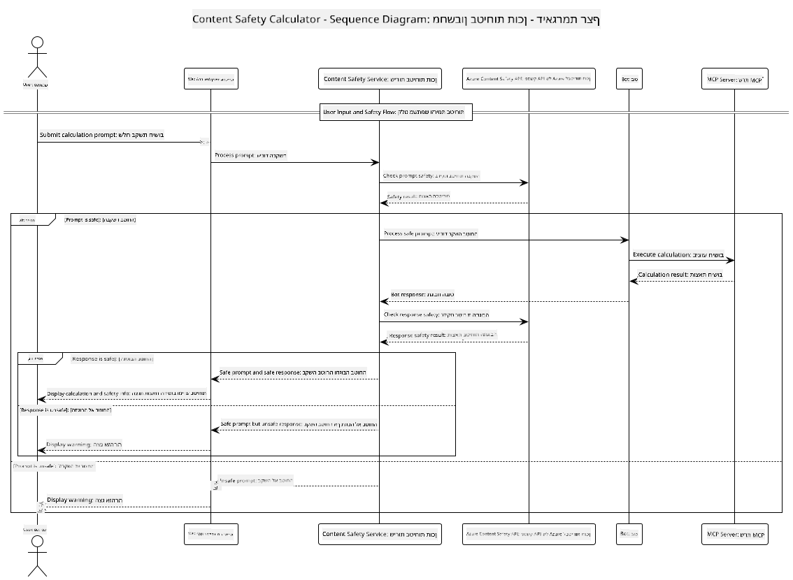

<!--
CO_OP_TRANSLATOR_METADATA:
{
  "original_hash": "e5ea5e7582f70008ea9bec3b3820f20a",
  "translation_date": "2025-07-13T23:18:00+00:00",
  "source_file": "04-PracticalImplementation/samples/java/containerapp/README.md",
  "language_code": "he"
}
-->
## ארכיטקטורת המערכת

הפרויקט הזה מדגים אפליקציית ווב שמשתמשת בבדיקת בטיחות תוכן לפני שליחת בקשות משתמש לשירות מחשבון דרך Model Context Protocol (MCP).



### איך זה עובד

1. **קלט משתמש**: המשתמש מזין בקשת חישוב בממשק הווב  
2. **סינון בטיחות תוכן (קלט)**: הבקשה מנותחת על ידי Azure Content Safety API  
3. **החלטת בטיחות (קלט)**:  
   - אם התוכן בטוח (חומרה < 2 בכל הקטגוריות), הוא ממשיך למחשבון  
   - אם התוכן מסומן כפוטנציאלית מזיק, התהליך נעצר ומוחזרת אזהרה  
4. **אינטגרציה עם מחשבון**: תוכן בטוח מעובד על ידי LangChain4j, שמתקשר עם שרת המחשבון דרך MCP  
5. **סינון בטיחות תוכן (פלט)**: תגובת הבוט מנותחת על ידי Azure Content Safety API  
6. **החלטת בטיחות (פלט)**:  
   - אם תגובת הבוט בטוחה, היא מוצגת למשתמש  
   - אם תגובת הבוט מסומנת כפוטנציאלית מזיקה, היא מוחלפת באזהרה  
7. **תגובה**: התוצאות (אם בטוחות) מוצגות למשתמש יחד עם שתי ניתוחי הבטיחות

## שימוש ב-Model Context Protocol (MCP) עם שירותי מחשבון

הפרויקט מדגים כיצד להשתמש ב-Model Context Protocol (MCP) לקרוא לשירותי מחשבון MCP מתוך LangChain4j. המימוש משתמש בשרת MCP מקומי שרץ על פורט 8080 כדי לספק פעולות חישוב.

### הגדרת שירות Azure Content Safety

לפני השימוש בתכונות בטיחות התוכן, יש ליצור משאב שירות Azure Content Safety:

1. התחבר ל-[Azure Portal](https://portal.azure.com)  
2. לחץ על "Create a resource" וחפש "Content Safety"  
3. בחר ב-"Content Safety" ולחץ על "Create"  
4. הזן שם ייחודי למשאב שלך  
5. בחר במנוי וקבוצת משאבים (או צור חדשה)  
6. בחר אזור נתמך (בדוק [זמינות אזורים](https://azure.microsoft.com/en-us/global-infrastructure/services/?products=cognitive-services) לפרטים)  
7. בחר רמת תמחור מתאימה  
8. לחץ על "Create" לפריסת המשאב  
9. לאחר סיום הפריסה, לחץ על "Go to resource"  
10. בתפריט השמאלי, תחת "Resource Management", בחר "Keys and Endpoint"  
11. העתק אחד מהמפתחות וכתובת ה-URL של נקודת הקצה לשימוש בשלב הבא

### קונפיגורציית משתני סביבה

הגדר את משתנה הסביבה `GITHUB_TOKEN` לאימות דגמי GitHub:  
```sh
export GITHUB_TOKEN=<your_github_token>
```

עבור תכונות בטיחות תוכן, הגדר:  
```sh
export CONTENT_SAFETY_ENDPOINT=<your_content_safety_endpoint>
export CONTENT_SAFETY_KEY=<your_content_safety_key>
```

משתני סביבה אלה משמשים את האפליקציה לאימות מול שירות Azure Content Safety. אם משתנים אלה לא מוגדרים, האפליקציה תשתמש בערכי מיקום לצורך הדגמה, אך תכונות בטיחות התוכן לא יעבדו כראוי.

### הפעלת שרת MCP למחשבון

לפני הרצת הלקוח, יש להפעיל את שרת MCP למחשבון במצב SSE בכתובת localhost:8080.

## תיאור הפרויקט

הפרויקט מדגים את האינטגרציה של Model Context Protocol (MCP) עם LangChain4j לקריאה לשירותי מחשבון. התכונות המרכזיות כוללות:

- שימוש ב-MCP לחיבור לשירות מחשבון לפעולות מתמטיות בסיסיות  
- בדיקת בטיחות תוכן בשכבה כפולה הן על בקשות המשתמש והן על תגובות הבוט  
- אינטגרציה עם מודל gpt-4.1-nano של GitHub דרך LangChain4j  
- שימוש ב-Server-Sent Events (SSE) להובלת MCP

## אינטגרציה של בטיחות תוכן

הפרויקט כולל תכונות בטיחות תוכן מקיפות כדי להבטיח שגם קלטי המשתמש וגם תגובות המערכת נקיים מתוכן מזיק:

1. **סינון קלט**: כל בקשות המשתמש מנותחות לקטגוריות תוכן מזיק כמו דיבור שנאה, אלימות, פגיעה עצמית ותוכן מיני לפני העיבוד.  

2. **סינון פלט**: גם כאשר משתמשים בדגמים שעשויים להיות לא מסוננים, המערכת בודקת את כל התגובות שנוצרו דרך אותם מסנני בטיחות תוכן לפני הצגתן למשתמש.

גישה בשכבה כפולה זו מבטיחה שהמערכת תישאר בטוחה ללא קשר לאיזה מודל AI משמש, ומגנה על המשתמשים הן מפני קלט מזיק והן מפני פלטים בעייתיים שנוצרו על ידי ה-AI.

## לקוח ווב

האפליקציה כוללת ממשק ווב ידידותי למשתמש שמאפשר אינטראקציה עם מערכת מחשבון בטיחות התוכן:

### תכונות ממשק הווב

- טופס פשוט ואינטואיטיבי להזנת בקשות חישוב  
- אימות בטיחות תוכן בשכבה כפולה (קלט ופלט)  
- משוב בזמן אמת על בטיחות הבקשה והתגובה  
- אינדיקטורים צבעוניים לבטיחות להקל על הפירוש  
- עיצוב נקי ורספונסיבי שמתאים למגוון מכשירים  
- דוגמאות לבקשות בטוחות להכוונת המשתמשים

### שימוש בלקוח הווב

1. הפעל את האפליקציה:  
   ```sh
   mvn spring-boot:run
   ```

2. פתח את הדפדפן ונווט ל-`http://localhost:8087`

3. הזן בקשת חישוב באזור הטקסט שסופק (למשל, "חשב את סכום 24.5 ו-17.3")

4. לחץ על "Submit" לעיבוד הבקשה

5. צפה בתוצאות, שיכללו:  
   - ניתוח בטיחות תוכן של הבקשה שלך  
   - התוצאה המחושבת (אם הבקשה הייתה בטוחה)  
   - ניתוח בטיחות תוכן של תגובת הבוט  
   - כל אזהרות בטיחות אם הקלט או הפלט סומנו

הלקוח הווב מטפל אוטומטית בשני תהליכי אימות בטיחות התוכן, ומבטיח שכל האינטראקציות בטוחות ומתאימות ללא קשר לאיזה מודל AI משמש.

**כתב ויתור**:  
מסמך זה תורגם באמצעות שירות תרגום מבוסס בינה מלאכותית [Co-op Translator](https://github.com/Azure/co-op-translator). למרות שאנו שואפים לדיוק, יש לקחת בחשבון כי תרגומים אוטומטיים עלולים להכיל שגיאות או אי-דיוקים. המסמך המקורי בשפת המקור שלו נחשב למקור הסמכותי. למידע קריטי מומלץ להשתמש בתרגום מקצועי על ידי מתרגם אנושי. אנו לא נושאים באחריות לכל אי-הבנה או פרשנות שגויה הנובעת משימוש בתרגום זה.