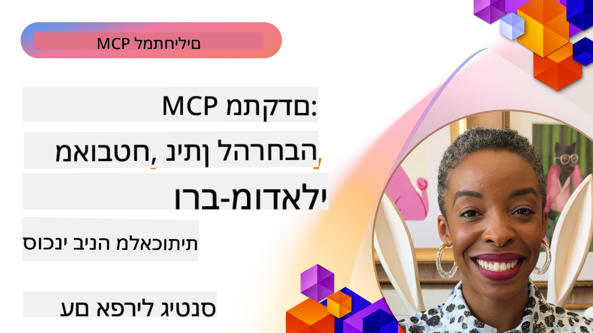

<!--
CO_OP_TRANSLATOR_METADATA:
{
  "original_hash": "d204bc94ea6027d06a703b21b711ca57",
  "translation_date": "2025-08-18T16:48:22+00:00",
  "source_file": "05-AdvancedTopics/README.md",
  "language_code": "he"
}
-->
# נושאים מתקדמים ב-MCP

_(לחצו על התמונה למעלה לצפייה בסרטון של השיעור)_

פרק זה מכסה סדרת נושאים מתקדמים ביישום פרוטוקול הקשר מודל (MCP), כולל אינטגרציה רב-מודאלית, יכולת הרחבה, שיטות אבטחה מומלצות ואינטגרציה ארגונית. נושאים אלו חיוניים לבניית יישומי MCP חזקים ומוכנים לייצור שיכולים לעמוד בדרישות של מערכות AI מודרניות.

## סקירה כללית

שיעור זה מתמקד ברעיונות מתקדמים ביישום פרוטוקול הקשר מודל, עם דגש על אינטגרציה רב-מודאלית, יכולת הרחבה, שיטות אבטחה מומלצות ואינטגרציה ארגונית. נושאים אלו חיוניים לבניית יישומי MCP ברמת ייצור שיכולים להתמודד עם דרישות מורכבות בסביבות ארגוניות.

## מטרות למידה

בסיום השיעור, תוכלו:

- ליישם יכולות רב-מודאליות במסגרת MCP
- לעצב ארכיטקטורות MCP ניתנות להרחבה לתרחישים בעלי דרישה גבוהה
- ליישם שיטות אבטחה מומלצות בהתאם לעקרונות האבטחה של MCP
- לשלב MCP עם מערכות AI ארגוניות ומסגרות עבודה
- לייעל ביצועים ואמינות בסביבות ייצור

## שיעורים ופרויקטים לדוגמה

| קישור | כותרת | תיאור |
|-------|--------|--------|
| [5.1 אינטגרציה עם Azure](./mcp-integration/README.md) | אינטגרציה עם Azure | למדו כיצד לשלב את שרת MCP שלכם ב-Azure |
| [5.2 דוגמה רב-מודאלית](./mcp-multi-modality/README.md) | דוגמאות רב-מודאליות ב-MCP | דוגמאות לתגובות קול, תמונה ורב-מודאליות |
| [5.3 דוגמת OAuth2 ב-MCP](../../../05-AdvancedTopics/mcp-oauth2-demo) | דוגמת OAuth2 ב-MCP | אפליקציית Spring Boot מינימלית המדגימה OAuth2 עם MCP, הן כשרת הרשאות והן כשרת משאבים. מציגה הנפקת טוקנים מאובטחת, נקודות קצה מוגנות, פריסה ב-Azure Container Apps ואינטגרציה עם API Management. |
| [5.4 הקשרים ראשיים](./mcp-root-contexts/README.md) | הקשרים ראשיים | למדו עוד על הקשרים ראשיים וכיצד ליישם אותם |
| [5.5 ניתוב](./mcp-routing/README.md) | ניתוב | למדו סוגים שונים של ניתוב |
| [5.6 דגימה](./mcp-sampling/README.md) | דגימה | למדו כיצד לעבוד עם דגימה |
| [5.7 יכולת הרחבה](./mcp-scaling/README.md) | יכולת הרחבה | למדו על יכולת הרחבה |
| [5.8 אבטחה](./mcp-security/README.md) | אבטחה | אבטחו את שרת MCP שלכם |
| [5.9 דוגמת חיפוש באינטרנט](./web-search-mcp/README.md) | חיפוש באינטרנט ב-MCP | שרת ולקוח MCP ב-Python שמשתלבים עם SerpAPI לחיפוש בזמן אמת באינטרנט, חדשות, מוצרים ושאלות ותשובות. מדגים תזמור רב-כלים, אינטגרציה עם API חיצוני וטיפול שגיאות חזק. |
| [5.10 סטרימינג בזמן אמת](./mcp-realtimestreaming/README.md) | סטרימינג | סטרימינג בזמן אמת הפך להיות חיוני בעולם מונע נתונים של היום, שבו עסקים ואפליקציות זקוקים לגישה מיידית למידע כדי לקבל החלטות בזמן. |
| [5.11 חיפוש באינטרנט בזמן אמת](./mcp-realtimesearch/README.md) | חיפוש באינטרנט | כיצד MCP משנה את החיפוש באינטרנט בזמן אמת על ידי מתן גישה סטנדרטית לניהול הקשר בין מודלים של AI, מנועי חיפוש ואפליקציות. |
| [5.12 אימות Entra ID עבור שרתי פרוטוקול הקשר מודל](./mcp-security-entra/README.md) | אימות Entra ID | Microsoft Entra ID מספק פתרון חזק לניהול זהויות וגישה מבוסס ענן, המסייע להבטיח שרק משתמשים ואפליקציות מורשים יוכלו לתקשר עם שרת MCP שלכם. |
| [5.13 אינטגרציה עם סוכן Azure AI Foundry](./mcp-foundry-agent-integration/README.md) | אינטגרציה עם Azure AI Foundry | למדו כיצד לשלב שרתי פרוטוקול הקשר מודל עם סוכני Azure AI Foundry, המאפשרים תזמור כלים חזק ויכולות AI ארגוניות עם חיבורים סטנדרטיים למקורות נתונים חיצוניים. |
| [5.14 הנדסת הקשר](./mcp-contextengineering/README.md) | הנדסת הקשר | הזדמנויות עתידיות של טכניקות הנדסת הקשר עבור שרתי MCP, כולל אופטימיזציה של הקשר, ניהול הקשר דינמי ואסטרטגיות להנדסת פקודות יעילה במסגרת MCP. |

## מקורות נוספים

למידע העדכני ביותר על נושאים מתקדמים ב-MCP, עיינו ב:
- [תיעוד MCP](https://modelcontextprotocol.io/)
- [מפרט MCP](https://spec.modelcontextprotocol.io/)
- [מאגר GitHub](https://github.com/modelcontextprotocol)

## נקודות מפתח

- יישומי MCP רב-מודאליים מרחיבים את יכולות ה-AI מעבר לעיבוד טקסט
- יכולת הרחבה חיונית לפריסות ארגוניות וניתן לטפל בה באמצעות הרחבה אופקית ואנכית
- אמצעי אבטחה מקיפים מגנים על נתונים ומבטיחים בקרת גישה נכונה
- אינטגרציה ארגונית עם פלטפורמות כמו Azure OpenAI ו-Microsoft AI Foundry משפרת את יכולות MCP
- יישומי MCP מתקדמים נהנים מארכיטקטורות אופטימליות וניהול משאבים מוקפד

## תרגיל

עצבו יישום MCP ברמת ארגון עבור מקרה שימוש ספציפי:

1. זיהוי דרישות רב-מודאליות עבור מקרה השימוש שלכם
2. תכנון בקרות אבטחה להגנה על נתונים רגישים
3. עיצוב ארכיטקטורה ניתנת להרחבה שיכולה להתמודד עם עומסים משתנים
4. תכנון נקודות אינטגרציה עם מערכות AI ארגוניות
5. תיעוד צווארי בקבוק אפשריים בביצועים ואסטרטגיות למניעתם

## משאבים נוספים

- [תיעוד Azure OpenAI](https://learn.microsoft.com/en-us/azure/ai-services/openai/)
- [תיעוד Microsoft AI Foundry](https://learn.microsoft.com/en-us/ai-services/)

---

## מה הלאה

- [5.1 אינטגרציה עם MCP](./mcp-integration/README.md)

**כתב ויתור**:  
מסמך זה תורגם באמצעות שירות תרגום מבוסס בינה מלאכותית [Co-op Translator](https://github.com/Azure/co-op-translator). למרות שאנו שואפים לדיוק, יש לקחת בחשבון שתרגומים אוטומטיים עשויים להכיל שגיאות או אי דיוקים. המסמך המקורי בשפתו המקורית צריך להיחשב כמקור סמכותי. עבור מידע קריטי, מומלץ להשתמש בתרגום מקצועי על ידי אדם. איננו נושאים באחריות לאי הבנות או לפרשנויות שגויות הנובעות משימוש בתרגום זה.