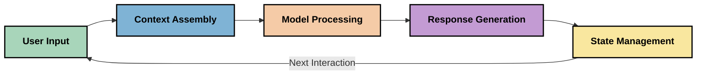
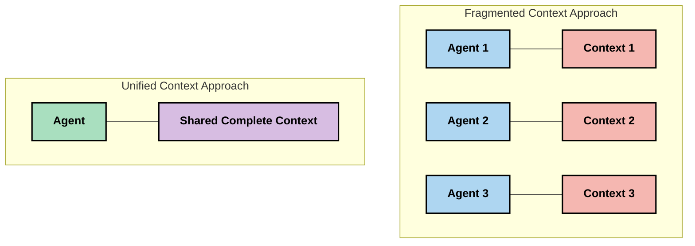
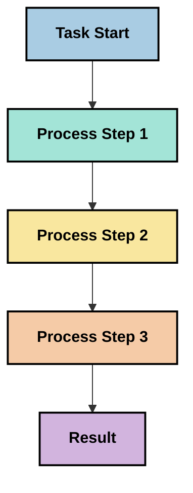
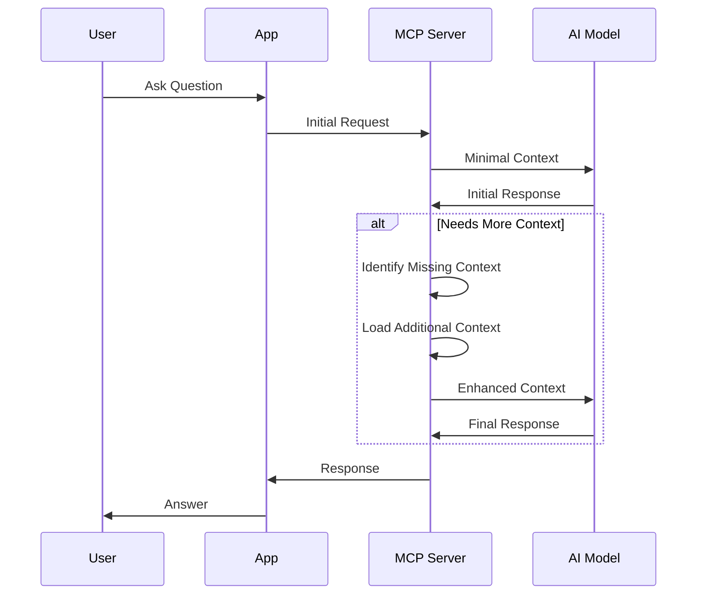
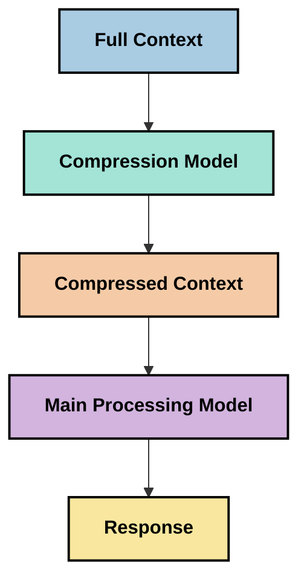

<!--
CO_OP_TRANSLATOR_METADATA:
{
  "original_hash": "fd169ca3071b81b5ee282e194bc823df",
  "translation_date": "2025-09-15T20:44:35+00:00",
  "source_file": "05-AdvancedTopics/mcp-contextengineering/README.md",
  "language_code": "he"
}
-->
# הנדסת הקשר: מושג מתפתח באקוסיסטם של MCP

## סקירה כללית

הנדסת הקשר היא מושג מתפתח בתחום הבינה המלאכותית, החוקר כיצד מידע מובנה, מועבר ומתוחזק במהלך אינטראקציות בין לקוחות לשירותי AI. ככל שאקוסיסטם פרוטוקול הקשר של מודלים (MCP) מתפתח, הבנת ניהול הקשר בצורה יעילה הופכת לחשובה יותר ויותר. מודול זה מציג את מושג הנדסת הקשר ובוחן את יישומיו הפוטנציאליים ביישומי MCP.

## מטרות למידה

בסיום מודול זה, תוכלו:

- להבין את מושג הנדסת הקשר המתפתח ואת תפקידו הפוטנציאלי ביישומי MCP
- לזהות את האתגרים המרכזיים בניהול הקשר שהעיצוב של פרוטוקול MCP מתמודד איתם
- לחקור טכניקות לשיפור ביצועי מודלים באמצעות ניהול קשר טוב יותר
- לשקול גישות למדידת והערכת יעילות הקשר
- ליישם את המושגים המתפתחים הללו לשיפור חוויות AI באמצעות מסגרת MCP

## מבוא להנדסת הקשר

הנדסת הקשר היא מושג מתפתח המתמקד בעיצוב מכוון ובניהול זרימת מידע בין משתמשים, יישומים ומודלים של AI. בניגוד לתחומים מבוססים כמו הנדסת הנחיות, הנדסת הקשר עדיין מוגדרת על ידי אנשי מקצוע העובדים לפתור את האתגרים הייחודיים של אספקת המידע הנכון למודלים של AI בזמן הנכון.

ככל שמודלים גדולים של שפה (LLMs) התפתחו, חשיבות הקשר הפכה לברורה יותר. האיכות, הרלוונטיות והמבנה של הקשר שאנו מספקים משפיעים ישירות על תוצאות המודלים. הנדסת הקשר חוקרת את הקשר הזה ושואפת לפתח עקרונות לניהול קשר יעיל.

> "בשנת 2025, המודלים הקיימים הם חכמים מאוד. אבל אפילו האדם החכם ביותר לא יוכל לבצע את עבודתו בצורה יעילה ללא הקשר של מה שמבקשים ממנו לעשות... 'הנדסת הקשר' היא הרמה הבאה של הנדסת הנחיות. מדובר בביצוע זה באופן אוטומטי במערכת דינמית." — וולדן יאן, Cognition AI

הנדסת הקשר עשויה לכלול:

1. **בחירת קשר**: קביעת איזה מידע רלוונטי למשימה נתונה
2. **מבנה קשר**: ארגון מידע למקסום הבנת המודל
3. **אספקת קשר**: אופטימיזציה של איך ומתי מידע נשלח למודלים
4. **תחזוקת קשר**: ניהול מצב והתפתחות הקשר לאורך זמן
5. **הערכת קשר**: מדידה ושיפור יעילות הקשר

תחומי המיקוד הללו רלוונטיים במיוחד לאקוסיסטם MCP, המספק דרך סטנדרטית ליישומים לספק קשר ל-LLMs.

## פרספקטיבת מסע הקשר

דרך אחת לדמיין הנדסת קשר היא לעקוב אחר המסע שהמידע עובר דרך מערכת MCP:



### שלבים מרכזיים במסע הקשר:

1. **קלט משתמש**: מידע גולמי מהמשתמש (טקסט, תמונות, מסמכים)
2. **הרכבת קשר**: שילוב קלט משתמש עם הקשר מערכת, היסטוריית שיחה ומידע נוסף שנשלף
3. **עיבוד מודל**: מודל ה-AI מעבד את הקשר שהורכב
4. **יצירת תגובה**: המודל מייצר תוצאות בהתבסס על הקשר שסופק
5. **ניהול מצב**: המערכת מעדכנת את מצבה הפנימי בהתבסס על האינטראקציה

פרספקטיבה זו מדגישה את הטבע הדינמי של הקשר במערכות AI ומעלה שאלות חשובות לגבי איך לנהל מידע בצורה הטובה ביותר בכל שלב.

## עקרונות מתפתחים בהנדסת הקשר

ככל שהתחום של הנדסת הקשר מתעצב, כמה עקרונות מוקדמים מתחילים להתגבש על ידי אנשי מקצוע. עקרונות אלו עשויים לעזור להנחות בחירות ביישומי MCP:

### עיקרון 1: שיתוף קשר באופן מלא

יש לשתף את הקשר באופן מלא בין כל רכיבי המערכת ולא לפזר אותו בין סוכנים או תהליכים שונים. כאשר הקשר מפוזר, החלטות שנעשות בחלק אחד של המערכת עשויות להתנגש עם אלו שנעשות במקום אחר.



ביישומי MCP, הדבר מציע עיצוב מערכות שבהן הקשר זורם בצורה חלקה לאורך כל הצינור ולא מחולק למקטעים.

### עיקרון 2: הכרה בכך שפעולות נושאות החלטות משתמעות

כל פעולה שמודל מבצע כוללת החלטות משתמעות לגבי איך לפרש את הקשר. כאשר רכיבים שונים פועלים על הקשרים שונים, החלטות משתמעות אלו עשויות להתנגש, מה שמוביל לתוצאות לא עקביות.

עיקרון זה בעל השלכות חשובות ליישומי MCP:
- העדפת עיבוד ליניארי של משימות מורכבות על פני ביצוע מקבילי עם קשר מפוזר
- הבטחת שכל נקודות ההחלטה נגישות לאותו מידע הקשרי
- עיצוב מערכות שבהן שלבים מאוחרים יכולים לראות את הקשר המלא של החלטות מוקדמות

### עיקרון 3: איזון עומק הקשר עם מגבלות חלון

ככל ששיחות ותהליכים מתארכים, חלונות הקשר בסופו של דבר מתמלאים. הנדסת קשר יעילה חוקרת גישות לניהול מתח זה בין קשר מקיף למגבלות טכניות.

גישות פוטנציאליות שנחקרות כוללות:
- דחיסת קשר השומרת על מידע חיוני תוך הפחתת שימוש בטוקנים
- טעינה מתקדמת של קשר בהתבסס על רלוונטיות לצרכים הנוכחיים
- סיכום אינטראקציות קודמות תוך שמירה על החלטות ועובדות מרכזיות

## אתגרי קשר ועיצוב פרוטוקול MCP

פרוטוקול הקשר של מודלים (MCP) עוצב מתוך מודעות לאתגרים הייחודיים של ניהול קשר. הבנת אתגרים אלו מסייעת להסביר היבטים מרכזיים בעיצוב פרוטוקול MCP:

### אתגר 1: מגבלות חלון קשר
לרוב המודלים של AI יש גדלי חלון קשר קבועים, המגבילים כמה מידע הם יכולים לעבד בבת אחת.

**תגובה בעיצוב MCP:** 
- הפרוטוקול תומך בקשר מובנה מבוסס משאבים שניתן להתייחס אליו בצורה יעילה
- משאבים יכולים להיות מחולקים לעמודים ונטענים באופן מתקדם

### אתגר 2: קביעת רלוונטיות
קשה לקבוע איזה מידע הכי רלוונטי לכלול בקשר.

**תגובה בעיצוב MCP:**
- כלים גמישים מאפשרים שליפה דינמית של מידע לפי צורך
- הנחיות מובנות מאפשרות ארגון קשר עקבי

### אתגר 3: התמדה של קשר
ניהול מצב לאורך אינטראקציות דורש מעקב קפדני אחר הקשר.

**תגובה בעיצוב MCP:**
- ניהול סשן סטנדרטי
- דפוסי אינטראקציה מוגדרים בבירור להתפתחות קשר

### אתגר 4: קשר רב-מודאלי
סוגי נתונים שונים (טקסט, תמונות, נתונים מובנים) דורשים טיפול שונה.

**תגובה בעיצוב MCP:**
- עיצוב הפרוטוקול מתאים לסוגי תוכן שונים
- ייצוג סטנדרטי של מידע רב-מודאלי

### אתגר 5: אבטחה ופרטיות
קשר לעיתים קרובות מכיל מידע רגיש שיש להגן עליו.

**תגובה בעיצוב MCP:**
- גבולות ברורים בין אחריות לקוח לשרת
- אפשרויות עיבוד מקומי למזעור חשיפת נתונים

הבנת אתגרים אלו ואיך MCP מתמודד איתם מספקת בסיס לחקר טכניקות הנדסת קשר מתקדמות יותר.

## גישות מתפתחות בהנדסת קשר

ככל שהתחום של הנדסת קשר מתפתח, כמה גישות מבטיחות מתחילות להתגבש. אלו מייצגות חשיבה עכשווית ולא פרקטיקות מבוססות, וסביר להניח שיתפתחו ככל שנצבור יותר ניסיון עם יישומי MCP.

### 1. עיבוד ליניארי חד-שירתי

בניגוד לארכיטקטורות מרובות סוכנים שמפזרות קשר, חלק מהעוסקים בתחום מוצאים שעיבוד ליניארי חד-שירתי מייצר תוצאות עקביות יותר. הדבר מתיישר עם העיקרון של שמירה על קשר מאוחד.



למרות שגישה זו עשויה להיראות פחות יעילה מעיבוד מקבילי, היא לעיתים קרובות מייצרת תוצאות קוהרנטיות ואמינות יותר מכיוון שכל שלב נבנה על הבנה מלאה של החלטות קודמות.

### 2. חלוקת קשר ותעדוף

פיצול קשרים גדולים לחלקים ניתנים לניהול ותעדוף מה שהכי חשוב.

```python
# Conceptual Example: Context Chunking and Prioritization
def process_with_chunked_context(documents, query):
    # 1. Break documents into smaller chunks
    chunks = chunk_documents(documents)
    
    # 2. Calculate relevance scores for each chunk
    scored_chunks = [(chunk, calculate_relevance(chunk, query)) for chunk in chunks]
    
    # 3. Sort chunks by relevance score
    sorted_chunks = sorted(scored_chunks, key=lambda x: x[1], reverse=True)
    
    # 4. Use the most relevant chunks as context
    context = create_context_from_chunks([chunk for chunk, score in sorted_chunks[:5]])
    
    # 5. Process with the prioritized context
    return generate_response(context, query)
```

הרעיון לעיל ממחיש כיצד ניתן לפצל מסמכים גדולים לחלקים ניתנים לניהול ולבחור רק את החלקים הרלוונטיים ביותר לקשר. גישה זו יכולה לעזור לעבוד בתוך מגבלות חלון קשר תוך ניצול בסיסי ידע גדולים.

### 3. טעינה מתקדמת של קשר

טעינת קשר באופן מתקדם לפי צורך ולא בבת אחת.



טעינה מתקדמת של קשר מתחילה עם קשר מינימלי ומתרחבת רק כשצריך. הדבר יכול להפחית משמעותית את השימוש בטוקנים עבור שאילתות פשוטות תוך שמירה על היכולת להתמודד עם שאלות מורכבות.

### 4. דחיסת קשר וסיכום

הפחתת גודל הקשר תוך שמירה על מידע חיוני.



דחיסת קשר מתמקדת ב:
- הסרת מידע מיותר
- סיכום תוכן ארוך
- חילוץ עובדות ופרטים מרכזיים
- שמירה על אלמנטים קריטיים של קשר
- אופטימיזציה ליעילות טוקנים

גישה זו יכולה להיות בעלת ערך במיוחד לשמירה על שיחות ארוכות בתוך חלונות קשר או לעיבוד מסמכים גדולים בצורה יעילה. חלק מהעוסקים בתחום משתמשים במודלים מיוחדים במיוחד לדחיסת קשר וסיכום היסטוריית שיחה.

## שיקולים לחקר הנדסת קשר

ככל שאנו חוקרים את התחום המתפתח של הנדסת קשר, כמה שיקולים ראויים לתשומת לב בעת עבודה עם יישומי MCP. אלו אינם פרקטיקות מומלצות מחייבות אלא תחומי חקר שעשויים להניב שיפורים במקרה השימוש הספציפי שלכם.

### שקלו את מטרות הקשר שלכם

לפני יישום פתרונות ניהול קשר מורכבים, הגדירו בבירור מה אתם מנסים להשיג:
- איזה מידע ספציפי המודל צריך כדי להצליח?
- איזה מידע חיוני לעומת משלים?
- מהם מגבלות הביצועים שלכם (זמן תגובה, מגבלות טוקנים, עלויות)?

### חקרו גישות קשר שכבתיות

חלק מהעוסקים בתחום מוצאים הצלחה עם קשר שמסודר בשכבות רעיוניות:
- **שכבת ליבה**: מידע חיוני שהמודל תמיד צריך
- **שכבה מצבית**: קשר ספציפי לאינטראקציה הנוכחית
- **שכבה תומכת**: מידע נוסף שעשוי להיות מועיל
- **שכבת גיבוי**: מידע שנגיש רק כשצריך

### חקרו אסטרטגיות שליפה

יעילות הקשר שלכם לעיתים קרובות תלויה באיך אתם שולפים מידע:
- חיפוש סמנטי ואמבדינגים למציאת מידע רלוונטי רעיונית
- חיפוש מבוסס מילות מפתח לפרטים עובדתיים ספציפיים
- גישות היברידיות שמשלבות שיטות שליפה שונות
- סינון מטא-נתונים לצמצום טווח בהתבסס על קטגוריות, תאריכים או מקורות

### נסו לשמור על קוהרנטיות קשר

מבנה וזרימת הקשר שלכם עשויים להשפיע על הבנת המודל:
- קיבוץ מידע קשור יחד
- שימוש בפורמט וארגון עקביים
- שמירה על סדר לוגי או כרונולוגי כשמתאים
- הימנעות ממידע סותר

### שקלו את היתרונות והחסרונות של ארכיטקטורות מרובות סוכנים

למרות שארכיטקטורות מרובות סוכנים פופולריות בהרבה מסגרות AI, הן מגיעות עם אתגרים משמעותיים לניהול קשר:
- פיצול קשר יכול להוביל להחלטות לא עקביות בין סוכנים
- עיבוד מקבילי עשוי להכניס קונפליקטים שקשה ליישב
- תקשורת בין סוכנים יכולה להכביד על ביצועים
- ניהול מצב מורכב נדרש לשמירה על קוהרנטיות

במקרים רבים, גישה של סוכן יחיד עם ניהול קשר מקיף עשויה לייצר תוצאות אמינות יותר מאשר סוכנים מרובים עם קשר מפוזר.

### פתחו שיטות הערכה

כדי לשפר את הנדסת הקשר לאורך זמן, שקלו איך תמדדו הצלחה:
- בדיקות A/B של מבני קשר שונים
- מעקב אחר שימוש בטוקנים וזמני תגובה
- מעקב אחר שביעות רצון משתמשים ושיעורי השלמת משימות
- ניתוח מתי ולמה אסטרטגיות קשר נכשלות

שיקולים אלו מייצגים תחומי חקר פעילים בתחום הנדסת הקשר. ככל שהתחום מתבגר, סביר להניח שיתגבשו דפוסים ופרקטיקות ברורים יותר.

## מדידת יעילות קשר: מסגרת מתפתחת

ככל שהנדסת הקשר מתפתחת כמושג, אנשי מקצוע מתחילים לחקור איך ניתן למדוד את יעילותה. עדיין אין מסגרת מבוססת, אך נשקלים מדדים שונים שעשויים לעזור להנחות עבודה עתידית.

### ממדי מדידה פוטנציאליים

#### 1. שיקולי יעילות קלט

- **יחס קשר-תגובה**: כמה קשר נדרש ביחס לגודל התגובה?
- **שימוש בטוקנים**: איזה אחוז מטוקני הקשר שסופקו משפיע על התגובה?
- **הפחתת קשר**: עד כמה ניתן לדחוס מידע גולמי בצורה יעילה?

#### 2. שיקולי ביצועים

- **השפעת זמן תגובה**: איך ניהול קשר משפיע על זמן התגובה?
- **כלכלת טוקנים**: האם אנו ממטבים את השימוש בטוקנים בצורה יעילה?
- **דיוק שליפה**: עד כמה המידע שנשלף רלוונטי?
- **שימוש במשאבים**: אילו משאבים חישוביים נדרשים?

#### 3. שיקולי איכות

- **רלוונטיות תגובה**: עד כמה התגובה מתייחסת לשאילתה?
- **דיוק עובדתי**: האם ניהול קשר משפר את נכונות העובדות?
- **עקביות**: האם התגובות עקביות בשאילתות דומות?
- **שיעור הזיות**: האם קשר טוב יותר מפחית הזיות של המודל?

#### 4. שיקולי חוויית משתמש

- **שיעור מעקב**: כמה פעמים משתמשים צריכים הבהרות?
- **השלמת משימות**: האם משתמשים מצליחים להשיג את מטרותיהם?
- **מדדי שביעות רצון**: איך משתמשים מדרגים את חווייתם?

### גישות חקר למדידה

בעת ניסוי בהנדסת קשר ביישומי MCP, שקלו את הגישות החקריות הבאות:

1. **השוואות בסיסיות**: קבעו בסיס עם גישות קשר פשוטות לפני בדיקת שיטות מתוחכמות יותר

2. **שינויים הדרגתיים**: שנו היבט אחד של ניהול קשר בכל פעם כדי לבודד את השפעותיו

3. **הערכה ממוקדת משתמש**: שלבו מדדים כמותיים עם משוב איכותני ממשתמשים

4. **ניתוח כשלונות**: בדקו מקרים שבהם אסטרטגיות קשר נכשלות כדי להבין שיפורים פוטנציאליים

5. **הערכה רב-ממדית**: שקלו את הפשרות בין יעילות, איכות וחוויית משתמש

גישה ניסיונית ורב-ממדית זו למדידה מתיישרת עם הטבע המתפתח של הנדסת קשר.

## מחשבות מסכמות

הנדסת קשר היא תחום חקר מתפתח שעשוי להיות מרכזי ליישומי MCP יעילים. על ידי התחשבות מכוונת באיך מידע זורם דרך המערכת שלכם, תוכלו ליצור חוויות AI יעילות, מדויקות ובעלות ערך רב יותר למשתמשים.

הטכניקות והגישות המתוארות במודול זה מייצגות חשיבה מוקדמת בתחום זה, לא פרקטיקות מבוססות. הנדסת קשר עשויה להתפתח לדיסציפלינה מוגדרת יותר ככל שיכולות AI מתפתחות והבנתנו מעמיקה. לעת עתה, ניסוי בשילוב עם מדידה קפדנית נראה כגישה הפורייה ביותר.

## כיוונים עתיד
- [אתר פרוטוקול הקשר מודל](https://modelcontextprotocol.io/)
- [מפרט פרוטוקול הקשר מודל](https://github.com/modelcontextprotocol/modelcontextprotocol)
- [תיעוד MCP](https://modelcontextprotocol.io/docs)
- [MCP C# SDK](https://github.com/modelcontextprotocol/csharp-sdk)
- [MCP Python SDK](https://github.com/modelcontextprotocol/python-sdk)
- [MCP TypeScript SDK](https://github.com/modelcontextprotocol/typescript-sdk)
- [MCP Inspector](https://github.com/modelcontextprotocol/inspector) - כלי בדיקה חזותי לשרתים של MCP

### מאמרים על הנדסת הקשר
- [אל תבנו סוכנים מרובים: עקרונות הנדסת הקשר](https://cognition.ai/blog/dont-build-multi-agents) - תובנות של וולדן יאן על עקרונות הנדסת הקשר
- [מדריך מעשי לבניית סוכנים](https://cdn.openai.com/business-guides-and-resources/a-practical-guide-to-building-agents.pdf) - מדריך של OpenAI לעיצוב סוכנים יעיל
- [בניית סוכנים אפקטיביים](https://www.anthropic.com/engineering/building-effective-agents) - הגישה של Anthropic לפיתוח סוכנים

### מחקרים קשורים
- [הרחבת אחזור דינמית עבור מודלים גדולים של שפה](https://arxiv.org/abs/2310.01487) - מחקר על גישות אחזור דינמיות
- [אבודים באמצע: כיצד מודלים של שפה משתמשים בהקשרים ארוכים](https://arxiv.org/abs/2307.03172) - מחקר חשוב על דפוסי עיבוד הקשר
- [יצירת תמונות מותנות טקסט היררכיות עם CLIP Latents](https://arxiv.org/abs/2204.06125) - מאמר על DALL-E 2 עם תובנות על מבנה הקשר
- [חקר תפקיד ההקשר בארכיטקטורות של מודלים גדולים של שפה](https://aclanthology.org/2023.findings-emnlp.124/) - מחקר עדכני על טיפול בהקשר
- [שיתוף פעולה בין סוכנים מרובים: סקירה](https://arxiv.org/abs/2304.03442) - מחקר על מערכות סוכנים מרובים והאתגרים שלהן

### משאבים נוספים
- [טכניקות אופטימיזציה לחלון הקשר](https://learn.microsoft.com/en-us/azure/ai-services/openai/concepts/context-window)
- [טכניקות RAG מתקדמות](https://www.microsoft.com/en-us/research/blog/retrieval-augmented-generation-rag-and-frontier-models/)
- [תיעוד Semantic Kernel](https://github.com/microsoft/semantic-kernel)
- [ערכת כלים לניהול הקשר AI](https://github.com/microsoft/aitoolkit)

## מה הלאה

- [5.15 MCP Custom Transport](../mcp-transport/README.md)

---

**כתב ויתור**:  
מסמך זה תורגם באמצעות שירות תרגום מבוסס בינה מלאכותית [Co-op Translator](https://github.com/Azure/co-op-translator). למרות שאנו שואפים לדיוק, יש לקחת בחשבון שתרגומים אוטומטיים עשויים להכיל שגיאות או אי דיוקים. המסמך המקורי בשפתו המקורית צריך להיחשב כמקור סמכותי. עבור מידע קריטי, מומלץ להשתמש בתרגום מקצועי על ידי אדם. איננו נושאים באחריות לאי הבנות או לפרשנויות שגויות הנובעות משימוש בתרגום זה.