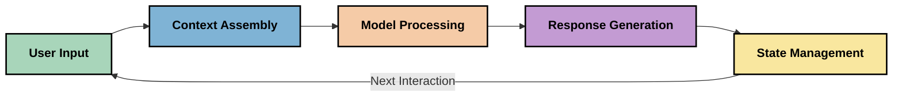
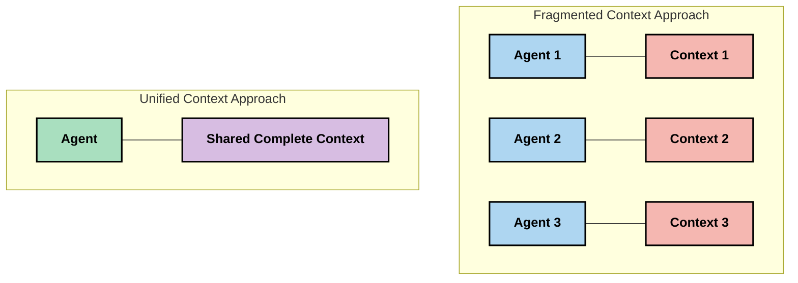
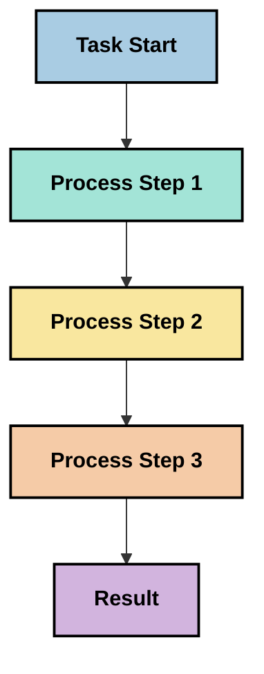
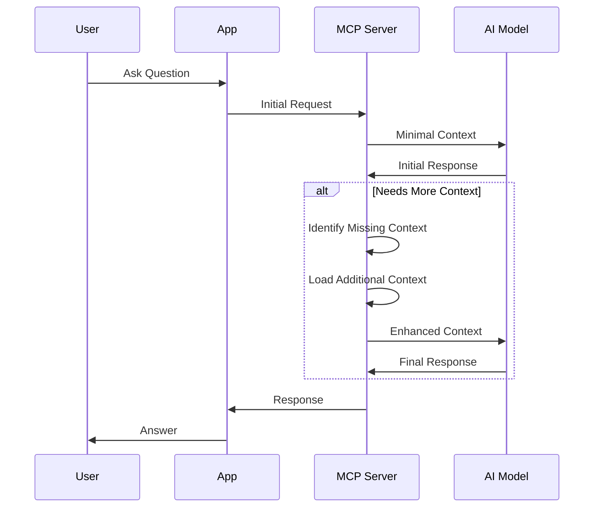
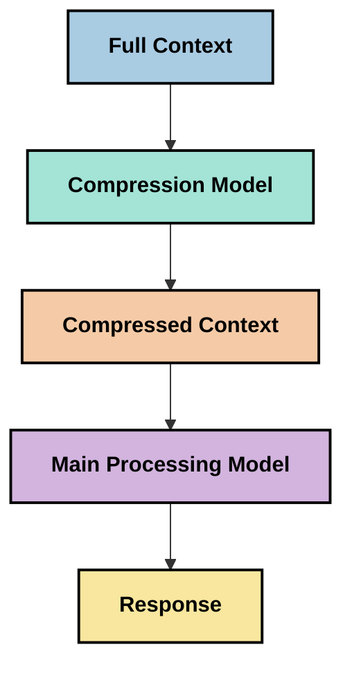

<!--
CO_OP_TRANSLATOR_METADATA:
{
  "original_hash": "5762e8e74dd99d8b7dbb31e69a82561e",
  "translation_date": "2025-07-17T08:38:41+00:00",
  "source_file": "05-AdvancedTopics/mcp-contextengineering/README.md",
  "language_code": "he"
}
-->
# הנדסת הקשר: מושג מתפתח במערכת האקולוגית של MCP

## סקירה כללית

הנדסת הקשר היא מושג מתפתח בתחום הבינה המלאכותית, החוקר כיצד מידע מאורגן, מועבר ומנוהל לאורך האינטראקציות בין לקוחות לשירותי AI. ככל שמערכת האקולוגית של Model Context Protocol (MCP) מתפתחת, ההבנה כיצד לנהל את ההקשר בצורה יעילה הופכת לחשובה יותר ויותר. מודול זה מציג את מושג הנדסת הקשר ובוחן את היישומים האפשריים שלו במימושי MCP.

## מטרות הלמידה

בסיום מודול זה, תוכל:

- להבין את מושג הנדסת הקשר המתפתח ואת תפקידו הפוטנציאלי ביישומי MCP
- לזהות את האתגרים המרכזיים בניהול הקשר שהפרוטוקול MCP מתמודד איתם
- לחקור טכניקות לשיפור ביצועי המודל באמצעות טיפול טוב יותר בהקשר
- לשקול גישות למדידה והערכה של יעילות ההקשר
- ליישם את המושגים המתפתחים הללו לשיפור חוויות AI במסגרת MCP

## מבוא להנדסת הקשר

הנדסת הקשר היא מושג מתפתח המתמקד בתכנון וניהול מכוון של זרימת מידע בין משתמשים, יישומים ומודלים של AI. בניגוד לתחומים מבוססים כמו הנדסת פרומפטים, הנדסת הקשר עדיין מוגדרת על ידי המתרגלים תוך כדי פתרון האתגרים הייחודיים של מתן המידע הנכון למודלים בזמן הנכון.

עם התפתחות מודלים לשוניים גדולים (LLMs), חשיבות ההקשר הפכה ברורה יותר ויותר. איכות, רלוונטיות ומבנה ההקשר שאנו מספקים משפיעים ישירות על תוצאות המודל. הנדסת הקשר חוקרת את הקשר הזה ושואפת לפתח עקרונות לניהול הקשר יעיל.

> "בשנת 2025, המודלים שם חכמים מאוד. אבל אפילו האדם החכם ביותר לא יוכל לבצע את עבודתו ביעילות ללא ההקשר של מה שמבקשים ממנו... 'הנדסת הקשר' היא השלב הבא בהנדסת פרומפטים. זה על ביצוע אוטומטי במערכת דינמית." — Walden Yan, Cognition AI

הנדסת הקשר עשויה לכלול:

1. **בחירת הקשר**: קביעת המידע הרלוונטי למשימה מסוימת  
2. **מבנה הקשר**: ארגון המידע למקסום הבנת המודל  
3. **העברת הקשר**: אופטימיזציה של אופן וזמן שליחת המידע למודלים  
4. **תחזוקת הקשר**: ניהול מצב והתפתחות ההקשר לאורך זמן  
5. **הערכת הקשר**: מדידה ושיפור יעילות ההקשר  

תחומים אלה רלוונטיים במיוחד למערכת האקולוגית של MCP, המספקת דרך סטנדרטית ליישומים להעביר הקשר ל-LLMs.

## נקודת מבט על מסע ההקשר

דרך אחת להמחיש הנדסת הקשר היא לעקוב אחר המסע שהמידע עובר במערכת MCP:



### שלבים מרכזיים במסע ההקשר:

1. **קלט משתמש**: מידע גולמי מהמשתמש (טקסט, תמונות, מסמכים)  
2. **הרכבת הקשר**: שילוב קלט המשתמש עם הקשר המערכת, היסטוריית שיחה ומידע נוסף שנשלף  
3. **עיבוד המודל**: המודל מעבד את ההקשר המורכב  
4. **יצירת תגובה**: המודל מייצר פלטים בהתבסס על ההקשר שניתן  
5. **ניהול מצב**: המערכת מעדכנת את המצב הפנימי בהתאם לאינטראקציה  

נקודת מבט זו מדגישה את הטבע הדינמי של ההקשר במערכות AI ומעלה שאלות חשובות לגבי ניהול המידע בכל שלב.

## עקרונות מתפתחים בהנדסת הקשר

ככל שהתחום מתגבש, מתחילים להופיע עקרונות ראשוניים מהמתרגלים. עקרונות אלה עשויים לסייע בקבלת החלטות במימושי MCP:

### עיקרון 1: שיתוף הקשר במלואו

ההקשר צריך להיות משותף במלואו בין כל רכיבי המערכת ולא מפוזר בין סוכנים או תהליכים שונים. כאשר ההקשר מפוזר, החלטות בחלק אחד של המערכת עלולות להתנגש עם החלטות בחלק אחר.



ביישומי MCP, זה מצביע על תכנון מערכות שבהן ההקשר זורם בצורה חלקה לאורך כל הצינור ולא מחולק.

### עיקרון 2: הכרה בכך שפעולות נושאות החלטות מרומזות

כל פעולה שהמודל מבצע מגלמת החלטות מרומזות לגבי פירוש ההקשר. כאשר רכיבים שונים פועלים על הקשרים שונים, החלטות מרומזות אלו עלולות להתנגש ולגרום לתוצאות לא עקביות.

לעיקרון זה יש השלכות חשובות ליישומי MCP:  
- העדפת עיבוד ליניארי של משימות מורכבות על פני ביצוע מקבילי עם הקשר מפוזר  
- הבטחת גישה למידע הקשרי זהה בכל נקודות ההחלטה  
- תכנון מערכות שבהן שלבים מאוחרים יכולים לראות את ההקשר המלא של החלטות מוקדמות

### עיקרון 3: איזון בין עומק ההקשר למגבלות חלון ההקשר

ככל שהשיחות והתהליכים מתארכים, חלונות ההקשר מתמלאים. הנדסת הקשר יעילה חוקרת דרכים לנהל את המתח בין הקשר מקיף למגבלות טכניות.

גישות פוטנציאליות שנחקרות כוללות:  
- דחיסת הקשר השומרת על מידע חיוני תוך הפחתת שימוש בטוקנים  
- טעינה הדרגתית של ההקשר בהתאם לרלוונטיות לצרכים הנוכחיים  
- סיכום אינטראקציות קודמות תוך שמירה על החלטות ועובדות מרכזיות

## אתגרי הקשר ועיצוב פרוטוקול MCP

פרוטוקול Model Context Protocol (MCP) עוצב מתוך מודעות לאתגרים הייחודיים בניהול הקשר. הבנת אתגרים אלה מסבירה היבטים מרכזיים בעיצוב הפרוטוקול:

### אתגר 1: מגבלות חלון הקשר  
לרוב המודלים יש גודל חלון הקשר קבוע, המגביל את כמות המידע שניתן לעבד בבת אחת.

**תגובה בעיצוב MCP:**  
- הפרוטוקול תומך בהקשר מובנה מבוסס משאבים שניתן להפנות אליו ביעילות  
- משאבים יכולים להיות מחולקים לעמודים ונטענים בהדרגה

### אתגר 2: קביעת רלוונטיות  
קשה לקבוע איזה מידע הוא הרלוונטי ביותר לכלול בהקשר.

**תגובה בעיצוב MCP:**  
- כלים גמישים מאפשרים שליפה דינמית של מידע לפי צורך  
- פרומפטים מובנים מאפשרים ארגון עקבי של ההקשר

### אתגר 3: שימור הקשר  
ניהול מצב לאורך אינטראקציות דורש מעקב מדויק אחרי ההקשר.

**תגובה בעיצוב MCP:**  
- ניהול מושבים סטנדרטי  
- דפוסי אינטראקציה מוגדרים בבירור להתפתחות ההקשר

### אתגר 4: הקשר מולטי-מודאלי  
סוגי נתונים שונים (טקסט, תמונות, נתונים מובנים) דורשים טיפול שונה.

**תגובה בעיצוב MCP:**  
- עיצוב הפרוטוקול מתאים לסוגי תוכן מגוונים  
- ייצוג סטנדרטי של מידע מולטי-מודאלי

### אתגר 5: אבטחה ופרטיות  
ההקשר לעיתים מכיל מידע רגיש שיש להגן עליו.

**תגובה בעיצוב MCP:**  
- גבולות ברורים בין אחריות הלקוח לשרת  
- אפשרויות עיבוד מקומי להפחתת חשיפת נתונים

הבנת אתגרים אלה ואופן הטיפול בהם ב-MCP מהווה בסיס לחקירת טכניקות מתקדמות יותר בהנדסת הקשר.

## גישות מתפתחות בהנדסת הקשר

ככל שהתחום מתפתח, מתגלות מספר גישות מבטיחות. אלו מייצגות חשיבה עכשווית ולא פרקטיקות מבוססות, וצפויות להתפתח עם צבירת ניסיון במימושי MCP.

### 1. עיבוד ליניארי חד-תהליכי

בניגוד לארכיטקטורות רב-סוכניות המפזרות את ההקשר, חלק מהמתרגלים מגלים שעיבוד ליניארי חד-תהליכי מניב תוצאות עקביות יותר. זה תואם לעיקרון של שמירת הקשר המאוחד.



למרות שגישה זו עשויה להיראות פחות יעילה מעיבוד מקבילי, היא לרוב מייצרת תוצאות קוהרנטיות ואמינות יותר כי כל שלב מתבסס על הבנה מלאה של החלטות קודמות.

### 2. חלוקת הקשר ופריוריטיזציה

פירוק הקשרים גדולים לחלקים ניתנים לניהול והעדפת החלקים החשובים ביותר.

```python
# Conceptual Example: Context Chunking and Prioritization
def process_with_chunked_context(documents, query):
    # 1. Break documents into smaller chunks
    chunks = chunk_documents(documents)
    
    # 2. Calculate relevance scores for each chunk
    scored_chunks = [(chunk, calculate_relevance(chunk, query)) for chunk in chunks]
    
    # 3. Sort chunks by relevance score
    sorted_chunks = sorted(scored_chunks, key=lambda x: x[1], reverse=True)
    
    # 4. Use the most relevant chunks as context
    context = create_context_from_chunks([chunk for chunk, score in sorted_chunks[:5]])
    
    # 5. Process with the prioritized context
    return generate_response(context, query)
```

הרעיון לעיל ממחיש כיצד ניתן לפרק מסמכים גדולים לחלקים קטנים ולבחור רק את החלקים הרלוונטיים ביותר להקשר. גישה זו מסייעת לעמוד במגבלות חלון ההקשר תוך ניצול מאגרי ידע גדולים.

### 3. טעינת הקשר הדרגתית

טעינת ההקשר בהדרגה לפי הצורך במקום בבת אחת.



טעינת הקשר ההדרגתית מתחילה מהקשר מינימלי ומתרחבת רק כשנדרש. זה יכול להפחית משמעותית את השימוש בטוקנים בשאילתות פשוטות תוך שמירה על היכולת להתמודד עם שאלות מורכבות.

### 4. דחיסה וסיכום הקשר

הקטנת גודל ההקשר תוך שמירה על מידע חיוני.



דחיסת הקשר מתמקדת ב:  
- הסרת מידע מיותר  
- סיכום תוכן ארוך  
- חילוץ עובדות ופרטים מרכזיים  
- שמירת אלמנטים קריטיים של ההקשר  
- אופטימיזציה לשימוש יעיל בטוקנים  

גישה זו חשובה במיוחד לשמירת שיחות ארוכות במסגרת חלונות הקשר או לעיבוד מסמכים גדולים ביעילות. חלק מהמתרגלים משתמשים במודלים מיוחדים לדחיסה וסיכום היסטוריית שיחה.

## שיקולים חקרניים בהנדסת הקשר

בחקירת תחום הנדסת הקשר המתפתח, ישנם מספר שיקולים שכדאי לזכור בעבודה עם מימושי MCP. אלו אינם פרקטיקות מחייבות אלא תחומי חקירה שעשויים להביא לשיפורים במקרים ספציפיים.

### שקול את מטרות ההקשר שלך

לפני יישום פתרונות ניהול הקשר מורכבים, הבהר מה אתה מנסה להשיג:  
- איזה מידע ספציפי המודל צריך כדי להצליח?  
- איזה מידע חיוני לעומת מידע משלים?  
- מהם מגבלות הביצועים שלך (שהייה, מגבלות טוקנים, עלויות)?

### חקור גישות הקשר בשכבות

חלק מהמתרגלים מצליחים עם הקשר המורכב משכבות רעיוניות:  
- **שכבת ליבה**: מידע חיוני שהמודל תמיד צריך  
- **שכבת סיטואציה**: הקשר ספציפי לאינטראקציה הנוכחית  
- **שכבת תמיכה**: מידע נוסף שעשוי לסייע  
- **שכבת גיבוי**: מידע נגיש רק בעת הצורך

### חקור אסטרטגיות שליפה

יעילות ההקשר תלויה לעיתים קרובות באופן שליפת המידע:  
- חיפוש סמנטי והטמעות למציאת מידע רלוונטי רעיונית  
- חיפוש מבוסס מילות מפתח לפרטים עובדתיים ספציפיים  
- גישות היברידיות המשלבות שיטות שליפה שונות  
- סינון מטא-דאטה לצמצום היקף לפי קטגוריות, תאריכים או מקורות

### נסה לשפר את קוהרנטיות ההקשר

מבנה וזרימת ההקשר עשויים להשפיע על הבנת המודל:  
- קיבוץ מידע קשור יחד  
- שימוש בעיצוב וארגון עקביים  
- שמירה על סדר לוגי או כרונולוגי במידת הצורך  
- הימנעות ממידע סותר

### שקול את הפשרות בארכיטקטורות רב-סוכניות

למרות הפופולריות של ארכיטקטורות רב-סוכניות במסגרות AI רבות, הן מציבות אתגרים משמעותיים בניהול הקשר:  
- פיצול ההקשר עלול לגרום להחלטות לא עקביות בין סוכנים  
- עיבוד מקבילי עלול ליצור קונפליקטים שקשה ליישב  
- עומס תקשורת בין סוכנים עלול לבטל את יתרונות הביצועים  
- ניהול מצב מורכב נדרש לשמירת קוהרנטיות

במקרים רבים, גישה חד-סוכנית עם ניהול הקשר מקיף עשויה להניב תוצאות אמינות יותר מאשר סוכנים מרובים עם הקשר מפוזר.

### פתח שיטות הערכה

כדי לשפר את הנדסת הקשר לאורך זמן, שקול כיצד תמדוד הצלחה:  
- בדיקות A/B של מבני הקשר השונים  
- ניטור שימוש בטוקנים וזמני תגובה  
- מעקב אחר שביעות רצון המשתמשים ושיעורי השלמת משימות  
- ניתוח מקרים שבהם אסטרטגיות הקשר נכשלות להבנת שיפורים אפשריים

שיקולים אלה מייצגים תחומי חקירה פעילים בתחום הנדסת הקשר. ככל שהתחום יתפתח, צפויים להופיע דפוסים ופרקטיקות ברורים יותר.

## מדידת יעילות ההקשר: מסגרת מתפתחת

ככל שהנדסת הקשר מתפתחת, מתרגלים מתחילים לחקור כיצד למדוד את יעילותה. עדיין אין מסגרת מוסכמת, אך נבחנות מדדים שונים שעשויים להנחות עבודה עתידית.

### ממדי מדידה פוטנציאליים

#### 1. שיקולי יעילות קלט

- **יחס הקשר לתגובה**: כמה הקשר נדרש ביחס לגודל התגובה?  
- **שימוש בטוקנים**: איזה אחוז מטוקני ההקשר משפיע על התגובה?  
- **הפחתת הקשר**: עד כמה ניתן לדחוס את המידע הגולמי?

#### 2. שיקולי ביצועים

- **השפעת השהייה**: כיצד ניהול ההקשר משפיע על זמן התגובה?  
- **כלכלת טוקנים**: האם משתמשים בטוקנים ביעילות?  
- **דיוק השליפה**: עד כמה המידע שנשלף רלוונטי?  
- **שימוש במשאבים**: אילו משאבים חישוביים נדרשים?

#### 3. שיקולי איכות

- **רלוונטיות התגובה**: עד כמה התגובה עונה על השאלה?  
- **דיוק עובדתי**: האם ניהול ההקשר משפר את נכונות העובדות?  
- **עקביות**: האם התגובות עקביות בשאלות דומות?  
- **שיעור הזיות**: האם הקשר טוב יותר מפחית הזיות של המודל?

#### 4. שיקולי חוויית משתמש

- **שיעור הבהרות**: כמה פעמים המשתמשים צריכים הבהרות?  
- **השלמת משימות**: האם המשתמשים משיגים את מטרותיהם?  
- **מדדי שביעות רצון**: כיצד המשתמשים מדרגים את חווייתם?

### גישות חקרניות למדידה

בעת ניסוי בהנדסת הקשר במימושי MCP, שקול גישות חקרניות אלו:

1. **השוואות בסיס**: קבע קו בסיס עם גישות הקשר פשוטות לפני בדיקת שיטות מתקדמות  
2. **שינויים הדרגתיים**: שנה היבט אחד של ניהול ההקשר בכל פעם כדי לבודד השפעות  
3. **הערכה ממוקדת משתמש**: שלב מדדים כמותיים עם משוב איכותי מהמשתמשים  
4. **ניתוח כישלונות**: בחן מקרים שבהם אסטרטגיות ההקשר נכשלות להבנת שיפורים אפשריים  
5. **הערכה רב-ממדית**: שקול פשרות בין יעילות, איכות וחוויית משתמש  

גישה ניסיונית ורב-פנים זו מתאימה לאופי המתפתח של הנדסת הקשר.

## מחשבות מסכמות

הנדסת הקשר היא תחום חקר מתפתח שעשוי להיות מרכזי ליישומי MCP יעילים. בהתבוננות מעמיקה על זרימת המידע במערכת שלך, תוכל ליצור חוויות AI יעילות, מדויקות וחשובות יותר למשתמשים.

הטכניקות והגישות המתוארות במודול זה מייצגות חשיבה ראשונית בתחום, ולא פרקטיקות מבוססות. הנדסת הקשר עשויה להתפתח לתחום מוגדר יותר ככל שיכולות ה-AI מתקדמות וההבנה שלנו מתעמקת. לעת עתה, ניסויים
- [Model Context Protocol Website](https://modelcontextprotocol.io/)
- [Model Context Protocol Specification](https://github.com/modelcontextprotocol/modelcontextprotocol)
- [MCP Documentation](https://modelcontextprotocol.io/docs)
- [MCP C# SDK](https://github.com/modelcontextprotocol/csharp-sdk)
- [MCP Python SDK](https://github.com/modelcontextprotocol/python-sdk)
- [MCP TypeScript SDK](https://github.com/modelcontextprotocol/typescript-sdk)
- [MCP Inspector](https://github.com/modelcontextprotocol/inspector) - כלי בדיקה ויזואלית לשרתי MCP

### מאמרים בהנדסת הקשר
- [Don't Build Multi-Agents: Principles of Context Engineering](https://cognition.ai/blog/dont-build-multi-agents) - תובנות של וולדן יאן על עקרונות הנדסת הקשר
- [A Practical Guide to Building Agents](https://cdn.openai.com/business-guides-and-resources/a-practical-guide-to-building-agents.pdf) - מדריך של OpenAI לעיצוב סוכנים יעיל
- [Building Effective Agents](https://www.anthropic.com/engineering/building-effective-agents) - הגישה של Anthropic לפיתוח סוכנים

### מחקרים קשורים
- [Dynamic Retrieval Augmentation for Large Language Models](https://arxiv.org/abs/2310.01487) - מחקר על שיטות שליפה דינמיות
- [Lost in the Middle: How Language Models Use Long Contexts](https://arxiv.org/abs/2307.03172) - מחקר חשוב על דפוסי עיבוד הקשר
- [Hierarchical Text-Conditioned Image Generation with CLIP Latents](https://arxiv.org/abs/2204.06125) - מאמר על DALL-E 2 עם תובנות על מבנה הקשר
- [Exploring the Role of Context in Large Language Model Architectures](https://aclanthology.org/2023.findings-emnlp.124/) - מחקר עדכני על ניהול הקשר
- [Multi-Agent Collaboration: A Survey](https://arxiv.org/abs/2304.03442) - מחקר על מערכות רב-סוכניות והאתגרים שלהן

### משאבים נוספים
- [Context Window Optimization Techniques](https://learn.microsoft.com/en-us/azure/ai-services/openai/concepts/context-window)
- [Advanced RAG Techniques](https://www.microsoft.com/en-us/research/blog/retrieval-augmented-generation-rag-and-frontier-models/)
- [Semantic Kernel Documentation](https://github.com/microsoft/semantic-kernel)
- [AI Toolkit for Context Management](https://github.com/microsoft/aitoolkit)

## מה הלאה
- [6. Community Contributions](../../06-CommunityContributions/README.md)

**כתב ויתור**:  
מסמך זה תורגם באמצעות שירות תרגום מבוסס בינה מלאכותית [Co-op Translator](https://github.com/Azure/co-op-translator). למרות שאנו שואפים לדיוק, יש לקחת בחשבון כי תרגומים אוטומטיים עלולים להכיל שגיאות או אי-דיוקים. המסמך המקורי בשפת המקור שלו נחשב למקור הסמכותי. למידע קריטי מומלץ להשתמש בתרגום מקצועי על ידי מתרגם אנושי. אנו לא נושאים באחריות לכל אי-הבנה או פרשנות שגויה הנובעת משימוש בתרגום זה.