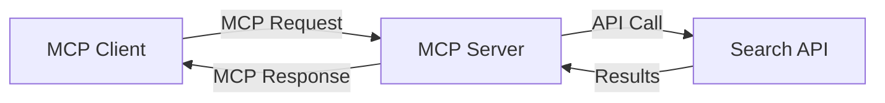
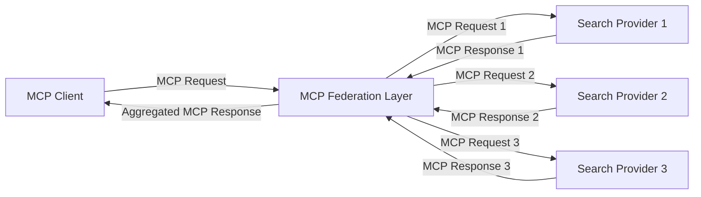
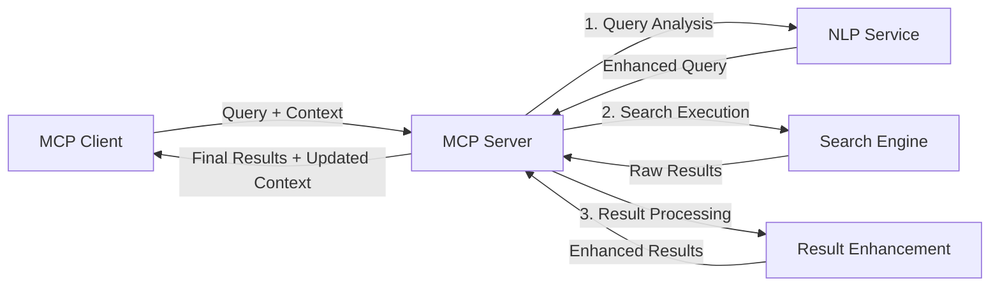

<!--
CO_OP_TRANSLATOR_METADATA:
{
  "original_hash": "16bef2c93c6a86d4ca6a8ce9e120e384",
  "translation_date": "2025-06-13T02:53:32+00:00",
  "source_file": "05-AdvancedTopics/mcp-realtimesearch/README.md",
  "language_code": "he"
}
-->
## ויתור אחריות לדוגמאות קוד

> **[!IMPORTANT]**: דוגמאות הקוד להלן ממחישות את השילוב של Model Context Protocol (MCP) עם פונקציונליות חיפוש באינטרנט. למרות שהן עוקבות אחרי התבניות והמבנים של ערכות הפיתוח הרשמיות של MCP, הן פושטו למטרות לימוד.
> 
> דוגמאות אלו מציגות:
> 
> 1. **מימוש בפייתון**: מימוש שרת FastMCP המספק כלי חיפוש באינטרנט ומתחבר ל-API חיפוש חיצוני. דוגמה זו מדגימה ניהול תקופת חיים נכון, טיפול בהקשר ומימוש כלים בהתאם לתבניות של [ערכת הפיתוח הרשמית בפייתון של MCP](https://github.com/modelcontextprotocol/python-sdk). השרת משתמש בהעברת HTTP מסוג Streamable המומלצת, שהחליפה את העברת SSE הישנה לפריסות פרודקשן.
> 
> 2. **מימוש ב-JavaScript**: מימוש TypeScript/JavaScript המשתמש בתבנית FastMCP מתוך [ערכת הפיתוח הרשמית ב-TypeScript של MCP](https://github.com/modelcontextprotocol/typescript-sdk) ליצירת שרת חיפוש עם הגדרות כלים וחיבורי לקוח נכונים. המימוש עוקב אחרי התבניות המעודכנות לניהול סשנים ושימור הקשר.
> 
> דוגמאות אלו דורשות טיפול נוסף בשגיאות, אימות, וקוד אינטגרציה ספציפי ל-API לשימוש בפרודקשן. נקודות הקצה של API החיפוש (`https://api.search-service.example/search`) הן דוגמאות וצריכות להיות מוחלפות בנקודות שירות אמיתיות.
> 
> לפרטים מלאים ועדכונים אחרונים, עיינו ב-[המפרט הרשמי של MCP](https://spec.modelcontextprotocol.io/) ובתיעוד ערכות הפיתוח.

## מושגי יסוד

### מסגרת Model Context Protocol (MCP)

ביסודה, Model Context Protocol מספק דרך סטנדרטית למודלים של בינה מלאכותית, אפליקציות ושירותים להחלפת הקשר. בחיפוש אינטרנט בזמן אמת, המסגרת הזו חיונית ליצירת חוויות חיפוש רציפות ורב-שלביות. רכיבים מרכזיים כוללים:

1. **ארכיטקטורת לקוח-שרת**: MCP מגדיר הפרדה ברורה בין לקוחות חיפוש (מבקשים) לשרתי חיפוש (מספקים), ומאפשר דגמי פריסה גמישים.

2. **תקשורת JSON-RPC**: הפרוטוקול משתמש ב-JSON-RPC להחלפת הודעות, מה שהופך אותו לתואם לטכנולוגיות ווב וקל ליישום בפלטפורמות שונות.

3. **ניהול הקשר**: MCP מגדיר שיטות מובנות לשימור, עדכון וניצול הקשר חיפוש לאורך אינטראקציות מרובות.

4. **הגדרות כלים**: יכולות החיפוש מוצגות ככלים סטנדרטיים עם פרמטרים וערכי החזרה מוגדרים היטב.

5. **תמיכה בזרימה**: הפרוטוקול תומך בזרימת תוצאות, חיונית לחיפוש בזמן אמת שבו תוצאות עשויות להגיע בהדרגה.

### תבניות אינטגרציה לחיפוש אינטרנט

בעת שילוב MCP עם חיפוש אינטרנט, מתגלות מספר תבניות:

#### 1. אינטגרציה ישירה עם ספק חיפוש

בתבנית זו, שרת MCP מתחבר ישירות לאחד או יותר מ-API חיפוש, מתרגם בקשות MCP לקריאות ספציפיות ל-API ומעצב את התוצאות כתשובות MCP.

#### 2. חיפוש מאוחד עם שימור הקשר

תבנית זו מפזרת שאילתות חיפוש בין מספר ספקי חיפוש תואמי MCP, שלכל אחד מהם מומחיות בתוכן או יכולות חיפוש שונות, תוך שמירה על הקשר אחיד.

#### 3. שרשרת חיפוש משופרת בהקשר

בתבנית זו, תהליך החיפוש מחולק למספר שלבים, כאשר ההקשר מועשר בכל שלב, מה שמניב תוצאות רלוונטיות יותר בהדרגה.

### רכיבי הקשר בחיפוש

בהקשר חיפוש מבוסס MCP, ההקשר כולל בדרך כלל:

- **היסטוריית שאילתות**: שאילתות חיפוש קודמות במושב
- **העדפות משתמש**: שפה, אזור, הגדרות חיפוש בטוח
- **היסטוריית אינטראקציה**: אילו תוצאות נלחצו, זמן שהייה על תוצאות
- **פרמטרי חיפוש**: מסננים, סדר מיון ומודיפיירים אחרים
- **ידע תחומי**: הקשר נושא ספציפי הרלוונטי לחיפוש
- **הקשר זמני**: גורמי רלוונטיות מבוססי זמן
- **העדפות מקור**: מקורות מידע מהימנים או מועדפים

## מקרים ויישומים

### מחקר ואיסוף מידע

MCP משפר זרימות עבודה מחקריות על ידי:

- שימור הקשר מחקרי בין מושבים
- מתן שאילתות מתוחכמות ורלוונטיות יותר בהקשר
- תמיכה בפדרציה של חיפוש רב-מקורית
- הקלה על חילוץ ידע מתוצאות חיפוש

### מעקב חדשות ומגמות בזמן אמת

חיפוש מבוסס MCP מציע יתרונות במעקב חדשות:

- גילוי כמעט בזמן אמת של סיפורי חדשות מתפתחים
- סינון הקשרי של מידע רלוונטי
- מעקב נושאים ויישויות ממקורות שונים
- התראות חדשות מותאמות אישית בהתאם להקשר המשתמש

### גלישה ומחקר בהעצמת AI

MCP יוצר אפשרויות חדשות לגלישה בהעצמת AI:

- הצעות חיפוש הקשריות המבוססות על פעילות דפדפן נוכחית
- אינטגרציה חלקה של חיפוש אינטרנט עם עוזרים מבוססי LLM
- שיפור רב-שלבי של החיפוש תוך שמירת ההקשר
- חיזוק בדיקת עובדות ואימות מידע

## מגמות וחדשנויות עתידיות

### התפתחות MCP בחיפוש אינטרנט

בעתיד, אנו צופים ש-MCP יתפתח לטיפול ב:

- **חיפוש מולטימודלי**: שילוב טקסט, תמונות, אודיו ווידאו עם שמירת הקשר
- **חיפוש מבוזר**: תמיכה באקוסיסטמים מבוזרים ומאוחדים של חיפוש
- **פרטיות בחיפוש**: מנגנוני חיפוש מודעי הקשר המגנים על פרטיות
- **הבנת שאילתות**: ניתוח סמנטי עמוק של שאילתות בשפה טבעית

### התפתחויות טכנולוגיות פוטנציאליות

טכנולוגיות מתהוות שישפיעו על עתיד חיפוש MCP:

1. **ארכיטקטורות חיפוש נוירליות**: מערכות חיפוש מבוססות אמבדינג מותאמות ל-MCP
2. **הקשר חיפוש מותאם אישית**: למידת דפוסי חיפוש אישיים לאורך זמן
3. **אינטגרציה של גרף ידע**: חיפוש הקשרי משודרג על ידי גרפי ידע תחומיים
4. **הקשר חוצה מודאליות**: שמירת הקשר בין מודאליות חיפוש שונות

## תרגילים מעשיים

### תרגיל 1: הקמת צינור חיפוש MCP בסיסי

בתרגיל זה תלמד כיצד:
- להגדיר סביבה בסיסית לחיפוש MCP
- לממש מטפלי הקשר לחיפוש אינטרנט
- לבדוק ולאמת שימור הקשר לאורך שאילתות חיפוש

### תרגיל 2: בניית עוזר מחקר עם חיפוש MCP

צור אפליקציה מלאה שמבצעת:
- עיבוד שאלות מחקר בשפה טבעית
- חיפושים מודעי הקשר באינטרנט
- סינתוז מידע ממקורות מרובים
- הצגת ממצאים מחקריים מסודרים

### תרגיל 3: מימוש פדרציית חיפוש רב-מקורית עם MCP

תרגיל מתקדם המכסה:
- הפצת שאילתות מודעת הקשר למנועי חיפוש מרובים
- דירוג ואגירת תוצאות
- הסרת כפילויות הקשרית בתוצאות
- טיפול במטא-נתונים ספציפיים למקור

## משאבים נוספים

- [מפרט Model Context Protocol](https://spec.modelcontextprotocol.io/) - מפרט רשמי ותיעוד מפורט של הפרוטוקול
- [תיעוד Model Context Protocol](https://modelcontextprotocol.io/) - מדריכים מפורטים ודרכי מימוש
- [MCP Python SDK](https://github.com/modelcontextprotocol/python-sdk) - מימוש רשמי בפייתון של פרוטוקול MCP
- [MCP TypeScript SDK](https://github.com/modelcontextprotocol/typescript-sdk) - מימוש רשמי ב-TypeScript של MCP
- [שרתי MCP לדוגמה](https://github.com/modelcontextprotocol/servers) - מימושים לדוגמה של שרתי MCP
- [Bing Web Search API Documentation](https://learn.microsoft.com/en-us/bing/search-apis/bing-web-search/overview) - API החיפוש של מיקרוסופט
- [Google Custom Search JSON API](https://developers.google.com/custom-search/v1/overview) - מנוע חיפוש מותאם אישית של גוגל
- [SerpAPI Documentation](https://serpapi.com/search-api) - API לתוצאות דפי חיפוש
- [Meilisearch Documentation](https://www.meilisearch.com/docs) - מנוע חיפוש קוד פתוח
- [Elasticsearch Documentation](https://www.elastic.co/guide/index.html) - מנוע חיפוש וניתוח מבוזר
- [LangChain Documentation](https://python.langchain.com/docs/get_started/introduction) - בניית אפליקציות עם LLM

## תוצאות למידה

בסיום מודול זה תוכל:

- להבין את יסודות חיפוש האינטרנט בזמן אמת ואת האתגרים שבו
- להסביר כיצד Model Context Protocol (MCP) משפר יכולות חיפוש בזמן אמת
- לממש פתרונות חיפוש מבוססי MCP באמצעות מסגרות ו-API פופולריים
- לתכנן ולפרוס ארכיטקטורות חיפוש סקלאביליות וביצועיות עם MCP
- ליישם מושגי MCP במקרים שונים כולל חיפוש סמנטי, סיוע מחקרי וגלישה בהעצמת AI
- להעריך מגמות וחדשנויות עתידיות בטכנולוגיות חיפוש מבוססות MCP

### שיקולי אמון ובטיחות

בעת מימוש פתרונות חיפוש אינטרנט מבוססי MCP, זכור את העקרונות החשובים הבאים מהמפרט של MCP:

1. **הסכמה ושליטה של המשתמש**: יש לקבל הסכמה מפורשת מהמשתמש ולהבטיח הבנה מלאה של כל גישה ופעולה על הנתונים. זה קריטי במיוחד למימושי חיפוש באינטרנט שעשויים לגשת למקורות חיצוניים.

2. **פרטיות נתונים**: יש לנהוג בטיפול הולם בשאילתות ותוצאות חיפוש, במיוחד אם הן מכילות מידע רגיש. יש ליישם בקרות גישה מתאימות להגנת נתוני המשתמש.

3. **בטיחות הכלים**: יש ליישם הרשאות ואימות נאותים לכלי החיפוש, שכן הם עלולים להוות סיכוני אבטחה דרך ביצוע קוד שרירותי. תיאורי התנהגות הכלים צריכים להיחשב כבלתי מהימנים אלא אם הם מגיעים משרת מהימן.

4. **תיעוד ברור**: ספק תיעוד ברור על היכולות, המגבלות ושיקולי האבטחה של מימוש החיפוש מבוסס MCP שלך, בהתאם להנחיות המימוש מהמפרט.

5. **זרימות הסכמה איתנות**: בנה זרימות הסכמה והרשאה איתנות שמסבירות בבירור מה כל כלי עושה לפני אישור השימוש בו, במיוחד לכלים המתקשרים עם משאבים חיצוניים באינטרנט.

לפרטים מלאים על אבטחה, אמון ושיקולי בטיחות ב-MCP, עיין ב-[התיעוד הרשמי](https://modelcontextprotocol.io/specification/2025-03-26#security-and-trust-%26-safety).

## מה הלאה

- [6. תרומות קהילתיות](../../06-CommunityContributions/README.md)

**כתב ויתור**:  
מסמך זה תורגם באמצעות שירות תרגום מבוסס בינה מלאכותית [Co-op Translator](https://github.com/Azure/co-op-translator). למרות שאנו שואפים לדיוק, יש לקחת בחשבון שתרגומים אוטומטיים עלולים להכיל שגיאות או אי דיוקים. המסמך המקורי בשפת המקור שלו נחשב למקור הסמכותי. למידע קריטי מומלץ להשתמש בתרגום מקצועי על ידי אדם. אנו לא נושאים באחריות לכל אי הבנה או פרשנות שגויה הנובעת משימוש בתרגום זה.