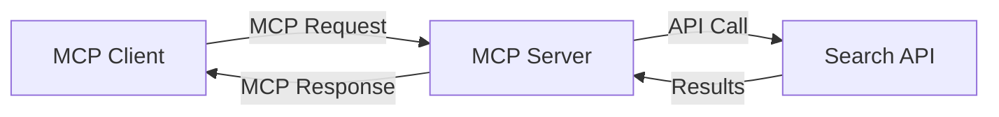
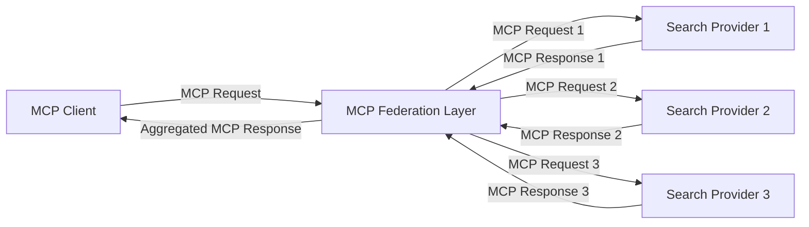
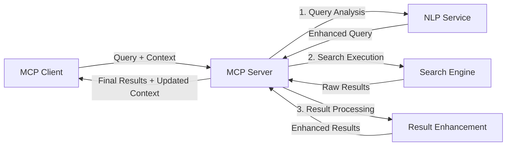

<!--
CO_OP_TRANSLATOR_METADATA:
{
  "original_hash": "eb12652eb7bd17f2193b835a344425c6",
  "translation_date": "2025-06-26T14:10:39+00:00",
  "source_file": "05-AdvancedTopics/mcp-realtimesearch/README.md",
  "language_code": "he"
}
-->
## כתב ויתור על דוגמאות קוד

> **הערה חשובה**: דוגמאות הקוד למטה מדגימות את האינטגרציה של Model Context Protocol (MCP) עם פונקציונליות חיפוש באינטרנט בזמן אמת. למרות שהן עוקבות אחרי התבניות והמבנים של ערכות הפיתוח הרשמיות של MCP, הן פושטו לצורכי לימוד.
> 
> דוגמאות אלו מציגות:
> 
> 1. **מימוש בפייתון**: מימוש שרת FastMCP שמספק כלי חיפוש באינטרנט ומתחבר ל-API חיפוש חיצוני. דוגמה זו מדגימה ניהול תקופת חיים נכון, טיפול בהקשר ומימוש כלי לפי התבניות של [ערכת הפיתוח הרשמית של MCP לפייתון](https://github.com/modelcontextprotocol/python-sdk). השרת משתמש בהעברת HTTP מסוג Streamable המומלצת, שהחליפה את העברת SSE הישנה לפריסות ייצור.
> 
> 2. **מימוש ב-JavaScript**: מימוש ב-TypeScript/JavaScript שמשתמש בתבנית FastMCP מתוך [ערכת הפיתוח הרשמית של MCP ל-TypeScript](https://github.com/modelcontextprotocol/typescript-sdk) ליצירת שרת חיפוש עם הגדרות כלים וחיבורי לקוח נכונים. הוא עוקב אחרי התבניות המעודכנות לניהול מושבים ושימור הקשר.
> 
> דוגמאות אלו דורשות טיפול שגיאות נוסף, אימות ואינטגרציה ספציפית ל-API לשימוש ייצור. נקודות הקצה של ה-API לחיפוש (`https://api.search-service.example/search`) הן מיקומי מילוי ויש להחליפן בנקודות קצה אמיתיות של שירותי חיפוש.
> 
> לפרטים מלאים ולשיטות העדכניות ביותר, יש לעיין ב-[מפרט הרשמי של MCP](https://spec.modelcontextprotocol.io/) ובתיעוד ערכות הפיתוח.

## מושגים מרכזיים

### מסגרת Model Context Protocol (MCP)

בסיסו של הפרוטוקול הוא מתן דרך סטנדרטית למודלים של AI, יישומים ושירותים להחליף מידע הקשר. בחיפוש אינטרנט בזמן אמת, המסגרת הזו חיונית ליצירת חוויות חיפוש עקביות ורב-שלביות. הרכיבים המרכזיים כוללים:

1. **ארכיטקטורת לקוח-שרת**: MCP מגדיר הפרדה ברורה בין לקוחות החיפוש (מבקשים) לשרתי החיפוש (מספקים), ומאפשר מודלים גמישים לפריסה.

2. **תקשורת JSON-RPC**: הפרוטוקול משתמש ב-JSON-RPC להחלפת הודעות, מה שהופך אותו לתואם לטכנולוגיות רשת וקל ליישום בפלטפורמות שונות.

3. **ניהול הקשר**: MCP מגדיר שיטות מובנות לשמירה, עדכון וניצול הקשר חיפוש במספר אינטראקציות.

4. **הגדרות כלים**: יכולות החיפוש מוצגות ככלים סטנדרטיים עם פרמטרים וערכי החזרה מוגדרים היטב.

5. **תמיכה בזרימה (Streaming)**: הפרוטוקול תומך בזרימת תוצאות, חיונית לחיפוש בזמן אמת שבו התוצאות עשויות להגיע בהדרגה.

### תבניות אינטגרציה של חיפוש באינטרנט

בעת שילוב MCP עם חיפוש באינטרנט, עולות מספר תבניות:

#### 1. אינטגרציה ישירה עם ספק חיפוש

בתבנית זו, שרת MCP מתקשר ישירות עם אחד או יותר APIs של חיפוש, מתרגם בקשות MCP לקריאות API ספציפיות ומעצב את התוצאות כתשובות MCP.

#### 2. חיפוש מאוחד עם שימור הקשר

תבנית זו מפזרת שאילתות חיפוש בין מספר ספקי חיפוש תואמי MCP, שכל אחד עשוי להתמחות בסוגי תוכן או יכולות חיפוש שונות, תוך שמירה על הקשר אחיד.

#### 3. שרשרת חיפוש משופרת בהקשר

בתבנית זו, תהליך החיפוש מחולק למספר שלבים, כאשר ההקשר מועשר בכל שלב, מה שמוביל לתוצאות רלוונטיות יותר בהדרגה.

### רכיבי הקשר בחיפוש

בחיפוש מבוסס MCP, ההקשר כולל בדרך כלל:

- **היסטוריית שאילתות**: שאילתות חיפוש קודמות במושב
- **העדפות משתמש**: שפה, אזור, הגדרות חיפוש בטוח
- **היסטוריית אינטראקציות**: אילו תוצאות נבחרו, זמן שהייה על תוצאות
- **פרמטרי חיפוש**: סינונים, סדר מיון ומודיפיקטורים נוספים
- **ידע תחומי**: הקשר ספציפי לנושא החיפוש
- **הקשר זמני**: גורמי רלוונטיות מבוססי זמן
- **העדפות מקור**: מקורות מידע אמינים או מועדפים

## מקרים ושימושים

### מחקר ואיסוף מידע

MCP משפר את זרימות העבודה במחקר על ידי:

- שימור הקשר מחקרי במושבי חיפוש
- אפשרות לשאילתות מתוחכמות ורלוונטיות להקשר
- תמיכה בפדרציית חיפוש מרובת מקורות
- הקלה על חילוץ ידע מתוצאות החיפוש

### ניטור חדשות ומגמות בזמן אמת

חיפוש מבוסס MCP מציע יתרונות לניטור חדשות:

- גילוי כמעט בזמן אמת של חדשות מתפתחות
- סינון הקשרי של מידע רלוונטי
- מעקב אחר נושאים ויישויות במקורות שונים
- התראות חדשות מותאמות אישית לפי הקשר המשתמש

### גלישה ומחקר בהעזר AI

MCP יוצר אפשרויות חדשות לגלישה בהעזר AI:

- הצעות חיפוש הקשריות לפי פעילות דפדפן נוכחית
- אינטגרציה חלקה של חיפוש אינטרנט עם עוזרי LLM
- שיפור חיפוש רב-שלבי עם הקשר מתמשך
- שיפור אימות עובדות ובדיקת מידע

## מגמות וחדשנות עתידית

### התפתחות MCP בחיפוש אינטרנט

בעתיד צפוי MCP לטפל ב:

- **חיפוש מולטימודלי**: שילוב חיפוש טקסט, תמונות, אודיו ווידאו עם שימור הקשר
- **חיפוש מבוזר**: תמיכה באקוסיסטמים מבוזרים ומאוחדים של חיפוש
- **פרטיות בחיפוש**: מנגנוני חיפוש שמכבדים פרטיות ומודעים להקשר
- **הבנת שאילתות**: ניתוח סמנטי עמוק של שאילתות שפה טבעית

### התקדמויות טכנולוגיות פוטנציאליות

טכנולוגיות חדשות שיעצבו את עתיד חיפוש MCP:

1. **ארכיטקטורות חיפוש נוירליות**: מערכות חיפוש מבוססות הטמעה מותאמות ל-MCP
2. **הקשר חיפוש מותאם אישית**: למידת דפוסי חיפוש של משתמשים לאורך זמן
3. **אינטגרציית גרפים של ידע**: חיפוש הקשרי משופר על ידי גרפים תחומיים
4. **הקשר חוצה-מודאלי**: שמירת הקשר בין מודאליות חיפוש שונות

## תרגילים מעשיים

### תרגיל 1: הקמת צינור חיפוש MCP בסיסי

בתרגיל זה תלמד כיצד:
- להגדיר סביבת חיפוש MCP בסיסית
- לממש מטפלי הקשר לחיפוש באינטרנט
- לבדוק ולאמת שימור הקשר בין איטרציות חיפוש

### תרגיל 2: בניית עוזר מחקר עם חיפוש MCP

צור אפליקציה שלמה ש:
- מעבדת שאלות מחקר בשפה טבעית
- מבצעת חיפושים בהקשר מודע באינטרנט
- מסנתזת מידע ממקורות מרובים
- מציגה ממצאים מחקריים מאורגנים

### תרגיל 3: מימוש פדרציית חיפוש מרובת מקורות עם MCP

תרגיל מתקדם הכולל:
- הפצת שאילתות בהקשר למספר מנועי חיפוש
- דירוג ואגרגציית תוצאות
- דה-דופליקציה הקשרית של תוצאות חיפוש
- טיפול במטא-דאטה ספציפית למקור

## משאבים נוספים

- [מפרט Model Context Protocol](https://spec.modelcontextprotocol.io/) - מפרט רשמי ותיעוד פרוטוקול מפורט
- [תיעוד Model Context Protocol](https://modelcontextprotocol.io/) - מדריכים מפורטים והנחיות מימוש
- [MCP Python SDK](https://github.com/modelcontextprotocol/python-sdk) - מימוש רשמי בפייתון של פרוטוקול MCP
- [MCP TypeScript SDK](https://github.com/modelcontextprotocol/typescript-sdk) - מימוש רשמי ב-TypeScript של פרוטוקול MCP
- [שרתים רפרנס MCP](https://github.com/modelcontextprotocol/servers) - מימושים לדוגמה של שרתי MCP
- [תיעוד Bing Web Search API](https://learn.microsoft.com/en-us/bing/search-apis/bing-web-search/overview) - API לחיפוש באינטרנט של מיקרוסופט
- [Google Custom Search JSON API](https://developers.google.com/custom-search/v1/overview) - מנוע חיפוש מתוכנת של גוגל
- [תיעוד SerpAPI](https://serpapi.com/search-api) - API לתוצאות מנועי חיפוש
- [תיעוד Meilisearch](https://www.meilisearch.com/docs) - מנוע חיפוש קוד פתוח
- [תיעוד Elasticsearch](https://www.elastic.co/guide/index.html) - מנוע חיפוש וניתוח מבוזר
- [תיעוד LangChain](https://python.langchain.com/docs/get_started/introduction) - בניית אפליקציות עם LLM

## תוצאות למידה

בסיום מודול זה תוכל:

- להבין את היסודות של חיפוש אינטרנט בזמן אמת ואת האתגרים בו
- להסביר כיצד Model Context Protocol (MCP) משפר את יכולות החיפוש בזמן אמת
- לממש פתרונות חיפוש מבוססי MCP באמצעות מסגרות ו-API פופולריים
- לתכנן ולפרוס ארכיטקטורות חיפוש סקלאביליות וביצועיות עם MCP
- ליישם מושגי MCP במגוון שימושים כולל חיפוש סמנטי, סיוע מחקר וגלישה בהעזר AI
- להעריך מגמות וחדשנות עתידית בטכנולוגיות חיפוש מבוססות MCP

### שיקולי אמון ובטיחות

בעת מימוש פתרונות חיפוש מבוססי MCP, זכרו את העקרונות החשובים מהמפרט של MCP:

1. **הסכמה ושליטה של המשתמש**: יש לקבל הסכמה מפורשת והבנה מלאה של כל הגישה והפעולות על הנתונים. זה חשוב במיוחד ביישומי חיפוש שיכולים לגשת למקורות חיצוניים.

2. **פרטיות הנתונים**: יש לנהוג כראוי בשאילתות ותוצאות חיפוש, במיוחד כאשר הן עשויות להכיל מידע רגיש. יש ליישם בקרות גישה מתאימות להגנת נתוני המשתמש.

3. **בטיחות הכלים**: יש ליישם הרשאות ואימות נאותים לכלי החיפוש, שכן הם עלולים להוות סיכוני אבטחה דרך הרצת קוד שרירותית. תיאורי התנהגות הכלים צריכים להיחשב כבלתי מהימנים אלא אם התקבלו משרת מהימן.

4. **תיעוד ברור**: יש לספק תיעוד ברור על היכולות, המגבלות ושיקולי האבטחה של מימוש החיפוש מבוסס MCP, בהתאם להנחיות המימוש מהמפרט.

5. **זרימות הסכמה איתנות**: יש לבנות זרימות הסכמה והרשאה איתנות שמסבירות בבירור מה כל כלי עושה לפני מתן הרשאה לשימושו, במיוחד עבור כלים שמתקשרים עם משאבי רשת חיצוניים.

לפרטים מלאים על אבטחה ואמון ב-MCP, עיינו ב-[התיעוד הרשמי](https://modelcontextprotocol.io/specification/2025-03-26#security-and-trust-%26-safety).

## מה הלאה

- [5.11 אימות Entra ID לשרתי Model Context Protocol](../mcp-security-entra/README.md)

**כתב ויתור**:  
מסמך זה תורגם באמצעות שירות תרגום מבוסס בינה מלאכותית [Co-op Translator](https://github.com/Azure/co-op-translator). למרות שאנו שואפים לדיוק, יש להיות מודעים לכך שתרגומים אוטומטיים עלולים להכיל שגיאות או אי-דיוקים. יש להתייחס למסמך המקורי בשפתו המקורית כמקור הסמכות. למידע קריטי מומלץ להשתמש בתרגום מקצועי על ידי מתרגם אנושי. אנו לא נושאים באחריות לכל אי-הבנה או פרשנות שגויה הנובעת משימוש בתרגום זה.