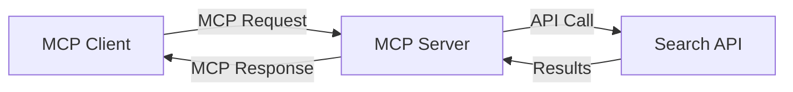
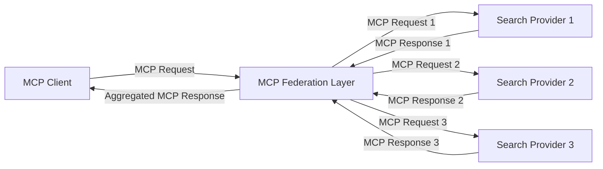
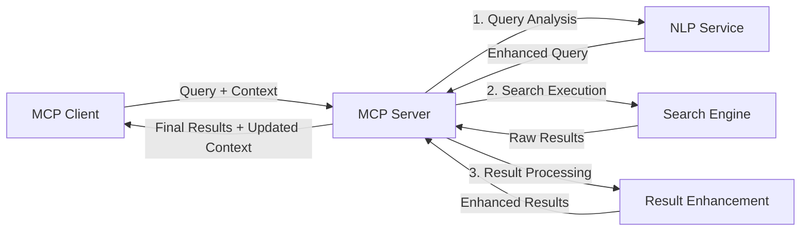

<!--
CO_OP_TRANSLATOR_METADATA:
{
  "original_hash": "333a03e51f90bdf3e6f1ba1694c73f36",
  "translation_date": "2025-07-17T07:26:10+00:00",
  "source_file": "05-AdvancedTopics/mcp-realtimesearch/README.md",
  "language_code": "he"
}
-->
## כתב ויתור על דוגמאות קוד

> **הערה חשובה**: דוגמאות הקוד שלהלן מדגימות את השילוב של Model Context Protocol (MCP) עם פונקציונליות חיפוש באינטרנט בזמן אמת. למרות שהן עוקבות אחרי התבניות והמבנים של ערכות הפיתוח הרשמיות של MCP, הן פושטו למטרות לימודיות.
> 
> דוגמאות אלו מציגות:
> 
> 1. **מימוש בפייתון**: מימוש שרת FastMCP המספק כלי חיפוש באינטרנט ומתחבר ל-API חיפוש חיצוני. דוגמה זו מדגימה ניהול מחזור חיים נכון, טיפול בהקשר ומימוש כלי בהתאם לתבניות של [ערכת הפיתוח הרשמית של MCP בפייתון](https://github.com/modelcontextprotocol/python-sdk). השרת משתמש בהעברת HTTP מסוג Streamable המומלצת, שהחליפה את העברת SSE הישנה לפריסות ייצור.
> 
> 2. **מימוש ב-JavaScript**: מימוש ב-TypeScript/JavaScript המשתמש בתבנית FastMCP מתוך [ערכת הפיתוח הרשמית של MCP ב-TypeScript](https://github.com/modelcontextprotocol/typescript-sdk) ליצירת שרת חיפוש עם הגדרות כלים וחיבורי לקוח נכונים. הוא עוקב אחרי התבניות העדכניות לניהול מושבים ושימור הקשר.
> 
> דוגמאות אלו דורשות טיפול נוסף בשגיאות, אימות, וקוד אינטגרציה ספציפי ל-API לשימוש בפרודקשן. נקודות הקצה של API החיפוש המוצגות (`https://api.search-service.example/search`) הן דמויות ויש להחליפן בנקודות קצה אמיתיות של שירותי חיפוש.
> 
> לפרטים מלאים ועדכונים אחרונים, יש לעיין ב-[מפרט הרשמי של MCP](https://spec.modelcontextprotocol.io/) ובתיעוד ערכות הפיתוח.

## מושגי יסוד

### מסגרת Model Context Protocol (MCP)

ביסודה, Model Context Protocol מספק דרך סטנדרטית למודלים של בינה מלאכותית, יישומים ושירותים להחלפת הקשר. בחיפוש אינטרנט בזמן אמת, המסגרת הזו חיונית ליצירת חוויות חיפוש עקביות ורב-שלביות. רכיבים מרכזיים כוללים:

1. **ארכיטקטורת לקוח-שרת**: MCP מגדיר הפרדה ברורה בין לקוחות חיפוש (מבקשים) לשרתי חיפוש (מספקים), ומאפשר מודלים גמישים לפריסה.

2. **תקשורת JSON-RPC**: הפרוטוקול משתמש ב-JSON-RPC להחלפת הודעות, מה שהופך אותו לתואם לטכנולוגיות ווב וקל ליישום בפלטפורמות שונות.

3. **ניהול הקשר**: MCP מגדיר שיטות מובנות לשמירה, עדכון וניצול הקשר חיפוש לאורך אינטראקציות מרובות.

4. **הגדרות כלים**: יכולות החיפוש מוצגות ככלים סטנדרטיים עם פרמטרים וערכי החזרה מוגדרים היטב.

5. **תמיכה בזרימה (Streaming)**: הפרוטוקול תומך בזרימת תוצאות, חיונית לחיפוש בזמן אמת שבו התוצאות עשויות להגיע בהדרגה.

### תבניות אינטגרציה לחיפוש באינטרנט

בעת שילוב MCP עם חיפוש באינטרנט, מתגלות מספר תבניות:

#### 1. אינטגרציה ישירה עם ספק חיפוש

בתבנית זו, שרת MCP מתקשר ישירות עם אחד או יותר API של חיפוש, מתרגם בקשות MCP לקריאות ספציפיות ל-API ומעצב את התוצאות כתשובות MCP.

#### 2. חיפוש פדרטיבי עם שימור הקשר

תבנית זו מפזרת שאילתות חיפוש בין מספר ספקי חיפוש תואמי MCP, שכל אחד מהם עשוי להתמחות בסוגי תוכן או יכולות חיפוש שונות, תוך שמירה על הקשר מאוחד.

#### 3. שרשרת חיפוש משופרת בהקשר

בתבנית זו, תהליך החיפוש מחולק למספר שלבים, כאשר ההקשר מועשר בכל שלב, מה שמוביל לתוצאות רלוונטיות יותר בהדרגה.

### רכיבי הקשר בחיפוש

בחיפוש מבוסס MCP, ההקשר כולל בדרך כלל:

- **היסטוריית שאילתות**: שאילתות חיפוש קודמות במושב
- **העדפות משתמש**: שפה, אזור, הגדרות חיפוש בטוח
- **היסטוריית אינטראקציות**: אילו תוצאות נבחרו, זמן שהייה על תוצאות
- **פרמטרי חיפוש**: מסננים, סדרי מיון ומודיפיקציות חיפוש נוספות
- **ידע תחומי**: הקשר נושא ספציפי הרלוונטי לחיפוש
- **הקשר זמני**: גורמי רלוונטיות מבוססי זמן
- **העדפות מקורות**: מקורות מידע מהימנים או מועדפים

## מקרי שימוש ויישומים

### מחקר ואיסוף מידע

MCP משפר את זרימות העבודה במחקר על ידי:

- שימור הקשר מחקרי לאורך מושבי חיפוש
- אפשרות לשאילתות מתוחכמות ורלוונטיות יותר בהקשר
- תמיכה בפדרציה של חיפוש מרובה מקורות
- הקלה על חילוץ ידע מתוצאות החיפוש

### ניטור חדשות ומגמות בזמן אמת

חיפוש מבוסס MCP מציע יתרונות לניטור חדשות:

- גילוי כמעט בזמן אמת של סיפורי חדשות מתפתחים
- סינון הקשרי של מידע רלוונטי
- מעקב אחר נושאים ויישויות ממקורות מרובים
- התראות חדשות מותאמות אישית על בסיס הקשר משתמש

### גלישה ומחקר משולבים בבינה מלאכותית

MCP יוצר אפשרויות חדשות לגלישה משולבת בינה מלאכותית:

- הצעות חיפוש הקשריות בהתבסס על פעילות דפדפן נוכחית
- אינטגרציה חלקה של חיפוש אינטרנט עם עוזרים מבוססי LLM
- שיפור חיפוש רב-שלבי עם שימור הקשר
- שיפור בדיקת עובדות ואימות מידע

## מגמות וחדשנות עתידית

### התפתחות MCP בחיפוש באינטרנט

בהסתכלות קדימה, אנו מצפים ש-MCP יתפתח כדי לטפל ב:

- **חיפוש מולטימודלי**: שילוב חיפוש טקסט, תמונות, אודיו ווידאו עם שימור הקשר
- **חיפוש מבוזר**: תמיכה באקוסיסטמים של חיפוש מבוזר ופדרטיבי
- **פרטיות בחיפוש**: מנגנוני חיפוש שמגנים על הפרטיות תוך התחשבות בהקשר  
- **הבנת שאילתות**: ניתוח סמנטי עמוק של שאילתות חיפוש בשפה טבעית  

### התפתחויות טכנולוגיות פוטנציאליות  

טכנולוגיות מתפתחות שיעצבו את עתיד החיפוש ב-MCP:  

1. **ארכיטקטורות חיפוש נוירוניות**: מערכות חיפוש מבוססות הטמעה המותאמות ל-MCP  
2. **הקשר חיפוש מותאם אישית**: למידת דפוסי חיפוש אישיים של משתמשים לאורך זמן  
3. **שילוב גרף ידע**: חיפוש הקשרי משופר באמצעות גרפי ידע תחומיים  
4. **הקשר חוצה-מודאלי**: שמירת ההקשר בין מודאליות חיפוש שונות  

## תרגילים מעשיים  

### תרגיל 1: הקמת צינור חיפוש בסיסי ב-MCP  

בתרגיל זה תלמד כיצד:  
- להגדיר סביבה בסיסית לחיפוש ב-MCP  
- לממש מטפלי הקשר לחיפוש באינטרנט  
- לבדוק ולאמת את שמירת ההקשר לאורך איטרציות החיפוש  

### תרגיל 2: בניית עוזר מחקר עם חיפוש MCP  

צור אפליקציה מלאה שמבצעת:  
- עיבוד שאלות מחקר בשפה טבעית  
- חיפושים אינטרנטיים בהקשר מודע  
- סינתוז מידע ממקורות מרובים  
- הצגת ממצאי מחקר מאורגנים  

### תרגיל 3: מימוש פדרציית חיפוש מרובת מקורות עם MCP  

תרגיל מתקדם הכולל:  
- הפצת שאילתות בהקשר מודע למנועי חיפוש מרובים  
- דירוג ואגרגציה של תוצאות  
- הסרת כפילויות הקשרית בתוצאות החיפוש  
- טיפול במטא-נתונים ספציפיים למקור  

## משאבים נוספים  

- [Model Context Protocol Specification](https://spec.modelcontextprotocol.io/) - מפרט רשמי ותיעוד מפורט של הפרוטוקול  
- [Model Context Protocol Documentation](https://modelcontextprotocol.io/) - מדריכים מפורטים והנחיות מימוש  
- [MCP Python SDK](https://github.com/modelcontextprotocol/python-sdk) - מימוש רשמי של הפרוטוקול בפייתון  
- [MCP TypeScript SDK](https://github.com/modelcontextprotocol/typescript-sdk) - מימוש רשמי של הפרוטוקול ב-TypeScript  
- [MCP Reference Servers](https://github.com/modelcontextprotocol/servers) - מימושים לדוגמה של שרתי MCP  
- [Bing Web Search API Documentation](https://learn.microsoft.com/en-us/bing/search-apis/bing-web-search/overview) - ממשק ה-API לחיפוש באינטרנט של מיקרוסופט  
- [Google Custom Search JSON API](https://developers.google.com/custom-search/v1/overview) - מנוע חיפוש מותאם של גוגל  
- [SerpAPI Documentation](https://serpapi.com/search-api) - API לתוצאות מנועי חיפוש  
- [Meilisearch Documentation](https://www.meilisearch.com/docs) - מנוע חיפוש קוד פתוח  
- [Elasticsearch Documentation](https://www.elastic.co/guide/index.html) - מנוע חיפוש וניתוח מבוזר  
- [LangChain Documentation](https://python.langchain.com/docs/get_started/introduction) - בניית אפליקציות עם LLMs  

## תוצאות למידה  

בסיום המודול תוכל:  

- להבין את יסודות החיפוש באינטרנט בזמן אמת ואת האתגרים הכרוכים בו  
- להסביר כיצד Model Context Protocol (MCP) משפר את יכולות החיפוש בזמן אמת  
- לממש פתרונות חיפוש מבוססי MCP באמצעות מסגרות ו-API פופולריים  
- לתכנן ולפרוס ארכיטקטורות חיפוש סקלאביליות וביצועיות גבוהות עם MCP  
- ליישם את מושגי MCP במגוון מקרים כמו חיפוש סמנטי, סיוע במחקר וגלישה משופרת בינה מלאכותית  
- להעריך מגמות חדשות וחדשנות עתידית בטכנולוגיות חיפוש מבוססות MCP  

### שיקולי אמון ובטיחות  

בעת מימוש פתרונות חיפוש אינטרנטיים מבוססי MCP, זכור את העקרונות החשובים הבאים מהמפרט של MCP:  

1. **הסכמה ושליטה של המשתמש**: יש לקבל הסכמה מפורשת מהמשתמש ולהבטיח שהוא מבין את כל הגישה והפעולות על הנתונים. זה חשוב במיוחד במימושי חיפוש באינטרנט שעשויים לגשת למקורות חיצוניים.  

2. **פרטיות נתונים**: יש לטפל כראוי בשאילתות ותוצאות חיפוש, במיוחד אם הן מכילות מידע רגיש. יש ליישם בקרות גישה מתאימות להגנת נתוני המשתמש.  

3. **בטיחות כלים**: יש ליישם הרשאות ואימות נאותים לכלי חיפוש, שכן הם עלולים להוות סיכוני אבטחה עקב הרצת קוד שרירותי. תיאורי התנהגות הכלים צריכים להיחשב כבלתי מהימנים אלא אם התקבלו משרת מהימן.  

4. **תיעוד ברור**: ספק תיעוד ברור לגבי היכולות, המגבלות ושיקולי האבטחה של מימוש החיפוש מבוסס MCP, בהתאם להנחיות מהמפרט.  

5. **זרימות הסכמה חזקות**: בנה זרימות הסכמה והרשאה חזקות שמסבירות בבירור מה כל כלי עושה לפני מתן הרשאה לשימוש בו, במיוחד כלים שפועלים מול משאבים חיצוניים באינטרנט.  

לפרטים מלאים על אבטחה ושיקולי אמון ב-MCP, עיין ב-[התיעוד הרשמי](https://modelcontextprotocol.io/specification/2025-03-26#security-and-trust-%26-safety).  

## מה הלאה  

- [5.12 אימות Entra ID לשרתי Model Context Protocol](../mcp-security-entra/README.md)

**כתב ויתור**:  
מסמך זה תורגם באמצעות שירות תרגום מבוסס בינה מלאכותית [Co-op Translator](https://github.com/Azure/co-op-translator). למרות שאנו שואפים לדיוק, יש לקחת בחשבון כי תרגומים אוטומטיים עלולים להכיל שגיאות או אי-דיוקים. המסמך המקורי בשפת המקור שלו צריך להיחשב כמקור הסמכות. למידע קריטי מומלץ להשתמש בתרגום מקצועי על ידי מתרגם אנושי. אנו לא נושאים באחריות לכל אי-הבנה או פרשנות שגויה הנובעת משימוש בתרגום זה.