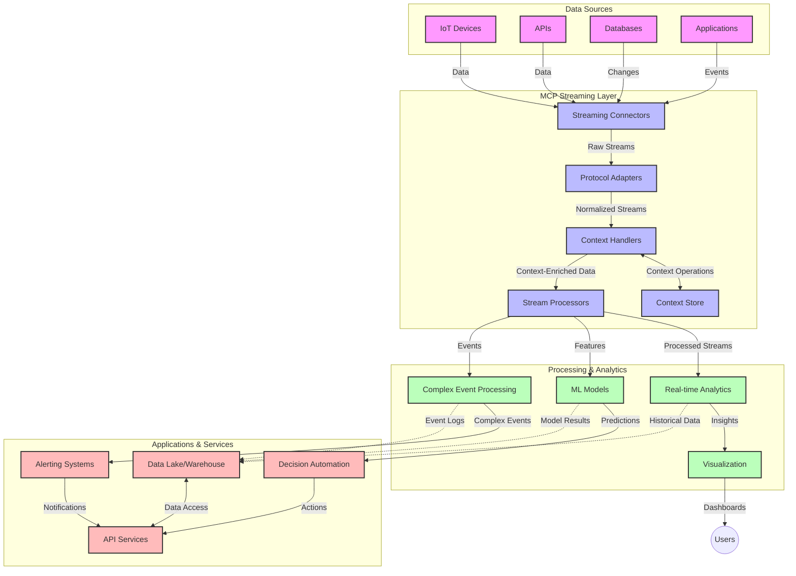

<!--
CO_OP_TRANSLATOR_METADATA:
{
  "original_hash": "68c518dbff8a3b127ed2aa934054c56c",
  "translation_date": "2025-06-11T17:22:39+00:00",
  "source_file": "05-AdvancedTopics/mcp-realtimestreaming/README.md",
  "language_code": "he"
}
-->
# פרוטוקול הקשר למודל עבור שידור נתונים בזמן אמת

## סקירה כללית

שידור נתונים בזמן אמת הפך לחיוני בעולם המונע נתונים של היום, שבו עסקים ויישומים זקוקים לגישה מיידית למידע על מנת לקבל החלטות בזמן הנכון. פרוטוקול הקשר למודל (MCP) מייצג התקדמות משמעותית באופטימיזציה של תהליכי השידור בזמן אמת הללו, משפר את יעילות עיבוד הנתונים, שומר על שלמות ההקשר ומשפר את ביצועי המערכת הכוללים.

מודול זה בוחן כיצד MCP משנה את שידור הנתונים בזמן אמת על ידי מתן גישה סטנדרטית לניהול הקשר בין מודלים של בינה מלאכותית, פלטפורמות שידור ויישומים.

## מבוא לשידור נתונים בזמן אמת

שידור נתונים בזמן אמת הוא פרדיגמה טכנולוגית שמאפשרת העברה, עיבוד וניתוח רציפים של נתונים בזמן שהם נוצרים, ומאפשרת למערכות להגיב מיידית למידע חדש. בניגוד לעיבוד אצוות מסורתי הפועל על מערכי נתונים סטטיים, תהליכי השידור מעבדים נתונים בתנועה, ומספקים תובנות ופעולות עם השהייה מינימלית.

### מושגי יסוד בשידור נתונים בזמן אמת:

- **זרימת נתונים רציפה**: הנתונים מעובדים כזרם מתמשך וללא הפסקה של אירועים או רשומות.
- **עיבוד בהשהייה נמוכה**: מערכות מתוכננות למזער את הזמן בין יצירת הנתונים לעיבודם.
- **יכולת התרחבות**: ארכיטקטורות השידור חייבות להתמודד עם נפחי וזרמי נתונים משתנים.
- **עמידות לתקלות**: מערכות צריכות להיות חסינות לכשלים כדי להבטיח זרימת נתונים בלתי מופרעת.
- **עיבוד מבוסס מצב**: שמירת ההקשר בין אירועים חיונית לניתוח משמעותי.

### פרוטוקול הקשר למודל ושידור בזמן אמת

פרוטוקול הקשר למודל (MCP) מתמודד עם מספר אתגרים קריטיים בסביבות שידור בזמן אמת:

1. **רציפות הקשר**: MCP מאחד את האופן שבו ההקשר נשמר בין רכיבי השידור המבוזרים, ומבטיח שלמודלים של בינה מלאכותית ותחנות עיבוד תהיה גישה להקשר היסטורי וסביבתי רלוונטי.

2. **ניהול מצב יעיל**: על ידי מתן מנגנונים מובנים להעברת הקשר, MCP מפחית את העומס בניהול המצב בצינורות השידור.

3. **אינטרופרביליות**: MCP יוצר שפה משותפת לשיתוף הקשר בין טכנולוגיות שידור שונות ומודלים של בינה מלאכותית, ומאפשר ארכיטקטורות גמישות ומורחבות יותר.

4. **הקשר מותאם לשידור**: מימושי MCP יכולים להעדיף אילו אלמנטים בהקשר הם החשובים ביותר לקבלת החלטות בזמן אמת, תוך אופטימיזציה הן לביצועים והן לדיוק.

5. **עיבוד אדפטיבי**: עם ניהול הקשר נכון באמצעות MCP, מערכות השידור יכולות להתאים את העיבוד באופן דינמי בהתאם לתנאים ודפוסים משתנים בנתונים.

ביישומים מודרניים הנעים מרשתות חיישנים של IoT ועד פלטפורמות מסחר פיננסיות, השילוב של MCP עם טכנולוגיות שידור מאפשר עיבוד חכם ומודע להקשר שיכול להגיב כראוי למצבים מורכבים ומתפתחים בזמן אמת.

## מטרות הלמידה

בסיום השיעור תוכל:

- להבין את יסודות שידור הנתונים בזמן אמת ואת האתגרים הכרוכים בו
- להסביר כיצד פרוטוקול הקשר למודל (MCP) משפר את שידור הנתונים בזמן אמת
- ליישם פתרונות שידור מבוססי MCP באמצעות מסגרות פופולריות כמו Kafka ו-Pulsar
- לתכנן ולפרוס ארכיטקטורות שידור חסינות לתקלות ובעלות ביצועים גבוהים עם MCP
- להחיל מושגי MCP על מקרים של שימוש ב-IoT, מסחר פיננסי וניתוח מבוסס בינה מלאכותית
- להעריך מגמות חדשות וחדשנויות עתידיות בטכנולוגיות שידור מבוססות MCP

### הגדרה ומשמעות

שידור נתונים בזמן אמת כולל יצירה, עיבוד והעברה רציפים של נתונים עם השהייה מינימלית. בניגוד לעיבוד אצוות, שבו הנתונים נאספים ומעובדים בקבוצות, נתוני השידור מעובדים בהדרגה כשהם מגיעים, ומאפשרים תובנות ופעולות מיידיות.

מאפיינים מרכזיים של שידור נתונים בזמן אמת כוללים:

- **השהייה נמוכה**: עיבוד וניתוח נתונים בתוך מילישניות עד שניות
- **זרימה רציפה**: זרמי נתונים בלתי מופרעים ממקורות שונים
- **עיבוד מיידי**: ניתוח נתונים עם הגעתם ולא באצוות
- **ארכיטקטורת מבוססת אירועים**: תגובה לאירועים כשהם מתרחשים

### אתגרים בשידור נתונים מסורתי

גישות שידור נתונים מסורתיות מתמודדות עם מספר מגבלות:

1. **אובדן הקשר**: קושי בשמירת ההקשר במערכות מבוזרות
2. **בעיות התרחבות**: אתגרים בקנה מידה לטיפול בנפחי וזרמי נתונים גבוהים
3. **מורכבות אינטגרציה**: קשיים באינטרופרביליות בין מערכות שונות
4. **ניהול השהייה**: איזון בין קצב העברה לזמן עיבוד
5. **עקביות נתונים**: הבטחת דיוק ושלמות הנתונים לאורך הזרם

## הבנת פרוטוקול הקשר למודל (MCP)

### מהו MCP?

פרוטוקול הקשר למודל (MCP) הוא פרוטוקול תקשורת סטנדרטי שנועד להקל על אינטראקציה יעילה בין מודלים של בינה מלאכותית ויישומים. בהקשר של שידור נתונים בזמן אמת, MCP מספק מסגרת ל:

- שימור ההקשר לאורך כל צינור הנתונים
- סטנדרטיזציה של פורמטי החלפת נתונים
- אופטימיזציה של העברת מערכי נתונים גדולים
- שיפור התקשורת בין מודל למודל ובין מודל ליישום

### רכיבים מרכזיים וארכיטקטורה

ארכיטקטורת MCP לשידור בזמן אמת כוללת מספר רכיבים מרכזיים:

1. **מנהליי הקשר**: מנהלים ושומרים על מידע הקשרי לאורך צינור השידור
2. **מעבדי זרם**: מעבדים זרמי נתונים נכנסים תוך שימוש בטכניקות מודעות להקשר
3. **מתאמי פרוטוקול**: ממירים בין פרוטוקולים שונים של שידור תוך שמירה על ההקשר
4. **מאגר הקשר**: מאחסן ומחזיר מידע הקשרי ביעילות
5. **מחברים לשידור**: מתחברים לפלטפורמות שידור שונות (Kafka, Pulsar, Kinesis וכו')



### כיצד MCP משפר את ניהול הנתונים בזמן אמת

MCP מתמודד עם אתגרי השידור המסורתיים באמצעות:

- **שלמות הקשר**: שמירה על הקשרים בין נקודות הנתונים לאורך כל הצינור
- **העברה אופטימלית**: הפחתת כפילויות בהחלפת נתונים באמצעות ניהול הקשר חכם
- **ממשקים סטנדרטיים**: מתן API עקבי לרכיבי השידור
- **הפחתת השהייה**: מזעור עומס העיבוד באמצעות טיפול יעיל בהקשר
- **הרחבת יכולת התרחבות**: תמיכה בהרחבה אופקית תוך שמירת ההקשר

## אינטגרציה ויישום

מערכות שידור נתונים בזמן אמת דורשות תכנון ארכיטקטוני ויישום קפדניים כדי לשמור על ביצועים ושלמות הקשר. פרוטוקול הקשר למודל מציע גישה סטנדרטית לשילוב מודלים של בינה מלאכותית וטכנולוגיות שידור, ומאפשר צינורות עיבוד מתוחכמים ומודעים להקשר.

### סקירה של אינטגרציית MCP בארכיטקטורות שידור

יישום MCP בסביבות שידור בזמן אמת כולל שיקולים מרכזיים:

1. **סיריאליזציה והעברת הקשר**: MCP מספק מנגנונים יעילים לקידוד מידע הקשר בתוך חבילות נתוני השידור, ומבטיח שההקשר החיוני מלווה את הנתונים לאורך צינור העיבוד. זה כולל פורמטים סטנדרטיים לסיריאליזציה מותאמים לשידור.

2. **עיבוד זרם מבוסס מצב**: MCP מאפשר עיבוד מבוסס מצב חכם יותר על ידי שמירה על ייצוג עקבי של ההקשר בין תחנות העיבוד. זה חשוב במיוחד בארכיטקטורות שידור מבוזרות שבהן ניהול מצב הוא אתגר מסורתי.

3. **זמן אירוע לעומת זמן עיבוד**: מימושי MCP במערכות שידור צריכים להתמודד עם האתגר הנפוץ של הבחנה בין מתי אירועים התרחשו לבין מתי הם עובדו. הפרוטוקול יכול לשלב הקשר זמני ששומר על סמנטיקת זמן האירוע.

4. **ניהול לחץ חוזר**: על ידי סטנדרטיזציה של טיפול בהקשר, MCP מסייע בניהול לחץ חוזר במערכות השידור, ומאפשר לרכיבים לתקשר את יכולות העיבוד שלהם ולהתאים את הזרימה בהתאם.

5. **חלונות הקשר ואגרגציה**: MCP מאפשר פעולות חלון מתוחכמות יותר על ידי מתן ייצוגים מובנים של הקשרים זמניים ויחסיים, ומאפשר אגרגציות משמעותיות יותר לאורך זרמי אירועים.

6. **עיבוד בדיוק-פעם אחת**: במערכות שידור הדורשות סמנטיקה של עיבוד בדיוק-פעם אחת, MCP יכול לשלב מטא-נתוני עיבוד שיעזרו במעקב ואימות מצב העיבוד בין רכיבים מבוזרים.

יישום MCP בטכנולוגיות שידור שונות יוצר גישה מאוחדת לניהול הקשר, מפחית את הצורך בקוד אינטגרציה מותאם אישית ומשפר את יכולת המערכת לשמור על הקשר משמעותי בזמן זרימת הנתונים בצינור.

### MCP במסגרת מסגרות שידור שונות

MCP ניתן לשילוב עם מסגרות שידור פופולריות כולל:

#### אינטגרציה עם Apache Kafka

```python
from mcp_streaming import MCPKafkaConnector

# Initialize MCP Kafka connector
connector = MCPKafkaConnector(
    bootstrap_servers='localhost:9092',
    context_preservation=True
)

# Create a context-aware consumer
consumer = connector.create_consumer('input-topic')

# Process streaming data with context
for message in consumer:
    context = message.get_context()
    data = message.get_value()
    
    # Process with context awareness
    result = process_with_context(data, context)
    
    # Produce output with preserved context
    connector.produce('output-topic', result, context=context)
```

#### יישום ב-Apache Pulsar

```python
from mcp_streaming import MCPPulsarClient

# Initialize MCP Pulsar client
client = MCPPulsarClient('pulsar://localhost:6650')

# Subscribe with context awareness
consumer = client.subscribe('input-topic', 'subscription-name', 
                           context_enabled=True)

# Process messages with context preservation
while True:
    message = consumer.receive()
    context = message.get_context()
    
    # Process with context
    result = process_with_context(message.data(), context)
    
    # Acknowledge the message
    consumer.acknowledge(message)
    
    # Send result with preserved context
    producer = client.create_producer('output-topic')
    producer.send(result, context=context)
```

### שיטות עבודה מומלצות לפריסה

בעת יישום MCP לשידור בזמן אמת:

1. **תכנן לעמידות לתקלות**:
   - יישם טיפול שגיאות מתאים
   - השתמש בתורים למכתבים מתים להודעות שנכשלו
   - עצב מעבדים אידמפוטנטיים

2. **אופטימיזציה לביצועים**:
   - הגדר גדלי באפר מתאימים
   - השתמש באצוות כשמתאים
   - יישם מנגנוני לחץ חוזר

3. **נטר ותצפת**:
   - עקוב אחרי מדדי עיבוד הזרם
   - נטר הפצת הקשר
   - הקם התראות על חריגות

4. **אבטח את הזרמים שלך**:
   - יישם הצפנה לנתונים רגישים
   - השתמש באימות והרשאות
   - החל בקרות גישה נאותות

### MCP ב-IoT ומחשוב קצה

MCP משפר את שידור ה-IoT על ידי:

- שימור הקשר של המכשיר לאורך צינור העיבוד
- אפשרות שידור נתונים יעילה מקצה לענן
- תמיכה בניתוח בזמן אמת של זרמי נתוני IoT
- הקלה על תקשורת בין מכשירים עם הקשר

דוגמה: רשתות חיישנים בעיר חכמה  
```
Sensors → Edge Gateways → MCP Stream Processors → Real-time Analytics → Automated Responses
```

### תפקיד בעסקאות פיננסיות ומסחר בתדירות גבוהה

MCP מספק יתרונות משמעותיים לשידור נתונים פיננסיים:

- עיבוד בהשהייה נמוכה במיוחד לקבלת החלטות מסחר
- שמירת הקשר העסקה לאורך כל תהליך העיבוד
- תמיכה בעיבוד אירועים מורכב עם מודעות להקשר
- הבטחת עקביות הנתונים במערכות מסחר מבוזרות

### שיפור ניתוחי נתונים מונחי בינה מלאכותית

MCP פותח אפשרויות חדשות לניתוחי שידור:

- אימון והסקת מסקנות של מודלים בזמן אמת
- למידה רציפה מנתוני שידור
- חילוץ תכונות מודע להקשר
- צינורות הסקה מרובי מודלים עם הקשר נשמר

## מגמות וחדשנויות עתידיות

### התפתחות MCP בסביבות זמן אמת

בהסתכלות קדימה, אנו מצפים ש-MCP יתפתח לטפל ב:

- **שילוב מחשוב קוונטי**: הכנה למערכות שידור מבוססות קוונטים
- **עיבוד מקצה טבעי**: העברת עיבוד מודע הקשר למכשירי קצה
- **ניהול שידור אוטונומי**: צינורות שידור המתאימים את עצמם אוטומטית
- **שידור פדרטיבי**: עיבוד מבוזר תוך שמירת פרטיות

### התקדמויות טכנולוגיות פוטנציאליות

טכנולוגיות מתפתחות שיעצבו את עתיד השידור ב-MCP:

1. **פרוטוקולי שידור מותאמים לבינה מלאכותית**: פרוטוקולים ייעודיים לעומסי עבודה של בינה מלאכותית
2. **שילוב מחשוב נוירומורפי**: מחשוב בהשראת המוח לעיבוד זרמים
3. **שידור ללא שרתים**: שידור מבוסס אירועים, מתרחב ללא ניהול תשתית
4. **מאגרי הקשר מבוזרים**: ניהול הקשר גלובלי ומאוד עקבי

## תרגילים מעשיים

### תרגיל 1: הקמת צינור שידור בסיסי מבוסס MCP

בתרגיל זה תלמד כיצד:

- להגדיר סביבת שידור MCP בסיסית
- ליישם מנהלי הקשר לעיבוד הזרם
- לבדוק ולאמת שימור הקשר

### תרגיל 2: בניית לוח מחוונים לניתוח בזמן אמת

צור יישום מלא ש:

- מקבל נתוני שידור באמצעות MCP
- מעבד את הזרם תוך שמירת ההקשר
- מציג תוצאות בזמן אמת

### תרגיל 3: יישום עיבוד אירועים מורכב עם MCP

תרגיל מתקדם הכולל:

- זיהוי תבניות בזרמים
- קורלציה הקשרית בין זרמים מרובים
- יצירת אירועים מורכבים עם הקשר נשמר

## משאבים נוספים

- [Model Context Protocol Specification](https://github.com/microsoft/model-context-protocol) - מפרט ותיעוד רשמי של MCP
- [Apache Kafka Documentation](https://kafka.apache.org/documentation/) - ללמוד על Kafka לעיבוד זרמים
- [Apache Pulsar](https://pulsar.apache.org/) - פלטפורמת מסרים ושידור מאוחדת
- [Streaming Systems: The What, Where, When, and How of Large-Scale Data Processing](https://www.oreilly.com/library/view/streaming-systems/9781491983867/) - ספר מקיף על ארכיטקטורות שידור
- [Microsoft Azure Event Hubs](https://learn.microsoft.com/en-us/azure/event-hubs/event-hubs-about) - שירות שידור אירועים מנוהל
- [MLflow Documentation](https://mlflow.org/docs/latest/index.html) - למעקב ופריסה של מודלים למידה מכונה
- [Real-Time Analytics with Apache Storm](https://storm.apache.org/releases/current/index.html) - מסגרת עיבוד לחישוב בזמן אמת
- [Flink ML](https://nightlies.apache.org/flink/flink-ml-docs-master/) - ספריית למידה מכונה ל-Apache Flink
- [LangChain Documentation](https://python.langchain.com/docs/get_started/introduction) - בניית יישומים עם LLMs

## תוצאות למידה

בסיום מודול זה תוכל:

- להבין את יסודות שידור הנתונים בזמן אמת ואת האתגרים הכרוכים בו
- להסביר כיצד פרוטוקול הקשר למודל (MCP) משפר את שידור הנתונים בזמן אמת
- ליישם פתרונות שידור מבוססי MCP באמצעות מסגרות פופולריות כמו Kafka ו-Pulsar
- לתכנן ולפרוס ארכיטקטורות שידור חסינות לתקלות ובעלות ביצועים גבוהים עם MCP
- להחיל מושגי MCP על מקרים של שימוש ב-IoT, מסחר פיננסי וניתוח מבוסס בינה מלאכותית
- להעריך מגמות חדשות וחדשנויות עתידיות בטכנולוגיות שידור מבוססות MCP

## מה הלאה


**כתב ויתור**:  
מסמך זה תורגם באמצעות שירות תרגום מבוסס בינה מלאכותית [Co-op Translator](https://github.com/Azure/co-op-translator). למרות שאנו שואפים לדיוק, יש לקחת בחשבון כי תרגומים אוטומטיים עלולים להכיל שגיאות או אי-דיוקים. המסמך המקורי בשפת המקור שלו צריך להיחשב למקור הסמכותי. למידע קריטי מומלץ להשתמש בתרגום מקצועי על ידי אדם. איננו אחראים לכל אי-הבנה או פרשנות שגויה הנובעת משימוש בתרגום זה.