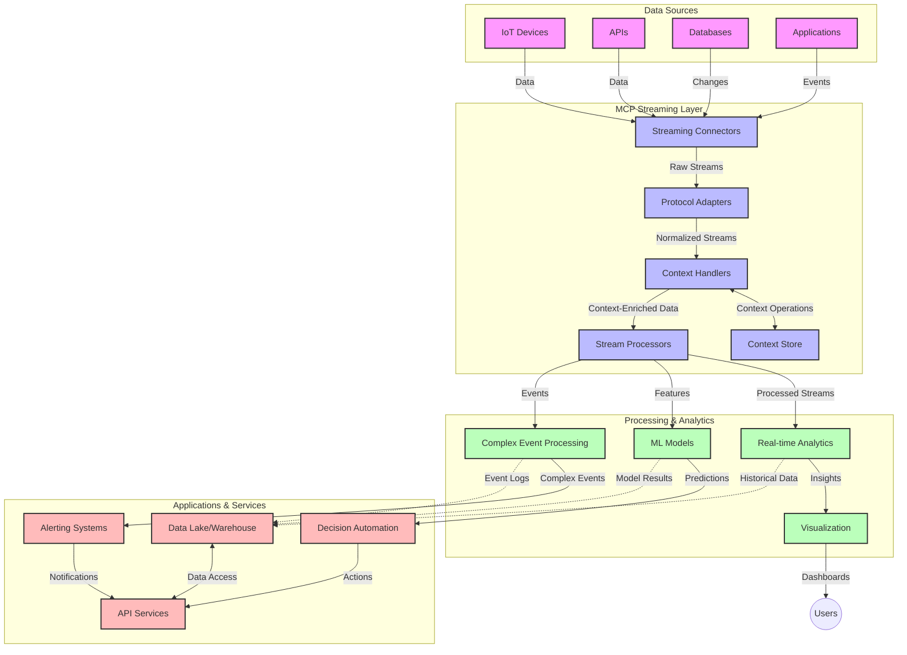

<!--
CO_OP_TRANSLATOR_METADATA:
{
  "original_hash": "b41174ac781ebf228b2043cbdfc09105",
  "translation_date": "2025-06-12T00:38:54+00:00",
  "source_file": "05-AdvancedTopics/mcp-realtimestreaming/README.md",
  "language_code": "he"
}
-->
# פרוטוקול הקשר של מודל לשידור נתונים בזמן אמת

## סקירה כללית

שידור נתונים בזמן אמת הפך חיוני בעולם המונחה נתונים של היום, שבו עסקים ויישומים זקוקים לגישה מיידית למידע כדי לקבל החלטות בזמן. פרוטוקול הקשר של מודל (MCP) מייצג התקדמות משמעותית באופטימיזציה של תהליכי השידור בזמן אמת הללו, משפר את יעילות עיבוד הנתונים, שומר על שלמות ההקשר ומשפר את ביצועי המערכת הכוללים.

מודול זה בוחן כיצד MCP משנה את שידור הנתונים בזמן אמת על ידי מתן גישה סטנדרטית לניהול הקשר בין מודלים של בינה מלאכותית, פלטפורמות שידור ויישומים.

## מבוא לשידור נתונים בזמן אמת

שידור נתונים בזמן אמת הוא פרדיגמת טכנולוגיה המאפשרת העברה, עיבוד וניתוח רציפים של נתונים בזמן שהם נוצרים, ומאפשרת למערכות להגיב מיידית למידע חדש. בניגוד לעיבוד באצוות המסורתי הפועל על מערכי נתונים סטטיים, השידור מעבד נתונים בתנועה, ומספק תובנות ופעולות עם השהייה מינימלית.

### מושגי יסוד בשידור נתונים בזמן אמת:

- **זרימת נתונים רציפה**: נתונים מעובדים כזרם מתמשך, בלתי פוסק של אירועים או רשומות.
- **עיבוד בהשהייה נמוכה**: מערכות מתוכננות למזער את הזמן בין יצירת הנתונים לעיבודם.
- **יכולת התרחבות**: ארכיטקטורות שידור חייבות להתמודד עם כמויות ומהירויות משתנות של נתונים.
- **עמידות לתקלות**: מערכות חייבות להיות עמידות בפני כשלים כדי להבטיח זרימת נתונים רציפה.
- **עיבוד מדורג בהקשר**: שמירה על ההקשר בין אירועים חיונית לניתוח משמעותי.

### פרוטוקול הקשר של מודל ושידור בזמן אמת

פרוטוקול הקשר של מודל (MCP) מתמודד עם מספר אתגרים מרכזיים בסביבות שידור בזמן אמת:

1. **המשכיות הקשר**: MCP מייצב כיצד ההקשר נשמר בין רכיבי השידור המפוזרים, ומבטיח שלמודלי הבינה המלאכותית ולצמתים העיבודיים תהיה גישה להקשר היסטורי וסביבתי רלוונטי.

2. **ניהול מדויק של מצב**: באמצעות מתן מנגנונים מובנים להעברת הקשר, MCP מפחית את העומס בניהול מצב בצינורות השידור.

3. **אינטרופרביליות**: MCP יוצר שפה משותפת לשיתוף הקשר בין טכנולוגיות שידור שונות ומודלים של בינה מלאכותית, ומאפשר ארכיטקטורות גמישות ומורחבות יותר.

4. **הקשר מותאם לשידור**: יישומי MCP יכולים להעדיף אילו אלמנטים של הקשר הם הרלוונטיים ביותר לקבלת החלטות בזמן אמת, ואופטימיזציה הן לביצועים והן לדיוק.

5. **עיבוד אדפטיבי**: עם ניהול הקשר נכון דרך MCP, מערכות השידור יכולות להתאים דינמית את העיבוד בהתבסס על תנאים ודפוסים משתנים בנתונים.

ביישומים מודרניים הנעים מרשתות חיישנים של IoT ועד פלטפורמות מסחר פיננסי, השילוב של MCP עם טכנולוגיות שידור מאפשר עיבוד חכם ומודע להקשר, המסוגל להגיב כראוי למצבים מורכבים ומתפתחים בזמן אמת.

## מטרות הלמידה

בסיום השיעור תוכל:

- להבין את היסודות של שידור נתונים בזמן אמת ואת האתגרים הכרוכים בו
- להסביר כיצד פרוטוקול הקשר של מודל (MCP) משפר את שידור הנתונים בזמן אמת
- ליישם פתרונות שידור מבוססי MCP באמצעות מסגרות פופולריות כמו Kafka ו-Pulsar
- לתכנן ולפרוס ארכיטקטורות שידור עמידות לתקלות ובעלות ביצועים גבוהים עם MCP
- להחיל מושגי MCP על מקרים שימוש ב-IoT, מסחר פיננסי וניתוח מבוסס בינה מלאכותית
- להעריך מגמות מתפתחות וחדשנויות עתידיות בטכנולוגיות שידור מבוססות MCP

### הגדרה ומשמעות

שידור נתונים בזמן אמת כולל יצירה, עיבוד והעברה רציפים של נתונים עם השהייה מינימלית. בניגוד לעיבוד באצוות, שבו הנתונים נאספים ומעובדים בקבוצות, נתוני השידור מעובדים באופן הדרגתי עם הגעתם, ומאפשרים תובנות ופעולות מיידיות.

מאפיינים מרכזיים של שידור נתונים בזמן אמת כוללים:

- **השהייה נמוכה**: עיבוד וניתוח נתונים בתוך מילישניות עד שניות
- **זרימה רציפה**: זרמי נתונים בלתי מופרעים ממקורות שונים
- **עיבוד מיידי**: ניתוח הנתונים עם הגעתם במקום באצוות
- **ארכיטקטורת מבוססת אירועים**: תגובה לאירועים כשהם מתרחשים

### אתגרים בשידור נתונים מסורתי

גישות שידור נתונים מסורתיות מתמודדות עם מספר מגבלות:

1. **אובדן הקשר**: קושי בשמירת ההקשר בין מערכות מפוזרות
2. **בעיות בהרחבה**: אתגרים בהרחבה לטיפול בכמויות גבוהות ומהירויות גבוהות של נתונים
3. **מורכבות אינטגרציה**: בעיות באינטרופרביליות בין מערכות שונות
4. **ניהול השהייה**: איזון בין קצב העברה לזמן עיבוד
5. **עקביות נתונים**: הבטחת דיוק ושלמות הנתונים לאורך הזרם

## הבנת פרוטוקול הקשר של מודל (MCP)

### מהו MCP?

פרוטוקול הקשר של מודל (MCP) הוא פרוטוקול תקשורת סטנדרטי שנועד להקל על אינטראקציה יעילה בין מודלים של בינה מלאכותית ליישומים. בהקשר של שידור נתונים בזמן אמת, MCP מספק מסגרת ל:

- שימור ההקשר לאורך צינור הנתונים
- סטנדרטיזציה של פורמטים להחלפת נתונים
- אופטימיזציה של שידור מערכי נתונים גדולים
- שיפור התקשורת בין מודל למודל ובין מודל ליישום

### רכיבים מרכזיים וארכיטקטורה

ארכיטקטורת MCP לשידור בזמן אמת מורכבת ממספר רכיבים מרכזיים:

1. **מנהליי הקשר**: מנהלים ושומרים על מידע הקשרי לאורך צינור השידור
2. **מעבדי השידור**: מעבדים זרמי נתונים נכנסים בשיטות מודעות להקשר
3. **מתאמי פרוטוקול**: ממירים בין פרוטוקולי שידור שונים תוך שמירת ההקשר
4. **מאגר הקשר**: מאחסן ומשחזר מידע הקשרי ביעילות
5. **מחברי שידור**: מתחברים לפלטפורמות שידור שונות (Kafka, Pulsar, Kinesis וכו')



### כיצד MCP משפר את טיפול הנתונים בזמן אמת

MCP מתמודד עם אתגרי השידור המסורתיים באמצעות:

- **שלמות הקשר**: שמירת הקשרים בין נקודות הנתונים לאורך כל הצינור
- **שידור מותאם**: הפחתת כפילויות בהחלפת נתונים באמצעות ניהול הקשר חכם
- **ממשקים סטנדרטיים**: מתן APIs עקביים לרכיבי השידור
- **הפחתת השהייה**: מזעור עומס העיבוד באמצעות טיפול יעיל בהקשר
- **הרחבה משופרת**: תמיכה בהרחבה אופקית תוך שמירת ההקשר

## אינטגרציה ויישום

מערכות שידור נתונים בזמן אמת דורשות תכנון ויישום ארכיטקטוני קפדני לשמירת ביצועים ושלמות הקשר. פרוטוקול הקשר של מודל מציע גישה סטנדרטית לאינטגרציה של מודלים של בינה מלאכותית וטכנולוגיות שידור, ומאפשר צינורות עיבוד מתוחכמים ומודעי הקשר.

### סקירת אינטגרציית MCP בארכיטקטורות שידור

יישום MCP בסביבות שידור בזמן אמת כולל מספר שיקולים מרכזיים:

1. **סיריאליזציה והעברת הקשר**: MCP מספק מנגנונים יעילים לקידוד מידע הקשר בתוך חבילות נתוני השידור, ומבטיח שההקשר החיוני ילווה את הנתונים לאורך כל צינור העיבוד. זה כולל פורמטים סטנדרטיים לסיריאליזציה מותאמים לשידור.

2. **עיבוד מדורג עם שמירת מצב**: MCP מאפשר עיבוד מדורג חכם יותר על ידי שמירה על ייצוג עקבי של ההקשר בצמתים השונים. זה חשוב במיוחד בארכיטקטורות שידור מפוזרות שבהן ניהול מצב הוא אתגר מסורתי.

3. **זמן אירוע לעומת זמן עיבוד**: יישומי MCP במערכות שידור חייבים להתמודד עם האתגר הנפוץ של הבחנה בין זמן האירוע לזמן העיבוד. הפרוטוקול יכול לשלב הקשר זמני השומר על סמנטיקת זמן האירוע.

4. **ניהול לחץ חוזר**: על ידי סטנדרטיזציה של טיפול בהקשר, MCP מסייע בניהול לחץ חוזר במערכות שידור, ומאפשר לרכיבים לתקשר את יכולות העיבוד שלהם ולהתאים את הזרימה בהתאם.

5. **חלונות הקשר ואגרגציה**: MCP מקל על פעולות חלונות מתוחכמות יותר על ידי מתן ייצוגים מובנים של הקשרים זמניים ויחסיים, ומאפשר אגרגציות משמעותיות יותר לאורך זרמי אירועים.

6. **עיבוד בדיוק-פעם-אחת**: במערכות שידור הדורשות סמנטיקה של עיבוד בדיוק-פעם-אחת, MCP יכול לשלב מטה-נתוני עיבוד שיעזרו במעקב ואימות סטטוס העיבוד בצמתים מפוזרים.

יישום MCP בטכנולוגיות שידור שונות יוצר גישה מאוחדת לניהול הקשר, ומפחית את הצורך בקוד אינטגרציה מותאם, תוך שיפור יכולת המערכת לשמור על הקשר משמעותי בעת זרימת הנתונים בצינור.

### MCP במסגרת מסגרות שידור נתונים שונות

דוגמאות אלו מבוססות על מפרט MCP הנוכחי המתמקד בפרוטוקול מבוסס JSON-RPC עם מנגנוני העברה מובחנים. הקוד מדגים כיצד ניתן ליישם מנגנוני העברה מותאמים המשולבים עם פלטפורמות שידור כמו Kafka ו-Pulsar תוך שמירה על תאימות מלאה לפרוטוקול MCP.

הדוגמאות נועדו להראות כיצד ניתן לשלב פלטפורמות שידור עם MCP כדי לספק עיבוד נתונים בזמן אמת תוך שמירת מודעות להקשר שהיא מרכזית ל-MCP. גישה זו מבטיחה שהדוגמאות משקפות במדויק את המצב הנוכחי של מפרט MCP נכון ליוני 2025.

MCP ניתן לשילוב עם מסגרות שידור פופולריות כולל:

#### אינטגרציה עם Apache Kafka

```python
import asyncio
import json
from typing import Dict, Any, Optional
from confluent_kafka import Consumer, Producer, KafkaError
from mcp.client import Client, ClientCapabilities
from mcp.core.message import JsonRpcMessage
from mcp.core.transports import Transport

# Custom transport class to bridge MCP with Kafka
class KafkaMCPTransport(Transport):
    def __init__(self, bootstrap_servers: str, input_topic: str, output_topic: str):
        self.bootstrap_servers = bootstrap_servers
        self.input_topic = input_topic
        self.output_topic = output_topic
        self.producer = Producer({'bootstrap.servers': bootstrap_servers})
        self.consumer = Consumer({
            'bootstrap.servers': bootstrap_servers,
            'group.id': 'mcp-client-group',
            'auto.offset.reset': 'earliest'
        })
        self.message_queue = asyncio.Queue()
        self.running = False
        self.consumer_task = None
        
    async def connect(self):
        """Connect to Kafka and start consuming messages"""
        self.consumer.subscribe([self.input_topic])
        self.running = True
        self.consumer_task = asyncio.create_task(self._consume_messages())
        return self
        
    async def _consume_messages(self):
        """Background task to consume messages from Kafka and queue them for processing"""
        while self.running:
            try:
                msg = self.consumer.poll(1.0)
                if msg is None:
                    await asyncio.sleep(0.1)
                    continue
                
                if msg.error():
                    if msg.error().code() == KafkaError._PARTITION_EOF:
                        continue
                    print(f"Consumer error: {msg.error()}")
                    continue
                
                # Parse the message value as JSON-RPC
                try:
                    message_str = msg.value().decode('utf-8')
                    message_data = json.loads(message_str)
                    mcp_message = JsonRpcMessage.from_dict(message_data)
                    await self.message_queue.put(mcp_message)
                except Exception as e:
                    print(f"Error parsing message: {e}")
            except Exception as e:
                print(f"Error in consumer loop: {e}")
                await asyncio.sleep(1)
    
    async def read(self) -> Optional[JsonRpcMessage]:
        """Read the next message from the queue"""
        try:
            message = await self.message_queue.get()
            return message
        except Exception as e:
            print(f"Error reading message: {e}")
            return None
    
    async def write(self, message: JsonRpcMessage) -> None:
        """Write a message to the Kafka output topic"""
        try:
            message_json = json.dumps(message.to_dict())
            self.producer.produce(
                self.output_topic,
                message_json.encode('utf-8'),
                callback=self._delivery_report
            )
            self.producer.poll(0)  # Trigger callbacks
        except Exception as e:
            print(f"Error writing message: {e}")
    
    def _delivery_report(self, err, msg):
        """Kafka producer delivery callback"""
        if err is not None:
            print(f'Message delivery failed: {err}')
        else:
            print(f'Message delivered to {msg.topic()} [{msg.partition()}]')
    
    async def close(self) -> None:
        """Close the transport"""
        self.running = False
        if self.consumer_task:
            self.consumer_task.cancel()
            try:
                await self.consumer_task
            except asyncio.CancelledError:
                pass
        self.consumer.close()
        self.producer.flush()

# Example usage of the Kafka MCP transport
async def kafka_mcp_example():
    # Create MCP client with Kafka transport
    client = Client(
        {"name": "kafka-mcp-client", "version": "1.0.0"},
        ClientCapabilities({})
    )
    
    # Create and connect the Kafka transport
    transport = KafkaMCPTransport(
        bootstrap_servers="localhost:9092",
        input_topic="mcp-responses",
        output_topic="mcp-requests"
    )
    
    await client.connect(transport)
    
    try:
        # Initialize the MCP session
        await client.initialize()
        
        # Example of executing a tool via MCP
        response = await client.execute_tool(
            "process_data",
            {
                "data": "sample data",
                "metadata": {
                    "source": "sensor-1",
                    "timestamp": "2025-06-12T10:30:00Z"
                }
            }
        )
        
        print(f"Tool execution response: {response}")
        
        # Clean shutdown
        await client.shutdown()
    finally:
        await transport.close()

# Run the example
if __name__ == "__main__":
    asyncio.run(kafka_mcp_example())
```

#### יישום Apache Pulsar

```python
import asyncio
import json
import pulsar
from typing import Dict, Any, Optional
from mcp.core.message import JsonRpcMessage
from mcp.core.transports import Transport
from mcp.server import Server, ServerOptions
from mcp.server.tools import Tool, ToolExecutionContext, ToolMetadata

# Create a custom MCP transport that uses Pulsar
class PulsarMCPTransport(Transport):
    def __init__(self, service_url: str, request_topic: str, response_topic: str):
        self.service_url = service_url
        self.request_topic = request_topic
        self.response_topic = response_topic
        self.client = pulsar.Client(service_url)
        self.producer = self.client.create_producer(response_topic)
        self.consumer = self.client.subscribe(
            request_topic,
            "mcp-server-subscription",
            consumer_type=pulsar.ConsumerType.Shared
        )
        self.message_queue = asyncio.Queue()
        self.running = False
        self.consumer_task = None
    
    async def connect(self):
        """Connect to Pulsar and start consuming messages"""
        self.running = True
        self.consumer_task = asyncio.create_task(self._consume_messages())
        return self
    
    async def _consume_messages(self):
        """Background task to consume messages from Pulsar and queue them for processing"""
        while self.running:
            try:
                # Non-blocking receive with timeout
                msg = self.consumer.receive(timeout_millis=500)
                
                # Process the message
                try:
                    message_str = msg.data().decode('utf-8')
                    message_data = json.loads(message_str)
                    mcp_message = JsonRpcMessage.from_dict(message_data)
                    await self.message_queue.put(mcp_message)
                    
                    # Acknowledge the message
                    self.consumer.acknowledge(msg)
                except Exception as e:
                    print(f"Error processing message: {e}")
                    # Negative acknowledge if there was an error
                    self.consumer.negative_acknowledge(msg)
            except Exception as e:
                # Handle timeout or other exceptions
                await asyncio.sleep(0.1)
    
    async def read(self) -> Optional[JsonRpcMessage]:
        """Read the next message from the queue"""
        try:
            message = await self.message_queue.get()
            return message
        except Exception as e:
            print(f"Error reading message: {e}")
            return None
    
    async def write(self, message: JsonRpcMessage) -> None:
        """Write a message to the Pulsar output topic"""
        try:
            message_json = json.dumps(message.to_dict())
            self.producer.send(message_json.encode('utf-8'))
        except Exception as e:
            print(f"Error writing message: {e}")
    
    async def close(self) -> None:
        """Close the transport"""
        self.running = False
        if self.consumer_task:
            self.consumer_task.cancel()
            try:
                await self.consumer_task
            except asyncio.CancelledError:
                pass
        self.consumer.close()
        self.producer.close()
        self.client.close()

# Define a sample MCP tool that processes streaming data
@Tool(
    name="process_streaming_data",
    description="Process streaming data with context preservation",
    metadata=ToolMetadata(
        required_capabilities=["streaming"]
    )
)
async def process_streaming_data(
    ctx: ToolExecutionContext,
    data: str,
    source: str,
    priority: str = "medium"
) -> Dict[str, Any]:
    """
    Process streaming data while preserving context
    
    Args:
        ctx: Tool execution context
        data: The data to process
        source: The source of the data
        priority: Priority level (low, medium, high)
        
    Returns:
        Dict containing processed results and context information
    """
    # Example processing that leverages MCP context
    print(f"Processing data from {source} with priority {priority}")
    
    # Access conversation context from MCP
    conversation_id = ctx.conversation_id if hasattr(ctx, 'conversation_id') else "unknown"
    
    # Return results with enhanced context
    return {
        "processed_data": f"Processed: {data}",
        "context": {
            "conversation_id": conversation_id,
            "source": source,
            "priority": priority,
            "processing_timestamp": ctx.get_current_time_iso()
        }
    }

# Example MCP server implementation using Pulsar transport
async def run_mcp_server_with_pulsar():
    # Create MCP server
    server = Server(
        {"name": "pulsar-mcp-server", "version": "1.0.0"},
        ServerOptions(
            capabilities={"streaming": True}
        )
    )
    
    # Register our tool
    server.register_tool(process_streaming_data)
    
    # Create and connect Pulsar transport
    transport = PulsarMCPTransport(
        service_url="pulsar://localhost:6650",
        request_topic="mcp-requests",
        response_topic="mcp-responses"
    )
    
    try:
        # Start the server with the Pulsar transport
        await server.run(transport)
    finally:
        await transport.close()

# Run the server
if __name__ == "__main__":
    asyncio.run(run_mcp_server_with_pulsar())
```

### שיטות מומלצות לפריסה

בעת יישום MCP לשידור בזמן אמת:

1. **עיצוב לעמידות לתקלות**:
   - יישום טיפול שגיאות מתאים
   - שימוש בתורים למסרונים שנכשלו
   - תכנון מעבדים אִדֶמְפּוֹטֶנְטִיים

2. **אופטימיזציה לביצועים**:
   - קביעת גדלי מאגר מתאימים
   - שימוש באצוות במידת הצורך
   - יישום מנגנוני לחץ חוזר

3. **ניטור ותצפית**:
   - מעקב אחרי מדדי עיבוד השידור
   - ניטור הפצת הקשר
   - הקמת התראות על חריגות

4. **אבטחת הזרמים שלך**:
   - יישום הצפנה לנתונים רגישים
   - שימוש באימות והרשאות
   - החלת בקרות גישה מתאימות

### MCP ב-IoT ומחשוב קצה

MCP משפר את שידור ה-IoT על ידי:

- שמירת הקשר המכשירי לאורך צינור העיבוד
- אפשרות שידור נתונים יעילה מקצה לענן
- תמיכה בניתוח בזמן אמת על זרמי נתוני IoT
- הקלת תקשורת מכשיר-למכשיר עם הקשר

דוגמה: רשתות חיישנים של עיר חכמה  
```
Sensors → Edge Gateways → MCP Stream Processors → Real-time Analytics → Automated Responses
```

### תפקיד בעסקאות פיננסיות ובמסחר בתדירות גבוהה

MCP מספק יתרונות משמעותיים לשידור נתונים פיננסיים:

- עיבוד השהייה נמוכה במיוחד להחלטות מסחר
- שמירת הקשר העסקה לאורך כל העיבוד
- תמיכה בעיבוד אירועים מורכב עם מודעות להקשר
- הבטחת עקביות נתונים במערכות מסחר מפוזרות

### שיפור ניתוח נתונים מבוסס בינה מלאכותית

MCP פותח אפשרויות חדשות לניתוח שידורי:

- אימון והסקת מודלים בזמן אמת
- למידה רציפה מנתוני שידור
- חילוץ תכונות מודע הקשר
- צינורות הסקה רב-מודליים עם הקשר שמור

## מגמות וחדשנויות עתידיות

### התפתחות MCP בסביבות זמן אמת

בהסתכלות קדימה, אנו צופים ש-MCP יתפתח כדי להתמודד עם:

- **אינטגרציה של מחשוב קוונטי**: הכנה למערכות שידור מבוססות קוונטום
- **עיבוד ילידי קצה**: העברת עיבוד מודע הקשר למכשירי קצה
- **ניהול שידור אוטונומי**: צינורות שידור המתאימים את עצמם באופן עצמאי
- **שידור מאוחד**: עיבוד מפוזר תוך שמירה על פרטיות

### התקדמויות טכנולוגיות פוטנציאליות

טכנולוגיות מתפתחות שיעצבו את עתיד השידור ב-MCP:

1. **פרוטוקולי שידור מותאמים לבינה מלאכותית**: פרוטוקולים מותאמים במיוחד לעומסי עבודה של AI
2. **אינטגרציה של מחשוב נוירומורפי**: מחשוב בהשראת המוח לעיבוד שידורים
3. **שידור ללא שרת**: שידור מבוסס אירועים, מדרגי ללא ניהול תשתית
4. **מאגרי הקשר מבוזרים**: ניהול הקשר גלובלי, עקבי מאוד

## תרגילים מעשיים

### תרגיל 1: הקמת צינור שידור בסיסי ב-MCP

בתרגיל זה תלמד כיצד:

- להגדיר סביבה בסיסית לשידור MCP
- ליישם מנהלי קשר לעיבוד שידור
- לבדוק ולאמת את שמירת ההקשר

### תרגיל 2: בניית לוח מחוונים לניתוח בזמן אמת

צור יישום שלם ש:

- מקבל נתוני שידור באמצעות MCP
- מעבד את הזרם תוך שמירת הקשר
- מציג תוצאות בזמן אמת

### תרגיל 3: יישום עיבוד אירועים מורכב עם MCP

תרגיל מתקדם המכסה:

- זיהוי דפוסים בזרמים
- קורלציה הקשרית בין זרמים מרובים
- יצירת אירועים מורכבים עם הקשר שמור

## משאבים נוספים

- [Model Context Protocol Specification](https://github.com/modelcontextprotocol) - מפרט ותיעוד רשמי של MCP  
- [Apache Kafka Documentation](https://kafka.apache.org/documentation/) - למידה על Kafka לעיבוד שידור  
- [Apache Pulsar](https://pulsar.apache.org/) - פלטפורמת הודעות ושידור מאוחדת  
- [Streaming Systems: The What, Where, When, and How of Large-Scale Data Processing](https://www.oreilly.com/library/view/streaming-systems/9781491983867/) - ספר מקיף על ארכיטקטורות שידור  
- [Microsoft Azure Event Hubs](https://learn.microsoft.com/azure/event-hubs/event-hubs-about) - שירות שידור אירועים מנוהל  
- [MLflow Documentation](https://mlflow.org/docs/latest/index.html) - למעקב ופריסת מודלים של למידת מכונה  
- [Real-Time Analytics with Apache Storm](https://storm.apache.org/releases/current/index.html) - מסגרת עיבוד בזמן אמת  
- [Flink ML](https://nightlies.apache.org/flink/flink-ml-docs-master/) - ספריית למידת מכונה ל-Apache Flink  
- [LangChain Documentation](https://python.langchain.com/docs/get_started/introduction) - בניית יישומים עם LLMs

## תוצאות הלמידה

בסיום מודול זה, תוכל:

- להבין את היסודות של

**כתב ויתור**:  
מסמך זה תורגם באמצעות שירות תרגום מבוסס בינה מלאכותית [Co-op Translator](https://github.com/Azure/co-op-translator). למרות שאנו שואפים לדיוק, יש לקחת בחשבון כי תרגומים אוטומטיים עלולים להכיל שגיאות או אי-דיוקים. המסמך המקורי בשפת המקור שלו הוא המקור הסמכותי שיש להסתמך עליו. למידע קריטי מומלץ להשתמש בתרגום מקצועי של מתרגם אנושי. אנו לא נושאים באחריות לכל אי-הבנה או פרשנות שגויה הנובעת משימוש בתרגום זה.