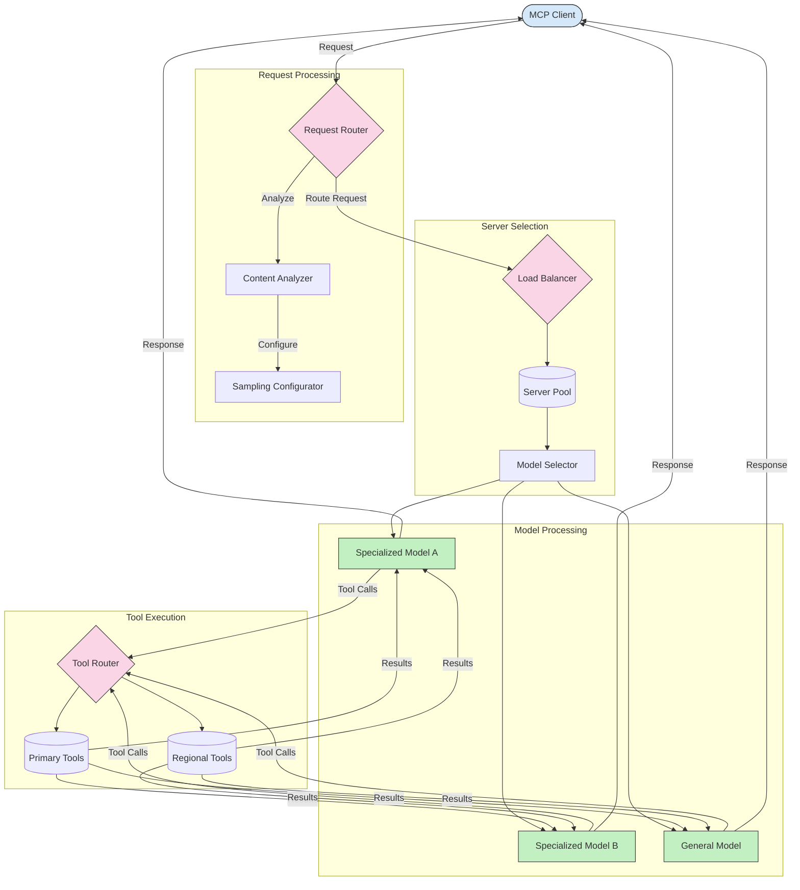

<!--
CO_OP_TRANSLATOR_METADATA:
{
  "original_hash": "2f1b473818b5a6cc9a9bbf777fffa6d4",
  "translation_date": "2025-07-14T21:49:09+00:00",
  "source_file": "05-AdvancedTopics/mcp-routing/README.md",
  "language_code": "he"
}
-->
## דגימה וארכיטקטורת ניתוב ב-MCP

דגימה היא רכיב קריטי בפרוטוקול הקשר למודל (MCP) שמאפשר עיבוד וניתוב יעיל של בקשות. היא כוללת ניתוח של בקשות נכנסות כדי לקבוע את המודל או השירות המתאים ביותר לטיפול בהן, בהתבסס על קריטריונים שונים כמו סוג התוכן, הקשר המשתמש ועומס המערכת.

ניתן לשלב דגימה וניתוב ליצירת ארכיטקטורה חזקה שממקסמת את ניצול המשאבים ומבטיחה זמינות גבוהה. תהליך הדגימה יכול לשמש לסיווג הבקשות, בעוד שהניתוב מפנה אותן למודלים או שירותים המתאימים.

הדיאגרמה למטה ממחישה כיצד דגימה וניתוב פועלים יחד בארכיטקטורה מקיפה של MCP:

## מה הלאה

- [5.6 דגימה](../mcp-sampling/README.md)

**כתב ויתור**:  
מסמך זה תורגם באמצעות שירות תרגום מבוסס בינה מלאכותית [Co-op Translator](https://github.com/Azure/co-op-translator). למרות שאנו שואפים לדיוק, יש לקחת בחשבון כי תרגומים אוטומטיים עלולים להכיל שגיאות או אי-דיוקים. המסמך המקורי בשפת המקור שלו נחשב למקור הסמכותי. למידע קריטי מומלץ להשתמש בתרגום מקצועי על ידי מתרגם אנושי. אנו לא נושאים באחריות לכל אי-הבנה או פרשנות שגויה הנובעת משימוש בתרגום זה.