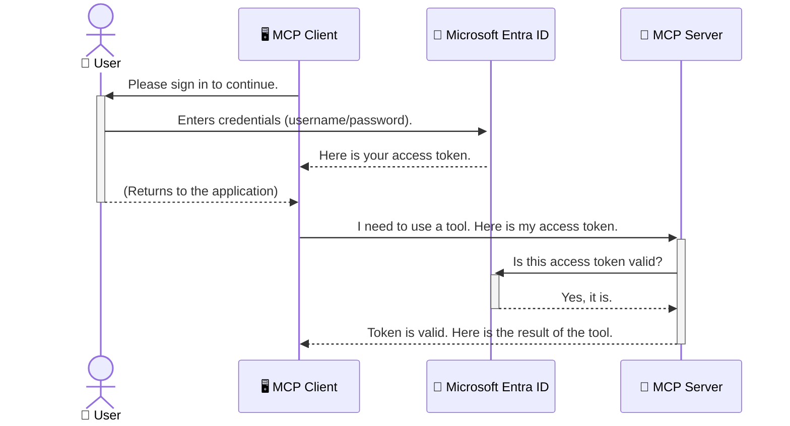

<!--
CO_OP_TRANSLATOR_METADATA:
{
  "original_hash": "9abe1d303ab126f9a8b87f03cebe5213",
  "translation_date": "2025-06-26T14:52:56+00:00",
  "source_file": "05-AdvancedTopics/mcp-security-entra/README.md",
  "language_code": "he"
}
-->
# אבטחת זרימות עבודה של AI: אימות Entra ID עבור שרתי Model Context Protocol

## הקדמה  
אבטחת שרת Model Context Protocol (MCP) שלך חשובה לא פחות מלהנעל את הדלת הראשית של הבית שלך. השארת שרת MCP פתוח חושפת את הכלים והנתונים שלך לגישה לא מורשית, שעלולה לגרום לפרצות אבטחה. Microsoft Entra ID מספק פתרון ניהול זהויות וגישה מבוסס ענן חזק, שמסייע לוודא שרק משתמשים ויישומים מורשים יכולים לתקשר עם שרת ה-MCP שלך. בחלק זה תלמד כיצד להגן על זרימות העבודה של ה-AI שלך באמצעות אימות Entra ID.

## מטרות הלמידה  
בסוף חלק זה תוכל:

- להבין את החשיבות של אבטחת שרתי MCP.  
- להסביר את היסודות של Microsoft Entra ID ואימות OAuth 2.0.  
- להבחין בין לקוחות ציבוריים ללקוחות סודיים.  
- ליישם אימות Entra ID בתרחישי שרת MCP מקומי (לקוח ציבורי) ומרוחק (לקוח סודי).  
- ליישם שיטות עבודה מומלצות לאבטחה בעת פיתוח זרימות עבודה של AI.

# אבטחת זרימות עבודה של AI: אימות Entra ID עבור שרתי Model Context Protocol

כמו שלא תשאיר את הדלת הראשית של הבית שלך פתוחה, כך אסור להשאיר את שרת ה-MCP שלך פתוח לגישה חופשית. אבטחת זרימות העבודה של ה-AI חיונית לבניית יישומים חזקים, אמינים ובטוחים. בפרק זה תכיר כיצד להשתמש ב-Microsoft Entra ID כדי לאבטח את שרתי ה-MCP שלך, ולהבטיח שרק משתמשים ויישומים מורשים יוכלו לגשת לכלים ולנתונים שלך.

## למה אבטחה חשובה עבור שרתי MCP

דמיין ששרת ה-MCP שלך כולל כלי שיכול לשלוח מיילים או לגשת למאגר נתוני לקוחות. שרת לא מאובטח משמעותו שכל אחד יכול להשתמש בכלי הזה, מה שעלול לגרום לגישה לא מורשית לנתונים, ספאם או פעילויות זדוניות אחרות.

באמצעות יישום אימות, אתה מבטיח שכל בקשה לשרת שלך תעבור אימות, המאשר את זהות המשתמש או היישום המבקש. זהו הצעד הראשון והחשוב ביותר באבטחת זרימות העבודה של ה-AI שלך.

## מבוא ל-Microsoft Entra ID

**Microsoft Entra ID** היא שירות ניהול זהויות וגישה מבוסס ענן. תחשוב עליו כשומר ביטחון אוניברסלי ליישומים שלך. הוא מטפל בתהליך המורכב של אימות זהויות משתמשים (authentication) וקביעת ההרשאות שלהם (authorization).

באמצעות Entra ID תוכל:

- לאפשר כניסה מאובטחת למשתמשים.  
- להגן על APIs ושירותים.  
- לנהל מדיניות גישה ממקום מרכזי.

עבור שרתי MCP, Entra ID מספק פתרון חזק ומוכר לניהול מי יכול לגשת ליכולות השרת שלך.

---

## הבנת הקסם: איך עובד אימות Entra ID

Entra ID משתמש בסטנדרטים פתוחים כמו **OAuth 2.0** לטיפול באימות. למרות שהפרטים יכולים להיות מורכבים, הרעיון המרכזי פשוט וניתן להבין אותו באמצעות דימוי.

### מבוא עדין ל-OAuth 2.0: מפתח החניית הרכב

תחשוב על OAuth 2.0 כמו שירות חניית רכב. כשאתה מגיע למסעדה, אינך נותן לחניין את מפתח הרכב הראשי שלך. במקום זאת, אתה נותן לו **מפתח חנייה** עם הרשאות מוגבלות — הוא יכול להניע את הרכב ולנעול את הדלתות, אבל לא יכול לפתוח את תא המטען או את תא הכפפות.

בדימוי הזה:

- **אתה** הוא ה-**משתמש**.  
- **הרכב שלך** הוא **שרת ה-MCP** עם הכלים והנתונים החשובים.  
- ה-**חניין** הוא **Microsoft Entra ID**.  
- ה-**שומר החנייה** הוא **לקוח ה-MCP** (היישום שמנסה לגשת לשרת).  
- **מפתח החנייה** הוא **Access Token**.

טוקן הגישה הוא מחרוזת מאובטחת שהלקוח מקבל מ-Entra ID לאחר שאתה נכנס. הלקוח מציג את הטוקן הזה לשרת ה-MCP בכל בקשה. השרת יכול לאמת את הטוקן כדי לוודא שהבקשה חוקית ושהלקוח בעל ההרשאות הדרושות, כל זאת מבלי לטפל בפרטי ההתחברות שלך (כמו סיסמה).

### זרימת האימות

כך התהליך עובד בפועל:



### היכרות עם ספריית האימות של Microsoft (MSAL)

לפני שנצלול לקוד, חשוב להכיר רכיב מרכזי שתראה בדוגמאות: **Microsoft Authentication Library (MSAL)**.

MSAL היא ספרייה שפותחה על ידי מיקרוסופט שמקלה מאוד על מפתחים לטפל באימות. במקום שתצטרך לכתוב את כל הקוד המורכב לניהול טוקנים, כניסות וחידוש סשנים, MSAL עושה את העבודה הקשה עבורך.

שימוש בספרייה כמו MSAL מומלץ מאוד כי:

- **היא מאובטחת:** מיישמת פרוטוקולים וסטנדרטים בטיחותיים מוכרים בתעשייה, ומפחיתה את הסיכון לפגיעויות בקוד שלך.  
- **מפשטת את הפיתוח:** מסתירה את המורכבות של פרוטוקולי OAuth 2.0 ו-OpenID Connect, ומאפשרת להוסיף אימות חזק ליישום שלך בכמה שורות קוד בלבד.  
- **מתוחזקת:** מיקרוסופט מעדכנת ומשפרת את MSAL בהתמדה כדי להתמודד עם איומי אבטחה חדשים ושינויים בפלטפורמות.

MSAL תומכת במגוון רחב של שפות ומסגרות עבודה, כולל .NET, JavaScript/TypeScript, Python, Java, Go ופלטפורמות מובייל כמו iOS ואנדרואיד. משמעות הדבר שתוכל להשתמש בדפוסי אימות עקביים בכל טכנולוגיות המערכת שלך.

למידע נוסף על MSAL, ניתן לעיין בתיעוד הרשמי של [סקירת MSAL](https://learn.microsoft.com/entra/identity-platform/msal-overview).

---

## אבטחת שרת MCP עם Entra ID: מדריך שלב-אחר-שלב

כעת, נעבור כיצד לאבטח שרת MCP מקומי (שמתקשר דרך `stdio`) using Entra ID. This example uses a **public client**, which is suitable for applications running on a user's machine, like a desktop app or a local development server.

### Scenario 1: Securing a Local MCP Server (with a Public Client)

In this scenario, we'll look at an MCP server that runs locally, communicates over `stdio`, and uses Entra ID to authenticate the user before allowing access to its tools. The server will have a single tool that fetches the user's profile information from the Microsoft Graph API.

#### 1. Setting Up the Application in Entra ID

Before writing any code, you need to register your application in Microsoft Entra ID. This tells Entra ID about your application and grants it permission to use the authentication service.

1. Navigate to the **[Microsoft Entra portal](https://entra.microsoft.com/)**.
2. Go to **App registrations** and click **New registration**.
3. Give your application a name (e.g., "My Local MCP Server").
4. For **Supported account types**, select **Accounts in this organizational directory only**.
5. You can leave the **Redirect URI** blank for this example.
6. Click **Register**.

Once registered, take note of the **Application (client) ID** and **Directory (tenant) ID**. You'll need these in your code.

#### 2. The Code: A Breakdown

Let's look at the key parts of the code that handle authentication. The full code for this example is available in the [Entra ID - Local - WAM](https://github.com/Azure-Samples/mcp-auth-servers/tree/main/src/entra-id-local-wam) folder of the [mcp-auth-servers GitHub repository](https://github.com/Azure-Samples/mcp-auth-servers).

**`AuthenticationService.cs`**

This class is responsible for handling the interaction with Entra ID.

- **`CreateAsync`**: This method initializes the `PublicClientApplication` from the MSAL (Microsoft Authentication Library). It's configured with your application's `clientId` and `tenantId`.
- **`WithBroker`**: This enables the use of a broker (like the Windows Web Account Manager), which provides a more secure and seamless single sign-on experience.
- **`AcquireTokenAsync`**: זו השיטה המרכזית. היא מנסה תחילה לקבל טוקן באופן שקט (כלומר, המשתמש לא יצטרך להיכנס שוב אם כבר יש לו סשן תקף). אם לא ניתן לקבל טוקן שקט, תתבקש כניסה אינטראקטיבית.

```csharp
// Simplified for clarity
public static async Task<AuthenticationService> CreateAsync(ILogger<AuthenticationService> logger)
{
    var msalClient = PublicClientApplicationBuilder
        .Create(_clientId) // Your Application (client) ID
        .WithAuthority(AadAuthorityAudience.AzureAdMyOrg)
        .WithTenantId(_tenantId) // Your Directory (tenant) ID
        .WithBroker(new BrokerOptions(BrokerOptions.OperatingSystems.Windows))
        .Build();

    // ... cache registration ...

    return new AuthenticationService(logger, msalClient);
}

public async Task<string> AcquireTokenAsync()
{
    try
    {
        // Try silent authentication first
        var accounts = await _msalClient.GetAccountsAsync();
        var account = accounts.FirstOrDefault();

        AuthenticationResult? result = null;

        if (account != null)
        {
            result = await _msalClient.AcquireTokenSilent(_scopes, account).ExecuteAsync();
        }
        else
        {
            // If no account, or silent fails, go interactive
            result = await _msalClient.AcquireTokenInteractive(_scopes).ExecuteAsync();
        }

        return result.AccessToken;
    }
    catch (Exception ex)
    {
        _logger.LogError(ex, "An error occurred while acquiring the token.");
        throw; // Optionally rethrow the exception for higher-level handling
    }
}
```

**`Program.cs`**

This is where the MCP server is set up and the authentication service is integrated.

- **`AddSingleton<AuthenticationService>`**: This registers the `AuthenticationService` with the dependency injection container, so it can be used by other parts of the application (like our tool).
- **`GetUserDetailsFromGraph` tool**: This tool requires an instance of `AuthenticationService`. Before it does anything, it calls `authService.AcquireTokenAsync()` משמש לקבלת טוקן גישה תקף. אם האימות מצליח, משתמשים בטוקן לקריאה ל-Microsoft Graph API כדי לקבל את פרטי המשתמש.

```csharp
// Simplified for clarity
[McpServerTool(Name = "GetUserDetailsFromGraph")]
public static async Task<string> GetUserDetailsFromGraph(
    AuthenticationService authService)
{
    try
    {
        // This will trigger the authentication flow
        var accessToken = await authService.AcquireTokenAsync();

        // Use the token to create a GraphServiceClient
        var graphClient = new GraphServiceClient(
            new BaseBearerTokenAuthenticationProvider(new TokenProvider(authService)));

        var user = await graphClient.Me.GetAsync();

        return System.Text.Json.JsonSerializer.Serialize(user);
    }
    catch (Exception ex)
    {
        return $"Error: {ex.Message}";
    }
}
```

#### 3. איך הכל עובד יחד

1. כאשר לקוח ה-MCP מנסה להשתמש ב-`GetUserDetailsFromGraph` tool, the tool first calls `AcquireTokenAsync`.
2. `AcquireTokenAsync` triggers the MSAL library to check for a valid token.
3. If no token is found, MSAL, through the broker, will prompt the user to sign in with their Entra ID account.
4. Once the user signs in, Entra ID issues an access token.
5. The tool receives the token and uses it to make a secure call to the Microsoft Graph API.
6. The user's details are returned to the MCP client.

This process ensures that only authenticated users can use the tool, effectively securing your local MCP server.

### Scenario 2: Securing a Remote MCP Server (with a Confidential Client)

When your MCP server is running on a remote machine (like a cloud server) and communicates over a protocol like HTTP Streaming, the security requirements are different. In this case, you should use a **confidential client** and the **Authorization Code Flow**. This is a more secure method because the application's secrets are never exposed to the browser.

This example uses a TypeScript-based MCP server that uses Express.js to handle HTTP requests.

#### 1. Setting Up the Application in Entra ID

The setup in Entra ID is similar to the public client, but with one key difference: you need to create a **client secret**.

1. Navigate to the **[Microsoft Entra portal](https://entra.microsoft.com/)**.
2. In your app registration, go to the **Certificates & secrets** tab.
3. Click **New client secret**, give it a description, and click **Add**.
4. **Important:** Copy the secret value immediately. You will not be able to see it again.
5. You also need to configure a **Redirect URI**. Go to the **Authentication** tab, click **Add a platform**, select **Web**, and enter the redirect URI for your application (e.g., `http://localhost:3001/auth/callback`).

> **⚠️ Important Security Note:** For production applications, Microsoft strongly recommends using **secretless authentication** methods such as **Managed Identity** or **Workload Identity Federation** instead of client secrets. Client secrets pose security risks as they can be exposed or compromised. Managed identities provide a more secure approach by eliminating the need to store credentials in your code or configuration.
>
> For more information about managed identities and how to implement them, see the [Managed identities for Azure resources overview](https://learn.microsoft.com/entra/identity/managed-identities-azure-resources/overview).

#### 2. The Code: A Breakdown

This example uses a session-based approach. When the user authenticates, the server stores the access token and refresh token in a session and gives the user a session token. This session token is then used for subsequent requests. The full code for this example is available in the [Entra ID - Confidential client](https://github.com/Azure-Samples/mcp-auth-servers/tree/main/src/entra-id-cca-session) folder of the [mcp-auth-servers GitHub repository](https://github.com/Azure-Samples/mcp-auth-servers).

**`Server.ts`**

This file sets up the Express server and the MCP transport layer.

- **`requireBearerAuth`**: This is middleware that protects the `/sse` and `/message` endpoints. It checks for a valid bearer token in the `Authorization` header of the request.
- **`EntraIdServerAuthProvider`**: This is a custom class that implements the `McpServerAuthorizationProvider` interface. It's responsible for handling the OAuth 2.0 flow.
- **`/auth/callback`**: נקודת הקצה הזו מטפלת בהפניה מ-Entra ID לאחר שהמשתמש אותת. היא מחליפה את קוד ההרשאה בטוקן גישה וטוקן רענון.

```typescript
// Simplified for clarity
const app = express();
const { server } = createServer();
const provider = new EntraIdServerAuthProvider();

// Protect the SSE endpoint
app.get("/sse", requireBearerAuth({
  provider,
  requiredScopes: ["User.Read"]
}), async (req, res) => {
  // ... connect to the transport ...
});

// Protect the message endpoint
app.post("/message", requireBearerAuth({
  provider,
  requiredScopes: ["User.Read"]
}), async (req, res) => {
  // ... handle the message ...
});

// Handle the OAuth 2.0 callback
app.get("/auth/callback", (req, res) => {
  provider.handleCallback(req.query.code, req.query.state)
    .then(result => {
      // ... handle success or failure ...
    });
});
```

**`Tools.ts`**

This file defines the tools that the MCP server provides. The `getUserDetails` הוא כלי דומה לזה שבדוגמה הקודמת, אך מקבל את טוקן הגישה מהסשן.

```typescript
// Simplified for clarity
server.setRequestHandler(CallToolRequestSchema, async (request) => {
  const { name } = request.params;
  const context = request.params?.context as { token?: string } | undefined;
  const sessionToken = context?.token;

  if (name === ToolName.GET_USER_DETAILS) {
    if (!sessionToken) {
      throw new AuthenticationError("Authentication token is missing or invalid. Ensure the token is provided in the request context.");
    }

    // Get the Entra ID token from the session store
    const tokenData = tokenStore.getToken(sessionToken);
    const entraIdToken = tokenData.accessToken;

    const graphClient = Client.init({
      authProvider: (done) => {
        done(null, entraIdToken);
      }
    });

    const user = await graphClient.api('/me').get();

    // ... return user details ...
  }
});
```

**`auth/EntraIdServerAuthProvider.ts`**

This class handles the logic for:

- Redirecting the user to the Entra ID sign-in page.
- Exchanging the authorization code for an access token.
- Storing the tokens in the `tokenStore`.
- Refreshing the access token when it expires.

#### 3. How It All Works Together

1. When a user first tries to connect to the MCP server, the `requireBearerAuth` middleware will see that they don't have a valid session and will redirect them to the Entra ID sign-in page.
2. The user signs in with their Entra ID account.
3. Entra ID redirects the user back to the `/auth/callback` endpoint with an authorization code.
4. The server exchanges the code for an access token and a refresh token, stores them, and creates a session token which is sent to the client.
5. The client can now use this session token in the `Authorization` header for all future requests to the MCP server.
6. When the `getUserDetails` כאשר הכלי נקרא, הוא משתמש בטוקן מהסשן כדי לאתר את טוקן הגישה מ-Entra ID ואז משתמש בו לקריאה ל-Microsoft Graph API.

זרימה זו מורכבת יותר מזו של הלקוח הציבורי, אך נדרשת לנקודות קצה שנגישות דרך האינטרנט הציבורי. מאחר ששרתי MCP מרוחקים חשופים לאינטרנט, נדרשות אמצעי אבטחה חזקים יותר להגנה מפני גישה לא מורשית ותקיפות פוטנציאליות.

## שיטות עבודה מומלצות לאבטחה

- **תמיד השתמש ב-HTTPS**: הצפן את התקשורת בין הלקוח לשרת כדי להגן על הטוקנים מיירוט.  
- **יישם בקרת גישה מבוססת תפקידים (RBAC)**: אל תבדוק רק *אם* המשתמש אותת; בדוק *מה* הוא מורשה לעשות. ניתן להגדיר תפקידים ב-Entra ID ולבדוק אותם בשרת ה-MCP.  
- **נטר ובצע ביקורת**: תעד את כל אירועי האימות כדי לזהות ולפעול נגד פעילות חשודה.  
- **טפל בהגבלת קצב (rate limiting) ובהאטות (throttling)**: Microsoft Graph ו-APIs אחרים מיישמים הגבלות קצב למניעת שימוש לרעה. יישם לוגיקת backoff אקספוננציאלית וניסיונות חוזרים בשרת ה-MCP כדי לטפל בנימוס בתגובות HTTP 429 (בקשות רבות מדי). שקול מטמון לנתונים הנגישים תדיר להפחתת קריאות API.  
- **אחסן טוקנים בצורה מאובטחת**: אחסן את טוקני הגישה והרענון באופן מאובטח. ביישומים מקומיים השתמש במנגנוני אחסון מאובטח של המערכת. ביישומי שרת שקול שימוש באחסון מוצפן או שירותי ניהול מפתחות מאובטחים כמו Azure Key Vault.  
- **טיפול בתוקף הטוקן**: לטוקני גישה יש תוקף מוגבל. יישם חידוש אוטומטי של טוקנים באמצעות טוקני רענון כדי לשמור על חוויית משתמש חלקה ללא צורך באימות חוזר.  
- **שקול שימוש ב-Azure API Management**: למרות שאבטחה ישירה בשרת ה-MCP נותנת שליטה מדויקת, שערי API כמו Azure API Management יכולים לטפל ברוב סוגיות האבטחה באופן אוטומטי, כולל אימות, הרשאה, הגבלת קצב ומעקב. הם מספקים שכבת אבטחה מרכזית בין הלקוחות לשרתי ה-MCP. לפרטים נוספים על שימוש בשערי API עם MCP, ראה את [Azure API Management Your Auth Gateway For MCP Servers](https://techcommunity.microsoft.com/blog/integrationsonazureblog/azure-api-management-your-auth-gateway-for-mcp-servers/4402690).

## נקודות עיקריות לזכור

- אבטחת שרת ה-MCP חיונית להגנה על הנתונים והכלים שלך.  
- Microsoft Entra ID מספק פתרון חזק וניתן להרחבה לאימות והרשאה.  
- השתמש ב-**לקוח ציבורי** עבור יישומים מקומיים וב-**לקוח סודי** עבור שרתים מרוחקים.  
- **Authorization Code Flow** הוא האופציה המאובטחת ביותר ליישומי רשת.

## תרגיל

1. חשוב על שרת MCP שאתה עשוי לבנות. האם הוא יהיה שרת מקומי או מרוחק?  
2. בהתבסס על התשובה, האם תשתמש בלקוח ציבורי או סודי?  
3. איזו הרשאה יבקש שרת ה-MCP שלך לביצוע פעולות מול Microsoft Graph?

## תרגילים מעשיים

### תרגיל 1: רישום יישום ב-Entra ID  
גש לפורטל Microsoft Entra.  
רשום יישום חדש עבור שרת ה-MCP שלך.  
רשום את מזהה היישום (client ID) ואת מזהה התיקייה (tenant ID).

### תרגיל 2: אבטחת שרת MCP מקומי (לקוח ציבורי)  
עקוב אחרי דוגמת הקוד לשילוב MSAL (Microsoft Authentication Library) לאימות משתמש.  
בדוק את זרימת האימות על ידי קריאה לכלי MCP שמושך פרטי משתמש מ-Microsoft Graph.

### תרגיל 3: אבטחת שרת MCP מרוחק (לקוח סודי)  
רשום לקוח סודי ב-Entra ID ויצר סוד לקוח.  
הגדר את שרת ה-Express.js שלך להשתמש ב-Authorization Code Flow.  
בדוק את נקודות הקצה המוגנות ואמת גישה מבוססת טוקן.

### תרגיל 4: יישום שיטות עבודה מומלצות לאבטחה  
הפעל HTTPS לשרת המקומי או המרוחק שלך.  
יישם בקרת גישה מבוססת תפקידים (RBAC) בלוגיקת השרת.  
הוסף טיפול בתוקף הטוקן ואחסון מאובטח של הטוקנים.

## משאבים

1. **תיעוד סקירת MSAL**  
למד כיצד Microsoft Authentication Library (MSAL) מאפשרת רכישת טוקנים מאובטחת בפלטפורמות שונות:  
[סקירת MSAL ב-Microsoft Learn](https://learn.microsoft.com/en-gb/entra/msal/overview)

2. **מאגר GitHub של Azure-Samples/mcp-auth-servers**  
מימושים לדוגמה של שרתי MCP המדגימים זרימות אימות:  
[Azure-Samples/mcp-auth-servers ב-GitHub](https://github.com/Azure-Samples/mcp-auth-servers)

3. **סקירת Managed Identities עבור משאבי Azure**  
הבנת איך לבטל סודות על ידי שימוש בזהויות מנוהלות שמוקצות למערכת או למשתמש:  
[סקירת Managed Identities ב-Microsoft Learn](https://learn.microsoft.com/en-us/entra/identity/managed-identities-azure-resources/)

4. **Azure API Management: שער האימות שלך לשרתי MCP**  
סקירה מעמיקה של שימוש ב-APIM כשער OAuth2 מאובטח לשרתי MCP:  
[Azure API Management Your Auth Gateway For MCP Servers](https://techcommunity.microsoft.com/blog/integrationsonazureblog/azure-api-management-your-auth-gateway-for-mcp-servers/4402690)

5. **רשימת הרשאות Microsoft Graph**  
רשימה מקיפה של הרשאות מורשות ומורשות יישום עבור Microsoft Graph:  
[רשימת הרשאות Microsoft Graph](https://learn.microsoft.com/zh-tw/graph/permissions-reference)

## תוצאות למידה  
בסיום חלק זה תוכל:

- להסביר מדוע אימות הוא קריטי לשרתי MCP ולזרימות עבודה של AI.  
- להגדיר ולהגדיר אימות Entra ID בתרחישי שרת MCP מקומי ומרוחק.  
- לבחור את סוג הלקוח המתאים (ציבורי או סודי) בהתבסס על פריסת השרת.  
- ליישם שיטות קידוד מאובטחות, כולל אחסון טוקנים והרשאות מבוססות תפקיד.  
- להגן בביטחון על שרת ה-MCP וכליו מפני גישה לא מורשית.

## מה הלאה

- [6. תרומות קהילתיות](../../06-CommunityContributions/README.md)

**כתב ויתור**:  
מסמך זה תורגם באמצעות שירות תרגום מבוסס בינה מלאכותית [Co-op Translator](https://github.com/Azure/co-op-translator). בעוד שאנו שואפים לדייק, יש לקחת בחשבון כי תרגומים אוטומטיים עלולים להכיל שגיאות או אי-דיוקים. המסמך המקורי בשפתו המקורית נחשב למקור הסמכותי. למידע קריטי מומלץ להשתמש בתרגום מקצועי על ידי אדם. איננו אחראים לכל אי-הבנה או פרשנות שגויה הנובעת משימוש בתרגום זה.