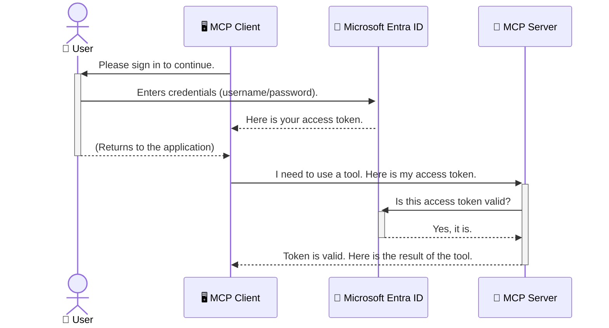

<!--
CO_OP_TRANSLATOR_METADATA:
{
  "original_hash": "6e562d7e5a77c8982da4aa8f762ad1d8",
  "translation_date": "2025-07-14T03:09:02+00:00",
  "source_file": "05-AdvancedTopics/mcp-security-entra/README.md",
  "language_code": "he"
}
-->
# אבטחת זרימות עבודה של בינה מלאכותית: אימות Entra ID עבור שרתי Model Context Protocol

## מבוא  
אבטחת שרת Model Context Protocol (MCP) שלך חשובה לא פחות מלהנעל את דלת הבית. השארת שרת MCP פתוח חושפת את הכלים והנתונים שלך לגישה לא מורשית, שעלולה להוביל לפרצות אבטחה. Microsoft Entra ID מספק פתרון חזק לניהול זהויות וגישה מבוסס ענן, שמבטיח שרק משתמשים ויישומים מורשים יוכלו לתקשר עם שרת ה-MCP שלך. בחלק זה תלמד כיצד להגן על זרימות העבודה של הבינה המלאכותית שלך באמצעות אימות Entra ID.

## מטרות הלמידה  
בסיום חלק זה תוכל:

- להבין את חשיבות אבטחת שרתי MCP.  
- להסביר את היסודות של Microsoft Entra ID ואימות OAuth 2.0.  
- להבחין בין לקוחות ציבוריים ללקוחות סודיים.  
- ליישם אימות Entra ID בתרחישי שרת MCP מקומי (לקוח ציבורי) ומרוחק (לקוח סודי).  
- ליישם שיטות עבודה מומלצות לאבטחה בפיתוח זרימות עבודה של בינה מלאכותית.

## אבטחה ו-MCP  
כמו שלא היית משאיר את דלת הבית שלך פתוחה, כך אסור להשאיר את שרת ה-MCP פתוח לגישה חופשית. אבטחת זרימות העבודה של הבינה המלאכותית חיונית לבניית יישומים חזקים, אמינים ובטוחים. פרק זה יציג כיצד להשתמש ב-Microsoft Entra ID כדי לאבטח את שרתי ה-MCP שלך, ולהבטיח שרק משתמשים ויישומים מורשים יוכלו לגשת לכלים ולנתונים שלך.

## מדוע אבטחה חשובה לשרתי MCP  
דמיין ששרת ה-MCP שלך כולל כלי שיכול לשלוח מיילים או לגשת למסד נתונים של לקוחות. שרת לא מאובטח יאפשר לכל אחד להשתמש בכלי הזה, מה שעלול להוביל לגישה לא מורשית לנתונים, ספאם או פעילויות זדוניות אחרות.

באמצעות יישום אימות, אתה מוודא שכל בקשה לשרת שלך מאומתת, ומאשרת את זהות המשתמש או היישום שמבצע את הבקשה. זהו הצעד הראשון והחשוב ביותר באבטחת זרימות העבודה של הבינה המלאכותית שלך.

## מבוא ל-Microsoft Entra ID  
[**Microsoft Entra ID**](https://adoption.microsoft.com/microsoft-security/entra/) היא שירות ניהול זהויות וגישה מבוסס ענן. אפשר לדמות אותה לשומר אבטחה אוניברסלי עבור היישומים שלך. היא מטפלת בתהליך המורכב של אימות זהויות משתמשים (authentication) וקביעת ההרשאות שלהם (authorization).

באמצעות Entra ID תוכל:

- לאפשר כניסה מאובטחת למשתמשים.  
- להגן על APIs ושירותים.  
- לנהל מדיניות גישה ממקום מרכזי.

עבור שרתי MCP, Entra ID מספקת פתרון חזק ואמין לניהול מי יכול לגשת ליכולות השרת שלך.

---

## הבנת הקסם: כיצד עובד אימות Entra ID  
Entra ID משתמשת בסטנדרטים פתוחים כמו **OAuth 2.0** לטיפול באימות. למרות שהפרטים יכולים להיות מורכבים, הרעיון המרכזי פשוט וניתן להסבר באמצעות אנלוגיה.

### מבוא עדין ל-OAuth 2.0: מפתח הוולאט  
דמיין את OAuth 2.0 כשירות וולאט לרכב שלך. כשאתה מגיע למסעדה, אינך נותן לוולאט את מפתח המאסטר שלך. במקום זאת, אתה נותן לו **מפתח וולאט** עם הרשאות מוגבלות — הוא יכול להניע את הרכב ולנעול את הדלתות, אך לא לפתוח את תא המטען או תא הכפפות.

באנלוגיה זו:

- **אתה** הוא ה-**משתמש**.  
- **הרכב שלך** הוא **שרת MCP** עם הכלים והנתונים היקרים שלו.  
- ה-**וולאט** הוא **Microsoft Entra ID**.  
- ה-**חניין** הוא **לקוח MCP** (היישום שמנסה לגשת לשרת).  
- ה-**מפתח וולאט** הוא **Access Token**.

טוקן הגישה הוא מחרוזת מאובטחת שהלקוח מקבל מ-Entra ID לאחר ההתחברות שלך. הלקוח מציג טוקן זה לשרת MCP בכל בקשה. השרת מאמת את הטוקן כדי לוודא שהבקשה חוקית ושהלקוח מורשה, וכל זאת מבלי לטפל בסיסמאות או בפרטי ההתחברות שלך.

### זרימת האימות  
כך התהליך עובד בפועל:



### היכרות עם ספריית האימות של Microsoft (MSAL)  
לפני שנצלול לקוד, חשוב להכיר רכיב מרכזי שתראה בדוגמאות: **Microsoft Authentication Library (MSAL)**.

MSAL היא ספרייה שפותחה על ידי מיקרוסופט ומקלה מאוד על מפתחים לטפל באימות. במקום שתצטרך לכתוב את כל הקוד המורכב לניהול טוקנים, כניסות ועדכון סשנים, MSAL עושה את העבודה הכבדה עבורך.

שימוש בספרייה כמו MSAL מומלץ מאוד כי:

- **היא מאובטחת:** מיישמת פרוטוקולים ונהלי אבטחה תקניים, ומפחיתה סיכונים לפרצות בקוד שלך.  
- **מפשטת את הפיתוח:** מסתירה את המורכבות של OAuth 2.0 ו-OpenID Connect, ומאפשרת להוסיף אימות חזק ליישום בכמה שורות קוד בלבד.  
- **מתוחזקת:** מיקרוסופט מעדכנת ומשפרת את MSAL בהתמדה כדי להתמודד עם איומי אבטחה חדשים ושינויים בפלטפורמות.

MSAL תומכת במגוון רחב של שפות ומסגרות פיתוח, כולל .NET, JavaScript/TypeScript, Python, Java, Go ופלטפורמות מובייל כמו iOS ואנדרואיד. משמעות הדבר היא שתוכל להשתמש בדפוסי אימות עקביים בכל טכנולוגיות הפיתוח שלך.

למידע נוסף על MSAL, ניתן לעיין בתיעוד הרשמי [MSAL overview documentation](https://learn.microsoft.com/entra/identity-platform/msal-overview).

---

## אבטחת שרת MCP שלך עם Entra ID: מדריך שלב אחר שלב  
כעת נעבור כיצד לאבטח שרת MCP מקומי (שמתקשר דרך `stdio`) באמצעות Entra ID. דוגמה זו משתמשת ב**לקוח ציבורי**, המתאים ליישומים שרצים במחשב המשתמש, כמו אפליקציית שולחן עבודה או שרת פיתוח מקומי.

### תרחיש 1: אבטחת שרת MCP מקומי (עם לקוח ציבורי)  
בתרחיש זה נבחן שרת MCP שרץ מקומית, מתקשר דרך `stdio`, ומשתמש ב-Entra ID לאימות המשתמש לפני מתן גישה לכלים שלו. לשרת יש כלי יחיד שמושך את פרטי הפרופיל של המשתמש מ-Microsoft Graph API.

#### 1. הגדרת היישום ב-Entra ID  
לפני כתיבת קוד, יש לרשום את היישום שלך ב-Microsoft Entra ID. זה מודיע ל-Entra ID על היישום ומאפשר לו להשתמש בשירות האימות.

1. עבור אל **[פורטל Microsoft Entra](https://entra.microsoft.com/)**.  
2. עבור ל-**App registrations** ולחץ על **New registration**.  
3. תן שם ליישום (למשל, "My Local MCP Server").  
4. בחר ב-**Supported account types** את האפשרות **Accounts in this organizational directory only**.  
5. ניתן להשאיר את **Redirect URI** ריק בדוגמה זו.  
6. לחץ על **Register**.

לאחר ההרשמה, רשום את **Application (client) ID** ו-**Directory (tenant) ID**. תזדקק להם בקוד.

#### 2. הקוד: פירוט  
נבחן את החלקים המרכזיים בקוד המטפלים באימות. הקוד המלא לדוגמה זו זמין בתיקיית [Entra ID - Local - WAM](https://github.com/Azure-Samples/mcp-auth-servers/tree/main/src/entra-id-local-wam) במאגר ה-GitHub של [mcp-auth-servers](https://github.com/Azure-Samples/mcp-auth-servers).

**`AuthenticationService.cs`**  
מחלקה זו אחראית על האינטראקציה עם Entra ID.

- **`CreateAsync`**: מאתחלת את `PublicClientApplication` מספריית MSAL, עם `clientId` ו-`tenantId` של היישום שלך.  
- **`WithBroker`**: מאפשרת שימוש ב-broker (כמו Windows Web Account Manager), שמספק חווית כניסה מאובטחת וחלקה.  
- **`AcquireTokenAsync`**: השיטה המרכזית. מנסה לקבל טוקן בשקט (ללא בקשת כניסה אם כבר יש סשן תקף). אם לא מצליח, תבקש מהמשתמש להיכנס באופן אינטראקטיבי.

```csharp
// Simplified for clarity
public static async Task<AuthenticationService> CreateAsync(ILogger<AuthenticationService> logger)
{
    var msalClient = PublicClientApplicationBuilder
        .Create(_clientId) // Your Application (client) ID
        .WithAuthority(AadAuthorityAudience.AzureAdMyOrg)
        .WithTenantId(_tenantId) // Your Directory (tenant) ID
        .WithBroker(new BrokerOptions(BrokerOptions.OperatingSystems.Windows))
        .Build();

    // ... cache registration ...

    return new AuthenticationService(logger, msalClient);
}

public async Task<string> AcquireTokenAsync()
{
    try
    {
        // Try silent authentication first
        var accounts = await _msalClient.GetAccountsAsync();
        var account = accounts.FirstOrDefault();

        AuthenticationResult? result = null;

        if (account != null)
        {
            result = await _msalClient.AcquireTokenSilent(_scopes, account).ExecuteAsync();
        }
        else
        {
            // If no account, or silent fails, go interactive
            result = await _msalClient.AcquireTokenInteractive(_scopes).ExecuteAsync();
        }

        return result.AccessToken;
    }
    catch (Exception ex)
    {
        _logger.LogError(ex, "An error occurred while acquiring the token.");
        throw; // Optionally rethrow the exception for higher-level handling
    }
}
```

**`Program.cs`**  
כאן מוגדר שרת ה-MCP ומשולב שירות האימות.

- **`AddSingleton<AuthenticationService>`**: רושם את `AuthenticationService` במיכל ה-Dependency Injection לשימוש חלקים אחרים ביישום (כמו הכלי שלנו).  
- הכלי **`GetUserDetailsFromGraph`** דורש מופע של `AuthenticationService`. לפני כל פעולה, הוא קורא ל-`authService.AcquireTokenAsync()` לקבלת טוקן גישה תקף. אם האימות מצליח, הוא משתמש בטוקן כדי לקרוא ל-Microsoft Graph API ולקבל את פרטי המשתמש.

```csharp
// Simplified for clarity
[McpServerTool(Name = "GetUserDetailsFromGraph")]
public static async Task<string> GetUserDetailsFromGraph(
    AuthenticationService authService)
{
    try
    {
        // This will trigger the authentication flow
        var accessToken = await authService.AcquireTokenAsync();

        // Use the token to create a GraphServiceClient
        var graphClient = new GraphServiceClient(
            new BaseBearerTokenAuthenticationProvider(new TokenProvider(authService)));

        var user = await graphClient.Me.GetAsync();

        return System.Text.Json.JsonSerializer.Serialize(user);
    }
    catch (Exception ex)
    {
        return $"Error: {ex.Message}";
    }
}
```

#### 3. כיצד הכל עובד יחד  
1. כאשר לקוח MCP מנסה להשתמש בכלי `GetUserDetailsFromGraph`, הכלי קורא קודם ל-`AcquireTokenAsync`.  
2. `AcquireTokenAsync` מפעיל את ספריית MSAL לבדוק אם יש טוקן תקף.  
3. אם לא נמצא טוקן, MSAL, דרך ה-broker, יבקש מהמשתמש להיכנס עם חשבון Entra ID שלו.  
4. לאחר ההתחברות, Entra ID מנפיק טוקן גישה.  
5. הכלי מקבל את הטוקן ומשתמש בו לקריאה מאובטחת ל-Microsoft Graph API.  
6. פרטי המשתמש מוחזרים ללקוח MCP.

תהליך זה מבטיח שרק משתמשים מאומתים יוכלו להשתמש בכלי, ובכך מאבטח את שרת ה-MCP המקומי שלך.

### תרחיש 2: אבטחת שרת MCP מרוחק (עם לקוח סודי)  
כאשר שרת ה-MCP שלך פועל על מכונה מרוחקת (כמו שרת ענן) ומתקשר בפרוטוקול כמו HTTP Streaming, דרישות האבטחה שונות. במקרה זה יש להשתמש ב**לקוח סודי** ובזרימת **Authorization Code Flow**. זוהי שיטה מאובטחת יותר כי סודות היישום אינם נחשפים לדפדפן.

דוגמה זו משתמשת בשרת MCP מבוסס TypeScript שמשתמש ב-Express.js לטיפול בבקשות HTTP.

#### 1. הגדרת היישום ב-Entra ID  
ההגדרה ב-Entra ID דומה ללקוח הציבורי, אך עם הבדל מרכזי: יש ליצור **סוד לקוח (client secret)**.

1. עבור אל **[פורטל Microsoft Entra](https://entra.microsoft.com/)**.  
2. בהרשמת היישום, עבור ללשונית **Certificates & secrets**.  
3. לחץ על **New client secret**, תן תיאור ולחץ על **Add**.  
4. **חשוב:** העתק את ערך הסוד מיד. לא תוכל לראות אותו שוב.  
5. יש להגדיר גם **Redirect URI**. עבור ללשונית **Authentication**, לחץ על **Add a platform**, בחר **Web**, והזן את כתובת ה-redirect של היישום (למשל, `http://localhost:3001/auth/callback`).

> **⚠️ הערת אבטחה חשובה:** ליישומים בפרודקשן, מיקרוסופט ממליצה בחום להשתמש בשיטות אימות ללא סודות כמו **Managed Identity** או **Workload Identity Federation** במקום סודות לקוח. סודות לקוח מהווים סיכון אבטחה כי הם עלולים להיחשף או להיפרץ. זהויות מנוהלות מספקות גישה מאובטחת יותר על ידי ביטול הצורך לאחסן סיסמאות בקוד או בקונפיגורציה.  
>  
> למידע נוסף על זהויות מנוהלות ואופן היישום שלהן, ראה את [Managed identities for Azure resources overview](https://learn.microsoft.com/entra/identity/managed-identities-azure-resources/overview).

#### 2. הקוד: פירוט  
דוגמה זו משתמשת בגישה מבוססת סשן. כאשר המשתמש מאומת, השרת מאחסן את טוקן הגישה וטוקן הרענון בסשן ומעניק למשתמש טוקן סשן. טוקן זה משמש לבקשות הבאות. הקוד המלא לדוגמה זו זמין בתיקיית [Entra ID - Confidential client](https://github.com/Azure-Samples/mcp-auth-servers/tree/main/src/entra-id-cca-session) במאגר ה-GitHub של [mcp-auth-servers](https://github.com/Azure-Samples/mcp-auth-servers).

**`Server.ts`**  
קובץ זה מגדיר את שרת Express ואת שכבת התקשורת של MCP.

- **`requireBearerAuth`**: זהו middleware שמגן על נקודות הקצה `/sse` ו-`/message`. הוא בודק טוקן bearer תקף בכותרת `Authorization` של הבקשה.  
- **`EntraIdServerAuthProvider`**: מחלקה מותאמת שמממשת את הממשק `McpServerAuthorizationProvider`. אחראית על טיפול בזרימת OAuth 2.0.  
- **`/auth/callback`**: נקודת קצה שמטפלת בהפניה מ-Entra ID לאחר שהמשתמש אותת. מחליפה את קוד האישור בטוקן גישה וטוקן רענון.

```typescript
// Simplified for clarity
const app = express();
const { server } = createServer();
const provider = new EntraIdServerAuthProvider();

// Protect the SSE endpoint
app.get("/sse", requireBearerAuth({
  provider,
  requiredScopes: ["User.Read"]
}), async (req, res) => {
  // ... connect to the transport ...
});

// Protect the message endpoint
app.post("/message", requireBearerAuth({
  provider,
  requiredScopes: ["User.Read"]
}), async (req, res) => {
  // ... handle the message ...
});

// Handle the OAuth 2.0 callback
app.get("/auth/callback", (req, res) => {
  provider.handleCallback(req.query.code, req.query.state)
    .then(result => {
      // ... handle success or failure ...
    });
});
```

**`Tools.ts`**  
קובץ זה מגדיר את הכלים ששרת ה-MCP מספק. הכלי `getUserDetails` דומה לזה שבדוגמה הקודמת, אך מקבל את טוקן הגישה מהסשן.

```typescript
// Simplified for clarity
server.setRequestHandler(CallToolRequestSchema, async (request) => {
  const { name } = request.params;
  const context = request.params?.context as { token?: string } | undefined;
  const sessionToken = context?.token;

  if (name === ToolName.GET_USER_DETAILS) {
    if (!sessionToken) {
      throw new AuthenticationError("Authentication token is missing or invalid. Ensure the token is provided in the request context.");
    }

    // Get the Entra ID token from the session store
    const tokenData = tokenStore.getToken(sessionToken);
    const entraIdToken = tokenData.accessToken;

    const graphClient = Client.init({
      authProvider: (done) => {
        done(null, entraIdToken);
      }
    });

    const user = await graphClient.api('/me').get();

    // ... return user details ...
  }
});
```

**`auth/EntraIdServerAuthProvider.ts`**  
מחלקה זו מטפלת בלוגיקה של:

- הפניית המשתמש לדף הכניסה של Entra ID.  
- החלפת קוד האישור בטוקן גישה.  
- אחסון הטוקנים ב-`tokenStore`.  
- רענון טוקן הגישה כשהוא פג תוקף.

#### 3. כיצד הכל עובד יחד  
1. כאשר משתמש מנסה להתחבר לשרת MCP, ה-middleware `requireBearerAuth` מזהה שאין לו סשן תקף ומפנה אותו לדף הכניסה של Entra ID.  
2. המשתמש נכנס עם חשבון Entra ID שלו.  
3. Entra ID מפנה את המשתמש חזרה לנקודת הקצה `/auth/callback` עם קוד אישור.
4. השרת מחליף את הקוד ב-token גישה ו-token רענון, מאחסן אותם, ויוצר token סשן שנשלח ללקוח.  
5. הלקוח יכול כעת להשתמש ב-token הסשן בכותרת `Authorization` עבור כל הבקשות העתידיות לשרת MCP.  
6. כאשר קוראים לכלי `getUserDetails`, הוא משתמש ב-token הסשן כדי לאתר את token הגישה של Entra ID ואז משתמש בו כדי לקרוא ל-Microsoft Graph API.

הזרימה הזו מורכבת יותר מהזרימה של הלקוח הציבורי, אך נדרשת לנקודות קצה הפונות לאינטרנט. מכיוון ששרתים מרוחקים של MCP נגישים דרך האינטרנט הציבורי, הם זקוקים לאמצעי אבטחה חזקים יותר כדי להגן מפני גישה לא מורשית ומתקפות פוטנציאליות.


## שיטות עבודה מומלצות לאבטחה

- **תמיד השתמש ב-HTTPS**: הצפן את התקשורת בין הלקוח לשרת כדי להגן על הטוקנים מפני יירוט.  
- **הטמיע בקרת גישה מבוססת תפקידים (RBAC)**: אל תבדוק רק *אם* המשתמש מאומת; בדוק *מה* הוא מורשה לעשות. ניתן להגדיר תפקידים ב-Entra ID ולבדוק אותם בשרת MCP שלך.  
- **נטר ובצע ביקורת**: רשום את כל אירועי האימות כדי שתוכל לזהות ולהגיב לפעילות חשודה.  
- **טפל במגבלות קצב ו-throttling**: Microsoft Graph ו-APIs אחרים מיישמים מגבלות קצב למניעת שימוש לרעה. הטמע לוגיקת backoff אקספוננציאלית וניסיון חוזר בשרת MCP שלך כדי להתמודד בצורה חלקה עם תגובות HTTP 429 (יותר מדי בקשות). שקול מטמון לנתונים שניגשים אליהם לעיתים קרובות כדי להפחית קריאות API.  
- **אחסון בטוח של טוקנים**: אחסן את טוקני הגישה והטוקנים לרענון בצורה מאובטחת. עבור אפליקציות מקומיות, השתמש במנגנוני האחסון המאובטחים של המערכת. עבור אפליקציות שרת, שקול להשתמש באחסון מוצפן או בשירותי ניהול מפתחות מאובטחים כמו Azure Key Vault.  
- **טיפול בתוקף הטוקן**: לטוקני גישה יש תוקף מוגבל. הטמע רענון אוטומטי של טוקנים באמצעות טוקני רענון כדי לשמור על חוויית משתמש רציפה ללא צורך באימות חוזר.  
- **שקול שימוש ב-Azure API Management**: בעוד שהטמעת אבטחה ישירות בשרת MCP שלך נותנת לך שליטה מדויקת, שערי API כמו Azure API Management יכולים לטפל בהרבה מהנושאים האבטחתיים האלו אוטומטית, כולל אימות, הרשאה, מגבלות קצב וניטור. הם מספקים שכבת אבטחה מרכזית שנמצאת בין הלקוחות שלך לשרתי MCP. לפרטים נוספים על שימוש בשערי API עם MCP, ראה את [Azure API Management Your Auth Gateway For MCP Servers](https://techcommunity.microsoft.com/blog/integrationsonazureblog/azure-api-management-your-auth-gateway-for-mcp-servers/4402690).


## נקודות מפתח

- אבטחת שרת MCP שלך חיונית להגנה על הנתונים והכלים שלך.  
- Microsoft Entra ID מספק פתרון חזק ומדרג לאימות והרשאה.  
- השתמש ב**לקוח ציבורי** לאפליקציות מקומיות וב**לקוח סודי** לשרתים מרוחקים.  
- **Authorization Code Flow** היא האפשרות המאובטחת ביותר לאפליקציות ווב.


## תרגיל

1. חשוב על שרת MCP שאתה עשוי לבנות. האם הוא יהיה שרת מקומי או שרת מרוחק?  
2. בהתבסס על התשובה שלך, האם תשתמש בלקוח ציבורי או סודי?  
3. איזו הרשאה שרת MCP שלך יבקש כדי לבצע פעולות מול Microsoft Graph?


## תרגילים מעשיים

### תרגיל 1: רישום אפליקציה ב-Entra ID  
גש לפורטל Microsoft Entra.  
רשום אפליקציה חדשה עבור שרת MCP שלך.  
רשום את מזהה האפליקציה (client ID) ואת מזהה התיקייה (tenant ID).

### תרגיל 2: אבטח שרת MCP מקומי (לקוח ציבורי)  
- עקוב אחר דוגמת הקוד לשילוב MSAL (Microsoft Authentication Library) לאימות משתמשים.  
- בדוק את זרימת האימות על ידי קריאה לכלי MCP שמביא פרטי משתמש מ-Microsoft Graph.

### תרגיל 3: אבטח שרת MCP מרוחק (לקוח סודי)  
- רשם לקוח סודי ב-Entra ID ויצר סוד לקוח.  
- הגדר את שרת MCP שלך ב-Express.js להשתמש ב-Authorization Code Flow.  
- בדוק את נקודות הקצה המוגנות ואמת גישה מבוססת טוקן.

### תרגיל 4: הטמע שיטות עבודה מומלצות לאבטחה  
- אפשר HTTPS לשרת המקומי או המרוחק שלך.  
- הטמע בקרת גישה מבוססת תפקידים (RBAC) בלוגיקת השרת שלך.  
- הוסף טיפול בתוקף טוקן ואחסון בטוח של טוקנים.

## משאבים

1. **תיעוד מבוא ל-MSAL**  
   למד כיצד Microsoft Authentication Library (MSAL) מאפשרת רכישת טוקנים מאובטחת בפלטפורמות שונות:  
   [MSAL Overview on Microsoft Learn](https://learn.microsoft.com/en-gb/entra/msal/overview)

2. **מאגר GitHub של Azure-Samples/mcp-auth-servers**  
   מימושים לדוגמה של שרתי MCP המדגימים זרימות אימות:  
   [Azure-Samples/mcp-auth-servers on GitHub](https://github.com/Azure-Samples/mcp-auth-servers)

3. **סקירת Managed Identities למשאבי Azure**  
   הבן כיצד לבטל סודות באמצעות זהויות מנוהלות שהוקצו למערכת או למשתמש:  
   [Managed Identities Overview on Microsoft Learn](https://learn.microsoft.com/en-us/entra/identity/managed-identities-azure-resources/)

4. **Azure API Management: שער האימות שלך לשרתי MCP**  
   ניתוח מעמיק של שימוש ב-APIM כשער OAuth2 מאובטח לשרתי MCP:  
   [Azure API Management Your Auth Gateway For MCP Servers](https://techcommunity.microsoft.com/blog/integrationsonazureblog/azure-api-management-your-auth-gateway-for-mcp-servers/4402690)

5. **רשימת הרשאות Microsoft Graph**  
   רשימה מקיפה של הרשאות מואצלות ואפליקטיביות עבור Microsoft Graph:  
   [Microsoft Graph Permissions Reference](https://learn.microsoft.com/zh-tw/graph/permissions-reference)


## תוצאות למידה  
בסיום חלק זה, תוכל:

- להסביר מדוע אימות הוא קריטי לשרתי MCP ולזרימות עבודה של AI.  
- להגדיר ולהגדיר אימות Entra ID עבור תרחישי שרת MCP מקומיים ומרוחקים.  
- לבחור את סוג הלקוח המתאים (ציבורי או סודי) בהתבסס על פריסת השרת שלך.  
- להטמיע שיטות קידוד מאובטחות, כולל אחסון טוקנים והרשאה מבוססת תפקידים.  
- להגן בביטחון על שרת MCP שלך וכליו מפני גישה לא מורשית.

## מה הלאה

- [5.13 אינטגרציה של Model Context Protocol (MCP) עם Azure AI Foundry](../mcp-foundry-agent-integration/README.md)

**כתב ויתור**:  
מסמך זה תורגם באמצעות שירות תרגום מבוסס בינה מלאכותית [Co-op Translator](https://github.com/Azure/co-op-translator). למרות שאנו שואפים לדיוק, יש לקחת בחשבון כי תרגומים אוטומטיים עלולים להכיל שגיאות או אי-דיוקים. המסמך המקורי בשפת המקור שלו נחשב למקור הסמכותי. למידע קריטי מומלץ להשתמש בתרגום מקצועי על ידי מתרגם אנושי. אנו לא נושאים באחריות לכל אי-הבנה או פרשנות שגויה הנובעת משימוש בתרגום זה.