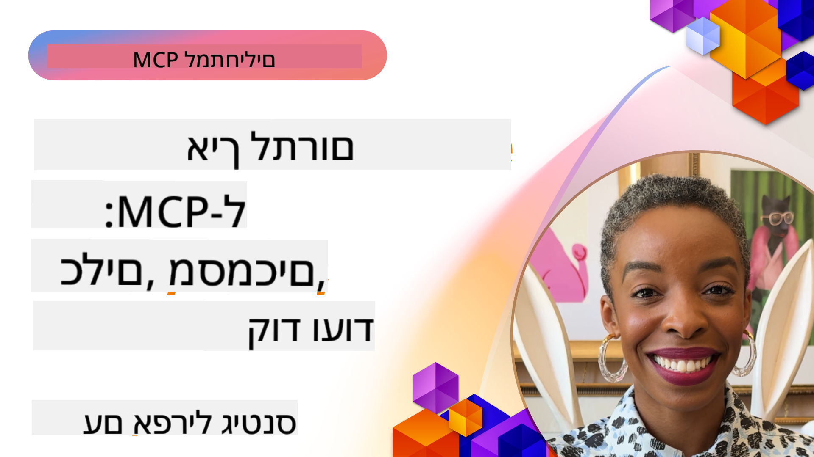

<!--
CO_OP_TRANSLATOR_METADATA:
{
  "original_hash": "fcf1e12b62102bf7d16b78deb2b163b7",
  "translation_date": "2025-08-18T17:03:03+00:00",
  "source_file": "06-CommunityContributions/README.md",
  "language_code": "he"
}
-->
# קהילה ותרומות

[](https://youtu.be/v1pvCYAWpRE)

_(לחצו על התמונה למעלה לצפייה בסרטון של השיעור הזה)_

## סקירה כללית

השיעור הזה מתמקד בדרכים להשתלב בקהילת MCP, לתרום לאקוסיסטם של MCP, ולעקוב אחר שיטות עבודה מומלצות לפיתוח שיתופי. הבנת הדרכים להשתתפות בפרויקטים של MCP בקוד פתוח היא חיונית למי שמעוניין לעצב את עתיד הטכנולוגיה הזו.

## מטרות למידה

בסיום השיעור, תוכלו:

- להבין את מבנה הקהילה והאקוסיסטם של MCP
- להשתתף בצורה אפקטיבית בפורומים ובדיונים של קהילת MCP
- לתרום למאגרי הקוד הפתוח של MCP
- ליצור ולשתף כלים ושרתים מותאמים אישית ל-MCP
- לעקוב אחר שיטות עבודה מומלצות לפיתוח ושיתוף פעולה ב-MCP
- לגלות משאבים ומסגרות קהילתיות לפיתוח MCP

## אקוסיסטם הקהילה של MCP

האקוסיסטם של MCP מורכב ממגוון רכיבים ומשתתפים שעובדים יחד כדי לקדם את הפרוטוקול.

### רכיבי מפתח בקהילה

1. **מתחזקים של פרוטוקול הליבה**: הארגון הרשמי [Model Context Protocol GitHub](https://github.com/modelcontextprotocol) מתחזק את מפרטי הליבה של MCP ואת היישומים הרפרנטיים.
2. **מפתחי כלים**: יחידים וצוותים שיוצרים כלים ושרתים ל-MCP.
3. **ספקי אינטגרציה**: חברות שמשלבות את MCP במוצרים ובשירותים שלהן.
4. **משתמשי קצה**: מפתחים וארגונים שמשתמשים ב-MCP באפליקציות שלהם.
5. **תורמים**: חברי קהילה שתורמים קוד, תיעוד או משאבים אחרים.

### משאבי קהילה

#### ערוצים רשמיים

- [ארגון GitHub של MCP](https://github.com/modelcontextprotocol)
- [תיעוד MCP](https://modelcontextprotocol.io/)
- [מפרט MCP](https://modelcontextprotocol.io/docs/specification)
- [דיונים ב-GitHub](https://github.com/orgs/modelcontextprotocol/discussions)
- [מאגר דוגמאות ושרתים של MCP](https://github.com/modelcontextprotocol/servers)

#### משאבים מונעי-קהילה

- [לקוחות MCP](https://modelcontextprotocol.io/clients) - רשימת לקוחות התומכים באינטגרציות MCP
- [שרתים קהילתיים של MCP](https://github.com/modelcontextprotocol/servers?tab=readme-ov-file#-community-servers) - רשימה מתרחבת של שרתי MCP שפותחו על ידי הקהילה
- [Awesome MCP Servers](https://github.com/wong2/awesome-mcp-servers) - רשימה אוצרותית של שרתי MCP
- [PulseMCP](https://www.pulsemcp.com/) - מרכז קהילתי וניוזלטר לגילוי משאבי MCP
- [שרת Discord](https://discord.gg/jHEGxQu2a5) - התחברו עם מפתחי MCP
- מימושי SDK לשפות ספציפיות
- פוסטים בבלוג ומדריכים

## תרומה ל-MCP

### סוגי תרומות

האקוסיסטם של MCP מקבל בברכה סוגים שונים של תרומות:

1. **תרומות קוד**:
   - שיפורים בפרוטוקול הליבה
   - תיקוני באגים
   - יישומי כלים ושרתים
   - ספריות לקוח/שרת בשפות שונות

2. **תיעוד**:
   - שיפור תיעוד קיים
   - יצירת מדריכים והדרכות
   - תרגום תיעוד
   - יצירת דוגמאות ואפליקציות לדוגמה

3. **תמיכה קהילתית**:
   - מענה לשאלות בפורומים ובדיונים
   - בדיקה ודיווח על בעיות
   - ארגון אירועי קהילה
   - חניכת תורמים חדשים

### תהליך התרומה: פרוטוקול הליבה

כדי לתרום לפרוטוקול הליבה של MCP או ליישומים הרשמיים, עקבו אחר העקרונות המפורטים ב-[הנחיות התרומה הרשמיות](https://github.com/modelcontextprotocol/modelcontextprotocol/blob/main/CONTRIBUTING.md):

1. **פשטות ומינימליזם**: מפרט MCP שומר על רף גבוה להוספת מושגים חדשים. קל יותר להוסיף דברים למפרט מאשר להסירם.
2. **גישה קונקרטית**: שינויים במפרט צריכים להתבסס על אתגרי יישום ספציפיים, ולא על רעיונות ספקולטיביים.
3. **שלבי הצעה**:
   - הגדרה: חקר מרחב הבעיה, אימות שמשתמשי MCP אחרים מתמודדים עם בעיה דומה.
   - אבטיפוס: בניית פתרון לדוגמה והדגמת יישומו המעשי.
   - כתיבה: בהתבסס על האבטיפוס, כתיבת הצעה למפרט.

### הגדרת סביבת פיתוח

```bash
# Fork the repository
git clone https://github.com/YOUR-USERNAME/modelcontextprotocol.git
cd modelcontextprotocol

# Install dependencies
npm install

# For schema changes, validate and generate schema.json:
npm run check:schema:ts
npm run generate:schema

# For documentation changes
npm run check:docs
npm run format

# Preview documentation locally (optional):
npm run serve:docs
```

### דוגמה: תרומת תיקון באג

```javascript
// Original code with bug in the typescript-sdk
export function validateResource(resource: unknown): resource is MCPResource {
  if (!resource || typeof resource !== 'object') {
    return false;
  }
  
  // Bug: Missing property validation
  // Current implementation:
  const hasName = 'name' in resource;
  const hasSchema = 'schema' in resource;
  
  return hasName && hasSchema;
}

// Fixed implementation in a contribution
export function validateResource(resource: unknown): resource is MCPResource {
  if (!resource || typeof resource !== 'object') {
    return false;
  }
  
  // Improved validation
  const hasName = 'name' in resource && typeof (resource as MCPResource).name === 'string';
  const hasSchema = 'schema' in resource && typeof (resource as MCPResource).schema === 'object';
  const hasDescription = !('description' in resource) || typeof (resource as MCPResource).description === 'string';
  
  return hasName && hasSchema && hasDescription;
}
```

### דוגמה: תרומת כלי חדש לספרייה הסטנדרטית

```python
# Example contribution: A CSV data processing tool for the MCP standard library

from mcp_tools import Tool, ToolRequest, ToolResponse, ToolExecutionException
import pandas as pd
import io
import json
from typing import Dict, Any, List, Optional

class CsvProcessingTool(Tool):
    """
    Tool for processing and analyzing CSV data.
    
    This tool allows models to extract information from CSV files,
    run basic analysis, and convert data between formats.
    """
    
    def get_name(self):
        return "csvProcessor"
        
    def get_description(self):
        return "Processes and analyzes CSV data"
    
    def get_schema(self):
        return {
            "type": "object",
            "properties": {
                "csvData": {
                    "type": "string", 
                    "description": "CSV data as a string"
                },
                "csvUrl": {
                    "type": "string",
                    "description": "URL to a CSV file (alternative to csvData)"
                },
                "operation": {
                    "type": "string",
                    "enum": ["summary", "filter", "transform", "convert"],
                    "description": "Operation to perform on the CSV data"
                },
                "filterColumn": {
                    "type": "string",
                    "description": "Column to filter by (for filter operation)"
                },
                "filterValue": {
                    "type": "string",
                    "description": "Value to filter for (for filter operation)"
                },
                "outputFormat": {
                    "type": "string",
                    "enum": ["json", "csv", "markdown"],
                    "default": "json",
                    "description": "Output format for the processed data"
                }
            },
            "oneOf": [
                {"required": ["csvData", "operation"]},
                {"required": ["csvUrl", "operation"]}
            ]
        }
    
    async def execute_async(self, request: ToolRequest) -> ToolResponse:
        try:
            # Extract parameters
            operation = request.parameters.get("operation")
            output_format = request.parameters.get("outputFormat", "json")
            
            # Get CSV data from either direct data or URL
            df = await self._get_dataframe(request)
            
            # Process based on requested operation
            result = {}
            
            if operation == "summary":
                result = self._generate_summary(df)
            elif operation == "filter":
                column = request.parameters.get("filterColumn")
                value = request.parameters.get("filterValue")
                if not column:
                    raise ToolExecutionException("filterColumn is required for filter operation")
                result = self._filter_data(df, column, value)
            elif operation == "transform":
                result = self._transform_data(df, request.parameters)
            elif operation == "convert":
                result = self._convert_format(df, output_format)
            else:
                raise ToolExecutionException(f"Unknown operation: {operation}")
            
            return ToolResponse(result=result)
        
        except Exception as e:
            raise ToolExecutionException(f"CSV processing failed: {str(e)}")
    
    async def _get_dataframe(self, request: ToolRequest) -> pd.DataFrame:
        """Gets a pandas DataFrame from either CSV data or URL"""
        if "csvData" in request.parameters:
            csv_data = request.parameters.get("csvData")
            return pd.read_csv(io.StringIO(csv_data))
        elif "csvUrl" in request.parameters:
            csv_url = request.parameters.get("csvUrl")
            return pd.read_csv(csv_url)
        else:
            raise ToolExecutionException("Either csvData or csvUrl must be provided")
    
    def _generate_summary(self, df: pd.DataFrame) -> Dict[str, Any]:
        """Generates a summary of the CSV data"""
        return {
            "columns": df.columns.tolist(),
            "rowCount": len(df),
            "columnCount": len(df.columns),
            "numericColumns": df.select_dtypes(include=['number']).columns.tolist(),
            "categoricalColumns": df.select_dtypes(include=['object']).columns.tolist(),
            "sampleRows": json.loads(df.head(5).to_json(orient="records")),
            "statistics": json.loads(df.describe().to_json())
        }
    
    def _filter_data(self, df: pd.DataFrame, column: str, value: str) -> Dict[str, Any]:
        """Filters the DataFrame by a column value"""
        if column not in df.columns:
            raise ToolExecutionException(f"Column '{column}' not found")
            
        filtered_df = df[df[column].astype(str).str.contains(value)]
        
        return {
            "originalRowCount": len(df),
            "filteredRowCount": len(filtered_df),
            "data": json.loads(filtered_df.to_json(orient="records"))
        }
    
    def _transform_data(self, df: pd.DataFrame, params: Dict[str, Any]) -> Dict[str, Any]:
        """Transforms the data based on parameters"""
        # Implementation would include various transformations
        return {
            "status": "success",
            "message": "Transformation applied"
        }
    
    def _convert_format(self, df: pd.DataFrame, format: str) -> Dict[str, Any]:
        """Converts the DataFrame to different formats"""
        if format == "json":
            return {
                "data": json.loads(df.to_json(orient="records")),
                "format": "json"
            }
        elif format == "csv":
            return {
                "data": df.to_csv(index=False),
                "format": "csv"
            }
        elif format == "markdown":
            return {
                "data": df.to_markdown(),
                "format": "markdown"
            }
        else:
            raise ToolExecutionException(f"Unsupported output format: {format}")
```

### הנחיות לתרומה

כדי לבצע תרומה מוצלחת לפרויקטים של MCP:

1. **התחילו בקטן**: התחילו בתיעוד, תיקוני באגים או שיפורים קטנים.
2. **עקבו אחר מדריך הסגנון**: שמרו על סגנון הקוד והקונבנציות של הפרויקט.
3. **כתבו בדיקות**: כללו בדיקות יחידה לתרומות הקוד שלכם.
4. **תעדו את עבודתכם**: הוסיפו תיעוד ברור לתכונות או שינויים חדשים.
5. **שלחו PR ממוקד**: שמרו על בקשות משיכה ממוקדות בבעיה או תכונה אחת.
6. **הגיבו למשוב**: היו פתוחים למשוב על התרומות שלכם.

### דוגמת תהליך תרומה

```bash
# Clone the repository
git clone https://github.com/modelcontextprotocol/typescript-sdk.git
cd typescript-sdk

# Create a new branch for your contribution
git checkout -b feature/my-contribution

# Make your changes
# ...

# Run tests to ensure your changes don't break existing functionality
npm test

# Commit your changes with a descriptive message
git commit -am "Fix validation in resource handler"

# Push your branch to your fork
git push origin feature/my-contribution

# Create a pull request from your branch to the main repository
# Then engage with feedback and iterate on your PR as needed
```

## יצירה ושיתוף של שרתי MCP

אחת הדרכים החשובות ביותר לתרום לאקוסיסטם של MCP היא על ידי יצירה ושיתוף של שרתי MCP מותאמים אישית. הקהילה כבר פיתחה מאות שרתים לשירותים ושימושים שונים.

### מסגרות פיתוח לשרתי MCP

מספר מסגרות זמינות לפישוט פיתוח שרתי MCP:

1. **SDKs רשמיים**:
   - [TypeScript SDK](https://github.com/modelcontextprotocol/typescript-sdk)
   - [Python SDK](https://github.com/modelcontextprotocol/python-sdk)
   - [C# SDK](https://github.com/modelcontextprotocol/csharp-sdk)
   - [Go SDK](https://github.com/modelcontextprotocol/go-sdk)
   - [Java SDK](https://github.com/modelcontextprotocol/java-sdk)
   - [Kotlin SDK](https://github.com/modelcontextprotocol/kotlin-sdk)

2. **מסגרות קהילתיות**:
   - [MCP-Framework](https://mcp-framework.com/) - בניית שרתי MCP בקלות ובמהירות ב-TypeScript
   - [MCP Declarative Java SDK](https://github.com/codeboyzhou/mcp-declarative-java-sdk) - שרתי MCP מונעי אנוטציות ב-Java
   - [Quarkus MCP Server SDK](https://github.com/quarkiverse/quarkus-mcp-server) - מסגרת Java לשרתי MCP
   - [Next.js MCP Server Template](https://github.com/vercel-labs/mcp-for-next.js) - פרויקט התחלתי לשרתי MCP ב-Next.js

### פיתוח כלים לשיתוף

#### דוגמה ב-.NET: יצירת חבילת כלי לשיתוף

```csharp
// Create a new .NET library project
// dotnet new classlib -n McpFinanceTools

using Microsoft.Mcp.Tools;
using System.Threading.Tasks;
using System.Net.Http;
using System.Text.Json;

namespace McpFinanceTools
{
    // Stock quote tool
    public class StockQuoteTool : IMcpTool
    {
        private readonly HttpClient _httpClient;
        
        public StockQuoteTool(HttpClient httpClient = null)
        {
            _httpClient = httpClient ?? new HttpClient();
        }
        
        public string Name => "stockQuote";
        public string Description => "Gets current stock quotes for specified symbols";
        
        public object GetSchema()
        {
            return new {
                type = "object",
                properties = new {
                    symbol = new { 
                        type = "string",
                        description = "Stock symbol (e.g., MSFT, AAPL)" 
                    },
                    includeHistory = new { 
                        type = "boolean",
                        description = "Whether to include historical data",
                        default = false
                    }
                },
                required = new[] { "symbol" }
            };
        }
        
        public async Task<ToolResponse> ExecuteAsync(ToolRequest request)
        {
            // Extract parameters
            string symbol = request.Parameters.GetProperty("symbol").GetString();
            bool includeHistory = false;
            
            if (request.Parameters.TryGetProperty("includeHistory", out var historyProp))
            {
                includeHistory = historyProp.GetBoolean();
            }
            
            // Call external API (example)
            var quoteResult = await GetStockQuoteAsync(symbol);
            
            // Add historical data if requested
            if (includeHistory)
            {
                var historyData = await GetStockHistoryAsync(symbol);
                quoteResult.Add("history", historyData);
            }
            
            // Return formatted result
            return new ToolResponse {
                Result = JsonSerializer.SerializeToElement(quoteResult)
            };
        }
        
        private async Task<Dictionary<string, object>> GetStockQuoteAsync(string symbol)
        {
            // Implementation would call a real stock API
            // This is a simplified example
            return new Dictionary<string, object>
            {
                ["symbol"] = symbol,
                ["price"] = 123.45,
                ["change"] = 2.5,
                ["percentChange"] = 1.2,
                ["lastUpdated"] = DateTime.UtcNow
            };
        }
        
        private async Task<object> GetStockHistoryAsync(string symbol)
        {
            // Implementation would get historical data
            // Simplified example
            return new[]
            {
                new { date = DateTime.Now.AddDays(-7).Date, price = 120.25 },
                new { date = DateTime.Now.AddDays(-6).Date, price = 122.50 },
                new { date = DateTime.Now.AddDays(-5).Date, price = 121.75 }
                // More historical data...
            };
        }
    }
}

// Create package and publish to NuGet
// dotnet pack -c Release
// dotnet nuget push bin/Release/McpFinanceTools.1.0.0.nupkg -s https://api.nuget.org/v3/index.json -k YOUR_API_KEY
```

#### דוגמה ב-Java: יצירת חבילת Maven לכלים

```java
// pom.xml configuration for a shareable MCP tool package
<!-- 
<project>
    <groupId>com.example</groupId>
    <artifactId>mcp-weather-tools</artifactId>
    <version>1.0.0</version>
    
    <dependencies>
        <dependency>
            <groupId>com.mcp</groupId>
            <artifactId>mcp-server</artifactId>
            <version>1.0.0</version>
        </dependency>
    </dependencies>
    
    <distributionManagement>
        <repository>
            <id>github</id>
            <name>GitHub Packages</name>
            <url>https://maven.pkg.github.com/username/mcp-weather-tools</url>
        </repository>
    </distributionManagement>
</project>
-->

package com.example.mcp.weather;

import com.mcp.tools.Tool;
import com.mcp.tools.ToolRequest;
import com.mcp.tools.ToolResponse;
import com.mcp.tools.ToolExecutionException;

import java.net.http.HttpClient;
import java.net.http.HttpRequest;
import java.net.http.HttpResponse;
import java.net.URI;
import java.util.HashMap;
import java.util.Map;

public class WeatherForecastTool implements Tool {
    private final HttpClient httpClient;
    private final String apiKey;
    
    public WeatherForecastTool(String apiKey) {
        this.httpClient = HttpClient.newHttpClient();
        this.apiKey = apiKey;
    }
    
    @Override
    public String getName() {
        return "weatherForecast";
    }
    
    @Override
    public String getDescription() {
        return "Gets weather forecast for a specified location";
    }
    
    @Override
    public Object getSchema() {
        Map<String, Object> schema = new HashMap<>();
        // Schema definition...
        return schema;
    }
    
    @Override
    public ToolResponse execute(ToolRequest request) {
        try {
            String location = request.getParameters().get("location").asText();
            int days = request.getParameters().has("days") ? 
                request.getParameters().get("days").asInt() : 3;
            
            // Call weather API
            Map<String, Object> forecast = getForecast(location, days);
            
            // Build response
            return new ToolResponse.Builder()
                .setResult(forecast)
                .build();
        } catch (Exception ex) {
            throw new ToolExecutionException("Weather forecast failed: " + ex.getMessage(), ex);
        }
    }
    
    private Map<String, Object> getForecast(String location, int days) {
        // Implementation would call weather API
        // Simplified example
        Map<String, Object> result = new HashMap<>();
        // Add forecast data...
        return result;
    }
}

// Build and publish using Maven
// mvn clean package
// mvn deploy
```

#### דוגמה ב-Python: פרסום חבילה ב-PyPI

```python
# Directory structure for a PyPI package:
# mcp_nlp_tools/
# ├── LICENSE
# ├── README.md
# ├── setup.py
# ├── mcp_nlp_tools/
# │   ├── __init__.py
# │   ├── sentiment_tool.py
# │   └── translation_tool.py

# Example setup.py
"""
from setuptools import setup, find_packages

setup(
    name="mcp_nlp_tools",
    version="0.1.0",
    packages=find_packages(),
    install_requires=[
        "mcp_server>=1.0.0",
        "transformers>=4.0.0",
        "torch>=1.8.0"
    ],
    author="Your Name",
    author_email="your.email@example.com",
    description="MCP tools for natural language processing tasks",
    long_description=open("README.md").read(),
    long_description_content_type="text/markdown",
    url="https://github.com/username/mcp_nlp_tools",
    classifiers=[
        "Programming Language :: Python :: 3",
        "License :: OSI Approved :: MIT License",
        "Operating System :: OS Independent",
    ],
    python_requires=">=3.8",
)
"""

# Example NLP tool implementation (sentiment_tool.py)
from mcp_tools import Tool, ToolRequest, ToolResponse, ToolExecutionException
from transformers import pipeline
import torch

class SentimentAnalysisTool(Tool):
    """MCP tool for sentiment analysis of text"""
    
    def __init__(self, model_name="distilbert-base-uncased-finetuned-sst-2-english"):
        # Load the sentiment analysis model
        self.sentiment_analyzer = pipeline("sentiment-analysis", model=model_name)
    
    def get_name(self):
        return "sentimentAnalysis"
        
    def get_description(self):
        return "Analyzes the sentiment of text, classifying it as positive or negative"
    
    def get_schema(self):
        return {
            "type": "object",
            "properties": {
                "text": {
                    "type": "string", 
                    "description": "The text to analyze for sentiment"
                },
                "includeScore": {
                    "type": "boolean",
                    "description": "Whether to include confidence scores",
                    "default": True
                }
            },
            "required": ["text"]
        }
    
    async def execute_async(self, request: ToolRequest) -> ToolResponse:
        try:
            # Extract parameters
            text = request.parameters.get("text")
            include_score = request.parameters.get("includeScore", True)
            
            # Analyze sentiment
            sentiment_result = self.sentiment_analyzer(text)[0]
            
            # Format result
            result = {
                "sentiment": sentiment_result["label"],
                "text": text
            }
            
            if include_score:
                result["score"] = sentiment_result["score"]
            
            # Return result
            return ToolResponse(result=result)
            
        except Exception as e:
            raise ToolExecutionException(f"Sentiment analysis failed: {str(e)}")

# To publish:
# python setup.py sdist bdist_wheel
# python -m twine upload dist/*
```

### שיתוף שיטות עבודה מומלצות

בעת שיתוף כלים ל-MCP עם הקהילה:

1. **תיעוד מלא**:
   - תעדו מטרה, שימוש ודוגמאות.
   - הסבירו פרמטרים וערכי החזרה.
   - תעדו תלות חיצונית.

2. **ניהול שגיאות**:
   - יישמו ניהול שגיאות חזק.
   - ספקו הודעות שגיאה מועילות.
   - טפלו במקרי קצה בצורה אלגנטית.

3. **שיקולי ביצועים**:
   - בצעו אופטימיזציה למהירות ושימוש במשאבים.
   - יישמו מנגנוני קאשינג במידת הצורך.
   - שקלו יכולת הרחבה.

4. **אבטחה**:
   - השתמשו במפתחות API ואימות מאובטחים.
   - וודאו וסננו קלטים.
   - יישמו הגבלת קצב לקריאות API חיצוניות.

5. **בדיקות**:
   - כללו כיסוי בדיקות מקיף.
   - בדקו עם סוגי קלט שונים ומקרי קצה.
   - תעדו נהלי בדיקה.

## שיתוף פעולה קהילתי ושיטות עבודה מומלצות

שיתוף פעולה אפקטיבי הוא המפתח לאקוסיסטם MCP משגשג.

### ערוצי תקשורת

- בעיות ודיונים ב-GitHub
- Microsoft Tech Community
- ערוצי Discord ו-Slack
- Stack Overflow (תגיות: `model-context-protocol` או `mcp`)

### סקירות קוד

בעת סקירת תרומות ל-MCP:

1. **בהירות**: האם הקוד ברור ומתועד היטב?
2. **נכונות**: האם הוא עובד כמצופה?
3. **עקביות**: האם הוא עוקב אחר קונבנציות הפרויקט?
4. **שלמות**: האם כלולות בדיקות ותיעוד?
5. **אבטחה**: האם יש חששות אבטחה?

### תאימות גרסאות

בעת פיתוח עבור MCP:

1. **גרסאות פרוטוקול**: עמדו בגרסת הפרוטוקול של MCP שהכלי שלכם תומך בה.
2. **תאימות לקוח**: שקלו תאימות לאחור.
3. **תאימות שרת**: עקבו אחר הנחיות יישום שרת.
4. **שינויים שבורים**: תעדו בבירור כל שינוי שבור.

## דוגמת פרויקט קהילתי: רישום כלים ל-MCP

```python
# Example schema for a community tool registry API

from fastapi import FastAPI, HTTPException, Depends
from pydantic import BaseModel, Field, HttpUrl
from typing import List, Optional
import datetime
import uuid

# Models for the tool registry
class ToolSchema(BaseModel):
    """JSON Schema for a tool"""
    type: str
    properties: dict
    required: List[str] = []

class ToolRegistration(BaseModel):
    """Information for registering a tool"""
    name: str = Field(..., description="Unique name for the tool")
    description: str = Field(..., description="Description of what the tool does")
    version: str = Field(..., description="Semantic version of the tool")
    schema: ToolSchema = Field(..., description="JSON Schema for tool parameters")
    author: str = Field(..., description="Author of the tool")
    repository: Optional[HttpUrl] = Field(None, description="Repository URL")
    documentation: Optional[HttpUrl] = Field(None, description="Documentation URL")
    package: Optional[HttpUrl] = Field(None, description="Package URL")
    tags: List[str] = Field(default_factory=list, description="Tags for categorization")
    examples: List[dict] = Field(default_factory=list, description="Example usage")

class Tool(ToolRegistration):
    """Tool with registry metadata"""
    id: uuid.UUID = Field(default_factory=uuid.uuid4)
    created_at: datetime.datetime = Field(default_factory=datetime.datetime.now)
    updated_at: datetime.datetime = Field(default_factory=datetime.datetime.now)
    downloads: int = Field(default=0)
    rating: float = Field(default=0.0)
    ratings_count: int = Field(default=0)

# FastAPI application for the registry
app = FastAPI(title="MCP Tool Registry")

# In-memory database for this example
tools_db = {}

@app.post("/tools", response_model=Tool)
async def register_tool(tool: ToolRegistration):
    """Register a new tool in the registry"""
    if tool.name in tools_db:
        raise HTTPException(status_code=400, detail=f"Tool '{tool.name}' already exists")
    
    new_tool = Tool(**tool.dict())
    tools_db[tool.name] = new_tool
    return new_tool

@app.get("/tools", response_model=List[Tool])
async def list_tools(tag: Optional[str] = None):
    """List all registered tools, optionally filtered by tag"""
    if tag:
        return [tool for tool in tools_db.values() if tag in tool.tags]
    return list(tools_db.values())

@app.get("/tools/{tool_name}", response_model=Tool)
async def get_tool(tool_name: str):
    """Get information about a specific tool"""
    if tool_name not in tools_db:
        raise HTTPException(status_code=404, detail=f"Tool '{tool_name}' not found")
    return tools_db[tool_name]

@app.delete("/tools/{tool_name}")
async def delete_tool(tool_name: str):
    """Delete a tool from the registry"""
    if tool_name not in tools_db:
        raise HTTPException(status_code=404, detail=f"Tool '{tool_name}' not found")
    del tools_db[tool_name]
    return {"message": f"Tool '{tool_name}' deleted"}
```

## נקודות מפתח

- קהילת MCP מגוונת ומקבלת בברכה סוגים שונים של תרומות.
- תרומה ל-MCP יכולה לנוע משיפורים בפרוטוקול הליבה ועד לכלים מותאמים אישית.
- מעקב אחר הנחיות התרומה משפר את הסיכוי שה-PR שלכם יתקבל.
- יצירה ושיתוף של כלים ל-MCP היא דרך חשובה לשפר את האקוסיסטם.
- שיתוף פעולה קהילתי הוא חיוני לצמיחה ולשיפור של MCP.

## תרגיל

1. זהו תחום באקוסיסטם של MCP שבו תוכלו לתרום בהתבסס על הכישורים והתחומי עניין שלכם.
2. בצעו Fork למאגר MCP והגדירו סביבת פיתוח מקומית.
3. צרו שיפור קטן, תיקון באג או כלי שיתרום לקהילה.
4. תעדו את התרומה שלכם עם בדיקות ותיעוד מתאימים.
5. שלחו בקשת משיכה למאגר המתאים.

## משאבים נוספים

- [פרויקטים קהילתיים של MCP](https://github.com/topics/model-context-protocol)

---

הבא: [שיעורים מאימוץ מוקדם](../07-LessonsfromEarlyAdoption/README.md)

**כתב ויתור**:  
מסמך זה תורגם באמצעות שירות תרגום מבוסס בינה מלאכותית [Co-op Translator](https://github.com/Azure/co-op-translator). למרות שאנו שואפים לדיוק, יש להיות מודעים לכך שתרגומים אוטומטיים עשויים להכיל שגיאות או אי דיוקים. המסמך המקורי בשפתו המקורית צריך להיחשב כמקור סמכותי. עבור מידע קריטי, מומלץ להשתמש בתרגום מקצועי על ידי אדם. אנו לא נושאים באחריות לאי הבנות או לפרשנויות שגויות הנובעות משימוש בתרגום זה.