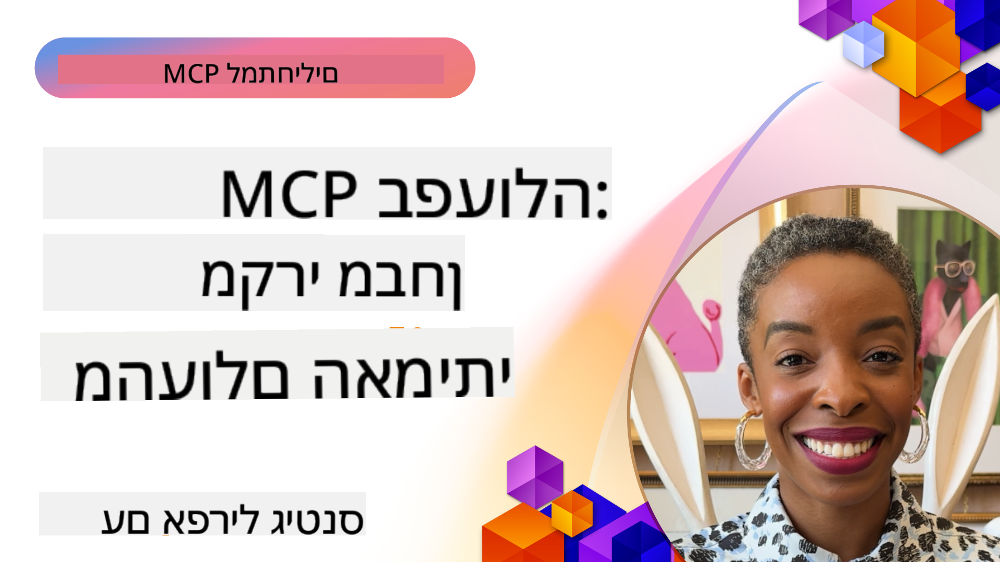

<!--
CO_OP_TRANSLATOR_METADATA:
{
  "original_hash": "1611dc5f6a2a35a789fc4c95fc5bfbe8",
  "translation_date": "2025-09-26T18:43:02+00:00",
  "source_file": "09-CaseStudy/README.md",
  "language_code": "he"
}
-->
# MCP בפעולה: מחקרי מקרה מהעולם האמיתי

_(לחצו על התמונה למעלה לצפייה בסרטון של השיעור הזה)_

פרוטוקול Model Context Protocol (MCP) משנה את הדרך שבה יישומי AI מתקשרים עם נתונים, כלים ושירותים. חלק זה מציג מחקרי מקרה מהעולם האמיתי המדגימים יישומים מעשיים של MCP בתרחישים ארגוניים שונים.

## סקירה כללית

חלק זה מציג דוגמאות מוחשיות ליישומי MCP, ומדגיש כיצד ארגונים מנצלים את הפרוטוקול הזה כדי לפתור אתגרים עסקיים מורכבים. באמצעות בחינת מחקרי המקרה, תוכלו לקבל תובנות על הגמישות, הסקלביליות והיתרונות המעשיים של MCP בתרחישים אמיתיים.

## מטרות למידה מרכזיות

על ידי חקר מחקרי המקרה, תלמדו:

- כיצד ניתן ליישם MCP לפתרון בעיות עסקיות ספציפיות
- על דפוסי אינטגרציה שונים וגישות ארכיטקטוניות
- לזהות שיטות עבודה מומלצות ליישום MCP בסביבות ארגוניות
- להבין את האתגרים והפתרונות שנמצאו ביישומים אמיתיים
- לזהות הזדמנויות ליישם דפוסים דומים בפרויקטים שלכם

## מחקרי מקרה נבחרים

### 1. [סוכני נסיעות Azure AI – יישום רפרנס](./travelagentsample.md)

מחקר מקרה זה בוחן את פתרון הרפרנס המקיף של Microsoft שמדגים כיצד לבנות אפליקציית תכנון נסיעות מבוססת AI עם MCP, Azure OpenAI ו-Azure AI Search. הפרויקט מציג:

- תזמור רב-סוכנים באמצעות MCP
- אינטגרציה של נתונים ארגוניים עם Azure AI Search
- ארכיטקטורה מאובטחת וסקלבילית באמצעות שירותי Azure
- כלים ניתנים להרחבה עם רכיבי MCP לשימוש חוזר
- חוויית משתמש שיחתית המופעלת על ידי Azure OpenAI

הארכיטקטורה ופרטי היישום מספקים תובנות חשובות לבניית מערכות רב-סוכנים מורכבות עם MCP כשכבת התיאום.

### 2. [עדכון פריטים ב-Azure DevOps מנתוני YouTube](./UpdateADOItemsFromYT.md)

מחקר מקרה זה מדגים יישום מעשי של MCP לאוטומציה של תהליכי עבודה. הוא מראה כיצד ניתן להשתמש בכלי MCP כדי:

- לחלץ נתונים מפלטפורמות מקוונות (YouTube)
- לעדכן פריטי עבודה במערכות Azure DevOps
- ליצור תהליכי אוטומציה חוזרים
- לשלב נתונים בין מערכות שונות

דוגמה זו ממחישה כיצד אפילו יישומי MCP פשוטים יחסית יכולים לספק שיפורים משמעותיים ביעילות על ידי אוטומציה של משימות שגרתיות ושיפור עקביות הנתונים בין מערכות.

### 3. [שליפת תיעוד בזמן אמת עם MCP](./docs-mcp/README.md)

מחקר מקרה זה מדריך אתכם כיצד לחבר לקוח קונסול Python לשרת Model Context Protocol (MCP) כדי לשלוף ולתעד תיעוד של Microsoft בזמן אמת ובהקשר מתאים. תלמדו כיצד:

- להתחבר לשרת MCP באמצעות לקוח Python ו-SDK הרשמי של MCP
- להשתמש בלקוחות HTTP זורמים לשליפת נתונים יעילה בזמן אמת
- לקרוא כלי תיעוד בשרת ולתעד תגובות ישירות בקונסול
- לשלב תיעוד מעודכן של Microsoft בתהליכי העבודה שלכם מבלי לצאת מהטרמינל

הפרק כולל משימה מעשית, דוגמת קוד מינימלית וקישורים למשאבים נוספים ללמידה מעמיקה. ראו את ההדרכה המלאה והקוד בפרק המקושר כדי להבין כיצד MCP יכול לשנות את הגישה לתיעוד ואת הפרודוקטיביות של מפתחים בסביבות מבוססות קונסול.

### 4. [אפליקציית אינטרנט ליצירת תוכנית לימודים אינטראקטיבית עם MCP](./docs-mcp/README.md)

מחקר מקרה זה מדגים כיצד לבנות אפליקציית אינטרנט אינטראקטיבית באמצעות Chainlit ו-MCP ליצירת תוכניות לימודים מותאמות אישית לכל נושא. משתמשים יכולים לציין נושא (כגון "הסמכת AI-900") ומשך לימודים (לדוגמה, 8 שבועות), והאפליקציה תספק פירוט שבועי של תוכן מומלץ. Chainlit מאפשר ממשק שיחה, מה שהופך את החוויה למרתקת ומותאמת.

- אפליקציית אינטרנט שיחתית המופעלת על ידי Chainlit
- הנחיות מונעות משתמש לנושא ולמשך זמן
- המלצות תוכן שבועיות באמצעות MCP
- תגובות בזמן אמת ומותאמות בממשק שיחה

הפרויקט ממחיש כיצד ניתן לשלב AI שיחתי ו-MCP ליצירת כלים חינוכיים דינמיים ומונעי משתמש בסביבת אינטרנט מודרנית.

### 5. [תיעוד בתוך העורך עם שרת MCP ב-VS Code](./docs-mcp/README.md)

מחקר מקרה זה מדגים כיצד ניתן להביא את תיעוד Microsoft Learn ישירות לסביבת VS Code שלכם באמצעות שרת MCP—אין צורך לעבור בין כרטיסיות בדפדפן! תלמדו כיצד:

- לחפש ולקרוא תיעוד בתוך VS Code באמצעות פאנל MCP או פלטת הפקודות
- להתייחס לתיעוד ולהכניס קישורים ישירות לקבצי README או Markdown של קורסים
- להשתמש ב-GitHub Copilot ו-MCP יחד לתיעוד וקוד מונעי AI
- לאמת ולשפר את התיעוד עם משוב בזמן אמת ודיוק ממקור Microsoft
- לשלב MCP עם תהליכי GitHub לאימות תיעוד מתמשך

היישום כולל:

- דוגמת קובץ `.vscode/mcp.json` להגדרה קלה
- הדרכות מבוססות צילומי מסך של החוויה בתוך העורך
- טיפים לשילוב Copilot ו-MCP למקסימום פרודוקטיביות

תרחיש זה אידיאלי עבור מחברי קורסים, כותבי תיעוד ומפתחים שרוצים להישאר ממוקדים בעורך שלהם תוך עבודה עם תיעוד, Copilot וכלי אימות—הכול מופעל על ידי MCP.

### 6. [יצירת שרת MCP עם APIM](./apimsample.md)

מחקר מקרה זה מספק מדריך שלב אחר שלב כיצד ליצור שרת MCP באמצעות Azure API Management (APIM). הוא מכסה:

- הגדרת שרת MCP ב-Azure API Management
- חשיפת פעולות API ככלי MCP
- הגדרת מדיניות להגבלת קצב ואבטחה
- בדיקת שרת MCP באמצעות Visual Studio Code ו-GitHub Copilot

דוגמה זו ממחישה כיצד ניתן לנצל את יכולות Azure ליצירת שרת MCP חזק שניתן להשתמש בו ביישומים שונים, ומשפר את האינטגרציה של מערכות AI עם APIs ארגוניים.

### 7. [רישום MCP ב-GitHub — האצת אינטגרציה סוכנית](https://github.com/mcp)

מחקר מקרה זה בוחן כיצד רישום MCP של GitHub, שהושק בספטמבר 2025, מתמודד עם אתגר קריטי באקוסיסטם ה-AI: גילוי ופריסה מפוזרים של שרתי Model Context Protocol (MCP).

#### סקירה כללית
**רישום MCP** פותר את הכאב הגובר של שרתי MCP מפוזרים בין מאגרים ורישומים, מה שהפך את האינטגרציה לאיטית ומועדת לטעויות. שרתים אלה מאפשרים לסוכני AI לתקשר עם מערכות חיצוניות כמו APIs, מסדי נתונים ומקורות תיעוד.

#### הצגת הבעיה
מפתחים שבונים תהליכי עבודה סוכניים נתקלו באתגרים רבים:
- **גילוי לקוי** של שרתי MCP בפלטפורמות שונות
- **שאלות הגדרה חוזרות** מפוזרות בפורומים ותיעוד
- **סיכוני אבטחה** ממקורות לא מאומתים ולא אמינים
- **חוסר סטנדרטיזציה** באיכות ובתאימות השרתים

#### ארכיטקטורת הפתרון
רישום MCP של GitHub מרכז שרתי MCP אמינים עם תכונות מפתח:
- **התקנה בלחיצה אחת** אינטגרציה באמצעות VS Code להגדרה פשוטה
- **מיון לפי אות מעל רעש** לפי כוכבים, פעילות ואימות קהילתי
- **אינטגרציה ישירה** עם GitHub Copilot וכלים תואמי MCP אחרים
- **מודל תרומה פתוח** המאפשר גם לקהילה וגם לשותפים ארגוניים לתרום

#### השפעה עסקית
הרישום סיפק שיפורים מדידים:
- **האצה בתהליכי התחלה** למפתחים המשתמשים בכלים כמו שרת MCP של Microsoft Learn, שמזרים תיעוד רשמי ישירות לסוכנים
- **שיפור פרודוקטיביות** באמצעות שרתים מתמחים כמו `github-mcp-server`, שמאפשרים אוטומציה טבעית של GitHub (יצירת PR, הפעלת CI מחדש, סריקת קוד)
- **חיזוק אמון באקוסיסטם** באמצעות רשימות מאורגנות וסטנדרטים שקופים להגדרות

#### ערך אסטרטגי
עבור מומחים המתמחים בניהול מחזור חיים של סוכנים ותהליכי עבודה שחוזרים על עצמם, רישום MCP מספק:
- **יכולות פריסה סוכנית מודולריות** עם רכיבים סטנדרטיים
- **צינורות הערכה מבוססי רישום** לבדיקות ואימות עקביים
- **אינטגרציה בין כלים** המאפשרת שילוב חלק בין פלטפורמות AI שונות

מחקר מקרה זה מדגים כי רישום MCP הוא יותר מסתם ספרייה—זו פלטפורמה בסיסית לאינטגרציה מודלית בקנה מידה גדול ולפריסת מערכות סוכניות.

## סיכום

שבעת מחקרי המקרה המקיפים הללו מדגימים את הגמישות יוצאת הדופן ואת היישומים המעשיים של פרוטוקול Model Context Protocol בתרחישים אמיתיים מגוונים. ממערכות תכנון נסיעות רב-סוכנים מורכבות וניהול API ארגוני ועד תהליכי עבודה מתועדים ב-VS Code ורישום MCP מהפכני ב-GitHub, דוגמאות אלו מציגות כיצד MCP מספק דרך סטנדרטית וסקלבילית לחבר מערכות AI עם הכלים, הנתונים והשירותים שהם צריכים כדי לספק ערך יוצא דופן.

מחקרי המקרה מכסים ממדים שונים של יישום MCP:
- **אינטגרציה ארגונית**: ניהול API של Azure ואוטומציה של Azure DevOps
- **תזמור רב-סוכנים**: תכנון נסיעות עם סוכני AI מתואמים
- **פרודוקטיביות מפתחים**: אינטגרציה ב-VS Code וגישה לתיעוד בזמן אמת
- **פיתוח אקוסיסטם**: רישום MCP של GitHub כפלטפורמה בסיסית
- **יישומים חינוכיים**: מחוללי תוכניות לימודים אינטראקטיביים וממשקי שיחה

על ידי לימוד יישומים אלו, תקבלו תובנות קריטיות על:
- **דפוסי ארכיטקטורה** למגוון קני מידה ושימושים
- **אסטרטגיות יישום** שמאזנות בין פונקציונליות לתחזוקה
- **שיקולי אבטחה וסקלביליות** לפריסות ייצור
- **שיטות עבודה מומלצות** לפיתוח שרתי MCP ואינטגרציה של לקוחות
- **חשיבה אקוסיסטמית** לבניית פתרונות AI מחוברים

דוגמאות אלו מדגימות יחד ש-MCP אינו רק מסגרת תיאורטית אלא פרוטוקול בשל ומוכן לייצור שמאפשר פתרונות מעשיים לאתגרים עסקיים מורכבים. בין אם אתם בונים כלי אוטומציה פשוטים או מערכות רב-סוכנים מתוחכמות, הדפוסים והגישות המוצגים כאן מספקים בסיס מוצק לפרויקטי MCP שלכם.

## משאבים נוספים

- [מאגר GitHub של סוכני נסיעות Azure AI](https://github.com/Azure-Samples/azure-ai-travel-agents)
- [כלי MCP של Azure DevOps](https://github.com/microsoft/azure-devops-mcp)
- [כלי MCP של Playwright](https://github.com/microsoft/playwright-mcp)
- [שרת MCP של Microsoft Docs](https://github.com/MicrosoftDocs/mcp)
- [רישום MCP ב-GitHub — האצת אינטגרציה סוכנית](https://github.com/mcp)
- [דוגמאות קהילת MCP](https://github.com/microsoft/mcp)

הבא: מעבדה מעשית [ייעול תהליכי עבודה של AI: בניית שרת MCP עם ערכת כלים AI](../10-StreamliningAIWorkflowsBuildingAnMCPServerWithAIToolkit/README.md)

---

