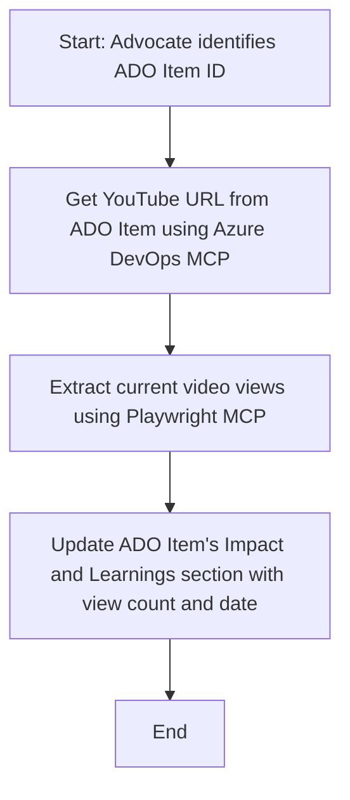

<!--
CO_OP_TRANSLATOR_METADATA:
{
  "original_hash": "14a2dfbea55ef735660a06bd6bdfe5f3",
  "translation_date": "2025-07-14T06:13:47+00:00",
  "source_file": "09-CaseStudy/UpdateADOItemsFromYT.md",
  "language_code": "he"
}
-->
# Case Study: עדכון פריטי Azure DevOps מנתוני YouTube עם MCP

> **Disclaimer:** קיימים כלים ודוחות מקוונים שיכולים לאוטומט את תהליך עדכון פריטי Azure DevOps עם נתונים מפלטפורמות כמו YouTube. התרחיש הבא מוצג כדוגמה בלבד להמחשת האופן שבו ניתן להשתמש בכלי MCP למשימות אוטומציה ואינטגרציה.

## סקירה כללית

מקרה בוחן זה מדגים דוגמה לאופן שבו פרוטוקול Model Context (MCP) וכליו יכולים לשמש לאוטומציה של תהליך עדכון פריטי עבודה ב-Azure DevOps (ADO) עם מידע שמקורו בפלטפורמות מקוונות, כגון YouTube. התרחיש המתואר הוא רק המחשה אחת מתוך מגוון היכולות הרחבות של כלים אלה, שניתן להתאים לצרכי אוטומציה דומים רבים.

בדוגמה זו, Advocate עוקב אחר מפגשים מקוונים באמצעות פריטי ADO, כאשר כל פריט כולל כתובת URL של סרטון YouTube. באמצעות כלי MCP, Advocate יכול לשמור על עדכניות פריטי ADO עם מדדי וידאו עדכניים, כגון מספר הצפיות, בצורה חוזרת ואוטומטית. גישה זו ניתנת להכללה למקרים אחרים שבהם יש צורך לשלב מידע ממקורות מקוונים לתוך ADO או מערכות אחרות.

## תרחיש

Advocate אחראי למעקב אחר השפעת מפגשים מקוונים ומעורבות הקהילה. כל מפגש מתועד כפריט עבודה ב-ADO בפרויקט 'DevRel', ופריט העבודה מכיל שדה לכתובת URL של סרטון YouTube. כדי לדווח במדויק על היקף המפגש, Advocate צריך לעדכן את פריט ה-ADO עם מספר הצפיות הנוכחי בתמונה ואת התאריך שבו נמשכו הנתונים.

## כלים בשימוש

- [Azure DevOps MCP](https://github.com/microsoft/azure-devops-mcp): מאפשר גישה ועדכונים תכנותיים לפריטי עבודה ב-ADO דרך MCP.
- [Playwright MCP](https://github.com/microsoft/playwright-mcp): מאוטומט פעולות דפדפן להוצאת נתונים חיים מדפי אינטרנט, כגון סטטיסטיקות סרטוני YouTube.

## תהליך עבודה שלב אחר שלב

1. **זיהוי פריט ADO**: התחילו עם מזהה פריט העבודה ב-ADO (למשל, 1234) בפרויקט 'DevRel'.
2. **שליפת כתובת YouTube**: השתמשו בכלי Azure DevOps MCP כדי לקבל את כתובת ה-YouTube מפריט העבודה.
3. **שליפת מספר צפיות**: השתמשו בכלי Playwright MCP כדי לנווט לכתובת ה-YouTube ולחלץ את מספר הצפיות הנוכחי.
4. **עדכון פריט ADO**: כתבו את מספר הצפיות העדכני ואת תאריך השליפה בקטע 'Impact and Learnings' של פריט העבודה ב-ADO באמצעות כלי Azure DevOps MCP.

## דוגמת פקודה

```bash
- Work with the ADO Item ID: 1234
- The project is '2025-Awesome'
- Get the YouTube URL for the ADO item
- Use Playwright to get the current views from the YouTube video
- Update the ADO item with the current video views and the updated date of the information
```

## דיאגרמת זרימה של Mermaid



## יישום טכני

- **אורקסטרציה של MCP**: תהליך העבודה מנוהל על ידי שרת MCP, המתאם את השימוש בכלי Azure DevOps MCP ו-Playwright MCP.
- **אוטומציה**: התהליך יכול להיות מופעל ידנית או מתוזמן לפעול בפרקי זמן קבועים כדי לשמור על עדכניות פריטי ADO.
- **הרחבה**: ניתן להרחיב את הדפוס לעדכון פריטי ADO עם מדדים מקוונים אחרים (כגון לייקים, תגובות) או מפלטפורמות נוספות.

## תוצאות והשפעה

- **יעילות**: מפחית את המאמץ הידני של Advocates על ידי אוטומציה של שליפת ועדכון מדדי הווידאו.
- **דיוק**: מבטיח שפריטי ADO משקפים את הנתונים העדכניים ביותר הזמינים ממקורות מקוונים.
- **חזרתיות**: מספק תהליך עבודה שניתן להשתמש בו שוב לתרחישים דומים הכוללים מקורות נתונים או מדדים אחרים.

## מקורות

- [Azure DevOps MCP](https://github.com/microsoft/azure-devops-mcp)
- [Playwright MCP](https://github.com/microsoft/playwright-mcp)
- [Model Context Protocol (MCP)](https://modelcontextprotocol.io/)

**כתב ויתור**:  
מסמך זה תורגם באמצעות שירות תרגום מבוסס בינה מלאכותית [Co-op Translator](https://github.com/Azure/co-op-translator). למרות שאנו שואפים לדיוק, יש לקחת בחשבון כי תרגומים אוטומטיים עלולים להכיל שגיאות או אי-דיוקים. המסמך המקורי בשפת המקור שלו נחשב למקור הסמכותי. למידע קריטי מומלץ להשתמש בתרגום מקצועי על ידי אדם. אנו לא נושאים באחריות לכל אי-הבנה או פרשנות שגויה הנובעת משימוש בתרגום זה.