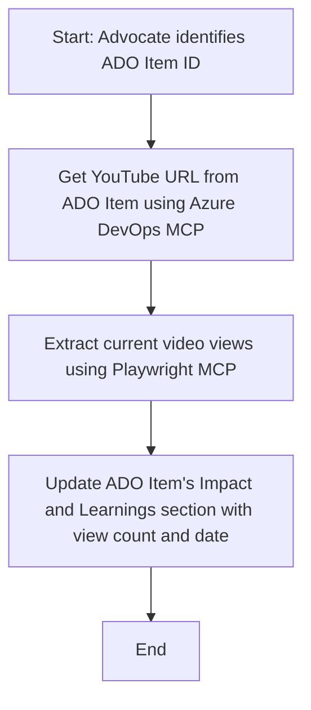

<!--
CO_OP_TRANSLATOR_METADATA:
{
  "original_hash": "14a2dfbea55ef735660a06bd6bdfe5f3",
  "translation_date": "2025-06-13T21:36:48+00:00",
  "source_file": "09-CaseStudy/UpdateADOItemsFromYT.md",
  "language_code": "he"
}
-->
# מקרה בוחן: עדכון פריטי Azure DevOps מנתוני YouTube עם MCP

> **הצהרת אחריות:** קיימים כלים ודוחות מקוונים שיכולים לאוטומט את תהליך עדכון פריטי Azure DevOps עם נתונים מפלטפורמות כמו YouTube. התרחיש הבא נמסר כדוגמה בלבד להמחשת האופן שבו ניתן להשתמש בכלי MCP לאוטומציה ואינטגרציה.

## סקירה כללית

מקרה בוחן זה מציג דוגמה לאופן שבו פרוטוקול הקשר המודל (MCP) וכליו יכולים לשמש לאוטומציה של תהליך עדכון פריטי עבודה ב-Azure DevOps (ADO) עם מידע שמקורו בפלטפורמות מקוונות, כגון YouTube. התרחיש המתואר הוא רק המחשה אחת מתוך היכולות הרחבות של הכלים הללו, שניתן להתאים לצרכים דומים רבים של אוטומציה.

בדוגמה זו, Advocate עוקב אחר מפגשים מקוונים באמצעות פריטי ADO, כאשר כל פריט כולל כתובת URL של סרטון YouTube. באמצעות כלי MCP, Advocate יכול לשמור על עדכניות פריטי ADO עם מדדי וידאו עדכניים, כמו מספר הצפיות, בצורה חוזרת ואוטומטית. גישה זו ניתנת להכללה לשימושים אחרים שבהם יש לשלב מידע ממקורות מקוונים ל-ADO או למערכות אחרות.

## תרחיש

Advocate אחראי למעקב אחר השפעת מפגשים מקוונים ומעורבות הקהילה. כל מפגש מתועד כפריט עבודה ב-ADO בפרויקט 'DevRel', ופריט העבודה מכיל שדה לכתובת URL של סרטון YouTube. כדי לדווח במדויק על היקף המפגש, Advocate צריך לעדכן את פריט ה-ADO עם מספר הצפיות הנוכחי בתאריך שבו נמשכו הנתונים.

## כלים בשימוש

- [Azure DevOps MCP](https://github.com/microsoft/azure-devops-mcp): מאפשר גישה ועדכונים תכנותיים לפריטי עבודה ב-ADO דרך MCP.
- [Playwright MCP](https://github.com/microsoft/playwright-mcp): מאוטומט פעולות דפדפן כדי לחלץ נתונים חיים מדפי אינטרנט, כגון סטטיסטיקות סרטוני YouTube.

## תהליך עבודה שלב-אחר-שלב

1. **זיהוי פריט ה-ADO**: התחילו עם מזהה פריט העבודה ב-ADO (למשל, 1234) בפרויקט 'DevRel'.
2. **שליפת כתובת ה-YouTube**: השתמשו בכלי Azure DevOps MCP כדי לקבל את כתובת ה-YouTube מפריט העבודה.
3. **חילוץ מספר הצפיות**: השתמשו בכלי Playwright MCP כדי לנווט לכתובת ה-YouTube ולחלץ את מספר הצפיות הנוכחי.
4. **עדכון פריט ה-ADO**: כתבו את מספר הצפיות העדכני ותאריך השליפה בקטע 'Impact and Learnings' של פריט העבודה ב-ADO באמצעות כלי Azure DevOps MCP.

## דוגמת פקודה

```bash
- Work with the ADO Item ID: 1234
- The project is '2025-Awesome'
- Get the YouTube URL for the ADO item
- Use Playwright to get the current views from the YouTube video
- Update the ADO item with the current video views and the updated date of the information
```

## דיאגרמת זרימה של Mermaid



## מימוש טכני

- **תזמור MCP**: תהליך העבודה מתוזמר על ידי שרת MCP, שמקשר בין השימוש בכלי Azure DevOps MCP ו-Playwright MCP.
- **אוטומציה**: התהליך יכול לפעול ידנית או להיות מתוזמן לריצה תקופתית כדי לשמור על עדכניות פריטי ה-ADO.
- **הרחבה**: אותו דפוס ניתן להרחיב לעדכון פריטי ADO עם מדדים מקוונים אחרים (כגון לייקים, תגובות) או מפלטפורמות נוספות.

## תוצאות והשפעה

- **יעילות**: מפחית מאמץ ידני של Advocates על ידי אוטומציה של שליפת ועדכון מדדי הווידאו.
- **דיוק**: מבטיח שפריטי ה-ADO משקפים את הנתונים העדכניים ביותר הזמינים ממקורות מקוונים.
- **חזרה על התהליך**: מספק תהליך עבודה שניתן להשתמש בו שוב בתרחישים דומים עם מקורות או מדדים אחרים.

## מקורות

- [Azure DevOps MCP](https://github.com/microsoft/azure-devops-mcp)
- [Playwright MCP](https://github.com/microsoft/playwright-mcp)
- [Model Context Protocol (MCP)](https://modelcontextprotocol.io/)

**כתב ויתור**:  
מסמך זה תורגם באמצעות שירות תרגום מבוסס בינה מלאכותית [Co-op Translator](https://github.com/Azure/co-op-translator). למרות שאנו שואפים לדיוק, יש לקחת בחשבון כי תרגומים אוטומטיים עלולים להכיל שגיאות או אי-דיוקים. המסמך המקורי בשפת המקור שלו נחשב למקור הסמכותי. למידע קריטי מומלץ להשתמש בתרגום מקצועי על ידי מתרגם אנושי. אנו לא נושאים באחריות לכל אי-הבנה או פרשנות שגויה הנובעת משימוש בתרגום זה.