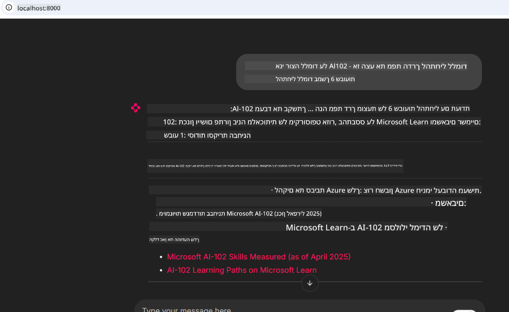
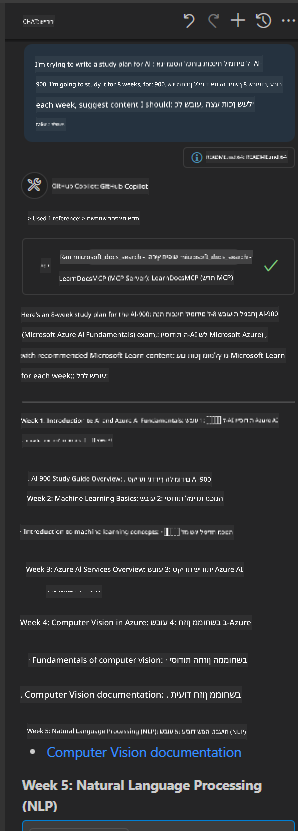

<!--
CO_OP_TRANSLATOR_METADATA:
{
  "original_hash": "4319d291c9d124ecafea52b3d04bfa0e",
  "translation_date": "2025-07-14T06:26:34+00:00",
  "source_file": "09-CaseStudy/docs-mcp/README.md",
  "language_code": "he"
}
-->
# מחקר מקרה: התחברות לשרת Microsoft Learn Docs MCP מלקוח

האם מצאת את עצמך אי פעם מתרוצץ בין אתרי תיעוד, Stack Overflow, וטאבים אינסופיים במנועי חיפוש, בזמן שאתה מנסה לפתור בעיה בקוד שלך? אולי יש לך מסך שני רק לתיעוד, או שאתה כל הזמן מחליף בין ה-IDE לדפדפן. האם לא היה עדיף אם היית יכול להביא את התיעוד ישירות לתוך זרימת העבודה שלך—משולב באפליקציות שלך, ב-IDE, או אפילו בכלים מותאמים אישית? במחקר מקרה זה נחקור כיצד לעשות בדיוק את זה על ידי התחברות ישירה לשרת Microsoft Learn Docs MCP מתוך אפליקציית הלקוח שלך.

## סקירה כללית

פיתוח מודרני הוא יותר מאשר כתיבת קוד—זה למצוא את המידע הנכון בזמן הנכון. התיעוד נמצא בכל מקום, אך לעיתים רחוקות במקום שבו אתה הכי צריך אותו: בתוך הכלים וזרימות העבודה שלך. על ידי שילוב של שליפת תיעוד ישירות לתוך האפליקציות שלך, תוכל לחסוך זמן, להפחית החלפת הקשר, ולהגביר את הפרודוקטיביות. בחלק זה נציג כיצד להתחבר לשרת Microsoft Learn Docs MCP, כדי שתוכל לגשת לתיעוד בזמן אמת, המותאם להקשר, מבלי לעזוב את האפליקציה שלך.

נלך יחד בתהליך הקמת החיבור, שליחת בקשה, וטיפול בתגובות סטרימינג בצורה יעילה. גישה זו לא רק מפשטת את זרימת העבודה שלך, אלא גם פותחת דלת לבניית כלים חכמים, מועילים יותר למפתחים.

## מטרות הלמידה

למה אנחנו עושים את זה? כי חוויות המפתחים הטובות ביותר הן אלה שמסירות מחסומים. דמיין עולם שבו עורך הקוד שלך, הצ'אטבוט או אפליקציית האינטרנט שלך יכולים לענות על שאלות התיעוד שלך מיד, באמצעות התוכן העדכני ביותר מ-Microsoft Learn. בסוף הפרק הזה תדע כיצד:

- להבין את היסודות של תקשורת שרת-לקוח MCP עבור תיעוד
- לממש אפליקציית קונסול או ווב שמתחברת לשרת Microsoft Learn Docs MCP
- להשתמש בלקוחות HTTP סטרימינג לשליפת תיעוד בזמן אמת
- לתעד ולפרש תגובות תיעוד באפליקציה שלך

תראה כיצד מיומנויות אלו יכולות לעזור לך לבנות כלים שהם לא רק תגובתיים, אלא ממש אינטראקטיביים ומותאמים להקשר.

## תרחיש 1 - שליפת תיעוד בזמן אמת עם MCP

בתרחיש זה נציג כיצד להתחבר לשרת Microsoft Learn Docs MCP, כדי שתוכל לגשת לתיעוד בזמן אמת, המותאם להקשר, מבלי לעזוב את האפליקציה שלך.

בוא ניישם את זה בפועל. המשימה שלך היא לכתוב אפליקציה שמתחברת לשרת Microsoft Learn Docs MCP, מפעילה את הכלי `microsoft_docs_search`, ומתעדת את תגובת הסטרימינג בקונסול.

### למה הגישה הזו?
כי זו הבסיס לבניית אינטגרציות מתקדמות יותר—בין אם אתה רוצה להפעיל צ'אטבוט, תוסף IDE, או לוח בקרה אינטרנטי.

תמצא את הקוד וההוראות לתרחיש זה בתיקיית [`solution`](./solution/README.md) בתוך מחקר המקרה. השלבים ינחו אותך בהקמת החיבור:
- השתמש ב-SDK הרשמי של MCP ובלקוח HTTP סטרימינג לחיבור
- קרא לכלי `microsoft_docs_search` עם פרמטר שאילתה לשליפת התיעוד
- מימש רישום נכון וטיפול בשגיאות
- צור ממשק קונסול אינטראקטיבי שיאפשר למשתמשים להזין שאילתות חיפוש מרובות

תרחיש זה מדגים כיצד:
- להתחבר לשרת Docs MCP
- לשלוח שאילתה
- לפרש ולהדפיס את התוצאות

כך עשוי להיראות הרצת הפתרון:

```
Prompt> What is Azure Key Vault?
Answer> Azure Key Vault is a cloud service for securely storing and accessing secrets. ...
```

להלן דוגמה מינימלית לפתרון. הקוד המלא והפרטים זמינים בתיקיית הפתרון.

<details>
<summary>Python</summary>

```python
import asyncio
from mcp.client.streamable_http import streamablehttp_client
from mcp import ClientSession

async def main():
    async with streamablehttp_client("https://learn.microsoft.com/api/mcp") as (read_stream, write_stream, _):
        async with ClientSession(read_stream, write_stream) as session:
            await session.initialize()
            result = await session.call_tool("microsoft_docs_search", {"query": "Azure Functions best practices"})
            print(result.content)

if __name__ == "__main__":
    asyncio.run(main())
```

- למימוש מלא ולרישום, ראה את הקובץ [`scenario1.py`](../../../../09-CaseStudy/docs-mcp/solution/python/scenario1.py).
- להוראות התקנה ושימוש, ראה את הקובץ [`README.md`](./solution/python/README.md) באותה תיקייה.
</details>

## תרחיש 2 - אפליקציית ווב אינטראקטיבית ליצירת תוכנית לימודים עם MCP

בתרחיש זה תלמד כיצד לשלב את Docs MCP בפרויקט פיתוח ווב. המטרה היא לאפשר למשתמשים לחפש בתיעוד Microsoft Learn ישירות מתוך ממשק ווב, ולהפוך את התיעוד לנגיש מיד בתוך האפליקציה או האתר שלך.

תראה כיצד:
- להקים אפליקציית ווב
- להתחבר לשרת Docs MCP
- לטפל בקלט משתמש ולהציג תוצאות

כך עשוי להיראות הרצת הפתרון:

```
User> I want to learn about AI102 - so suggest the roadmap to get it started from learn for 6 weeks

Assistant> Here’s a detailed 6-week roadmap to start your preparation for the AI-102: Designing and Implementing a Microsoft Azure AI Solution certification, using official Microsoft resources and focusing on exam skills areas:

---
## Week 1: Introduction & Fundamentals
- **Understand the Exam**: Review the [AI-102 exam skills outline](https://learn.microsoft.com/en-us/credentials/certifications/exams/ai-102/).
- **Set up Azure**: Sign up for a free Azure account if you don't have one.
- **Learning Path**: [Introduction to Azure AI services](https://learn.microsoft.com/en-us/training/modules/intro-to-azure-ai/)
- **Focus**: Get familiar with Azure portal, AI capabilities, and necessary tools.

....more weeks of the roadmap...

Let me know if you want module-specific recommendations or need more customized weekly tasks!
```

להלן דוגמה מינימלית לפתרון. הקוד המלא והפרטים זמינים בתיקיית הפתרון.



<details>
<summary>Python (Chainlit)</summary>

Chainlit הוא מסגרת לבניית אפליקציות ווב מבוססות שיחה עם בינה מלאכותית. הוא מקל על יצירת צ'אטבוטים ואסיסטנטים אינטראקטיביים שיכולים לקרוא לכלי MCP ולהציג תוצאות בזמן אמת. אידיאלי לפרוטוטייפ מהיר וממשקים ידידותיים למשתמש.

```python
import chainlit as cl
import requests

MCP_URL = "https://learn.microsoft.com/api/mcp"

@cl.on_message
def handle_message(message):
    query = {"question": message}
    response = requests.post(MCP_URL, json=query)
    if response.ok:
        result = response.json()
        cl.Message(content=result.get("answer", "No answer found.")).send()
    else:
        cl.Message(content="Error: " + response.text).send()
```

- למימוש מלא, ראה את הקובץ [`scenario2.py`](../../../../09-CaseStudy/docs-mcp/solution/python/scenario2.py).
- להוראות התקנה והרצה, ראה את הקובץ [`README.md`](./solution/python/README.md).
</details>

## תרחיש 3: תיעוד בתוך העורך עם שרת MCP ב-VS Code

אם ברצונך לקבל את Microsoft Learn Docs ישירות בתוך VS Code (במקום לעבור בין טאבים בדפדפן), תוכל להשתמש בשרת MCP בתוך העורך שלך. זה מאפשר לך:
- לחפש ולקרוא תיעוד ב-VS Code מבלי לעזוב את סביבת הקידוד שלך.
- להפנות לתיעוד ולהכניס קישורים ישירות לקבצי README או קורסים.
- לשלב בין GitHub Copilot ל-MCP לזרימת עבודה חלקה ומונעת בינה מלאכותית.

**תלמד כיצד:**
- להוסיף קובץ `.vscode/mcp.json` תקין לשורש סביבת העבודה שלך (ראה דוגמה למטה).
- לפתוח את לוח MCP או להשתמש בפלטת הפקודות ב-VS Code לחיפוש והכנסת תיעוד.
- להפנות לתיעוד ישירות בקבצי markdown תוך כדי עבודה.
- לשלב את זרימת העבודה הזו עם GitHub Copilot לפרודוקטיביות גבוהה יותר.

הנה דוגמה כיצד להגדיר את שרת MCP ב-VS Code:

```json
{
  "servers": {
    "LearnDocsMCP": {
      "url": "https://learn.microsoft.com/api/mcp"
    }
  }
}
```

</details>

> למדריך מפורט עם צילומי מסך והסברים שלב אחר שלב, ראה את הקובץ [`README.md`](./solution/scenario3/README.md).



גישה זו אידיאלית לכל מי שבונה קורסים טכניים, כותב תיעוד, או מפתח קוד עם צורך תדיר בהפניות.

## נקודות מפתח

שילוב התיעוד ישירות בכלים שלך הוא לא רק נוחות—זו מהפכה בפרודוקטיביות. על ידי התחברות לשרת Microsoft Learn Docs MCP מתוך הלקוח שלך, תוכל:

- לבטל את הצורך להחליף הקשר בין הקוד לתיעוד
- לקבל תיעוד עדכני ומותאם להקשר בזמן אמת
- לבנות כלים חכמים, אינטראקטיביים יותר למפתחים

מיומנויות אלו יעזרו לך ליצור פתרונות שהם לא רק יעילים, אלא גם מהנים לשימוש.

## משאבים נוספים

להעמקת ההבנה, חקור את המשאבים הרשמיים הבאים:

- [Microsoft Learn Docs MCP Server (GitHub)](https://github.com/MicrosoftDocs/mcp)
- [Get started with Azure MCP Server (mcp-python)](https://learn.microsoft.com/en-us/azure/developer/azure-mcp-server/get-started#create-the-python-app)
- [What is the Azure MCP Server?](https://learn.microsoft.com/en-us/azure/developer/azure-mcp-server/)
- [Model Context Protocol (MCP) Introduction](https://modelcontextprotocol.io/introduction)
- [Add plugins from a MCP Server (Python)](https://learn.microsoft.com/en-us/semantic-kernel/concepts/plugins/adding-mcp-plugins)

**כתב ויתור**:  
מסמך זה תורגם באמצעות שירות תרגום מבוסס בינה מלאכותית [Co-op Translator](https://github.com/Azure/co-op-translator). למרות שאנו שואפים לדיוק, יש לקחת בחשבון כי תרגומים אוטומטיים עלולים להכיל שגיאות או אי-דיוקים. המסמך המקורי בשפת המקור שלו צריך להיחשב כמקור הסמכות. למידע קריטי מומלץ להשתמש בתרגום מקצועי על ידי אדם. אנו לא נושאים באחריות לכל אי-הבנה או פרשנות שגויה הנובעת משימוש בתרגום זה.