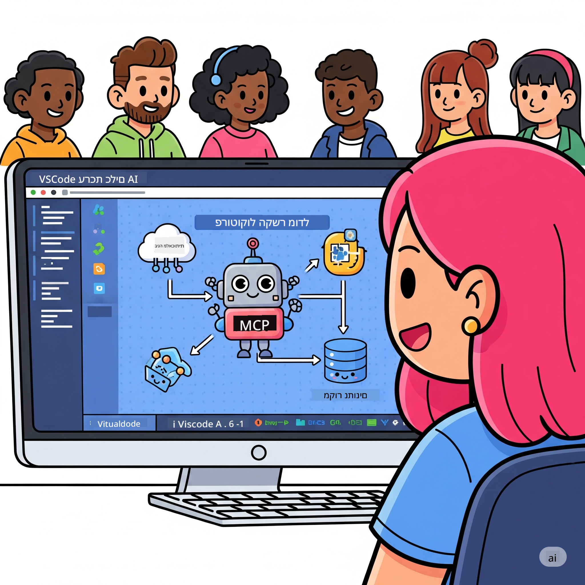
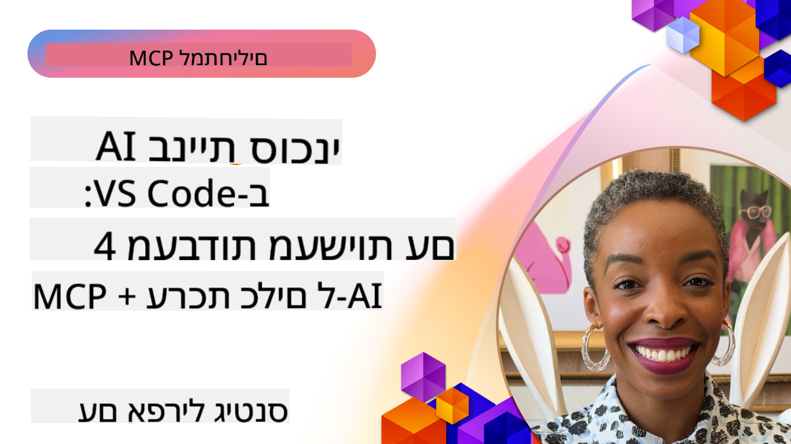

<!--
CO_OP_TRANSLATOR_METADATA:
{
  "original_hash": "1b000fd6e1b04c047578bfc5d07d54eb",
  "translation_date": "2025-08-18T17:02:29+00:00",
  "source_file": "10-StreamliningAIWorkflowsBuildingAnMCPServerWithAIToolkit/README.md",
  "language_code": "he"
}
-->
# ייעול תהליכי עבודה עם AI: בניית שרת MCP עם AI Toolkit

## 🎯 סקירה כללית

_(לחצו על התמונה למעלה לצפייה בסרטון של השיעור)_

ברוכים הבאים ל-**סדנת Model Context Protocol (MCP)**! סדנה מעשית זו משלבת שתי טכנולוגיות מתקדמות שמטרתן לשנות את הדרך שבה מפתחים יישומי AI:

- **🔗 Model Context Protocol (MCP)**: תקן פתוח לשילוב חלק של כלי AI
- **🛠️ AI Toolkit ל-Visual Studio Code (AITK)**: הרחבה עוצמתית של מיקרוסופט לפיתוח AI

### 🎓 מה תלמדו

בסיום הסדנה, תשלוט באמנות בניית יישומים חכמים שמחברים מודלים של AI לכלים ושירותים בעולם האמיתי. החל מבדיקות אוטומטיות ועד אינטגרציות מותאמות של API, תרכשו מיומנויות מעשיות לפתרון אתגרים עסקיים מורכבים.

## 🏗️ מערך טכנולוגי

### 🔌 Model Context Protocol (MCP)

MCP הוא **"USB-C ל-AI"** - תקן אוניברסלי שמחבר מודלים של AI לכלים חיצוניים ומקורות נתונים.

**✨ תכונות עיקריות:**

- 🔄 **אינטגרציה סטנדרטית**: ממשק אוניברסלי לחיבור כלי AI
- 🏛️ **ארכיטקטורה גמישה**: שרתים מקומיים ומרוחקים באמצעות stdio/SSE
- 🧰 **מערכת אקולוגית עשירה**: כלים, הנחיות ומשאבים בפרוטוקול אחד
- 🔒 **מוכן לארגונים**: אבטחה ואמינות מובנות

**🎯 למה MCP חשוב:**
כמו ש-USB-C פתר את כאוס הכבלים, MCP פותר את המורכבות של אינטגרציות AI. פרוטוקול אחד, אינסוף אפשרויות.

### 🤖 AI Toolkit ל-Visual Studio Code (AITK)

הרחבת הפיתוח של מיקרוסופט שממנפת את VS Code לכוח AI.

**🚀 יכולות מרכזיות:**

- 📦 **קטלוג מודלים**: גישה למודלים מ-Azure AI, GitHub, Hugging Face, Ollama
- ⚡ **הסקה מקומית**: ביצוע אופטימלי של ONNX על CPU/GPU/NPU
- 🏗️ **בונה סוכנים**: פיתוח סוכני AI חזותי עם אינטגרציה של MCP
- 🎭 **רב-מודאלי**: תמיכה בטקסט, חזות, ותוצאות מובנות

**💡 יתרונות פיתוח:**

- פריסת מודלים ללא הגדרות
- הנדסת הנחיות חזותית
- סביבת בדיקות בזמן אמת
- אינטגרציה חלקה של שרת MCP

## 📚 מסלול הלמידה

### [🚀 מודול 1: יסודות AI Toolkit](./lab1/README.md)

**משך**: 15 דקות

- 🛠️ התקנה והגדרת AI Toolkit ל-VS Code
- 🗂️ חקר קטלוג המודלים (100+ מודלים מ-GitHub, ONNX, OpenAI, Anthropic, Google)
- 🎮 שליטה במגרש המשחקים האינטראקטיבי לבדיקת מודלים בזמן אמת
- 🤖 בניית סוכן AI ראשון עם בונה הסוכנים
- 📊 הערכת ביצועי מודלים עם מדדים מובנים (F1, רלוונטיות, דמיון, עקביות)
- ⚡ למידת יכולות עיבוד אצווה ותמיכה רב-מודאלית

**🎯 תוצאה לימודית**: יצירת סוכן AI פונקציונלי עם הבנה מקיפה של יכולות AITK

### [🌐 מודול 2: יסודות MCP עם AI Toolkit](./lab2/README.md)

**משך**: 20 דקות

- 🧠 שליטה בארכיטקטורה ובמושגים של Model Context Protocol (MCP)
- 🌐 חקר מערכת שרתי MCP של מיקרוסופט
- 🤖 בניית סוכן אוטומציה לדפדפן באמצעות שרת MCP של Playwright
- 🔧 אינטגרציה של שרתי MCP עם בונה הסוכנים של AI Toolkit
- 📊 הגדרה ובדיקה של כלי MCP בתוך הסוכנים שלכם
- 🚀 ייצוא ופריסת סוכנים מבוססי MCP לשימוש בייצור

**🎯 תוצאה לימודית**: פריסת סוכן AI משודרג עם כלים חיצוניים באמצעות MCP

### [🔧 מודול 3: פיתוח מתקדם של MCP עם AI Toolkit](./lab3/README.md)

**משך**: 20 דקות

- 💻 יצירת שרתי MCP מותאמים אישית באמצעות AI Toolkit
- 🐍 הגדרה ושימוש ב-SDK Python MCP העדכני (v1.9.3)
- 🔍 הגדרה ושימוש ב-MCP Inspector לצורכי דיבוג
- 🛠️ בניית שרת MCP למזג אוויר עם תהליכי דיבוג מקצועיים
- 🧪 דיבוג שרתי MCP בסביבות בונה הסוכנים וה-MCP Inspector

**🎯 תוצאה לימודית**: פיתוח ודיבוג שרתי MCP מותאמים אישית עם כלי עבודה מודרניים

### [🐙 מודול 4: פיתוח MCP מעשי - שרת GitHub Clone מותאם אישית](./lab4/README.md)

**משך**: 30 דקות

- 🏗️ בניית שרת MCP אמיתי לשכפול GitHub עבור תהליכי פיתוח
- 🔄 יישום שכפול מאגר חכם עם אימות וטיפול בשגיאות
- 📁 יצירת ניהול תיקיות חכם ואינטגרציה עם VS Code
- 🤖 שימוש במצב סוכן GitHub Copilot עם כלי MCP מותאמים אישית
- 🛡️ יישום אמינות מוכנה לייצור ותאימות בין-פלטפורמות

**🎯 תוצאה לימודית**: פריסת שרת MCP מוכן לייצור שמייעל תהליכי פיתוח אמיתיים

## 💡 יישומים והשפעה בעולם האמיתי

### 🏢 שימושים ארגוניים

#### 🔄 אוטומציה של DevOps

שדרגו את תהליכי הפיתוח שלכם עם אוטומציה חכמה:

- **ניהול מאגר חכם**: סקירת קוד והחלטות מיזוג מונעות AI
- **CI/CD חכם**: אופטימיזציה אוטומטית של צינורות על בסיס שינויים בקוד
- **מיון בעיות**: סיווג ותיעדוף באגים באופן אוטומטי

#### 🧪 מהפכת הבטחת איכות

שפרו בדיקות עם אוטומציה מונעת AI:

- **יצירת בדיקות חכמה**: יצירת מערכי בדיקות מקיפים באופן אוטומטי
- **בדיקות רגרסיה חזותיות**: זיהוי שינויים בממשק משתמש באמצעות AI
- **מעקב ביצועים**: זיהוי ופתרון בעיות באופן יזום

#### 📊 אינטליגנציה בצינורות נתונים

בנו תהליכי עיבוד נתונים חכמים יותר:

- **תהליכי ETL אדפטיביים**: טרנספורמציות נתונים שמתאימות את עצמן
- **זיהוי חריגות**: ניטור איכות נתונים בזמן אמת
- **ניתוב חכם**: ניהול זרימת נתונים חכם

#### 🎧 שיפור חוויית לקוח

צרו אינטראקציות לקוח יוצאות דופן:

- **תמיכה מודעת הקשר**: סוכני AI עם גישה להיסטוריית לקוח
- **פתרון בעיות יזום**: שירות לקוחות מנבא
- **אינטגרציה רב-ערוצית**: חוויית AI אחידה בכל הפלטפורמות

## 🛠️ דרישות מוקדמות והגדרות

### 💻 דרישות מערכת

| רכיב | דרישה | הערות |
|------|-------|-------|
| **מערכת הפעלה** | Windows 10+, macOS 10.15+, Linux | כל מערכת הפעלה מודרנית |
| **Visual Studio Code** | גרסה יציבה אחרונה | נדרש עבור AITK |
| **Node.js** | v18.0+ ו-npm | לפיתוח שרתי MCP |
| **Python** | 3.10+ | אופציונלי עבור שרתי MCP ב-Python |
| **זיכרון** | מינימום 8GB RAM | מומלץ 16GB עבור מודלים מקומיים |

### 🔧 סביבת פיתוח

#### הרחבות מומלצות ל-VS Code

- **AI Toolkit** (ms-windows-ai-studio.windows-ai-studio)
- **Python** (ms-python.python)
- **Python Debugger** (ms-python.debugpy)
- **GitHub Copilot** (GitHub.copilot) - אופציונלי אך מועיל

#### כלים אופציונליים

- **uv**: מנהל חבילות Python מודרני
- **MCP Inspector**: כלי דיבוג חזותי לשרתי MCP
- **Playwright**: לדוגמאות אוטומציה של דפדפן

## 🎖️ תוצאות לימוד ומסלול הסמכה

### 🏆 רשימת מיומנויות לשליטה

עם סיום הסדנה, תגיעו לשליטה ב:

#### 🎯 מיומנויות ליבה

- [ ] **שליטה בפרוטוקול MCP**: הבנה מעמיקה של ארכיטקטורה ודפוסי יישום
- [ ] **שליטה ב-AITK**: שימוש ברמה מקצועית ב-AI Toolkit לפיתוח מהיר
- [ ] **פיתוח שרתים מותאמים אישית**: בנייה, פריסה ותחזוקה של שרתי MCP בייצור
- [ ] **אינטגרציה מצוינת של כלים**: חיבור AI לתהליכי פיתוח קיימים
- [ ] **יישום פתרון בעיות**: יישום מיומנויות שנלמדו לאתגרים עסקיים אמיתיים

#### 🔧 מיומנויות טכניות

- [ ] הגדרה והתקנה של AI Toolkit ב-VS Code
- [ ] עיצוב ויישום שרתי MCP מותאמים אישית
- [ ] אינטגרציה של מודלים GitHub עם ארכיטקטורת MCP
- [ ] בניית תהליכי בדיקות אוטומטיים עם Playwright
- [ ] פריסת סוכני AI לשימוש בייצור
- [ ] דיבוג ואופטימיזציה של ביצועי שרתי MCP

#### 🚀 יכולות מתקדמות

- [ ] ארכיטקטורה של אינטגרציות AI בקנה מידה ארגוני
- [ ] יישום שיטות אבטחה מומלצות ליישומי AI
- [ ] עיצוב ארכיטקטורות שרתי MCP ניתנות להרחבה
- [ ] יצירת שרשראות כלים מותאמות לתחומים ספציפיים
- [ ] הדרכת אחרים בפיתוח מבוסס AI

## 📖 משאבים נוספים

- [מפרט MCP](https://modelcontextprotocol.io/docs)
- [מאגר GitHub של AI Toolkit](https://github.com/microsoft/vscode-ai-toolkit)
- [אוסף שרתי MCP לדוגמה](https://github.com/modelcontextprotocol/servers)
- [מדריך שיטות עבודה מומלצות](https://modelcontextprotocol.io/docs/best-practices)

---

**🚀 מוכנים לשנות את תהליכי הפיתוח שלכם עם AI?**

בואו נבנה יחד את העתיד של יישומים חכמים עם MCP ו-AI Toolkit!

**כתב ויתור**:  
מסמך זה תורגם באמצעות שירות תרגום מבוסס בינה מלאכותית [Co-op Translator](https://github.com/Azure/co-op-translator). למרות שאנו שואפים לדיוק, יש לקחת בחשבון שתרגומים אוטומטיים עשויים להכיל שגיאות או אי דיוקים. המסמך המקורי בשפתו המקורית צריך להיחשב כמקור הסמכותי. עבור מידע קריטי, מומלץ להשתמש בתרגום מקצועי על ידי אדם. איננו נושאים באחריות לאי הבנות או לפרשנויות שגויות הנובעות משימוש בתרגום זה.