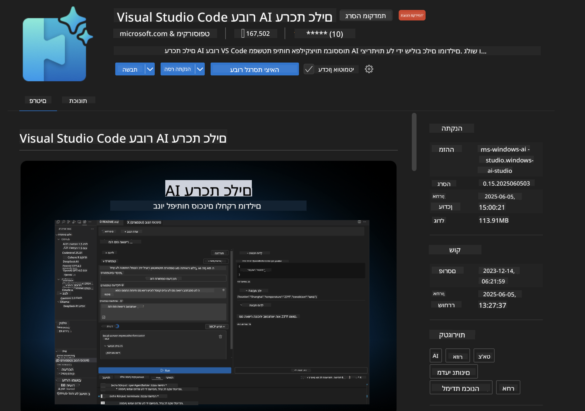
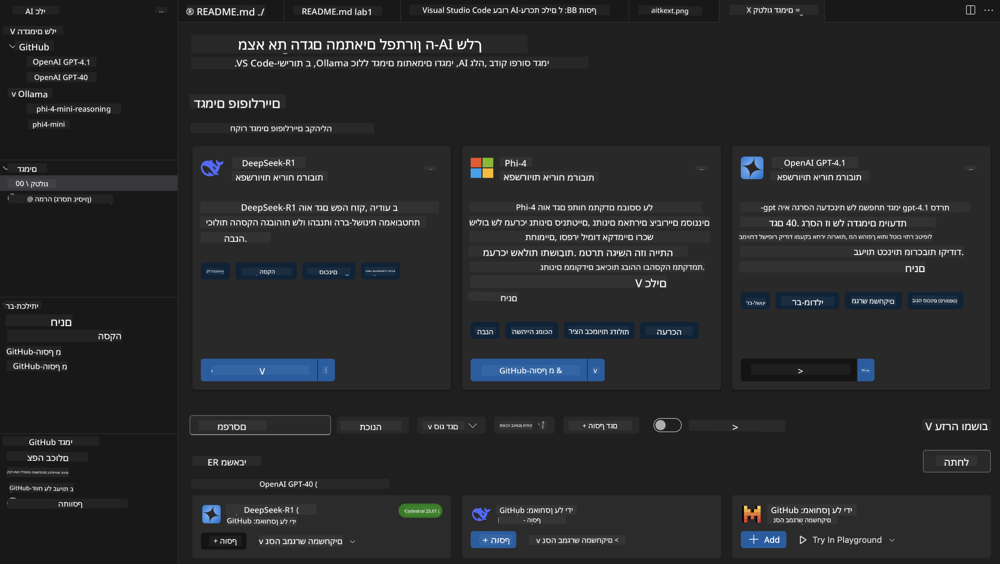
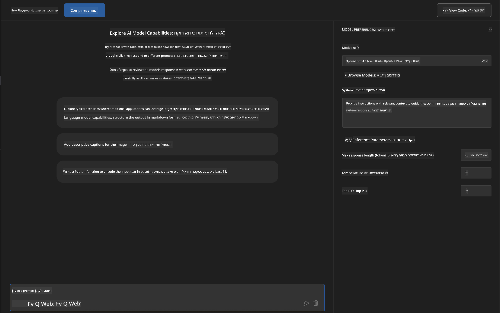
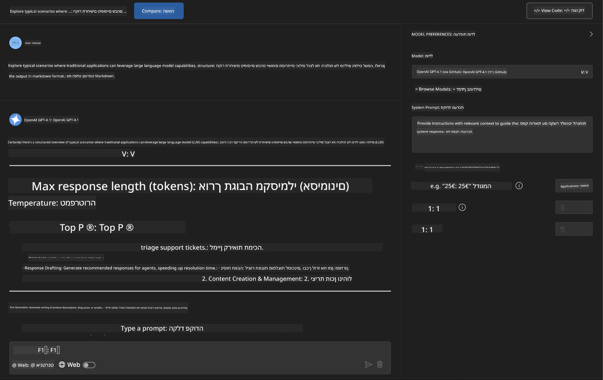
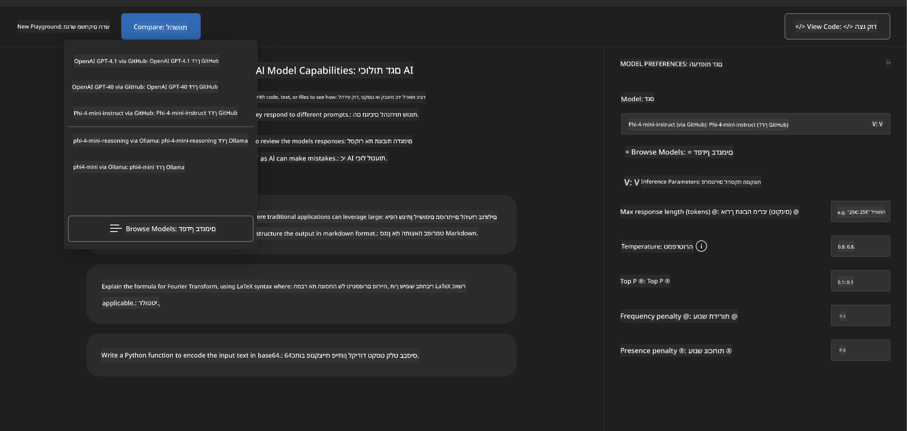
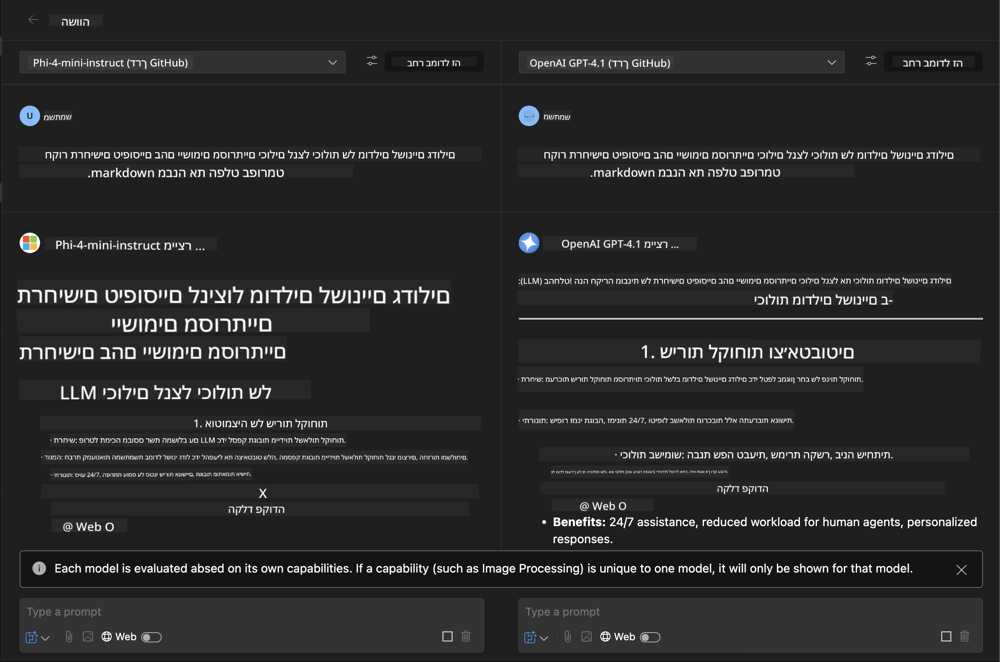
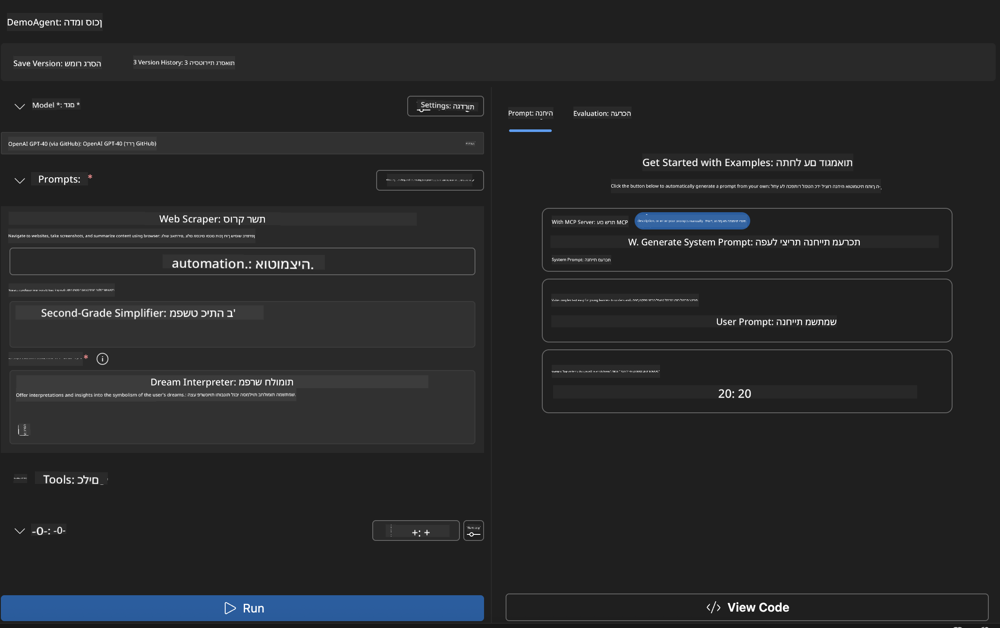
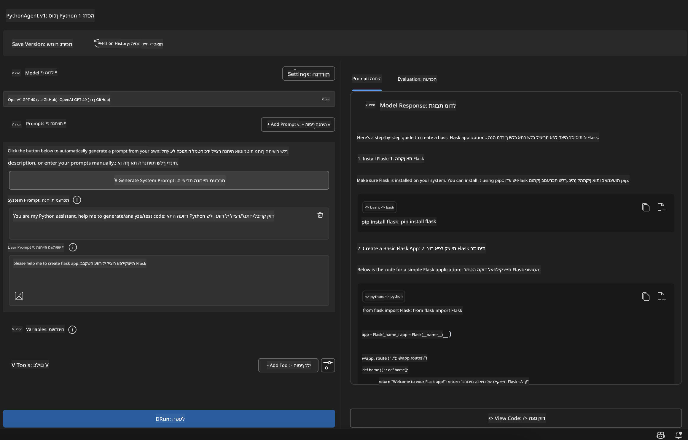

<!--
CO_OP_TRANSLATOR_METADATA:
{
  "original_hash": "2aa9dbc165e104764fa57e8a0d3f1c73",
  "translation_date": "2025-07-14T07:30:13+00:00",
  "source_file": "10-StreamliningAIWorkflowsBuildingAnMCPServerWithAIToolkit/lab1/README.md",
  "language_code": "he"
}
-->
# 🚀 מודול 1: יסודות AI Toolkit

[]()
[]()
[]()

## 📋 מטרות הלמידה

בסיום מודול זה תוכל:
- ✅ להתקין ולהגדיר את AI Toolkit עבור Visual Studio Code
- ✅ לנווט בקטלוג הדגמים ולהבין מקורות דגמים שונים
- ✅ להשתמש ב-Playground לבדיקות וניסויים עם דגמים
- ✅ ליצור סוכני AI מותאמים אישית באמצעות Agent Builder
- ✅ להשוות ביצועי דגמים בין ספקים שונים
- ✅ ליישם שיטות עבודה מומלצות להנדסת פרומפטים

## 🧠 מבוא ל-AI Toolkit (AITK)

**AI Toolkit עבור Visual Studio Code** הוא התוסף המוביל של מיקרוסופט שהופך את VS Code לסביבת פיתוח AI מקיפה. הוא גשר בין מחקר AI לפיתוח יישומים מעשי, ומאפשר גישה ל-AI גנרטיבי למפתחים בכל רמות המיומנות.

### 🌟 יכולות מרכזיות

| תכונה | תיאור | מקרה שימוש |
|---------|-------------|----------|
| **🗂️ קטלוג דגמים** | גישה ל-100+ דגמים מ-GitHub, ONNX, OpenAI, Anthropic, Google | גילוי ובחירת דגמים |
| **🔌 תמיכה ב-BYOM** | שילוב דגמים משלך (מקומיים/מרוחקים) | פריסת דגמים מותאמים |
| **🎮 Playground אינטראקטיבי** | בדיקות בזמן אמת עם ממשק שיחה | פרוטוטייפינג ובדיקות מהירות |
| **📎 תמיכה מולטי-מודאלית** | טיפול בטקסט, תמונות וקבצים מצורפים | יישומי AI מורכבים |
| **⚡ עיבוד אצווה** | הרצת פרומפטים מרובים במקביל | זרימות עבודה יעילות לבדיקות |
| **📊 הערכת דגמים** | מדדים מובנים (F1, רלוונטיות, דמיון, קוהרנטיות) | הערכת ביצועים |

### 🎯 למה AI Toolkit חשוב

- **🚀 פיתוח מואץ**: מרעיון לפרוטוטייפ תוך דקות
- **🔄 זרימת עבודה מאוחדת**: ממשק אחד למספר ספקי AI
- **🧪 ניסויים פשוטים**: השוואת דגמים ללא הגדרות מורכבות
- **📈 מוכן לפרודקשן**: מעבר חלק מפרוטוטייפ לפריסה

## 🛠️ דרישות מוקדמות והגדרה

### 📦 התקנת תוסף AI Toolkit

**שלב 1: גישה לשוק התוספים**
1. פתח את Visual Studio Code
2. עבור לתצוגת התוספים (`Ctrl+Shift+X` או `Cmd+Shift+X`)
3. חפש "AI Toolkit"

**שלב 2: בחר את הגרסה שלך**
- **🟢 גרסה יציבה**: מומלצת לשימוש בפרודקשן
- **🔶 גרסת בטא**: גישה מוקדמת לתכונות חדשות

**שלב 3: התקן והפעל**



### ✅ רשימת בדיקה לאימות
- [ ] סמל AI Toolkit מופיע בסרגל הצד של VS Code
- [ ] התוסף מופעל ומופעל
- [ ] אין שגיאות התקנה בפאנל הפלט

## 🧪 תרגיל מעשי 1: חקר דגמים מ-GitHub

**🎯 מטרה**: לשלוט בקטלוג הדגמים ולבדוק את דגם ה-AI הראשון שלך

### 📊 שלב 1: ניווט בקטלוג הדגמים

קטלוג הדגמים הוא שער הכניסה שלך לאקוסיסטם ה-AI. הוא מאגד דגמים מספקים שונים, מה שמקל על גילוי והשוואת אפשרויות.

**🔍 מדריך ניווט:**

לחץ על **MODELS - Catalog** בסרגל הצד של AI Toolkit



**💡 טיפ מקצועי**: חפש דגמים עם יכולות ספציפיות שמתאימות למקרה השימוש שלך (למשל, יצירת קוד, כתיבה יצירתית, ניתוח).

**⚠️ הערה**: דגמים המתארחים ב-GitHub (כלומר דגמי GitHub) חינמיים לשימוש אך כפופים למגבלות בקצב הבקשות והטוקנים. אם ברצונך לגשת לדגמים שאינם ב-GitHub (כלומר דגמים חיצוניים המתארחים דרך Azure AI או נקודות קצה אחרות), תצטרך לספק מפתח API או אימות מתאים.

### 🚀 שלב 2: הוסף והגדר את הדגם הראשון שלך

**אסטרטגיית בחירת דגם:**
- **GPT-4.1**: הטוב ביותר להסקה וניתוח מורכבים
- **Phi-4-mini**: קל משקל, תגובות מהירות למשימות פשוטות

**🔧 תהליך ההגדרה:**
1. בחר **OpenAI GPT-4.1** מהקטלוג
2. לחץ על **Add to My Models** - זה ירשום את הדגם לשימושך
3. בחר **Try in Playground** כדי להפעיל את סביבת הבדיקה
4. המתן לאתחול הדגם (הגדרה ראשונית עשויה לקחת רגע)



**⚙️ הבנת פרמטרי הדגם:**
- **Temperature**: שולט ביצירתיות (0 = דטרמיניסטי, 1 = יצירתי)
- **Max Tokens**: אורך תגובה מקסימלי
- **Top-p**: דגימת נוקליאוס לגיוון התגובה

### 🎯 שלב 3: שלוט בממשק ה-Playground

ה-Playground הוא המעבדה לניסויים שלך עם AI. כך תפיק ממנו את המירב:

**🎨 שיטות עבודה מומלצות להנדסת פרומפטים:**
1. **היה ספציפי**: הוראות ברורות ומפורטות מניבות תוצאות טובות יותר
2. **ספק הקשר**: כלול מידע רקע רלוונטי
3. **השתמש בדוגמאות**: הראה לדגם מה אתה רוצה עם דוגמאות
4. **חזור ושפר**: עדכן את הפרומפטים בהתאם לתוצאות הראשוניות

**🧪 תרחישי בדיקה:**
```markdown
# Example 1: Code Generation
"Write a Python function that calculates the factorial of a number using recursion. Include error handling and docstrings."

# Example 2: Creative Writing
"Write a professional email to a client explaining a project delay, maintaining a positive tone while being transparent about challenges."

# Example 3: Data Analysis
"Analyze this sales data and provide insights: [paste your data]. Focus on trends, anomalies, and actionable recommendations."
```



### 🏆 תרגיל אתגר: השוואת ביצועי דגמים

**🎯 מטרה**: להשוות דגמים שונים באמצעות אותם פרומפטים כדי להבין את היתרונות שלהם

**📋 הוראות:**
1. הוסף את **Phi-4-mini** לסביבת העבודה שלך
2. השתמש באותו פרומפט עבור GPT-4.1 ו-Phi-4-mini



3. השווה איכות תגובה, מהירות ודיוק
4. תעד את ממצאיך בחלק התוצאות



**💡 תובנות מרכזיות לגלות:**
- מתי להשתמש ב-LLM לעומת SLM
- פשרות בין עלות לביצועים
- יכולות מיוחדות של דגמים שונים

## 🤖 תרגיל מעשי 2: בניית סוכנים מותאמים עם Agent Builder

**🎯 מטרה**: ליצור סוכני AI מתמחים המותאמים למשימות וזרימות עבודה ספציפיות

### 🏗️ שלב 1: הבנת Agent Builder

Agent Builder הוא המקום שבו AI Toolkit באמת זורח. הוא מאפשר ליצור עוזרי AI ייעודיים שמשלבים את כוחם של דגמי שפה גדולים עם הוראות מותאמות, פרמטרים ספציפיים וידע מיוחד.

**🧠 רכיבי ארכיטקטורת הסוכן:**
- **דגם ליבה**: ה-LLM הבסיסי (GPT-4, Groks, Phi וכו')
- **פרומפט מערכת**: מגדיר את אישיות הסוכן והתנהגותו
- **פרמטרים**: הגדרות מכוונות לביצועים מיטביים
- **אינטגרציית כלים**: חיבור ל-APIs חיצוניים ושירותי MCP
- **זיכרון**: הקשר שיחה ושמירת מצב הפעלה



### ⚙️ שלב 2: העמקה בהגדרת הסוכן

**🎨 יצירת פרומפטי מערכת אפקטיביים:**
```markdown
# Template Structure:
## Role Definition
You are a [specific role] with expertise in [domain].

## Capabilities
- List specific abilities
- Define scope of knowledge
- Clarify limitations

## Behavior Guidelines
- Response style (formal, casual, technical)
- Output format preferences
- Error handling approach

## Examples
Provide 2-3 examples of ideal interactions
```

*כמובן, ניתן גם להשתמש ב-Generate System Prompt כדי לקבל עזרה מ-AI ביצירת ואופטימיזציה של הפרומפטים*

**🔧 אופטימיזציית פרמטרים:**
| פרמטר | טווח מומלץ | מקרה שימוש |
|-----------|------------------|----------|
| **Temperature** | 0.1-0.3 | תגובות טכניות/עובדתיות |
| **Temperature** | 0.7-0.9 | משימות יצירתיות/סיעור מוחות |
| **Max Tokens** | 500-1000 | תגובות תמציתיות |
| **Max Tokens** | 2000-4000 | הסברים מפורטים |

### 🐍 שלב 3: תרגיל מעשי - סוכן תכנות בפייתון

**🎯 משימה**: ליצור עוזר קידוד בפייתון מתמחה

**📋 שלבי ההגדרה:**

1. **בחירת דגם**: בחר **Claude 3.5 Sonnet** (מצוין לקוד)

2. **עיצוב פרומפט מערכת**:
```markdown
# Python Programming Expert Agent

## Role
You are a senior Python developer with 10+ years of experience. You excel at writing clean, efficient, and well-documented Python code.

## Capabilities
- Write production-ready Python code
- Debug complex issues
- Explain code concepts clearly
- Suggest best practices and optimizations
- Provide complete working examples

## Response Format
- Always include docstrings
- Add inline comments for complex logic
- Suggest testing approaches
- Mention relevant libraries when applicable

## Code Quality Standards
- Follow PEP 8 style guidelines
- Use type hints where appropriate
- Handle exceptions gracefully
- Write readable, maintainable code
```

3. **הגדרת פרמטרים**:
   - Temperature: 0.2 (לקוד עקבי ואמין)
   - Max Tokens: 2000 (הסברים מפורטים)
   - Top-p: 0.9 (איזון יצירתיות)



### 🧪 שלב 4: בדיקת סוכן הפייתון שלך

**תרחישי בדיקה:**
1. **פונקציה בסיסית**: "צור פונקציה למציאת מספרים ראשוניים"
2. **אלגוריתם מורכב**: "ממש עץ חיפוש בינארי עם פעולות הוספה, מחיקה וחיפוש"
3. **בעיה מעשית**: "בנה סקרייפר לאינטרנט שמטפל במגבלות קצב ונסה מחדש"
4. **ניפוי שגיאות**: "תקן את הקוד הזה [הדבק קוד עם שגיאות]"

**🏆 קריטריוני הצלחה:**
- ✅ הקוד רץ ללא שגיאות
- ✅ כולל תיעוד מתאים
- ✅ עוקב אחרי שיטות עבודה מומלצות בפייתון
- ✅ מספק הסברים ברורים
- ✅ מציע שיפורים

## 🎓 סיכום מודול 1 ושלבים הבאים

### 📊 בדיקת ידע

בדוק את הבנתך:
- [ ] האם אתה יכול להסביר את ההבדלים בין הדגמים בקטלוג?
- [ ] האם יצרת ובדקת סוכן מותאם אישית בהצלחה?
- [ ] האם אתה מבין כיצד לאופטם פרמטרים למקרי שימוש שונים?
- [ ] האם אתה יכול לעצב פרומפטי מערכת אפקטיביים?

### 📚 משאבים נוספים

- **תיעוד AI Toolkit**: [Official Microsoft Docs](https://github.com/microsoft/vscode-ai-toolkit)
- **מדריך להנדסת פרומפטים**: [Best Practices](https://platform.openai.com/docs/guides/prompt-engineering)
- **דגמים ב-AI Toolkit**: [Models in Develpment](https://github.com/microsoft/vscode-ai-toolkit/blob/main/doc/models.md)

**🎉 מזל טוב!** שלטת ביסודות AI Toolkit ואתה מוכן לבנות יישומי AI מתקדמים יותר!

### 🔜 המשך למודול הבא

מוכן ליכולות מתקדמות יותר? המשך ל-**[מודול 2: MCP עם יסודות AI Toolkit](../lab2/README.md)** שם תלמד כיצד:
- לחבר את הסוכנים שלך לכלים חיצוניים באמצעות Model Context Protocol (MCP)
- לבנות סוכני אוטומציה לדפדפן עם Playwright
- לשלב שרתי MCP עם סוכני AI Toolkit שלך
- להעצים את הסוכנים שלך עם נתונים ויכולות חיצוניות

**כתב ויתור**:  
מסמך זה תורגם באמצעות שירות תרגום מבוסס בינה מלאכותית [Co-op Translator](https://github.com/Azure/co-op-translator). למרות שאנו שואפים לדיוק, יש לקחת בחשבון כי תרגומים אוטומטיים עלולים להכיל שגיאות או אי-דיוקים. המסמך המקורי בשפת המקור שלו נחשב למקור הסמכותי. למידע קריטי מומלץ להשתמש בתרגום מקצועי על ידי מתרגם אנושי. אנו לא נושאים באחריות לכל אי-הבנה או פרשנות שגויה הנובעים משימוש בתרגום זה.