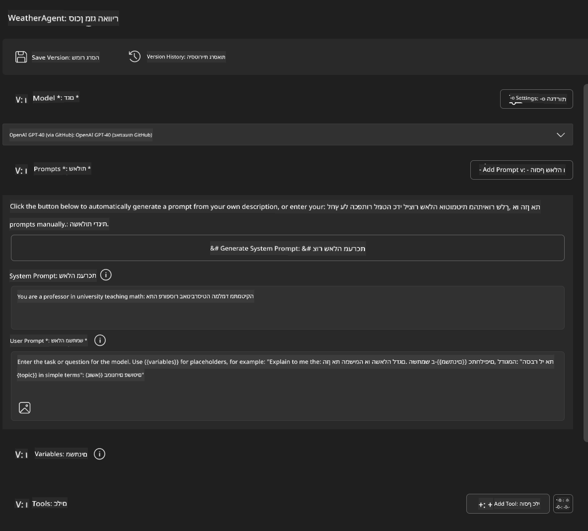
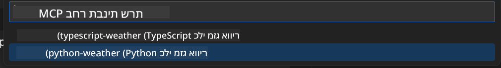
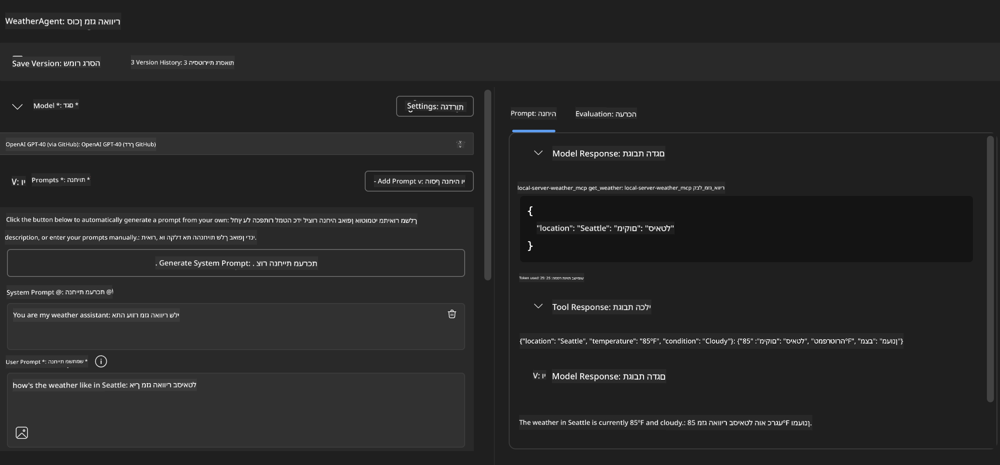
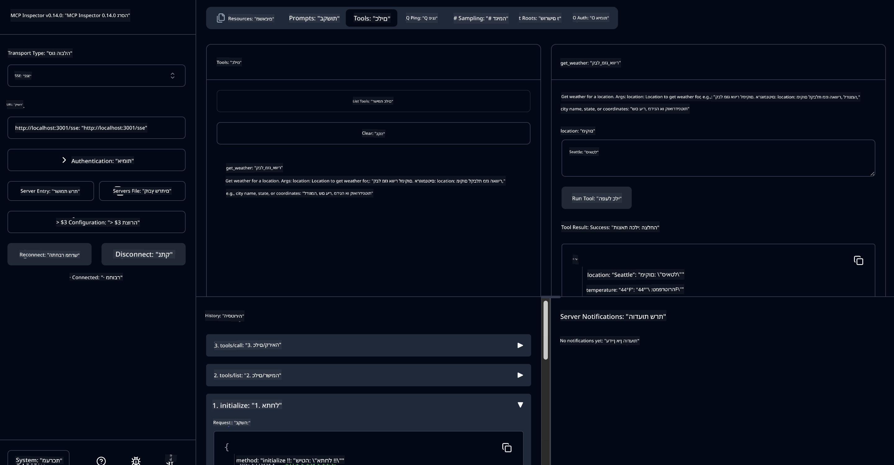

<!--
CO_OP_TRANSLATOR_METADATA:
{
  "original_hash": "dd8da3f75addcef453fe11f02a270217",
  "translation_date": "2025-06-10T06:14:39+00:00",
  "source_file": "10-StreamliningAIWorkflowsBuildingAnMCPServerWithAIToolkit/lab3/README.md",
  "language_code": "he"
}
-->
# 🔧 מודול 3: פיתוח מתקדם של MCP עם AI Toolkit


## 🎯 מטרות הלמידה

בסיום המעבדה הזו תוכל/י:

- ✅ ליצור שרתי MCP מותאמים אישית בעזרת AI Toolkit  
- ✅ להגדיר ולהשתמש ב-MCP Python SDK העדכני ביותר (גרסה 1.9.3)  
- ✅ להגדיר ולהשתמש ב-MCP Inspector לצורך איתור באגים  
- ✅ לבצע איתור באגים לשרתי MCP הן בסביבת Agent Builder והן ב-Inspector  
- ✅ להבין תהליכי פיתוח מתקדמים של שרתי MCP  

## 📋 דרישות מוקדמות

- השלמת מעבדה 2 (יסודות MCP)  
- VS Code עם תוסף AI Toolkit מותקן  
- סביבת Python 3.10 ומעלה  
- Node.js ו-npm לצורך הגדרת Inspector  

## 🏗️ מה תבנה/י

במעבדה זו תיצור/י **שרת MCP מזג אוויר** שמדגים:  
- מימוש שרת MCP מותאם אישית  
- אינטגרציה עם Agent Builder של AI Toolkit  
- תהליכי איתור באגים מקצועיים  
- דפוסי שימוש מודרניים של MCP SDK  

---

## 🔧 סקירת רכיבים מרכזיים

### 🐍 MCP Python SDK  
ספריית ה-SDK של Model Context Protocol בפייתון מספקת את הבסיס לבניית שרתי MCP מותאמים. תשתמש/י בגרסה 1.9.3 עם יכולות איתור באגים משופרות.  

### 🔍 MCP Inspector  
כלי איתור באגים חזק שמספק:  
- ניטור שרת בזמן אמת  
- ויזואליזציה של ביצוע כלים  
- בדיקת בקשות/תגובות ברשת  
- סביבה אינטראקטיבית לבדיקות  

---

## 📖 יישום שלב אחר שלב

### שלב 1: יצירת WeatherAgent ב-Agent Builder

1. **הפעל/י את Agent Builder** ב-VS Code דרך תוסף AI Toolkit  
2. **צור/י סוכן חדש** עם התצורה הבאה:  
   - שם הסוכן: `WeatherAgent`  



### שלב 2: אתחול פרויקט שרת MCP

1. **גש/י ל-Tools** → **Add Tool** ב-Agent Builder  
2. **בחר/י "MCP Server"** מתוך האפשרויות  
3. **בחר/י "Create A new MCP Server"**  
4. **בחר/י בתבנית `python-weather`**  
5. **קבע/י שם לשרת:** `weather_mcp`  



### שלב 3: פתח/י ובחן/י את הפרויקט

1. **פתח/י את הפרויקט שנוצר** ב-VS Code  
2. **סקור/י את מבנה הפרויקט:**  
   ```
   weather_mcp/
   ├── src/
   │   ├── __init__.py
   │   └── server.py
   ├── inspector/
   │   ├── package.json
   │   └── package-lock.json
   ├── .vscode/
   │   ├── launch.json
   │   └── tasks.json
   ├── pyproject.toml
   └── README.md
   ```  

### שלב 4: שדרג/י לגרסת MCP SDK העדכנית ביותר

> **🔍 למה לשדרג?** אנו רוצים להשתמש בגרסת MCP SDK העדכנית (v1.9.3) ובשירות Inspector (0.14.0) כדי ליהנות מיכולות משופרות ואיתור באגים טוב יותר.

#### 4א. עדכון תלותיות פייתון

**ערוך/י את הקבצים `pyproject.toml`:** update [./code/weather_mcp/pyproject.toml](../../../../10-StreamliningAIWorkflowsBuildingAnMCPServerWithAIToolkit/lab3/code/weather_mcp/pyproject.toml)


#### 4b. Update Inspector Configuration

**Edit `inspector/package.json`:** update [./code/weather_mcp/inspector/package.json](../../../../10-StreamliningAIWorkflowsBuildingAnMCPServerWithAIToolkit/lab3/code/weather_mcp/inspector/package.json)

#### 4c. Update Inspector Dependencies

**Edit `inspector/package-lock.json`:** update [./code/weather_mcp/inspector/package-lock.json](../../../../10-StreamliningAIWorkflowsBuildingAnMCPServerWithAIToolkit/lab3/code/weather_mcp/inspector/package-lock.json)

> **📝 Note:** This file contains extensive dependency definitions. Below is the essential structure - the full content ensures proper dependency resolution.


> **⚡ Full Package Lock:** The complete package-lock.json contains ~3000 lines of dependency definitions. The above shows the key structure - use the provided file for complete dependency resolution.

### Step 5: Configure VS Code Debugging

*Note: Please copy the file in the specified path to replace the corresponding local file*

#### 5a. Update Launch Configuration

**Edit `.vscode/launch.json`:**

```json
{
  "version": "0.2.0",
  "configurations": [
    {
      "name": "Attach to Local MCP",
      "type": "debugpy",
      "request": "attach",
      "connect": {
        "host": "localhost",
        "port": 5678
      },
      "presentation": {
        "hidden": true
      },
      "internalConsoleOptions": "neverOpen",
      "postDebugTask": "Terminate All Tasks"
    },
    {
      "name": "Launch Inspector (Edge)",
      "type": "msedge",
      "request": "launch",
      "url": "http://localhost:6274?timeout=60000&serverUrl=http://localhost:3001/sse#tools",
      "cascadeTerminateToConfigurations": [
        "Attach to Local MCP"
      ],
      "presentation": {
        "hidden": true
      },
      "internalConsoleOptions": "neverOpen"
    },
    {
      "name": "Launch Inspector (Chrome)",
      "type": "chrome",
      "request": "launch",
      "url": "http://localhost:6274?timeout=60000&serverUrl=http://localhost:3001/sse#tools",
      "cascadeTerminateToConfigurations": [
        "Attach to Local MCP"
      ],
      "presentation": {
        "hidden": true
      },
      "internalConsoleOptions": "neverOpen"
    }
  ],
  "compounds": [
    {
      "name": "Debug in Agent Builder",
      "configurations": [
        "Attach to Local MCP"
      ],
      "preLaunchTask": "Open Agent Builder",
    },
    {
      "name": "Debug in Inspector (Edge)",
      "configurations": [
        "Launch Inspector (Edge)",
        "Attach to Local MCP"
      ],
      "preLaunchTask": "Start MCP Inspector",
      "stopAll": true
    },
    {
      "name": "Debug in Inspector (Chrome)",
      "configurations": [
        "Launch Inspector (Chrome)",
        "Attach to Local MCP"
      ],
      "preLaunchTask": "Start MCP Inspector",
      "stopAll": true
    }
  ]
}
```

**ערוך/י את `.vscode/tasks.json`:**

```
{
  "version": "2.0.0",
  "tasks": [
    {
      "label": "Start MCP Server",
      "type": "shell",
      "command": "python -m debugpy --listen 127.0.0.1:5678 src/__init__.py sse",
      "isBackground": true,
      "options": {
        "cwd": "${workspaceFolder}",
        "env": {
          "PORT": "3001"
        }
      },
      "problemMatcher": {
        "pattern": [
          {
            "regexp": "^.*$",
            "file": 0,
            "location": 1,
            "message": 2
          }
        ],
        "background": {
          "activeOnStart": true,
          "beginsPattern": ".*",
          "endsPattern": "Application startup complete|running"
        }
      }
    },
    {
      "label": "Start MCP Inspector",
      "type": "shell",
      "command": "npm run dev:inspector",
      "isBackground": true,
      "options": {
        "cwd": "${workspaceFolder}/inspector",
        "env": {
          "CLIENT_PORT": "6274",
          "SERVER_PORT": "6277",
        }
      },
      "problemMatcher": {
        "pattern": [
          {
            "regexp": "^.*$",
            "file": 0,
            "location": 1,
            "message": 2
          }
        ],
        "background": {
          "activeOnStart": true,
          "beginsPattern": "Starting MCP inspector",
          "endsPattern": "Proxy server listening on port"
        }
      },
      "dependsOn": [
        "Start MCP Server"
      ]
    },
    {
      "label": "Open Agent Builder",
      "type": "shell",
      "command": "echo ${input:openAgentBuilder}",
      "presentation": {
        "reveal": "never"
      },
      "dependsOn": [
        "Start MCP Server"
      ],
    },
    {
      "label": "Terminate All Tasks",
      "command": "echo ${input:terminate}",
      "type": "shell",
      "problemMatcher": []
    }
  ],
  "inputs": [
    {
      "id": "openAgentBuilder",
      "type": "command",
      "command": "ai-mlstudio.agentBuilder",
      "args": {
        "initialMCPs": [ "local-server-weather_mcp" ],
        "triggeredFrom": "vsc-tasks"
      }
    },
    {
      "id": "terminate",
      "type": "command",
      "command": "workbench.action.tasks.terminate",
      "args": "terminateAll"
    }
  ]
}
```


---

## 🚀 הרצת השרת ובדיקתו

### שלב 6: התקנת תלותיות

לאחר ביצוע השינויים, הרץ/י את הפקודות הבאות:

**התקן/י את תלותיות הפייתון:**  
```bash
uv sync
```

**התקן/י את תלותיות ה-Inspector:**  
```bash
cd inspector
npm install
```

### שלב 7: איתור באגים עם Agent Builder

1. **לחץ/י F5** או השתמש/י בתצורת **"Debug in Agent Builder"**  
2. **בחר/י בתצורת קומפאונד** מפאנל איתור הבאגים  
3. **המתן/י לעליית השרת ולפתיחת Agent Builder**  
4. **בדוק/י את שרת מזג האוויר שלך** עם שאילתות בשפה טבעית  

הזן/י פקודה כמו זו

SYSTEM_PROMPT

```
You are my weather assistant
```

USER_PROMPT

```
How's the weather like in Seattle
```



### שלב 8: איתור באגים עם MCP Inspector

1. **השתמש/י בתצורת "Debug in Inspector"** (Edge או Chrome)  
2. **פתח/י את ממשק ה-Inspector בכתובת** `http://localhost:6274`  
3. **חקור/י את סביבה האינטראקטיבית לבדיקה:**  
   - הצג/י את הכלים הזמינים  
   - בדוק/י ביצוע כלים  
   - נטר/י בקשות רשת  
   - איתר/י באגים בתגובות השרת  



---

## 🎯 תוצאות למידה מרכזיות

בסיום המעבדה הזו, ביצעת:

- [x] **יצירת שרת MCP מותאם אישית** בעזרת תבניות AI Toolkit  
- [x] **שדרוג לגרסת MCP SDK העדכנית** (v1.9.3) לפונקציונליות משופרת  
- [x] **הגדרת תהליכי איתור באגים מקצועיים** הן ל-Agent Builder והן ל-Inspector  
- [x] **הגדרת MCP Inspector** לבדיקות אינטראקטיביות של השרת  
- [x] **שליטה בתצורות איתור באגים ב-VS Code** לפיתוח MCP  

## 🔧 תכונות מתקדמות שנחקרו

| תכונה | תיאור | מקרה שימוש |
|---------|-------------|----------|
| **MCP Python SDK v1.9.3** | מימוש פרוטוקול עדכני | פיתוח שרתים מודרני |
| **MCP Inspector 0.14.0** | כלי איתור באגים אינטראקטיבי | בדיקות שרת בזמן אמת |
| **איתור באגים ב-VS Code** | סביבת פיתוח משולבת | תהליך איתור באגים מקצועי |
| **אינטגרציה עם Agent Builder** | חיבור ישיר ל-AI Toolkit | בדיקות סוכן מקצה לקצה |

## 📚 משאבים נוספים

- [תיעוד MCP Python SDK](https://modelcontextprotocol.io/docs/sdk/python)  
- [מדריך תוסף AI Toolkit](https://code.visualstudio.com/docs/ai/ai-toolkit)  
- [תיעוד איתור באגים ב-VS Code](https://code.visualstudio.com/docs/editor/debugging)  
- [מפרט Model Context Protocol](https://modelcontextprotocol.io/docs/concepts/architecture)  

---

**🎉 מזל טוב!** סיימת בהצלחה את מעבדה 3 ועכשיו תוכל/י ליצור, לאתר באגים ולפרוס שרתי MCP מותאמים אישית באמצעות תהליכי פיתוח מקצועיים.

### 🔜 המשך למודול הבא

מוכן/ה ליישם את מיומנויות ה-MCP שלך בסביבת פיתוח אמיתית? המשך ל-**[מודול 4: פיתוח MCP מעשי - שרת גיטאב מותאם אישית](../lab4/README.md)** שבו תוכל/י:  
- לבנות שרת MCP מוכן לייצור שמבצע אוטומציה של פעולות במאגרי GitHub  
- לממש פונקציונליות שיבוט מאגרי GitHub דרך MCP  
- לשלב שרתי MCP מותאמים אישית עם VS Code ו-GitHub Copilot Agent Mode  
- לבדוק ולפרוס שרתי MCP מותאמים בסביבות ייצור  
- ללמוד אוטומציה מעשית של תהליכי עבודה למפתחים

**כתב ויתור**:  
מסמך זה תורגם באמצעות שירות תרגום מבוסס בינה מלאכותית [Co-op Translator](https://github.com/Azure/co-op-translator). למרות שאנו שואפים לדיוק, יש לקחת בחשבון שתרגומים אוטומטיים עלולים להכיל שגיאות או אי דיוקים. יש להתייחס למסמך המקורי בשפת המקור כמקור הסמכותי. למידע קריטי מומלץ להשתמש בתרגום מקצועי אנושי. אנו לא נושאים באחריות לכל אי הבנה או פרשנות שגויה הנובעת משימוש בתרגום זה.