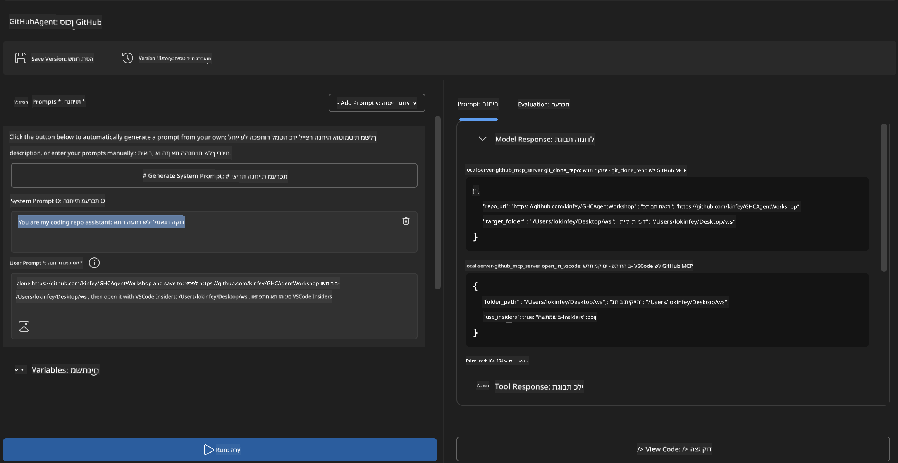
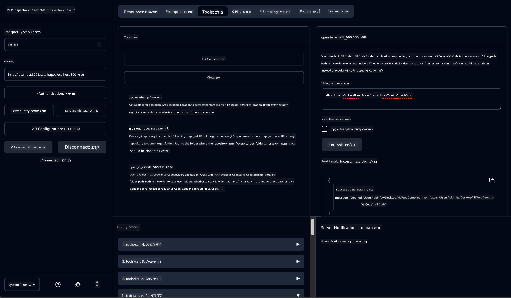

<!--
CO_OP_TRANSLATOR_METADATA:
{
  "original_hash": "f83bc722dc758efffd68667d6a1db470",
  "translation_date": "2025-07-14T08:44:30+00:00",
  "source_file": "10-StreamliningAIWorkflowsBuildingAnMCPServerWithAIToolkit/lab4/README.md",
  "language_code": "he"
}
-->
# 🐙 מודול 4: פיתוח MCP מעשי - שרת גיטאב מותאם אישית לשכפול


> **⚡ התחלה מהירה:** בנה שרת MCP מוכן לייצור שמבצע אוטומציה לשכפול מאגרי GitHub ואינטגרציה עם VS Code תוך 30 דקות בלבד!

## 🎯 מטרות הלמידה

בסיום המעבדה הזו תוכל:

- ✅ ליצור שרת MCP מותאם אישית עבור תהליכי פיתוח אמיתיים
- ✅ לממש פונקציונליות לשכפול מאגרי GitHub דרך MCP
- ✅ לשלב שרתי MCP מותאמים עם VS Code ו-Agent Builder
- ✅ להשתמש במצב Agent של GitHub Copilot עם כלי MCP מותאמים
- ✅ לבדוק ולפרוס שרתי MCP מותאמים בסביבות ייצור

## 📋 דרישות מוקדמות

- השלמת מעבדות 1-3 (יסודות MCP ופיתוח מתקדם)
- מנוי ל-GitHub Copilot ([הרשמה חינמית זמינה](https://github.com/github-copilot/signup))
- VS Code עם הרחבות AI Toolkit ו-GitHub Copilot
- התקנת Git CLI וקונפיגורציה מתאימה

## 🏗️ סקירת הפרויקט

### **אתגר פיתוח מהעולם האמיתי**
כמפתחים, אנו משתמשים לעיתים קרובות ב-GitHub לשכפול מאגרים ופתיחתם ב-VS Code או VS Code Insiders. התהליך הידני כולל:
1. פתיחת טרמינל/שורת פקודה
2. ניווט לתיקייה הרצויה
3. הרצת הפקודה `git clone`
4. פתיחת VS Code בתיקייה המשוכפלת

**הפתרון שלנו ב-MCP מפשט את כל זה לפקודה חכמה אחת!**

### **מה תבנה**
שרת **GitHub Clone MCP** (`git_mcp_server`) שמציע:

| תכונה | תיאור | יתרון |
|---------|-------------|---------|
| 🔄 **שכפול מאגרים חכם** | שכפול מאגרים מ-GitHub עם אימות | בדיקת שגיאות אוטומטית |
| 📁 **ניהול תיקיות חכם** | בדיקה ויצירת תיקיות בצורה בטוחה | מונע כתיבה על קבצים קיימים |
| 🚀 **אינטגרציה חוצת פלטפורמות עם VS Code** | פתיחת פרויקטים ב-VS Code/Insiders | מעבר חלק בתהליכי עבודה |
| 🛡️ **טיפול שגיאות חזק** | טיפול בבעיות רשת, הרשאות ונתיבים | אמינות מוכנה לייצור |

---

## 📖 יישום שלב אחר שלב

### שלב 1: יצירת סוכן GitHub ב-Agent Builder

1. **הפעל את Agent Builder** דרך הרחבת AI Toolkit
2. **צור סוכן חדש** עם הקונפיגורציה הבאה:
   ```
   Agent Name: GitHubAgent
   ```

3. **אתחל שרת MCP מותאם אישית:**
   - עבור ל-**כלים** → **הוסף כלי** → **שרת MCP**
   - בחר **"צור שרת MCP חדש"**
   - בחר **תבנית Python** לגמישות מקסימלית
   - **שם השרת:** `git_mcp_server`

### שלב 2: קונפיגורציית מצב Agent של GitHub Copilot

1. **פתח את GitHub Copilot** ב-VS Code (Ctrl/Cmd + Shift + P → "GitHub Copilot: Open")
2. **בחר דגם Agent** בממשק Copilot
3. **בחר בדגם Claude 3.7** לשיפור יכולות ההבנה וההסקה
4. **הפעל אינטגרציה עם MCP** לגישה לכלים

> **💡 טיפ מקצועי:** דגם Claude 3.7 מספק הבנה מעמיקה יותר של תהליכי פיתוח ודפוסי טיפול בשגיאות.

### שלב 3: מימוש פונקציונליות ליבת שרת MCP

**השתמש בפרומפט המפורט הבא במצב Agent של GitHub Copilot:**

```
Create two MCP tools with the following comprehensive requirements:

🔧 TOOL A: clone_repository
Requirements:
- Clone any GitHub repository to a specified local folder
- Return the absolute path of the successfully cloned project
- Implement comprehensive validation:
  ✓ Check if target directory already exists (return error if exists)
  ✓ Validate GitHub URL format (https://github.com/user/repo)
  ✓ Verify git command availability (prompt installation if missing)
  ✓ Handle network connectivity issues
  ✓ Provide clear error messages for all failure scenarios

🚀 TOOL B: open_in_vscode
Requirements:
- Open specified folder in VS Code or VS Code Insiders
- Cross-platform compatibility (Windows/Linux/macOS)
- Use direct application launch (not terminal commands)
- Auto-detect available VS Code installations
- Handle cases where VS Code is not installed
- Provide user-friendly error messages

Additional Requirements:
- Follow MCP 1.9.3 best practices
- Include proper type hints and documentation
- Implement logging for debugging purposes
- Add input validation for all parameters
- Include comprehensive error handling
```

### שלב 4: בדיקת שרת MCP שלך

#### 4א. בדיקה ב-Agent Builder

1. **הפעל את תצורת הדיבוג** ב-Agent Builder
2. **קונפג את הסוכן עם פרומפט מערכת זה:**

```
SYSTEM_PROMPT:
You are my intelligent coding repository assistant. You help developers efficiently clone GitHub repositories and set up their development environment. Always provide clear feedback about operations and handle errors gracefully.
```

3. **בדוק תרחישי משתמש ריאליסטיים:**

```
USER_PROMPT EXAMPLES:

Scenario : Basic Clone and Open
"Clone {Your GitHub Repo link such as https://github.com/kinfey/GHCAgentWorkshop
 } and save to {The global path you specify}, then open it with VS Code Insiders"
```



**תוצאות צפויות:**
- ✅ שכפול מוצלח עם אישור נתיב
- ✅ פתיחת VS Code אוטומטית
- ✅ הודעות שגיאה ברורות במצבים לא תקינים
- ✅ טיפול נכון במקרים קיצוניים

#### 4ב. בדיקה ב-MCP Inspector



---

**🎉 כל הכבוד!** יצרת בהצלחה שרת MCP מעשי ומוכן לייצור שפותר אתגרים אמיתיים בתהליכי פיתוח. שרת השכפול המותאם שלך מדגים את כוחו של MCP לאוטומציה ולשיפור פרודוקטיביות המפתחים.

### 🏆 הישגים שהושגו:
- ✅ **מפתח MCP** - יצירת שרת MCP מותאם אישית
- ✅ **מייעל תהליכים** - פישוט תהליכי פיתוח  
- ✅ **מומחה אינטגרציה** - חיבור כלים רבים לפיתוח
- ✅ **מוכן לייצור** - בניית פתרונות לפריסה

---

## 🎓 סיום הסדנה: המסע שלך עם Model Context Protocol

**משתתף יקר,**

מזל טוב על השלמת כל ארבעת המודולים בסדנת Model Context Protocol! עשית דרך ארוכה מהבנת יסודות AI Toolkit ועד לבניית שרתי MCP מוכנים לייצור שפותרים אתגרים אמיתיים בפיתוח.

### 🚀 סיכום מסלול הלמידה שלך:

**[מודול 1](../lab1/README.md)**: התחלת בחקר יסודות AI Toolkit, בדיקת דגמים ויצירת הסוכן AI הראשון שלך.

**[מודול 2](../lab2/README.md)**: למדת את ארכיטקטורת MCP, שילבת Playwright MCP ובנית סוכן אוטומציה לדפדפן.

**[מודול 3](../lab3/README.md)**: התקדמת לפיתוח שרתי MCP מותאמים עם שרת מזג האוויר ולמדת כלים לניפוי שגיאות.

**[מודול 4](../lab4/README.md)**: יישמת את כל הידע ליצירת כלי אוטומציה מעשי לשכפול מאגרי GitHub.

### 🌟 מה שלטת בו:

- ✅ **מערכת AI Toolkit**: דגמים, סוכנים ודפוסי אינטגרציה
- ✅ **ארכיטקטורת MCP**: עיצוב לקוח-שרת, פרוטוקולי תקשורת ואבטחה
- ✅ **כלי פיתוח**: מ-Playground ל-Inspector ועד לפריסה בייצור
- ✅ **פיתוח מותאם אישית**: בנייה, בדיקה ופריסה של שרתי MCP משלך
- ✅ **יישומים מעשיים**: פתרון אתגרים אמיתיים בתהליכי עבודה עם AI

### 🔮 הצעדים הבאים שלך:

1. **בנה שרת MCP משלך**: הפעל את הכישורים לאוטומציה של תהליכים ייחודיים
2. **הצטרף לקהילת MCP**: שתף יצירות ולמד מאחרים
3. **חקור אינטגרציה מתקדמת**: חבר שרתי MCP למערכות ארגוניות
4. **תרום לקוד פתוח**: סייע בשיפור כלי MCP והתיעוד

זכור, הסדנה הזו היא רק ההתחלה. מערכת Model Context Protocol מתפתחת במהירות, ואתה מצויד להיות בחזית כלי הפיתוח המונעים בינה מלאכותית.

**תודה על ההשתתפות והמחויבות ללמידה!**

אנו מקווים שהסדנה הזו עוררה בך רעיונות שישנו את הדרך בה אתה בונה ומתקשר עם כלי AI במסע הפיתוח שלך.

**קידוד מהנה!**

---

**כתב ויתור**:  
מסמך זה תורגם באמצעות שירות תרגום מבוסס בינה מלאכותית [Co-op Translator](https://github.com/Azure/co-op-translator). למרות שאנו שואפים לדיוק, יש לקחת בחשבון כי תרגומים אוטומטיים עלולים להכיל שגיאות או אי-דיוקים. המסמך המקורי בשפת המקור שלו נחשב למקור הסמכותי. למידע קריטי מומלץ להשתמש בתרגום מקצועי על ידי מתרגם אנושי. אנו לא נושאים באחריות לכל אי-הבנה או פרשנות שגויה הנובעת משימוש בתרגום זה.