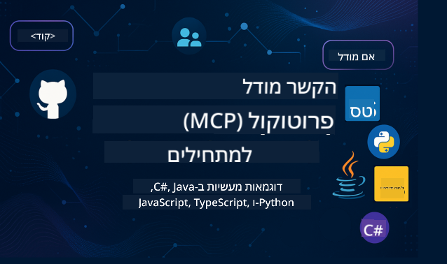

<!--
CO_OP_TRANSLATOR_METADATA:
{
  "original_hash": "2a21391378c12ecfef50f866329dfde0",
  "translation_date": "2025-05-17T05:29:32+00:00",
  "source_file": "README.md",
  "language_code": "he"
}
-->

עקבו אחר שלבים אלו כדי להתחיל להשתמש במשאבים אלו:
1. **פצלו את המאגר**: לחצו 
2. **שכפלו את המאגר**: `git clone https://github.com/microsoft/mcp-for-beginners.git`
3. [**הצטרפו ל-Microsoft Azure AI Foundry Discord ופגשו מומחים ומפתחים נוספים**](https://discord.com/invite/ByRwuEEgH4)

### 🌐 תמיכה רב-לשונית

#### נתמך באמצעות GitHub Action (אוטומטי ותמיד מעודכן)
[צרפתית](../fr/README.md) | [ספרדית](../es/README.md) | [גרמנית](../de/README.md) | [רוסית](../ru/README.md) | [ערבית](../ar/README.md) | [פרסית (פארסי)](../fa/README.md) | [אורדו](../ur/README.md) | [סינית (פשוטה)](../zh/README.md) | [סינית (מסורתית, מקאו)](../mo/README.md) | [סינית (מסורתית, הונג קונג)](../hk/README.md) | [סינית (מסורתית, טייוואן)](../tw/README.md) | [יפנית](../ja/README.md) | [קוריאנית](../ko/README.md) | [הינדי](../hi/README.md) | [בנגלית](../bn/README.md) | [מראטהי](../mr/README.md) | [נפאלי](../ne/README.md) | [פנג'אבי (גורמוקי)](../pa/README.md) | [פורטוגזית (פורטוגל)](../pt/README.md) | [פורטוגזית (ברזיל)](../br/README.md) | [איטלקית](../it/README.md) | [פולנית](../pl/README.md) | [טורקית](../tr/README.md) | [יוונית](../el/README.md) | [תאית](../th/README.md) | [שוודית](../sv/README.md) | [דנית](../da/README.md) | [נורווגית](../no/README.md) | [פינית](../fi/README.md) | [הולנדית](../nl/README.md) | [עברית](./README.md) | [וייטנאמית](../vi/README.md) | [אינדונזית](../id/README.md) | [מלאית](../ms/README.md) | [טאגאלוג (פיליפינית)](../tl/README.md) | [סווהילית](../sw/README.md) | [הונגרית](../hu/README.md) | [צ'כית](../cs/README.md) | [סלובקית](../sk/README.md) | [רומנית](../ro/README.md) | [בולגרית](../bg/README.md) | [סרבית (קירילית)](../sr/README.md) | [קרואטית](../hr/README.md) | [סלובנית](../sl/README.md)
# 🚀 מדריך אולטימטיבי לתוכנית לימודים של פרוטוקול הקשר המודל (MCP) למתחילים

## **למדו MCP עם דוגמאות קוד מעשיות ב-C#, Java, JavaScript, Python ו-TypeScript**

## 🧠 סקירה כללית של תוכנית הלימודים של פרוטוקול הקשר המודל

**פרוטוקול הקשר המודל (MCP)** הוא מסגרת מתקדמת שנועדה לתקנן את האינטראקציות בין מודלים של בינה מלאכותית ויישומי לקוח. תוכנית הלימודים בקוד פתוח זו מציעה מסלול למידה מובנה, הכולל דוגמאות קוד מעשיות ומקרי שימוש בעולם האמיתי, בשפות תכנות פופולריות כמו C#, Java, JavaScript, TypeScript ו-Python.

בין אם אתם מפתחים בתחום הבינה המלאכותית, ארכיטקטים של מערכות או מהנדסי תוכנה, מדריך זה הוא המשאב המקיף שלכם לשליטה ביסודות MCP ובאסטרטגיות יישום.

## 🔗 משאבים רשמיים של MCP

- 📘 [תיעוד MCP](https://modelcontextprotocol.io/) – מדריכים מפורטים ומדריכי משתמש  
- 📜 [מפרט MCP](https://spec.modelcontextprotocol.io/) – ארכיטקטורת הפרוטוקול והפניות טכניות  
- 🧑‍💻 [מאגר GitHub של MCP](https://github.com/modelcontextprotocol) – SDKs בקוד פתוח, כלים ודוגמאות קוד  

## 🧭 מבנה מלא של תוכנית הלימודים של MCP

### 📌 [מבוא ל-MCP](./00-Introduction/README.md)

- מהו פרוטוקול הקשר המודל?
- מדוע התקנון חשוב בצינורות AI
- מקרי שימוש מעשיים ויתרונות של MCP

### 🧩 [הסבר על מושגים מרכזיים](./01-CoreConcepts/README.md)

- הבנת ארכיטקטורת לקוח-שרת ב-MCP
- רכיבי פרוטוקול מרכזיים: בקשות, תגובות וסכמות
- דפוסי הודעות והחלפת נתונים ב-MCP

### 🔐 [אבטחה ב-MCP](./02-Security/readme.md)

- זיהוי איומי אבטחה במערכות מבוססות MCP
- טכניקות ופרקטיקות מומלצות לאבטחת יישומים

### 🚀 [התחלת העבודה עם MCP](./03-GettingStarted/README.md)

- הגדרת סביבה וקונפיגורציה
- יצירת שרתי ולקוחות MCP בסיסיים
- שילוב MCP עם יישומים קיימים

#### 🧮 פרויקטים לדוגמה של מחשבון MCP:

  
<strong>חקור יישומי קוד לפי שפה</strong>

  - [דוגמת שרת MCP ב-C#](./03-GettingStarted/samples/csharp/README.md)
  - [מחשבון MCP ב-Java](./03-GettingStarted/samples/java/calculator/README.md)
  - [דמו MCP ב-JavaScript](./03-GettingStarted/samples/javascript/README.md)
  - [שרת MCP ב-Python](../../03-GettingStarted/samples/python/mcp_calculator_server.py)
  - [דוגמת MCP ב-TypeScript](./03-GettingStarted/samples/typescript/README.md)

### 🛠️ [יישום מעשי](./04-PracticalImplementation/README.md)

- שימוש ב-SDKs בשפות שונות
- איתור באגים, בדיקה ואימות
- יצירת תבניות בקשה ותהליכים לשימוש חוזר

#### 💡 פרויקטים מתקדמים של מחשבון MCP:

  
<strong>חקור דוגמאות מתקדמות</strong>

  - [דוגמה מתקדמת ב-C#](./04-PracticalImplementation/samples/csharp/README.md)
  - [דוגמת אפליקציית מיכל ב-Java](./04-PracticalImplementation/samples/java/containerapp/README.md)
  - [דוגמה מתקדמת ב-JavaScript](./04-PracticalImplementation/samples/javascript/README.md)
  - [יישום מורכב ב-Python](../../04-PracticalImplementation/samples/python/mcp_sample.py)
  - [דוגמת מיכל ב-TypeScript](./04-PracticalImplementation/samples/typescript/README.md)

### 🎓 [נושאים מתקדמים ב-MCP](./05-AdvancedTopics/README.md)

- תהליכי עבודה מרובי-מודלים והרחבה
- אסטרטגיות אבטחה להתרחבות
- MCP באקוסיסטמות ארגוניות

### 🌍 [תרומות הקהילה](./06-CommunityContributions/README.md)

- איך לתרום קוד ותיעוד
- שיתוף פעולה דרך GitHub
- שיפורים והיזון חוזר מונעי קהילה

### 📈 [תובנות מאימוץ מוקדם](./07-CaseStudies/README.md)

- יישומים בעולם האמיתי ומה עבד
- בנייה ופריסה של פתרונות מבוססי MCP
- מגמות ומפת דרכים לעתיד

### 📏 [פרקטיקות מומלצות ל-MCP](./08-BestPractices/README.md)

- כוונון ביצועים ואופטימיזציה
- תכנון מערכות MCP עמידות לתקלות
- אסטרטגיות בדיקה ועמידות

### 📊 [מקרי מבחן של MCP](./09-CaseStudy/Readme.md)

- התעמקות בארכיטקטורות פתרונות MCP
- תבניות פריסה וטיפים לשילוב
- דיאגרמות מפרטות וסיורים בפרויקטים

## 🎯 דרישות מוקדמות ללימוד MCP

כדי להפיק את המירב מתוכנית הלימודים הזו, כדאי שיהיה לכם:

- ידע בסיסי ב-C#, Java או Python
- הבנה של מודל לקוח-שרת ו-APIs
- (אופציונלי) היכרות עם מושגים של למידת מכונה

## 🛠️ איך להשתמש בתוכנית הלימודים הזו ביעילות

כל שיעור במדריך זה כולל:

1. הסברים ברורים על מושגי MCP  
2. דוגמאות קוד חיות במספר שפות  
3. תרגילים לבניית יישומי MCP אמיתיים  
4. משאבים נוספים ללומדים מתקדמים  

## 📜 מידע על רישיון

תוכן זה מורשה תחת **רישיון MIT**. לתנאים והגבלות, ראו את [הרישיון](../../LICENSE).

## 🤝 הנחיות לתרומה

פרויקט זה מקבל בברכה תרומות והצעות. רוב התרומות דורשות ממך להסכים ל-
הסכם רישיון תורם (CLA) המצהיר שיש לך את הזכות, ובפועל, להעניק לנו
את הזכויות להשתמש בתרומתך. לפרטים, בקר ב-<https://cla.opensource.microsoft.com>.

כאשר אתה מגיש בקשת משיכה, בוט CLA יקבע באופן אוטומטי אם עליך לספק
CLA ויקשט את ה-PR בהתאם (למשל, בדיקת סטטוס, הערה). פשוט עקוב אחר ההנחיות
שסופקו על ידי הבוט. תצטרך לעשות זאת רק פעם אחת בכל המאגרים המשתמשים ב-CLA שלנו.

פרויקט זה אימץ את [קוד ההתנהגות בקוד פתוח של מיקרוסופט](https://opensource.microsoft.com/codeofconduct/).
למידע נוסף, ראה את [שאלות נפוצות על קוד ההתנהגות](https://opensource.microsoft.com/codeofconduct/faq/) או
צור קשר עם [opencode@microsoft.com](mailto:opencode@microsoft.com) לכל שאלות או הערות נוספות.

## ™️ הודעת סימן מסחרי

פרויקט זה עשוי להכיל סימני מסחר או לוגואים של פרויקטים, מוצרים או שירותים. שימוש מורשה בסימני המסחר או הלוגואים של מיקרוסופט כפוף ל-
[הנחיות לסימני מסחר ומותג של מיקרוסופט](https://www.microsoft.com/legal/intellectualproperty/trademarks/usage/general).
שימוש בסימני מסחר או לוגואים של מיקרוסופט בגרסאות מותאמות של פרויקט זה לא יגרום לבלבול או לרמוז על חסות של מיקרוסופט.
כל שימוש בסימני מסחר או לוגואים של צד שלישי כפוף למדיניות של אותם צדדים שלישיים.

**כתב ויתור**:  
מסמך זה תורגם באמצעות שירות תרגום בינה מלאכותית [Co-op Translator](https://github.com/Azure/co-op-translator). בעוד שאנו שואפים לדיוק, אנא היו מודעים לכך שתרגומים אוטומטיים עשויים להכיל שגיאות או אי-דיוקים. המסמך המקורי בשפתו המקורית צריך להיחשב כמקור הסמכותי. למידע קריטי, מומלץ תרגום מקצועי על ידי אדם. איננו נושאים באחריות על אי-הבנות או פרשנויות שגויות הנובעות משימוש בתרגום זה.