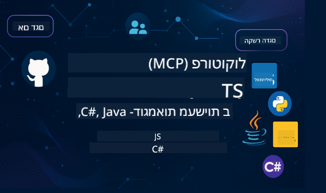

<!--
CO_OP_TRANSLATOR_METADATA:
{
  "original_hash": "866c8877136cb03e1efb9ad633a2f0a6",
  "translation_date": "2025-08-26T17:58:10+00:00",
  "source_file": "README.md",
  "language_code": "he"
}
-->
 

עקבו אחר השלבים הבאים כדי להתחיל להשתמש במשאבים אלו:
1. **פצלו את המאגר**: לחצו 
2. **שכפלו את המאגר**:   `git clone https://github.com/microsoft/mcp-for-beginners.git`
3. [**הצטרפו ל-Azure AI Foundry Discord ופגשו מומחים ומפתחים נוספים**](https://discord.com/invite/ByRwuEEgH4)

### 🌐 תמיכה בריבוי שפות

#### נתמך באמצעות GitHub Action (אוטומטי ותמיד מעודכן)

 [ערבית](../ar/README.md) | [בנגלית](../bn/README.md) | [בולגרית](../bg/README.md) | [בורמזית (מיאנמר)](../my/README.md) | [סינית (פשוטה)](../zh/README.md) | [סינית (מסורתית, הונג קונג)](../hk/README.md) | [סינית (מסורתית, מקאו)](../mo/README.md) | [סינית (מסורתית, טייוואן)](../tw/README.md) | [קרואטית](../hr/README.md) | [צ'כית](../cs/README.md) | [דנית](../da/README.md) | [הולנדית](../nl/README.md) | [פינית](../fi/README.md) | [צרפתית](../fr/README.md) | [גרמנית](../de/README.md) | [יוונית](../el/README.md) | [עברית](./README.md) | [הינדית](../hi/README.md) | [הונגרית](../hu/README.md) | [אינדונזית](../id/README.md) | [איטלקית](../it/README.md) | [יפנית](../ja/README.md) | [קוריאנית](../ko/README.md) | [מלאית](../ms/README.md) | [מרטהי](../mr/README.md) | [נפאלית](../ne/README.md) | [נורווגית](../no/README.md) | [פרסית (פרסית)](../fa/README.md) | [פולנית](../pl/README.md) | [פורטוגזית (ברזיל)](../br/README.md) | [פורטוגזית (פורטוגל)](../pt/README.md) | [פנג'אבית (גורמוקי)](../pa/README.md) | [רומנית](../ro/README.md) | [רוסית](../ru/README.md) | [סרבית (קירילית)](../sr/README.md) | [סלובקית](../sk/README.md) | [סלובנית](../sl/README.md) | [ספרדית](../es/README.md) | [סווהילית](../sw/README.md) | [שוודית](../sv/README.md) | [טאגאלוג (פיליפינית)](../tl/README.md) | [תאית](../th/README.md) | [טורקית](../tr/README.md) | [אוקראינית](../uk/README.md) | [אורדו](../ur/README.md) | [וייטנאמית](../vi/README.md)

# 🚀 תכנית לימודים של פרוטוקול הקשר מודל (MCP) למתחילים

## **למדו MCP עם דוגמאות קוד מעשיות ב-C#, Java, JavaScript, Rust, Python ו-TypeScript**

## 🧠 סקירה כללית של תכנית הלימודים של פרוטוקול הקשר מודל

**פרוטוקול הקשר מודל (MCP)** הוא מסגרת חדשנית שנועדה לתקנן אינטראקציות בין מודלים של בינה מלאכותית ליישומי לקוח. תכנית הלימודים בקוד פתוח זו מציעה מסלול למידה מובנה, הכולל דוגמאות קוד מעשיות ושימושים בעולם האמיתי, בשפות תכנות פופולריות כמו C#, Java, JavaScript, TypeScript ו-Python.

בין אם אתם מפתחי בינה מלאכותית, אדריכלי מערכות או מהנדסי תוכנה, מדריך זה הוא המשאב המקיף שלכם לשליטה ביסודות MCP ובאסטרטגיות יישום.

## 🔗 משאבים רשמיים של MCP

- 📘 [תיעוד MCP](https://modelcontextprotocol.io/) – מדריכים מפורטים והנחיות למשתמש  
- 📜 [מפרט MCP](https://modelcontextprotocol.io/docs/) – ארכיטקטורת הפרוטוקול והפניות טכניות  
- 📜 [מפרט MCP מקורי](https://spec.modelcontextprotocol.io/) – הפניות טכניות ישנות (עשויות לכלול פרטים נוספים)  
- 🧑‍💻 [מאגר GitHub של MCP](https://github.com/modelcontextprotocol) – ערכות SDK, כלים ודוגמאות קוד בקוד פתוח
- 🌐 [קהילת MCP](https://github.com/orgs/modelcontextprotocol/discussions) – הצטרפו לדיונים ותרמו לקהילה

## 🧭 סקירה כללית של תכנית הלימודים של MCP

### 📚 מבנה תכנית הלימודים המלאה

| מודול | נושא | תיאור | קישור |
|--------|-------|-------------|------|
| **מודול 1-3: יסודות** | | | |
| 00 | מבוא ל-MCP | סקירה כללית של פרוטוקול הקשר מודל ומשמעותו בצינורות AI | [קראו עוד](./00-Introduction/README.md) |
| 01 | הסבר על מושגים מרכזיים | חקירה מעמיקה של מושגי MCP מרכזיים | [קראו עוד](./01-CoreConcepts/README.md) |
| 02 | אבטחה ב-MCP | איומי אבטחה ושיטות עבודה מומלצות | [קראו עוד](./02-Security/README.md) |
| 03 | התחלה עם MCP | הגדרת סביבה, שרתים/לקוחות בסיסיים, אינטגרציה | [קראו עוד](./03-GettingStarted/README.md) |
| **מודול 3: בניית השרת והלקוח הראשונים שלכם** | | | |
| 3.1 | שרת ראשון | יצירת שרת MCP ראשון | [מדריך](./03-GettingStarted/01-first-server/README.md) |
| 3.2 | לקוח ראשון | פיתוח לקוח MCP בסיסי | [מדריך](./03-GettingStarted/02-client/README.md) |
| 3.3 | לקוח עם LLM | שילוב מודלים של שפה גדולה | [מדריך](./03-GettingStarted/03-llm-client/README.md) |
| 3.4 | אינטגרציה עם VS Code | שימוש בשרתי MCP ב-VS Code | [מדריך](./03-GettingStarted/04-vscode/README.md) |
| 3.5 | שרת stdio | יצירת שרתים באמצעות stdio transport | [מדריך](./03-GettingStarted/05-stdio-server/README.md) |
| 3.6 | הזרמת HTTP | יישום הזרמת HTTP ב-MCP | [מדריך](./03-GettingStarted/06-http-streaming/README.md) |
| 3.7 | ערכת כלים ל-AI | שימוש בערכת כלים ל-AI עם MCP | [מדריך](./03-GettingStarted/07-aitk/README.md) |
| 3.8 | בדיקות | בדיקת יישום שרת MCP שלכם | [מדריך](./03-GettingStarted/08-testing/README.md) |
| 3.9 | פריסה | פריסת שרתי MCP לייצור | [מדריך](./03-GettingStarted/09-deployment/README.md) |
| **מודול 4-5: מעשי ומתקדם** | | | |
| 04 | יישום מעשי | ערכות SDK, ניפוי באגים, בדיקות, תבניות פקודות לשימוש חוזר | [קראו עוד](./04-PracticalImplementation/README.md) |
| 05 | נושאים מתקדמים ב-MCP | AI רב-מודאלי, סקיילינג, שימוש ארגוני | [קראו עוד](./05-AdvancedTopics/README.md) |
| 5.1 | אינטגרציה עם Azure | אינטגרציית MCP עם Azure | [מדריך](./05-AdvancedTopics/mcp-integration/README.md) |
| 5.2 | רב-מודאליות | עבודה עם מודאליות מרובות | [מדריך](./05-AdvancedTopics/mcp-multi-modality/README.md) |
| 5.3 | הדגמת OAuth2 | יישום אימות OAuth2 | [מדריך](./05-AdvancedTopics/mcp-oauth2-demo/README.md) |
| 5.4 | הקשרים ראשיים | הבנה ויישום הקשרים ראשיים | [מדריך](./05-AdvancedTopics/mcp-root-contexts/README.md) |
| 5.5 | ניתוב | אסטרטגיות ניתוב ב-MCP | [מדריך](./05-AdvancedTopics/mcp-routing/README.md) |
| 5.6 | דגימה | טכניקות דגימה ב-MCP | [מדריך](./05-AdvancedTopics/mcp-sampling/README.md) |
| 5.7 | סקיילינג | סקיילינג של יישומי MCP | [מדריך](./05-AdvancedTopics/mcp-scaling/README.md) |
| 5.8 | אבטחה | שיקולי אבטחה מתקדמים | [מדריך](./05-AdvancedTopics/mcp-security/README.md) |
| 5.9 | חיפוש ברשת | יישום יכולות חיפוש ברשת | [מדריך](./05-AdvancedTopics/web-search-mcp/README.md) |
| 5.10 | הזרמה בזמן אמת | בניית פונקציונליות הזרמה בזמן אמת | [מדריך](./05-AdvancedTopics/mcp-realtimestreaming/README.md) |
| 5.11 | חיפוש בזמן אמת | יישום חיפוש בזמן אמת | [מדריך](./05-AdvancedTopics/mcp-realtimesearch/README.md) |
| 5.12 | אימות Entra ID | אימות עם Microsoft Entra ID | [מדריך](./05-AdvancedTopics/mcp-security-entra/README.md) |
| 5.13 | אינטגרציה עם Foundry | אינטגרציה עם Azure AI Foundry | [מדריך](./05-AdvancedTopics/mcp-foundry-agent-integration/README.md) |
| 5.14 | הנדסת הקשרים | טכניקות להנדסת הקשרים יעילה | [מדריך](./05-AdvancedTopics/mcp-contextengineering/README.md) |
| **מודול 6-10: קהילה ושיטות עבודה מומלצות** | | | |
| 06 | תרומות קהילתיות | כיצד לתרום לאקוסיסטם של MCP | [מדריך](./06-CommunityContributions/README.md) |
| 07 | תובנות מאימוץ מוקדם | סיפורי יישום בעולם האמיתי | [מדריך](./07-LessonsFromEarlyAdoption/README.md) |
| 08 | שיטות עבודה מומלצות ל-MCP | ביצועים, עמידות בפני תקלות, חוסן | [מדריך](./08-BestPractices/README.md) |
| 09 | מקרי בוחן של MCP | דוגמאות יישום מעשיות | [מדריך](./09-CaseStudy/README.md) |
| 10 | סדנה מעשית | בניית שרת MCP עם ערכת כלים ל-AI | [מעבדה](./10-StreamliningAIWorkflowsBuildingAnMCPServerWithAIToolkit/README.md) |

### 💻 פרויקטי דוגמאות קוד

#### דוגמאות בסיסיות של מחשבון MCP

| שפה | תיאור | קישור |
|----------|-------------|------|
| C# | דוגמת שרת MCP | [צפו בקוד](./03-GettingStarted/samples/csharp/README.md) |
| Java | מחשבון MCP | [צפו בקוד](./03-GettingStarted/samples/java/calculator/README.md) |
| JavaScript | הדגמת MCP | [צפו בקוד](./03-GettingStarted/samples/javascript/README.md) |
| Python | שרת MCP | [צפו בקוד](../../03-GettingStarted/samples/python/mcp_calculator_server.py) |
| TypeScript | דוגמת MCP | [צפו בקוד](./03-GettingStarted/samples/typescript/README.md) |
| Rust | דוגמת MCP | [צפו בקוד](./03-GettingStarted/samples/rust/README.md) |

#### יישומים מתקדמים של MCP

| שפה | תיאור | קישור |
|----------|-------------|------|
| C# | דוגמה מתקדמת | [View Code](./04-PracticalImplementation/samples/csharp/README.md) |
| Java עם Spring | דוגמת אפליקציית קונטיינר | [View Code](./04-PracticalImplementation/samples/java/containerapp/README.md) |
| JavaScript | דוגמה מתקדמת | [View Code](./04-PracticalImplementation/samples/javascript/README.md) |
| Python | יישום מורכב | [View Code](../../04-PracticalImplementation/samples/python/READMEmd) |
| TypeScript | דוגמת קונטיינר | [View Code](./04-PracticalImplementation/samples/typescript/README.md) |

## 🎯 דרישות מקדימות ללמידת MCP

כדי להפיק את המרב מתוכנית הלימודים הזו, כדאי שיהיה לך:

- ידע בסיסי בתכנות לפחות באחת מהשפות הבאות: C#, Java, JavaScript, Python או TypeScript  
- הבנה של מודל לקוח-שרת ו-APIs  
- היכרות עם מושגים של REST ו-HTTP  
- (אופציונלי) רקע במושגים של AI/ML  

- הצטרפות לדיוני הקהילה שלנו לקבלת תמיכה  

## 📚 מדריך לימוד ומשאבים

מאגר זה כולל מספר משאבים שיעזרו לך לנווט וללמוד בצורה יעילה:

### מדריך לימוד

[מדריך לימוד](./study_guide.md) מקיף זמין כדי לעזור לך לנווט במאגר זה בצורה יעילה. המדריך כולל:

- מפה חזותית של תוכנית הלימודים המציגה את כל הנושאים המכוסים  
- פירוט מעמיק של כל חלקי המאגר  
- הנחיות כיצד להשתמש בפרויקטים לדוגמה  
- מסלולי לימוד מומלצים לרמות מיומנות שונות  
- משאבים נוספים להשלמת מסע הלמידה שלך  

### יומן שינויים

אנו מנהלים [יומן שינויים](./changelog.md) מפורט שעוקב אחר כל העדכונים המשמעותיים לחומרי תוכנית הלימודים, כולל:

- תוספות תוכן חדשות  
- שינויים מבניים  
- שיפורי תכונות  
- עדכוני תיעוד  

## 🛠️ כיצד להשתמש בתוכנית הלימודים בצורה יעילה

כל שיעור במדריך זה כולל:

1. הסברים ברורים על מושגי MCP  
2. דוגמאות קוד חיות במספר שפות  
3. תרגילים לבניית אפליקציות MCP אמיתיות  
4. משאבים נוספים ללומדים מתקדמים  

## אירועים 

### [MCP Dev Days יולי 2025](https://developer.microsoft.com/en-us/reactor/series/S-1563/)
#### [➡️צפה לפי דרישה - MCP Dev Days](https://developer.microsoft.com/en-us/reactor/series/S-1563/)
התכוננו לשני ימים של תובנות טכניות מעמיקות, חיבור קהילתי ולמידה מעשית ב-MCP Dev Days, אירוע וירטואלי המוקדש ל-Model Context Protocol (MCP) — הסטנדרט המתפתח שמגשר בין מודלים של AI לכלים שהם מסתמכים עליהם.  
ניתן לצפות ב-MCP Dev Days על ידי הרשמה בעמוד האירוע שלנו: https://aka.ms/mcpdevdays.  

#### [יום 1: פרודוקטיביות MCP, כלי פיתוח וקהילה:](https://developer.microsoft.com/en-us/reactor/series/S-1563/)

מוקדש להעצמת מפתחים להשתמש ב-MCP בתהליך הפיתוח שלהם ולחגוג את קהילת MCP המדהימה. נצטרף לחברי קהילה ולשותפים כמו Arcade, Block, Okta ו-Neon כדי לראות כיצד הם משתפים פעולה עם Microsoft לעיצוב אקוסיסטם MCP פתוח ומתרחב.  
דמואים מעשיים בעולם האמיתי ב-VS Code, Visual Studio, GitHub Copilot וכלים פופולריים בקהילה  
תהליכי עבודה מונחי הקשר  
מפגשים ותובנות בהובלת הקהילה  
בין אם אתם רק מתחילים עם MCP או כבר בונים איתו, יום 1 יספק השראה ותובנות מעשיות.  

#### [יום 2: בניית שרתי MCP בביטחון](https://developer.microsoft.com/en-us/reactor/series/S-1563/)

מוקדש לבוני MCP. נעמיק באסטרטגיות יישום ובשיטות עבודה מומלצות ליצירת שרתי MCP ושילוב MCP בתהליכי העבודה של AI.  

#### הנושאים כוללים:

- בניית שרתי MCP ושילובם בחוויות סוכנים  
- פיתוח מונחה פרומפט  
- שיטות עבודה מומלצות לאבטחה  
- שימוש בבניית בלוקים כמו Functions, ACA ו-API Management  
- התאמת רישום וכלים (1P + 3P)  

אם אתם מפתחים, בוני כלים או אסטרטגים של מוצרי AI, יום זה מלא בתובנות שאתם צריכים כדי לבנות פתרונות MCP בקנה מידה גדול, מאובטחים ומוכנים לעתיד.  

### MCP Boot Camp אוגוסט 2025  
למדו בסשנים וידאו אינטנסיביים כיצד ליצור שרתי MCP, לשלב עם VS Code ולפרוס באופן מקצועי ב-Azure בהתבסס על תוכן מתוכנית MCP למתחילים. צאו עם מיומנויות מעשיות בטכנולוגיה שחברות גדולות כבר משתמשות בה.  

#### [➡️צפה לפי דרישה MCP Bootcamp | אנגלית](https://developer.microsoft.com/en-us/reactor/series/s-1568/)  
#### [➡️צפה לפי דרישה MCP Bootcamp | ברזיל](https://developer.microsoft.com/en-us/reactor/series/S-1566/)  
#### [➡️צפה לפי דרישה MCP Bootcamp | ספרדית](https://developer.microsoft.com/en-us/reactor/series/S-1567/)  

## 🌟 תודה לקהילה

תודה ל-Microsoft Valued Professional [שיבאם גוייל](https://www.linkedin.com/in/shivam2003/) על תרומתו בדוגמאות קוד חשובות.  

## 📜 מידע על רישיון

תוכן זה מורשה תחת **רישיון MIT**. לתנאים והגבלות, ראו [LICENSE](../../LICENSE).  

## 🤝 הנחיות לתרומה

פרויקט זה מקבל בברכה תרומות והצעות. רוב התרומות דורשות ממך להסכים ל-  
Contributor License Agreement (CLA) שמצהיר שיש לך את הזכות, ואתה אכן מעניק לנו  
את הזכויות להשתמש בתרומתך. לפרטים, בקרו ב-  
<https://cla.opensource.microsoft.com>.  

כאשר אתה מגיש בקשת משיכה, בוט CLA יקבע באופן אוטומטי אם עליך לספק  
CLA ויעטר את ה-PR בהתאם (לדוגמה, בדיקת סטטוס, תגובה). פשוט עקוב אחר ההוראות  
שסופקו על ידי הבוט. תצטרך לעשות זאת רק פעם אחת בכל המאגרים המשתמשים ב-CLA שלנו.  

פרויקט זה אימץ את [Microsoft Open Source Code of Conduct](https://opensource.microsoft.com/codeofconduct/).  
למידע נוסף, ראו את [שאלות נפוצות על קוד ההתנהגות](https://opensource.microsoft.com/codeofconduct/faq/) או  
צרו קשר עם [opencode@microsoft.com](mailto:opencode@microsoft.com) עם שאלות או הערות נוספות.  

## 📂 מבנה המאגר

המאגר מאורגן כדלקמן:

- **תוכנית לימודים מרכזית (00-10)**: התוכן המרכזי מאורגן בעשרה מודולים רציפים  
- **images/**: דיאגרמות ואיורים המשמשים לאורך תוכנית הלימודים  
- **translations/**: תמיכה רב-שפתית עם תרגומים אוטומטיים  
- **translated_images/**: גרסאות מקומיות של דיאגרמות ואיורים  
- **study_guide.md**: מדריך מקיף לניווט במאגר  
- **changelog.md**: רישום של כל השינויים המשמעותיים לחומרי תוכנית הלימודים  
- **mcp.json**: קובץ תצורה למפרט MCP  
- **CODE_OF_CONDUCT.md, LICENSE, SECURITY.md, SUPPORT.md**: מסמכי ניהול פרויקט  

## 🎒 קורסים נוספים
הצוות שלנו מייצר קורסים נוספים! בדקו:

- [AI Agents For Beginners](https://github.com/microsoft/ai-agents-for-beginners?WT.mc_id=academic-105485-koreyst)  
- [Generative AI for Beginners using .NET](https://github.com/microsoft/Generative-AI-for-beginners-dotnet?WT.mc_id=academic-105485-koreyst)  
- [Generative AI for Beginners using JavaScript](https://github.com/microsoft/generative-ai-with-javascript?WT.mc_id=academic-105485-koreyst)  
- [Generative AI for Beginners](https://github.com/microsoft/generative-ai-for-beginners?WT.mc_id=academic-105485-koreyst)  
- [Generative AI for Beginners using Java](https://github.com/microsoft/generative-ai-for-beginners-java?WT.mc_id=academic-105485-koreyst)  
- [ML for Beginners](https://aka.ms/ml-beginners?WT.mc_id=academic-105485-koreyst)  
- [Data Science for Beginners](https://aka.ms/datascience-beginners?WT.mc_id=academic-105485-koreyst)  
- [AI for Beginners](https://aka.ms/ai-beginners?WT.mc_id=academic-105485-koreyst)  
- [Cybersecurity for Beginners](https://github.com/microsoft/Security-101?WT.mc_id=academic-96948-sayoung)  
- [Web Dev for Beginners](https://aka.ms/webdev-beginners?WT.mc_id=academic-105485-koreyst)  
- [IoT for Beginners](https://aka.ms/iot-beginners?WT.mc_id=academic-105485-koreyst)  
- [XR Development for Beginners](https://github.com/microsoft/xr-development-for-beginners?WT.mc_id=academic-105485-koreyst)  
- [Mastering GitHub Copilot for AI Paired Programming](https://aka.ms/GitHubCopilotAI?WT.mc_id=academic-105485-koreyst)  
- [Mastering GitHub Copilot for C#/.NET Developers](https://github.com/microsoft/mastering-github-copilot-for-dotnet-csharp-developers?WT.mc_id=academic-105485-koreyst)  
- [Choose Your Own Copilot Adventure](https://github.com/microsoft/CopilotAdventures?WT.mc_id=academic-105485-koreyst)  

## ™️ הודעת סימן מסחרי

פרויקט זה עשוי להכיל סימנים מסחריים או לוגואים עבור פרויקטים, מוצרים או שירותים. שימוש מורשה בסימנים מסחריים או לוגואים של Microsoft כפוף ל-  
[Microsoft's Trademark & Brand Guidelines](https://www.microsoft.com/legal/intellectualproperty/trademarks/usage/general).  
שימוש בסימנים מסחריים או לוגואים של Microsoft בגרסאות מותאמות של פרויקט זה חייב לא לגרום לבלבול או לרמוז על חסות של Microsoft.  
כל שימוש בסימנים מסחריים או לוגואים של צד שלישי כפוף למדיניות של אותם צדדים שלישיים.  

---

**כתב ויתור**:  
מסמך זה תורגם באמצעות שירות תרגום מבוסס בינה מלאכותית [Co-op Translator](https://github.com/Azure/co-op-translator). למרות שאנו שואפים לדיוק, יש לקחת בחשבון שתרגומים אוטומטיים עשויים להכיל שגיאות או אי דיוקים. המסמך המקורי בשפתו המקורית צריך להיחשב כמקור סמכותי. עבור מידע קריטי, מומלץ להשתמש בתרגום מקצועי על ידי אדם. איננו נושאים באחריות לאי הבנות או לפרשנויות שגויות הנובעות משימוש בתרגום זה.