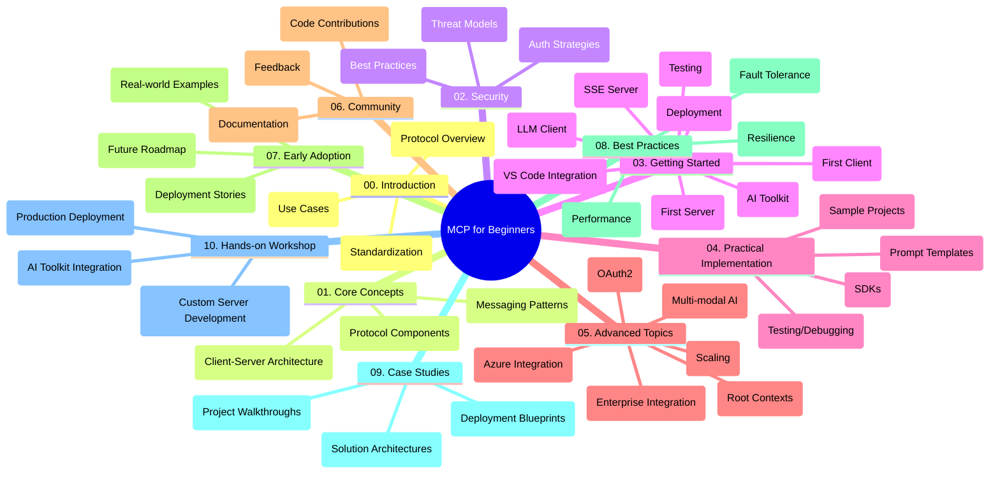

<!--
CO_OP_TRANSLATOR_METADATA:
{
  "original_hash": "a607d4febc94caee9a12b77795f7fc9a",
  "translation_date": "2025-07-13T15:16:09+00:00",
  "source_file": "study_guide.md",
  "language_code": "he"
}
-->
# פרוטוקול הקשר של מודל (MCP) למתחילים - מדריך לימוד

מדריך לימוד זה מספק סקירה של מבנה ותוכן המאגר עבור תוכנית הלימודים "פרוטוקול הקשר של מודל (MCP) למתחילים". השתמש במדריך זה כדי לנווט במאגר ביעילות ולהפיק את המרב מהמשאבים הזמינים.

## סקירת המאגר

פרוטוקול הקשר של מודל (MCP) הוא מסגרת סטנדרטית לאינטראקציות בין מודלים של בינה מלאכותית ליישומי לקוח. מאגר זה מספק תוכנית לימודים מקיפה עם דוגמאות קוד מעשיות ב-C#, Java, JavaScript, Python ו-TypeScript, המיועדת למפתחי AI, אדריכלי מערכות ומהנדסי תוכנה.

## מפת תוכנית לימודים ויזואלית

## מבנה המאגר

המאגר מאורגן בעשרה חלקים עיקריים, שכל אחד מהם מתמקד בהיבטים שונים של MCP:

1. **הקדמה (00-Introduction/)**
   - סקירה של פרוטוקול הקשר של מודל
   - מדוע סטנדרטיזציה חשובה בצינורות AI
   - מקרי שימוש מעשיים ויתרונות

2. **מושגי יסוד (01-CoreConcepts/)**
   - ארכיטקטורת לקוח-שרת
   - רכיבי פרוטוקול מרכזיים
   - דפוסי הודעות ב-MCP

3. **אבטחה (02-Security/)**
   - איומי אבטחה במערכות מבוססות MCP
   - שיטות עבודה מומלצות לאבטחת יישומים
   - אסטרטגיות אימות והרשאה

4. **התחלה מהירה (03-GettingStarted/)**
   - הגדרת סביבה וקונפיגורציה
   - יצירת שרתי ולקוחות MCP בסיסיים
   - אינטגרציה עם יישומים קיימים
   - תת-חלקים לשרת ראשון, לקוח ראשון, לקוח LLM, אינטגרציה עם VS Code, שרת SSE, ערכת כלים ל-AI, בדיקות ופריסה

5. **יישום מעשי (04-PracticalImplementation/)**
   - שימוש ב-SDK בשפות תכנות שונות
   - טכניקות דיבוג, בדיקה ואימות
   - יצירת תבניות פרומפט וזרימות עבודה לשימוש חוזר
   - פרויקטים לדוגמה עם דוגמאות יישום

6. **נושאים מתקדמים (05-AdvancedTopics/)**
   - זרימות עבודה רב-מודליות והרחבה
   - אסטרטגיות סקיילינג מאובטחות
   - MCP באקוסיסטמים ארגוניים
   - נושאים מיוחדים כולל אינטגרציה עם Azure, רב-מודליות, OAuth2, הקשרים שורשיים, ניתוב, דגימה, סקיילינג, אבטחה, אינטגרציה עם חיפוש באינטרנט וזרימה.

7. **תרומות מהקהילה (06-CommunityContributions/)**
   - איך לתרום קוד ותיעוד
   - שיתוף פעולה דרך GitHub
   - שיפורים והערות מונחי קהילה

8. **לקחים מאימוץ מוקדם (07-LessonsfromEarlyAdoption/)**
   - יישומים מהעולם האמיתי וסיפורי הצלחה
   - בנייה ופריסה של פתרונות מבוססי MCP
   - מגמות ומפת דרכים עתידית

9. **שיטות עבודה מומלצות (08-BestPractices/)**
   - כוונון ביצועים ואופטימיזציה
   - תכנון מערכות MCP עמידות לתקלות
   - אסטרטגיות בדיקה ועמידות

10. **מקרי מבחן (09-CaseStudy/)**
    - ניתוחים מעמיקים של ארכיטקטורות פתרונות MCP
    - תבניות פריסה וטיפים לאינטגרציה
    - דיאגרמות עם הערות והדרכות פרויקט

11. **סדנה מעשית (10-StreamliningAIWorkflowsBuildingAnMCPServerWithAIToolkit/)**
    - סדנה מעשית מקיפה המשלבת MCP עם ערכת הכלים של Microsoft ל-AI עבור VS Code
    - בניית יישומים חכמים המחברים בין מודלי AI לכלים מהעולם האמיתי
    - מודולים מעשיים המכסים יסודות, פיתוח שרת מותאם ופריסת ייצור

## פרויקטים לדוגמה

המאגר כולל מספר פרויקטים לדוגמה המדגימים יישום MCP בשפות תכנות שונות:

### דוגמאות מחשבון MCP בסיסי
- דוגמת שרת MCP ב-C#
- מחשבון MCP ב-Java
- דמו MCP ב-JavaScript
- שרת MCP ב-Python
- דוגמה ב-TypeScript

### פרויקטים מתקדמים למחשבון MCP
- דוגמה מתקדמת ב-C#
- דוגמת אפליקציית מכולה ב-Java
- דוגמה מתקדמת ב-JavaScript
- יישום מורכב ב-Python
- דוגמת מכולה ב-TypeScript

## משאבים נוספים

המאגר כולל משאבים תומכים:

- **תיקיית תמונות**: מכילה דיאגרמות ואיורים המשמשים לאורך תוכנית הלימודים
- **תרגומים**: תמיכה רב-שפתית עם תרגומים אוטומטיים של התיעוד
- **משאבים רשמיים של MCP**:
  - [MCP Documentation](https://modelcontextprotocol.io/)
  - [MCP Specification](https://spec.modelcontextprotocol.io/)
  - [MCP GitHub Repository](https://github.com/modelcontextprotocol)

## איך להשתמש במאגר זה

1. **למידה סדרתית**: עקוב אחרי הפרקים לפי הסדר (00 עד 10) לחוויית למידה מסודרת.
2. **מיקוד בשפה ספציפית**: אם אתה מעוניין בשפת תכנות מסוימת, חקור את תיקיות הדוגמאות ליישומים בשפה המועדפת עליך.
3. **יישום מעשי**: התחל בקטע "התחלה מהירה" כדי להגדיר את הסביבה וליצור את שרת ולקוח MCP הראשונים שלך.
4. **חקירה מתקדמת**: לאחר שתהיה נוח עם היסודות, העמק בנושאים המתקדמים להרחבת הידע.
5. **מעורבות קהילתית**: הצטרף ל-[Azure AI Foundry Discord](https://discord.com/invite/ByRwuEEgH4) כדי להתחבר למומחים ולמפתחים נוספים.

## תרומה

מאגר זה מקבל בברכה תרומות מהקהילה. עיין בקטע תרומות מהקהילה לקבלת הנחיות כיצד לתרום.

---

*מדריך לימוד זה נוצר ב-11 ביוני 2025, ומספק סקירה של המאגר נכון לתאריך זה. ייתכן שתוכן המאגר עודכן מאז.*

**כתב ויתור**:  
מסמך זה תורגם באמצעות שירות תרגום מבוסס בינה מלאכותית [Co-op Translator](https://github.com/Azure/co-op-translator). למרות שאנו שואפים לדיוק, יש לקחת בחשבון כי תרגומים אוטומטיים עלולים להכיל שגיאות או אי-דיוקים. המסמך המקורי בשפת המקור שלו נחשב למקור הסמכותי. למידע קריטי מומלץ להשתמש בתרגום מקצועי על ידי מתרגם אנושי. אנו לא נושאים באחריות לכל אי-הבנה או פרשנות שגויה הנובעת משימוש בתרגום זה.