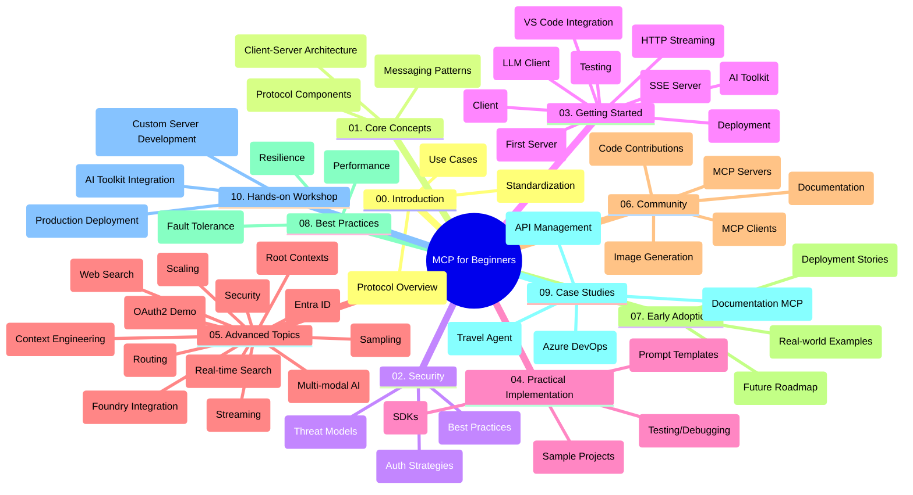

<!--
CO_OP_TRANSLATOR_METADATA:
{
  "original_hash": "5f321ea583cf087a94e47ee74c62b504",
  "translation_date": "2025-07-17T07:17:20+00:00",
  "source_file": "study_guide.md",
  "language_code": "he"
}
-->
# פרוטוקול הקשר של מודל (MCP) למתחילים - מדריך לימוד

מדריך לימוד זה מספק סקירה של מבנה ותוכן המאגר עבור תכנית הלימודים "פרוטוקול הקשר של מודל (MCP) למתחילים". השתמש במדריך זה כדי לנווט במאגר ביעילות ולהפיק את המרב מהמשאבים הזמינים.

## סקירת המאגר

פרוטוקול הקשר של מודל (MCP) הוא מסגרת סטנדרטית לאינטראקציות בין מודלים של בינה מלאכותית ליישומי לקוח. נוצר במקור על ידי Anthropic, MCP מתוחזק כיום על ידי קהילת MCP הרחבה דרך הארגון הרשמי ב-GitHub. מאגר זה מספק תכנית לימודים מקיפה עם דוגמאות קוד מעשיות ב-C#, Java, JavaScript, Python ו-TypeScript, המיועדת למפתחי AI, אדריכלי מערכות ומהנדסי תוכנה.

## מפת תכנית הלימודים הוויזואלית

## מבנה המאגר

המאגר מאורגן לעשרה חלקים עיקריים, שכל אחד מהם מתמקד בהיבטים שונים של MCP:

1. **הקדמה (00-Introduction/)**
   - סקירה של פרוטוקול הקשר של מודל
   - מדוע סטנדרטיזציה חשובה בצינורות AI
   - מקרי שימוש מעשיים ויתרונות

2. **מושגים מרכזיים (01-CoreConcepts/)**
   - ארכיטקטורת לקוח-שרת
   - רכיבי פרוטוקול מרכזיים
   - דפוסי הודעות ב-MCP

3. **אבטחה (02-Security/)**
   - איומי אבטחה במערכות מבוססות MCP
   - שיטות עבודה מומלצות לאבטחת יישומים
   - אסטרטגיות אימות והרשאה

4. **התחלה מהירה (03-GettingStarted/)**
   - הגדרת סביבה וקונפיגורציה
   - יצירת שרתי ולקוחות MCP בסיסיים
   - אינטגרציה עם יישומים קיימים
   - כולל חלקים עבור:
     - מימוש שרת ראשון
     - פיתוח לקוח
     - אינטגרציה עם LLM client
     - אינטגרציה עם VS Code
     - שרת Server-Sent Events (SSE)
     - סטרימינג HTTP
     - אינטגרציה עם AI Toolkit
     - אסטרטגיות בדיקה
     - הנחיות לפריסה

5. **מימוש מעשי (04-PracticalImplementation/)**
   - שימוש ב-SDK בשפות תכנות שונות
   - טכניקות דיבוג, בדיקה ואימות
   - יצירת תבניות פרומפט וזרימות עבודה לשימוש חוזר
   - פרויקטים לדוגמה עם דוגמאות מימוש

6. **נושאים מתקדמים (05-AdvancedTopics/)**
   - טכניקות הנדסת הקשר
   - אינטגרציה עם Foundry agent
   - זרימות עבודה מולטימודליות ב-AI
   - הדגמות OAuth2 לאימות
   - יכולות חיפוש בזמן אמת
   - סטרימינג בזמן אמת
   - מימוש הקשרים שורשיים
   - אסטרטגיות ניתוב
   - טכניקות דגימה
   - גישות להרחבה
   - שיקולי אבטחה
   - אינטגרציה עם אבטחת Entra ID
   - אינטגרציה עם חיפוש באינטרנט

7. **תרומות מהקהילה (06-CommunityContributions/)**
   - כיצד לתרום קוד ותיעוד
   - שיתוף פעולה דרך GitHub
   - שיפורים ומשוב מונחי קהילה
   - שימוש בלקוחות MCP שונים (Claude Desktop, Cline, VSCode)
   - עבודה עם שרתי MCP פופולריים כולל יצירת תמונות

8. **לקחים מאימוץ מוקדם (07-LessonsfromEarlyAdoption/)**
   - מימושים מהעולם האמיתי וסיפורי הצלחה
   - בנייה ופריסה של פתרונות מבוססי MCP
   - מגמות ומפת דרכים עתידית

9. **שיטות עבודה מומלצות (08-BestPractices/)**
   - כוונון ביצועים ואופטימיזציה
   - תכנון מערכות MCP עמידות לתקלות
   - אסטרטגיות בדיקה ועמידות

10. **מקרי בוחן (09-CaseStudy/)**
    - מקרה בוחן: אינטגרציה עם Azure API Management
    - מקרה בוחן: מימוש סוכן נסיעות
    - מקרה בוחן: אינטגרציה של Azure DevOps עם YouTube
    - דוגמאות מימוש עם תיעוד מפורט

11. **סדנת מעשית (10-StreamliningAIWorkflowsBuildingAnMCPServerWithAIToolkit/)**
    - סדנה מעשית מקיפה המשלבת MCP עם AI Toolkit
    - בניית יישומים חכמים המחברים בין מודלי AI לכלים מהעולם האמיתי
    - מודולים מעשיים המכסים יסודות, פיתוח שרת מותאם ואסטרטגיות פריסה
    - גישת למידה מבוססת מעבדה עם הוראות שלב-אחר-שלב

## משאבים נוספים

המאגר כולל משאבים תומכים:

- **תיקיית תמונות**: מכילה דיאגרמות ואיורים המשמשים לאורך תכנית הלימודים
- **תרגומים**: תמיכה רב-לשונית עם תרגומים אוטומטיים של התיעוד
- **משאבים רשמיים של MCP**:
  - [MCP Documentation](https://modelcontextprotocol.io/)
  - [MCP Specification](https://spec.modelcontextprotocol.io/)
  - [MCP GitHub Repository](https://github.com/modelcontextprotocol)

## כיצד להשתמש במאגר זה

1. **למידה סדרתית**: עקוב אחרי הפרקים לפי הסדר (00 עד 10) לחוויית למידה מסודרת.
2. **מיקוד בשפה ספציפית**: אם אתה מעוניין בשפת תכנות מסוימת, חקור את תיקיות הדוגמאות למימושים בשפה המועדפת עליך.
3. **מימוש מעשי**: התחל בחלק "התחלה מהירה" כדי להגדיר את הסביבה שלך וליצור את שרת ולקוח MCP הראשונים שלך.
4. **חקירה מתקדמת**: לאחר שתהיה נוח עם היסודות, העמק בנושאים המתקדמים להרחבת הידע.
5. **מעורבות קהילתית**: הצטרף לקהילת MCP דרך דיונים ב-GitHub וערוצי Discord כדי להתחבר למומחים ולמפתחים נוספים.

## לקוחות וכלים של MCP

תכנית הלימודים מכסה לקוחות וכלים שונים של MCP:

1. **לקוחות רשמיים**:
   - Visual Studio Code
   - MCP ב-Visual Studio Code
   - Claude Desktop
   - Claude ב-VSCode
   - Claude API

2. **לקוחות קהילתיים**:
   - Cline (ממשק שורת פקודה)
   - Cursor (עורך קוד)
   - ChatMCP
   - Windsurf

3. **כלי ניהול MCP**:
   - MCP CLI
   - MCP Manager
   - MCP Linker
   - MCP Router

## שרתי MCP פופולריים

המאגר מציג שרתי MCP שונים, כולל:

1. **שרתי ייחוס רשמיים**:
   - Filesystem
   - Fetch
   - Memory
   - Sequential Thinking

2. **יצירת תמונות**:
   - Azure OpenAI DALL-E 3
   - Stable Diffusion WebUI
   - Replicate

3. **כלי פיתוח**:
   - Git MCP
   - Terminal Control
   - Code Assistant

4. **שרתי מומחים**:
   - Salesforce
   - Microsoft Teams
   - Jira & Confluence

## תרומה

מאגר זה מקבל בברכה תרומות מהקהילה. עיין בחלק תרומות מהקהילה לקבלת הנחיות כיצד לתרום בצורה יעילה לאקוסיסטם של MCP.

## יומן שינויים

| תאריך | שינויים |
|-------|---------|
| 16 ביולי 2025 | - עדכון מבנה המאגר לשקף את התוכן הנוכחי - הוספת חלק לקוחות וכלים של MCP - הוספת חלק שרתי MCP פופולריים - עדכון מפת תכנית הלימודים הוויזואלית עם כל הנושאים הנוכחיים - שיפור חלק הנושאים המתקדמים עם כל התחומים המיוחדים - עדכון מקרי הבוחן לשקף דוגמאות אמיתיות - הבהרת מקור MCP שנוצר על ידי Anthropic |
| 11 ביוני 2025 | - יצירת מדריך הלימוד הראשוני - הוספת מפת תכנית הלימודים הוויזואלית - מתן סקירה של מבנה המאגר - הכללת פרויקטים לדוגמה ומשאבים נוספים |

---

*מדריך לימוד זה עודכן ב-16 ביולי 2025, ומספק סקירה של המאגר נכון לתאריך זה. ייתכן שהתוכן במאגר יעודכן לאחר תאריך זה.*

**כתב ויתור**:  
מסמך זה תורגם באמצעות שירות תרגום מבוסס בינה מלאכותית [Co-op Translator](https://github.com/Azure/co-op-translator). למרות שאנו שואפים לדיוק, יש לקחת בחשבון כי תרגומים אוטומטיים עלולים להכיל שגיאות או אי-דיוקים. המסמך המקורי בשפת המקור שלו נחשב למקור הסמכותי. למידע קריטי מומלץ להשתמש בתרגום מקצועי על ידי מתרגם אנושי. אנו לא נושאים באחריות לכל אי-הבנה או פרשנות שגויה הנובעת משימוש בתרגום זה.