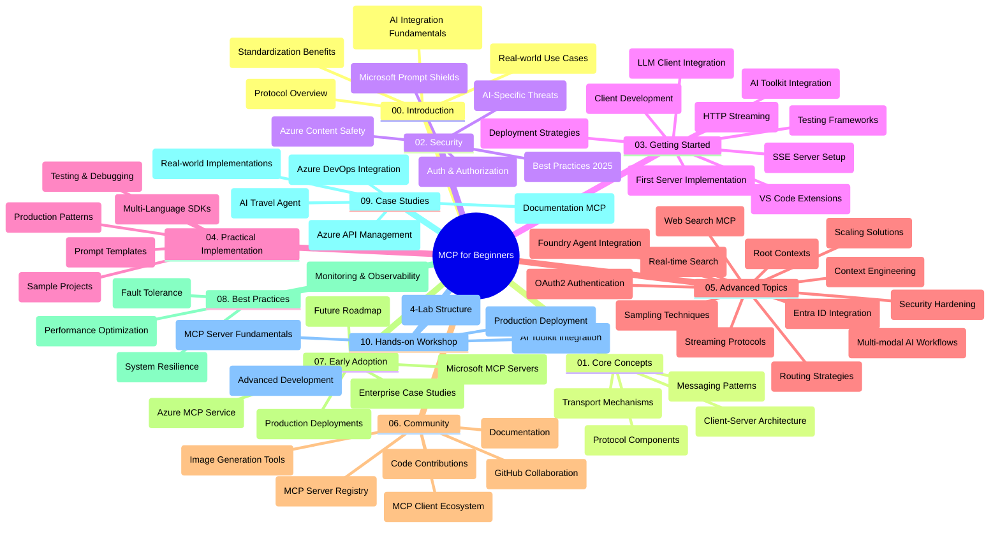

<!--
CO_OP_TRANSLATOR_METADATA:
{
  "original_hash": "e2c6ed897fa98fa08e0146101776c7ff",
  "translation_date": "2025-07-18T10:07:05+00:00",
  "source_file": "study_guide.md",
  "language_code": "he"
}
-->
# פרוטוקול הקשר של מודל (MCP) למתחילים - מדריך לימוד

מדריך לימוד זה מספק סקירה של מבנה ותוכן המאגר עבור תוכנית הלימודים "פרוטוקול הקשר של מודל (MCP) למתחילים". השתמש במדריך זה כדי לנווט במאגר ביעילות ולהפיק את המרב מהמשאבים הזמינים.

## סקירת המאגר

פרוטוקול הקשר של מודל (MCP) הוא מסגרת סטנדרטית לאינטראקציות בין מודלים של בינה מלאכותית ליישומי לקוח. נוצר במקור על ידי Anthropic, MCP מתוחזק כיום על ידי קהילת MCP הרחבה דרך הארגון הרשמי ב-GitHub. מאגר זה מספק תוכנית לימודים מקיפה עם דוגמאות קוד מעשיות ב-C#, Java, JavaScript, Python ו-TypeScript, המיועדת למפתחי בינה מלאכותית, אדריכלי מערכות ומהנדסי תוכנה.

## מפת תוכנית הלימודים הוויזואלית

## מבנה המאגר

המאגר מאורגן בעשרה חלקים עיקריים, שכל אחד מהם מתמקד בהיבטים שונים של MCP:

1. **הקדמה (00-Introduction/)**
   - סקירה כללית של פרוטוקול הקשר של מודל
   - מדוע סטנדרטיזציה חשובה בצינורות בינה מלאכותית
   - מקרי שימוש מעשיים ויתרונות

2. **מושגים מרכזיים (01-CoreConcepts/)**
   - ארכיטקטורת לקוח-שרת
   - רכיבי פרוטוקול מרכזיים
   - דפוסי הודעות ב-MCP

3. **אבטחה (02-Security/)**
   - איומי אבטחה במערכות מבוססות MCP
   - שיטות עבודה מומלצות לאבטחת יישומים
   - אסטרטגיות אימות והרשאה
   - **תיעוד אבטחה מקיף**:
     - MCP Security Best Practices 2025
     - Azure Content Safety Implementation Guide
     - MCP Security Controls and Techniques
     - MCP Best Practices Quick Reference
   - **נושאי אבטחה מרכזיים**:
     - התקפות הזרקת פרומפט ורעלת כלים
     - חטיפת סשן ובעיות confused deputy
     - פגיעויות במעבר טוקנים
     - הרשאות מופרזות ובקרת גישה
     - אבטחת שרשרת אספקה לרכיבי בינה מלאכותית
     - אינטגרציה עם Microsoft Prompt Shields

4. **התחלה מהירה (03-GettingStarted/)**
   - הגדרת סביבה וקונפיגורציה
   - יצירת שרתים ולקוחות MCP בסיסיים
   - אינטגרציה עם יישומים קיימים
   - כולל חלקים עבור:
     - יישום שרת ראשון
     - פיתוח לקוח
     - אינטגרציית לקוח LLM
     - אינטגרציה עם VS Code
     - שרת Server-Sent Events (SSE)
     - סטרימינג HTTP
     - אינטגרציה עם AI Toolkit
     - אסטרטגיות בדיקה
     - הנחיות לפריסה

5. **יישום מעשי (04-PracticalImplementation/)**
   - שימוש ב-SDK בשפות תכנות שונות
   - טכניקות דיבוג, בדיקה ואימות
   - יצירת תבניות פרומפט וזרימות עבודה לשימוש חוזר
   - פרויקטים לדוגמה עם דוגמאות יישום

6. **נושאים מתקדמים (05-AdvancedTopics/)**
   - טכניקות הנדסת הקשר
   - אינטגרציה עם Foundry agent
   - זרימות עבודה מולטי-מודליות בבינה מלאכותית
   - הדגמות OAuth2 לאימות
   - יכולות חיפוש בזמן אמת
   - סטרימינג בזמן אמת
   - יישום הקשרים שורשיים
   - אסטרטגיות ניתוב
   - טכניקות דגימה
   - גישות סקיילינג
   - שיקולי אבטחה
   - אינטגרציה עם אבטחת Entra ID
   - אינטגרציה עם חיפוש באינטרנט

7. **תרומות מהקהילה (06-CommunityContributions/)**
   - איך לתרום קוד ותיעוד
   - שיתוף פעולה דרך GitHub
   - שיפורים ומשוב מונחי קהילה
   - שימוש בלקוחות MCP שונים (Claude Desktop, Cline, VSCode)
   - עבודה עם שרתי MCP פופולריים כולל יצירת תמונות

8. **לקחים מאימוץ מוקדם (07-LessonsfromEarlyAdoption/)**
   - יישומים מהעולם האמיתי וסיפורי הצלחה
   - בנייה ופריסה של פתרונות מבוססי MCP
   - מגמות ומפת דרכים עתידית
   - **מדריך שרתי MCP של Microsoft**: מדריך מקיף ל-10 שרתי MCP של Microsoft מוכנים לייצור הכולל:
     - Microsoft Learn Docs MCP Server
     - Azure MCP Server (מעל 15 מחברים מיוחדים)
     - GitHub MCP Server
     - Azure DevOps MCP Server
     - MarkItDown MCP Server
     - SQL Server MCP Server
     - Playwright MCP Server
     - Dev Box MCP Server
     - Azure AI Foundry MCP Server
     - Microsoft 365 Agents Toolkit MCP Server

9. **שיטות עבודה מומלצות (08-BestPractices/)**
   - כוונון ביצועים ואופטימיזציה
   - תכנון מערכות MCP עמידות לתקלות
   - אסטרטגיות בדיקה ועמידות

10. **מקרי בוחן (09-CaseStudy/)**
    - דוגמת אינטגרציה עם Azure API Management
    - דוגמת יישום סוכן נסיעות
    - אינטגרציה עם Azure DevOps ועדכוני YouTube
    - דוגמאות יישום MCP עם תיעוד מפורט

11. **סדנת מעשית (10-StreamliningAIWorkflowsBuildingAnMCPServerWithAIToolkit/)**
    - סדנה מעשית מקיפה המשלבת MCP עם AI Toolkit
    - בניית יישומים חכמים המחברים בין מודלי בינה מלאכותית לכלים מהעולם האמיתי
    - מודולים מעשיים המכסים יסודות, פיתוח שרת מותאם ואסטרטגיות פריסה לייצור
    - **מבנה המעבדה**:
      - מעבדה 1: יסודות שרת MCP
      - מעבדה 2: פיתוח שרת MCP מתקדם
      - מעבדה 3: אינטגרציה עם AI Toolkit
      - מעבדה 4: פריסה וסקיילינג לייצור
    - גישת למידה מבוססת מעבדה עם הוראות שלב-אחר-שלב

## משאבים נוספים

המאגר כולל משאבים תומכים:

- **תיקיית תמונות**: מכילה דיאגרמות ואיורים המשמשים לאורך תוכנית הלימודים
- **תרגומים**: תמיכה בריבוי שפות עם תרגומים אוטומטיים של התיעוד
- **משאבים רשמיים של MCP**:
  - [MCP Documentation](https://modelcontextprotocol.io/)
  - [MCP Specification](https://spec.modelcontextprotocol.io/)
  - [MCP GitHub Repository](https://github.com/modelcontextprotocol)

## איך להשתמש במאגר זה

1. **למידה סדרתית**: עקוב אחרי הפרקים לפי הסדר (00 עד 10) לחוויית למידה מסודרת.
2. **מיקוד בשפה ספציפית**: אם אתה מעוניין בשפת תכנות מסוימת, חקור את תיקיות הדוגמאות ליישומים בשפה המועדפת עליך.
3. **יישום מעשי**: התחל בחלק "התחלה מהירה" כדי להגדיר את הסביבה וליצור את שרת ולקוח MCP הראשונים שלך.
4. **חקירה מתקדמת**: לאחר שתהיה נוח עם היסודות, העמק בנושאים המתקדמים להרחבת הידע.
5. **מעורבות קהילתית**: הצטרף לקהילת MCP דרך דיונים ב-GitHub וערוצי Discord כדי להתחבר למומחים ולמפתחים נוספים.

## לקוחות וכלים של MCP

תוכנית הלימודים כוללת מגוון לקוחות וכלים של MCP:

1. **לקוחות רשמיים**:
   - Visual Studio Code
   - MCP ב-Visual Studio Code
   - Claude Desktop
   - Claude ב-VSCode
   - Claude API

2. **לקוחות קהילתיים**:
   - Cline (ממשק שורת פקודה)
   - Cursor (עורך קוד)
   - ChatMCP
   - Windsurf

3. **כלי ניהול MCP**:
   - MCP CLI
   - MCP Manager
   - MCP Linker
   - MCP Router

## שרתי MCP פופולריים

המאגר מציג שרתי MCP שונים, כולל:

1. **שרתי MCP רשמיים של Microsoft**:
   - Microsoft Learn Docs MCP Server
   - Azure MCP Server (מעל 15 מחברים מיוחדים)
   - GitHub MCP Server
   - Azure DevOps MCP Server
   - MarkItDown MCP Server
   - SQL Server MCP Server
   - Playwright MCP Server
   - Dev Box MCP Server
   - Azure AI Foundry MCP Server
   - Microsoft 365 Agents Toolkit MCP Server

2. **שרתי ייחוס רשמיים**:
   - Filesystem
   - Fetch
   - Memory
   - Sequential Thinking

3. **יצירת תמונות**:
   - Azure OpenAI DALL-E 3
   - Stable Diffusion WebUI
   - Replicate

4. **כלי פיתוח**:
   - Git MCP
   - Terminal Control
   - Code Assistant

5. **שרתי מומחים**:
   - Salesforce
   - Microsoft Teams
   - Jira & Confluence

## תרומה

מאגר זה מקבל בברכה תרומות מהקהילה. עיין בחלק תרומות מהקהילה לקבלת הנחיות כיצד לתרום בצורה יעילה לאקוסיסטם של MCP.

## יומן שינויים

| תאריך | שינויים |
|-------|---------|
| 18 ביולי 2025 | - עדכון מבנה המאגר לכלול מדריך שרתי MCP של Microsoft - הוספת רשימה מקיפה של 10 שרתי MCP של Microsoft מוכנים לייצור - שיפור חלק שרתי MCP פופולריים עם שרתי MCP רשמיים של Microsoft - עדכון חלק מקרי בוחן עם דוגמאות קבצים ממשיות - הוספת פרטי מבנה מעבדה לסדנה המעשית |
| 16 ביולי 2025 | - עדכון מבנה המאגר לשקף את התוכן הנוכחי - הוספת חלק לקוחות וכלים של MCP - הוספת חלק שרתי MCP פופולריים - עדכון מפת תוכנית הלימודים הוויזואלית עם כל הנושאים הנוכחיים - שיפור חלק נושאים מתקדמים עם כל התחומים המיוחדים - עדכון מקרי בוחן לשקף דוגמאות ממשיות - הבהרת מקור MCP כנוצר על ידי Anthropic |
| 11 ביוני 2025 | - יצירה ראשונית של מדריך הלימוד - הוספת מפת תוכנית הלימודים הוויזואלית - תיאור מבנה המאגר - הכללת פרויקטים לדוגמה ומשאבים נוספים |

---

*מדריך לימוד זה עודכן ב-18 ביולי 2025, ומספק סקירה של המאגר נכון לתאריך זה. ייתכן שהתוכן במאגר יעודכן לאחר תאריך זה.*

**כתב ויתור**:  
מסמך זה תורגם באמצעות שירות תרגום מבוסס בינה מלאכותית [Co-op Translator](https://github.com/Azure/co-op-translator). למרות שאנו שואפים לדיוק, יש לקחת בחשבון כי תרגומים אוטומטיים עלולים להכיל שגיאות או אי-דיוקים. המסמך המקורי בשפת המקור שלו צריך להיחשב כמקור הסמכות. למידע קריטי מומלץ להשתמש בתרגום מקצועי על ידי אדם. אנו לא נושאים באחריות לכל אי-הבנה או פרשנות שגויה הנובעת משימוש בתרגום זה.