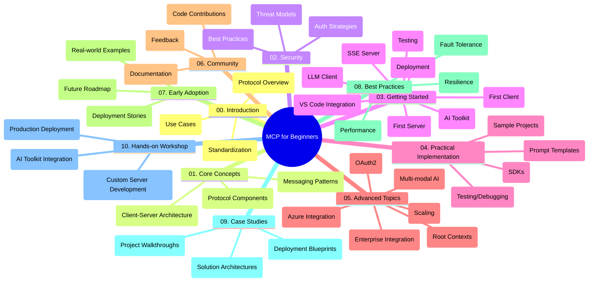

<!--
CO_OP_TRANSLATOR_METADATA:
{
  "original_hash": "a607d4febc94caee9a12b77795f7fc9a",
  "translation_date": "2025-06-11T16:47:02+00:00",
  "source_file": "study_guide.md",
  "language_code": "he"
}
-->
# פרוטוקול הקשר של מודל (MCP) למתחילים - מדריך לימוד

מדריך הלימוד הזה מספק סקירה כללית של מבנה ותוכן המאגר עבור תוכנית הלימודים "פרוטוקול הקשר של מודל (MCP) למתחילים". השתמש במדריך זה כדי לנווט במאגר בצורה יעילה ולהפיק את המיטב מהמשאבים הזמינים.

## סקירת המאגר

פרוטוקול הקשר של מודל (MCP) הוא מסגרת סטנדרטית לאינטראקציות בין מודלים של בינה מלאכותית ליישומי לקוח. מאגר זה מספק תוכנית לימודים מקיפה עם דוגמאות קוד מעשיות ב-C#, Java, JavaScript, Python ו-TypeScript, המיועדת למפתחי AI, אדריכלי מערכות ומהנדסי תוכנה.

## מפת תוכנית הלימודים הוויזואלית

## מבנה המאגר

המאגר מאורגן בעשרה חלקים עיקריים, שכל אחד מהם מתמקד בהיבטים שונים של MCP:

1. **הקדמה (00-Introduction/)**
   - סקירה כללית של פרוטוקול הקשר של מודל
   - מדוע סטנדרטיזציה חשובה בשרשראות AI
   - מקרי שימוש מעשיים ויתרונות

2. **מושגים מרכזיים (01-CoreConcepts/)**
   - ארכיטקטורת לקוח-שרת
   - רכיבי פרוטוקול מרכזיים
   - דפוסי הודעות ב-MCP

3. **אבטחה (02-Security/)**
   - איומי אבטחה במערכות מבוססות MCP
   - שיטות עבודה מומלצות לאבטחת יישומים
   - אסטרטגיות אימות והרשאה

4. **התחלה (03-GettingStarted/)**
   - הגדרת סביבה וקונפיגורציה
   - יצירת שרתי ולקוחות MCP בסיסיים
   - אינטגרציה עם יישומים קיימים
   - תת-סעיפים לשרת ראשון, לקוח ראשון, לקוח LLM, אינטגרציה עם VS Code, שרת SSE, כלי AI, בדיקות ופריסה

5. **יישום מעשי (04-PracticalImplementation/)**
   - שימוש ב-SDK בשפות תכנות שונות
   - ניפוי שגיאות, בדיקות וטכניקות אימות
   - יצירת תבניות פרומפטים וזרימות עבודה שניתן להשתמש בהן מחדש
   - פרויקטים לדוגמה עם דוגמאות יישום

6. **נושאים מתקדמים (05-AdvancedTopics/)**
   - זרימות עבודה רב-מודליות והרחבה
   - אסטרטגיות סקיילינג מאובטחות
   - MCP במערכות ארגוניות
   - נושאים מיוחדים כולל אינטגרציה עם Azure, מולטי-מודליות, OAuth2, הקשרים שורשיים, ניתוב, דגימה, סקיילינג, אבטחה, אינטגרציה עם חיפוש באינטרנט וזרימה

7. **תרומות מהקהילה (06-CommunityContributions/)**
   - כיצד לתרום קוד ותיעוד
   - שיתוף פעולה דרך GitHub
   - שיפורים והיזון חוזר שמונעים על ידי הקהילה

8. **לקחים מאימוץ מוקדם (07-LessonsfromEarlyAdoption/)**
   - יישומים מהעולם האמיתי וסיפורי הצלחה
   - בנייה ופריסה של פתרונות מבוססי MCP
   - מגמות ומפת דרכים עתידית

9. **שיטות עבודה מומלצות (08-BestPractices/)**
   - כיוונון ביצועים ואופטימיזציה
   - תכנון מערכות MCP עמידות לתקלות
   - אסטרטגיות בדיקה ועמידות

10. **מקרי בוחן (09-CaseStudy/)**
    - ניתוח מעמיק של ארכיטקטורות פתרונות MCP
    - דיאגרמות פריסה וטיפים לאינטגרציה
    - דיאגרמות עם הערות וסיורים בפרויקטים

11. **סדנה מעשית (10-StreamliningAIWorkflowsBuildingAnMCPServerWithAIToolkit/)**
    - סדנה מעשית מקיפה המשלבת MCP עם כלי AI של מיקרוסופט ל-VS Code
    - בניית יישומים אינטליגנטיים המחברים מודלי AI עם כלים מהעולם האמיתי
    - מודולים מעשיים הכוללים יסודות, פיתוח שרת מותאם אישית ואסטרטגיות פריסה

## פרויקטים לדוגמה

המאגר כולל מספר פרויקטים לדוגמה המדגימים יישום MCP בשפות תכנות שונות:

### דוגמאות בסיסיות למחשבון MCP
- דוגמה לשרת MCP ב-C#
- מחשבון MCP ב-Java
- דמו MCP ב-JavaScript
- שרת MCP ב-Python
- דוגמה ל-MCP ב-TypeScript

### פרויקטים מתקדמים למחשבון MCP
- דוגמה מתקדמת ב-C#
- דוגמה לאפליקציית מכולה ב-Java
- דוגמה מתקדמת ב-JavaScript
- יישום מורכב ב-Python
- דוגמה למכולה ב-TypeScript

## משאבים נוספים

המאגר כולל משאבים תומכים:

- **תיקיית תמונות**: מכילה דיאגרמות ואיורים המשמשים לאורך תוכנית הלימודים
- **תרגומים**: תמיכה בריבוי שפות עם תרגומים אוטומטיים של התיעוד
- **משאבים רשמיים של MCP**:
  - [MCP Documentation](https://modelcontextprotocol.io/)
  - [MCP Specification](https://spec.modelcontextprotocol.io/)
  - [MCP GitHub Repository](https://github.com/modelcontextprotocol)

## איך להשתמש במאגר זה

1. **למידה סדרתית**: עקוב אחרי הפרקים בסדר (00 עד 10) לחוויית למידה מובנית.
2. **התמקדות בשפה ספציפית**: אם אתה מתעניין בשפת תכנות מסוימת, עיין בתיקיות הדוגמאות ליישומים בשפה המועדפת עליך.
3. **יישום מעשי**: התחל בסעיף "התחלה" כדי להגדיר את הסביבה וליצור את שרת ולקוח MCP הראשונים שלך.
4. **חקירה מתקדמת**: ברגע שתהיה נוח עם היסודות, העמק בנושאים המתקדמים להרחבת הידע.
5. **מעורבות קהילתית**: הצטרף ל-[Azure AI Foundry Discord](https://discord.com/invite/ByRwuEEgH4) כדי להתחבר למומחים ולמפתחים אחרים.

## תרומה

מאגר זה מקבל בברכה תרומות מהקהילה. עיין בסעיף תרומות מהקהילה לקבלת הנחיות כיצד לתרום.

---

*מדריך לימוד זה נוצר ב-11 ביוני 2025, ומספק סקירה של המאגר נכון לתאריך זה. ייתכן שתוכן המאגר עודכן מאז.*

**כתב ויתור**:  
מסמך זה תורגם באמצעות שירות תרגום מבוסס בינה מלאכותית [Co-op Translator](https://github.com/Azure/co-op-translator). למרות שאנו שואפים לדיוק, יש לקחת בחשבון שתרגומים אוטומטיים עלולים להכיל שגיאות או אי-דיוקים. המסמך המקורי בשפת המקור שלו הוא המקור המוסמך. למידע קריטי מומלץ להיעזר בתרגום מקצועי על ידי אדם. אנו לא נושאים באחריות לכל אי-הבנות או פרשנויות שגויות הנובעות משימוש בתרגום זה.